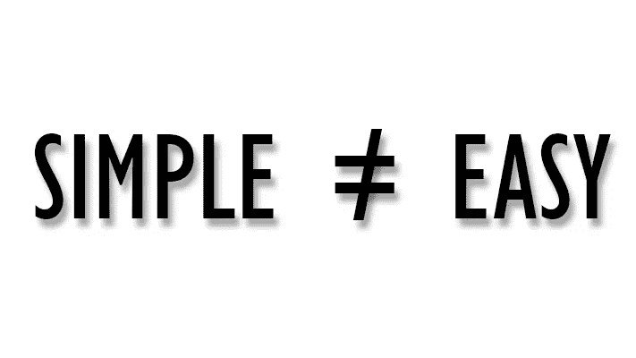
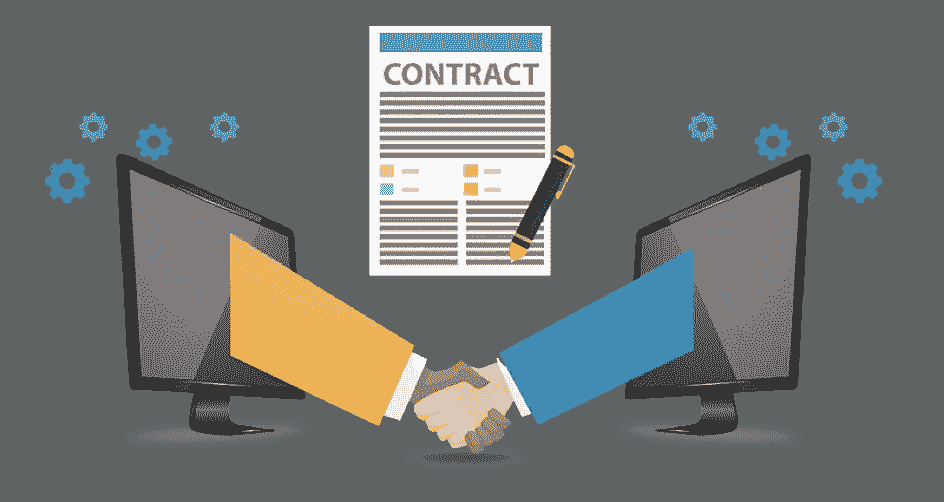
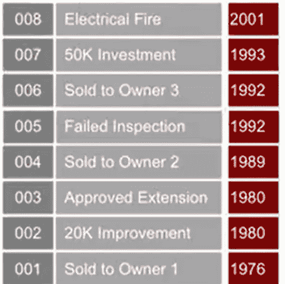
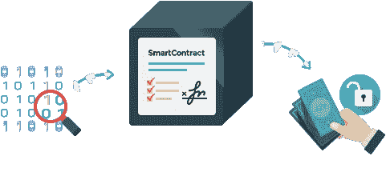
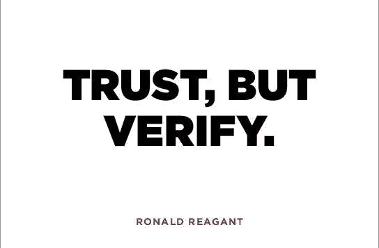
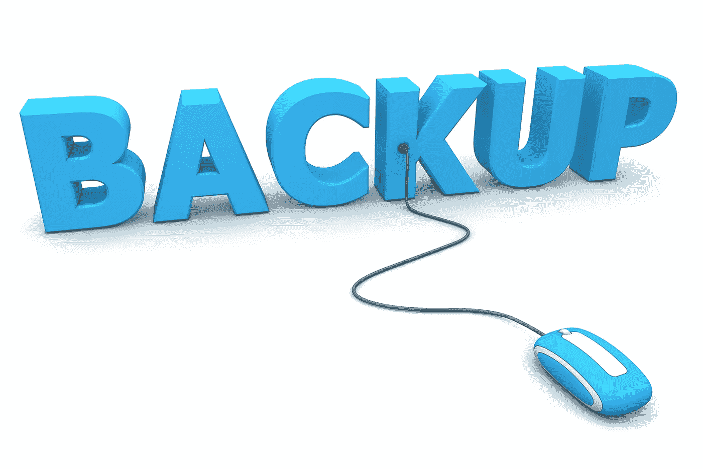

# 什么是智能合约？

> 原文：<https://medium.com/coinmonks/what-are-smart-contract-and-whats-so-smart-about-them-a-beginners-guide-4228999305b?source=collection_archive---------2----------------------->

## ***“在区块链上，没人知道你是冰箱”——***理查德·布朗

哦，原来你在这里。这意味着你一定听说过**区块链**以及世界上关于它的传言。如果你听说过它，但不知道它是如何工作的。在这里了解区块链及其运作方式****。****

*好吧，让我们开始吧。*

*区块链最好的一点是其系统的去中心化概念，这消除了货币/价值转移所需的中介，如银行和其他第三方 T21，同时也节省了时间。事实证明，与目前在世界各地运行的传统系统相比，它更安全、更快、更便宜。*

*1994 年，[**Nick Szabo**](https://en.wikipedia.org/wiki/Nick_Szabo)**(学者和密码学家)**提出**智能契约**与任何其他契约一样，但它虚拟地存在于计算机中(在一个分散的分类帐中)，根据它定义的*规则*，它将成为**自动执行契约**；众所周知，合同通常就是这样运作的(根据规则)。*

# **那么什么是智能合同呢？**

**

*A digital contract among different entities.*

*智能合同帮助您以一种非常简单、透明和无冲突的方式交换金钱、财产、股份、任何种类的资产或任何有价值的东西，同时消除了对中间人(如银行、第三方)的需求。*

**

*用最好的方式来描述它就是将这项技术与世界传统体系中正在进行的当前趋势进行比较。在这里，我们将讨论使用**智能合同**技术和**传统方式**的**房屋**的**所有权转移**的真实场景。*

## ***传统方式:***

*你要买房子。我们有一种叫做**分类账的东西，**就像记账一样(分录、借方、贷方)。分类账是迄今为止存储交易信息的基本要素。以下面的房子为例:*

**

*如果我们需要记录谁拥有这座房子，建造这座房子用了多少材料，那么我们需要从一家名为**Title company**的公司获得那份信息分类账。并且知道这一点；如果你想从冠名公司获得唱片，至少需要 **10 天**才能获得信息。*

*在我们想买房子之前，我们想得到房子的分类账，有点像左边的。大多数**冠名公司**在我们今天使用的总账中有错误。今天，我们依赖于一个至关重要的东西，那就是信任。你最清楚这一点，就像有人可以在分类账中写入信息一样容易，他们也可以删除其中的一些信息，或者更好的是，他们可以篡改分类账中的现有信息。*

**

*Ledger of House*

*你能想象买一栋房子，然后去找房主，他们说:“是的，我保留了所有封号的记录。请拥有它”。你会信任他们吗？*

***NOO！！因为信息可能被篡改。你将为根本不存在的东西买单。
我们可以使用**智能合约来改善这一切。*****

## *智能合同方式:*

*现在让我们重新考虑一下上面这个房屋所有权转移的例子。该合同通过在已经部署的区块链上自动执行来起作用。我们可以使用区块链获得以前的房屋所有权信息，因为其中的数据是不可篡改的，智能合同可以查看所有的事情是否都以适当的方式进行，并且一切都如区块链总账中所述。*

*现在，如果房屋的所有权被设置为在两周内以我们的**虚拟合同**中持有的某个价值(**金钱** / **资产**)转让给你，那么智能合同将保持从创建时间到**所有权**的**转让日期**的时间检查。如果它没有按照合同中描述的时间转移，那么它将根据合同中定义的规则释放资金，将资金归还给其合法所有者。所有人都会被警告。*

*该系统在“如果-那么”的前提下工作，并被区块链内外的数百人见证，所以你可以期待一个完美的交付。*

**

*你可以在各种情况下使用智能合约，从金融衍生品到保险费、违约、物权法、信用执行、金融服务、法律程序和众筹协议。*

# *他们有什么聪明之处？*

*说实话，几乎**一切**。！**以下是智能合约给你的好处:***

## *一 **自治:***

*你是达成协议的人。没有必要依赖经纪人、律师或其他中介来确认。顺便提一下，这也排除了被第三方操纵的危险，因为执行是由网络自动管理的，而不是由一个或多个可能有偏见的人来管理。*

## ***信任:***

*你的文件在共享账本上加密了。有人不可能说他们丢了。*

**

## ***备份:***

*想象一下，如果你的银行失去了你的储蓄账户。在区块链，你的每一个朋友都支持你。你的文件被复制了很多次。*

**

## ***安全:***

*[密码术](https://blockgeeks.com/guides/cryptocurrencies-cryptography/)，网站的加密，让你的文件安全。不存在黑客行为。事实上，只有异常聪明的黑客才能破解密码并渗透进去。*

## ***速度:***

*你通常不得不花费大量的时间和文书工作来手动处理文档。智能合同使用软件代码来自动化任务，从而减少了一系列业务流程的时间。*

## ***储蓄:***

*智能合同可以帮你省钱，因为它们消除了中介的存在。例如，你必须付钱给公证人来见证你的交易。*

**

## ***精度:***

*自动化合同不仅更快更便宜，而且避免了手动填写大量表格带来的错误*

> *智能合同是全球各地的人们相互做生意的一种方式，即使他们不说相同的语言或使用相同的货币——米海艾丽西*

*喜欢吗？？？请跟随..更多的人来了。*