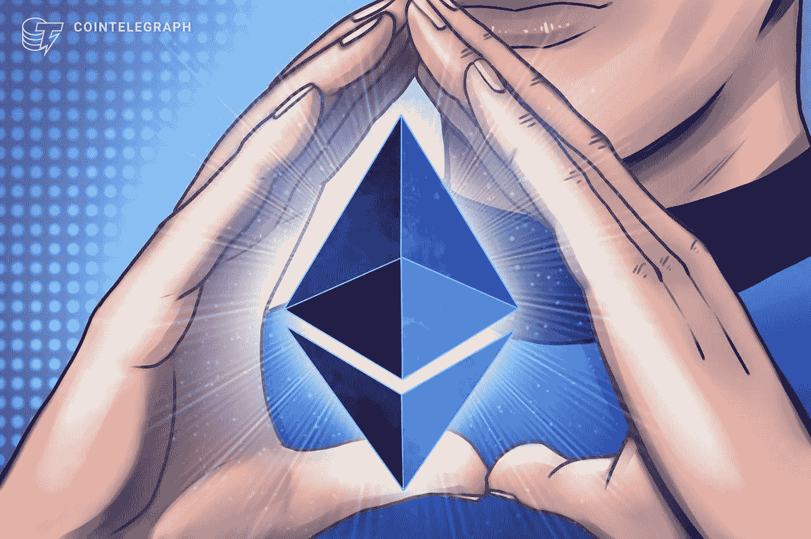

# 什么是智能合约？定义和解释

> 原文：<https://medium.com/coinmonks/what-are-smart-contracts-definition-and-explanation-e96cb879a8cb?source=collection_archive---------5----------------------->

## 在区块链上运行智能应用

智能合同是基于计算机程序的电子合同，以合法安全的方式实现业务流程自动化，在合作公司之间也是如此。智能合约基于区块链技术，并利用该技术的优势，如透明性、防伪和可用性。