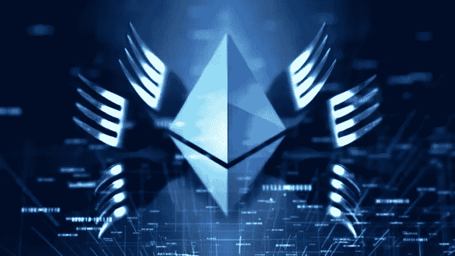

# 什么是软叉和硬叉？

> 原文：<https://medium.com/coinmonks/what-are-soft-forks-hard-forks-ffc676e98b1?source=collection_archive---------2----------------------->

像任何软件一样，区块链是更新的。这些更新在加密领域被称为分叉。fork 这个词来自英语，意思是叉子。正如在本文的过程中会变得清楚的那样，这是一个恰当的术语。因为区块链是分散的，所以没有决定执行分叉的中央机构。在某些情况下，分叉是由加密货币程序员自己实现的，就像…