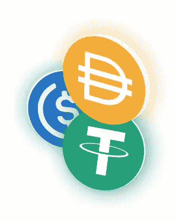

# 什么是 stablecoins？

> 原文：<https://medium.com/coinmonks/what-are-stablecoins-6f3a91fafbc1?source=collection_archive---------3----------------------->

## Stablecoins 提供了一种更简单的方法来处理你在区块链的法定货币。看看 stablecoins 是如何工作的。

Source: ethereum.org

尽管稳定的货币通常与法定货币挂钩，但情况并非总是如此。稳定资本有很多不同的例子，其中很多作为一种投资策略经常被忽视。虽然我不会深入探讨如何把你的钱用在这些方面的建议，但我会看看稳定的生态系统中存在的一些不同的机会。在这篇文章中，我们将会看到三种主要类型的 stablecoins。

## 稳定的硬币是如何维持价格的？

稳定货币是为了应对加密货币的价格波动而创造的。尽管根据你所看到的稳定币的不同会有所不同，但它们通常会通过抵押品来维持价格。一个小规模的例子是，如果发行者持有 5000 美元，他们可以发行多达 5000 枚硬币，这些硬币与相应的法定货币挂钩，在本例中为美元。

## **菲亚特钉住了 Stablecoins**

这些是最常用的稳定的硬币。法定硬币通过硬币发行者持有的 1:1 准备金与货币直接挂钩。在最简单的情况下，用户将实际的美元存入银行账户，账户持有人发行等值的硬币。这与加密货币有点矛盾，因为它创建了一个持有这些资金的中央实体，但迄今为止，它运行得相当好。然而，这些中央持有的储备也存在安全风险；它们可能会遭到黑客攻击，或者在某些情况下，它们储备的有效性可能会受到质疑。泰瑟最近受到了这样的指控，其摘要可以在[这里](https://cointelegraph.com/news/the-strange-story-of-tether-the-digital-money-that-claims-it-isnt-money)找到，尽管最近的[报道](https://cointelegraph.com/news/tether-stablecoin-is-fully-backed-says-new-assurance-report)试图平息它们。

它们的最大用途是作为加密的交易对，不能直接用于法定货币的交易，或者在分散的交易所作为交换对使用。即使你不去寻找未知的代币，这些仍然提供了一种更简单的交易方式，而不需要不断地从你的银行账户存款和取款。因此，交易所创建稳定的账户是很常见的；比特币基地有 USDC，双子座有双子座美元(GUSD)，币安有币安美元，等等。它们的功能没有太大的差异，但它们确实让加密交易变得更容易。交易所通常会对持有稳定的股票表示兴趣，例如就对持有戴或股票表示兴趣。

## **加密货币支持的 Stablecoins**

虽然我说过法定硬币通常由储备货币支持，但也有例外。戴是一种与美元挂钩的稳定货币，完全由以太坊支持。它使用一种由智能合同促成的[超额抵押](https://www.investopedia.com/terms/o/overcollateralization.asp)贷款和还款方式。Dai 的链上特性解决了其他 stablecoins 的一些集中化问题。我对它最大的不满是，由于以太坊收费的性质，它目前有点难以进入。这是加密货币支持稳定币的最大例子。

然而，其他的确实存在。为了在以太坊链上使用比特币，有一个[包装的](https://cointelegraph.com/explained/wrapped-crypto-tokens-explained)比特币令牌直接与 BTC 的价值挂钩。从最基本的意义上来说，任何包装的代币都是加密支持的稳定币，尽管它们由于易变而远不稳定。包裹代币在 DeFi 交易所提供了更多的功能，这也是你最常发现它们的地方。

## **商品挂钩稳定商品**

这些硬币由商品储备支持。它遵循与固定硬币相同的概念，所以我不会深入探讨。市场上有几种不同的商品硬币。系绳黄金和 PAX 硬币都是由黄金支持的，代币的所有权可以与一金衡盎司的黄金挂钩。代币也可以兑换成金条，前提是持有者拥有大约 400 盎司。

认证钻石公司提供不同的代币，以不同的方式与钻石联系在一起。CDC 硬币是由一个未分配的 0.05 克拉的钻石当量，这不能赎回，并打算作为一种交换方法。DPASS 令牌使用 ERC-721 标准，代表一颗钻石。他们还提供 DPT 实用程序令牌，允许在其平台上提供附加服务。即使和钻石挂钩，也没有办法赎回。

还有少数其他商品币；石油美元与石油和天然气有关，矿脉与银条有关，电力总账与可再生能源有关，等等。

## 结论

因此，正如我们所看到的，对于如何利用 stablecoins，有几种不同的选择。从交易到使用它们作为价值储存手段，它们在交易加密货币时提供了更多的简单性。通过下注获得一些收益的能力也是持有一些的一个很好的好处。目前，Tether 拥有最高的 24 小时交易量。我认为随着加密货币的采用不断增加，系绳和其他稳定货币的使用也会增加。我特别兴奋地看到戴继续获得大量采用，因为它提供了一个完全链上的选择和更多的分散比其他人。

> 加入 Coinmonks [Telegram group](https://t.me/joinchat/EPmjKpNYwRMsBI4p) 并了解加密交易和投资

## 另外，阅读

*   [什么是融资融券交易](https://blog.coincodecap.com/margin-trading)
*   最好的[密码交易机器人](/coinmonks/crypto-trading-bot-c2ffce8acb2a) | [网格交易](https://blog.coincodecap.com/grid-trading)
*   [3 商业评论](/coinmonks/3commas-review-an-excellent-crypto-trading-bot-2020-1313a58bec92) | [Pionex 评论](/coinmonks/pionex-review-exchange-with-crypto-trading-bot-1e459d0191ea) | [Coinrule 评论](/coinmonks/coinrule-review-2021-a-beginner-friendly-crypto-trading-bot-daf0504848ba)
*   [AAX 交易所评论](/coinmonks/aax-exchange-review-2021-67c5ea09330c) | [德里比特评论](/coinmonks/deribit-review-options-fees-apis-and-testnet-2ca16c4bbdb2) | [FTX 交易所评论](/coinmonks/ftx-crypto-exchange-review-53664ac1198f)
*   [n 零审核](/coinmonks/ngrave-zero-review-c465cf8307fc) | [Phemex 审核](/coinmonks/phemex-review-4cfba0b49e28) | [PrimeXBT 审核](/coinmonks/primexbt-review-88e0815be858)
*   [Bybit 交易所评论](/coinmonks/bybit-exchange-review-dbd570019b71) | [Bityard 评论](/coinmonks/bityard-review-7d104239be35) | [CoinSpot 评论](https://blog.coincodecap.com/coinspot-review)
*   [3 commas vs crypto hopper](/coinmonks/3commas-vs-pionex-vs-cryptohopper-best-crypto-bot-6a98d2baa203)|[赚取加密利息](/coinmonks/earn-crypto-interest-b10b810fdda3)
*   最好的比特币[硬件钱包](/coinmonks/the-best-cryptocurrency-hardware-wallets-of-2020-e28b1c124069?source=friends_link&sk=324dd9ff8556ab578d71e7ad7658ad7c) | [BitBox02 回顾](/coinmonks/bitbox02-review-your-swiss-bitcoin-hardware-wallet-c36c88fff29)
*   [总帐 vs n 平均](/coinmonks/ledger-vs-ngrave-zero-7e40f0c1d694) | [总帐 nano s vs x](/coinmonks/ledger-nano-s-vs-x-battery-hardware-price-storage-59a6663fe3b0)
*   [密码本交易平台](/coinmonks/top-10-crypto-copy-trading-platforms-for-beginners-d0c37c7d698c)
*   [CoinLoan 评论](/coinmonks/coinloan-review-18128b9badc4) | [YouHodler 评论](/coinmonks/youhodler-4-easy-ways-to-make-money-98969b9689f2) | [BlockFi 评论](/coinmonks/blockfi-review-53096053c097)
*   最好的[加密税务软件](/coinmonks/best-crypto-tax-tool-for-my-money-72d4b430816b) | [硬币追踪评论](/coinmonks/cointracking-review-a-reliable-cryptocurrency-tax-software-5114e3eb5737)
*   最佳[加密借贷平台](/coinmonks/top-5-crypto-lending-platforms-in-2020-that-you-need-to-know-a1b675cec3fa) | [杠杆令牌](/coinmonks/leveraged-token-3f5257808b22)
*   [block fi vs Celsius](/coinmonks/blockfi-vs-celsius-vs-hodlnaut-8a1cc8c26630)|[Hodlnaut Review](/coinmonks/hodlnaut-review-best-way-to-hodl-is-to-earn-interest-on-your-bitcoin-6658a8c19edf)
*   [Bitsgap 审查](/coinmonks/bitsgap-review-a-crypto-trading-bot-that-makes-easy-money-a5d88a336df2) | [Quadency 审查](/coinmonks/quadency-review-a-crypto-trading-automation-platform-3068eaa374e1) | [Bitbns 审查](/coinmonks/bitbns-review-38256a07e161)
*   [埃利帕尔泰坦评论](/coinmonks/ellipal-titan-review-85e9071dd029) | [赛克斯斯通评论](/coinmonks/secux-stone-hardware-wallet-review-15-discount-coupon-2020-7577032faa6e)
*   [本地比特币审核](/coinmonks/localbitcoins-review-6cc001c6ed56) | [加密货币储蓄账户](https://blog.coincodecap.com/cryptocurrency-savings-accounts)
*   最佳[区块链分析](https://bitquery.io/blog/best-blockchain-analysis-tools-and-software)工具| [赚比特币](/coinmonks/earn-bitcoin-6e8bd3c592d9)
*   [加密套利](/coinmonks/crypto-arbitrage-guide-how-to-make-money-as-a-beginner-62bfe5c868f6)指南| [如何做空比特币](/coinmonks/how-to-short-bitcoin-568a2d0b4ae5)
*   最佳[加密制图工具](/coinmonks/what-are-the-best-charting-platforms-for-cryptocurrency-trading-85aade584d80) | [最佳加密交易所](/coinmonks/crypto-exchange-dd2f9d6f3769)
*   [如何在印度购买比特币？](/coinmonks/buy-bitcoin-in-india-feb50ddfef94) | [瓦济克斯评论](/coinmonks/wazirx-review-5c811b074f5b)
*   [印度比特币交易所](/coinmonks/bitcoin-exchange-in-india-7f1fe79715c9) | [比特币储蓄账户](/coinmonks/bitcoin-savings-account-e65b13f92451)
*   [CoinDCX 评论](/coinmonks/coindcx-review-8444db3621a2) | [加密保证金交易交易所](https://blog.coincodecap.com/crypto-margin-trading-exchanges)

> [直接在您的收件箱中获得最佳软件交易](/coinmonks/newsletters/coinmonks)

