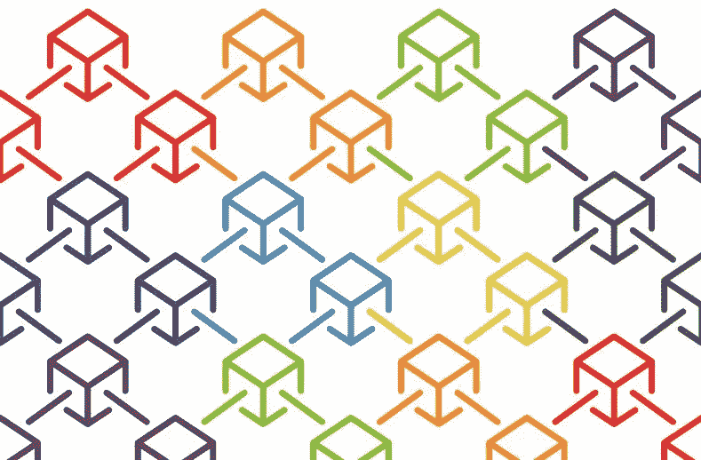

# 以太坊，超帐织物，超帐锯齿有什么区别？

> 原文：<https://medium.com/coinmonks/what-are-the-differences-between-ethereum-hyperledger-fabric-and-hyperledger-sawtooth-5d0fc279d862?source=collection_archive---------0----------------------->



Source: [https://ethereumworldnews.com/blockchain-technology-will-affect-your-future-whether-you-like-it-or-not/](https://ethereumworldnews.com/blockchain-technology-will-affect-your-future-whether-you-like-it-or-not/)

在主持了一系列区块链研讨会后，我经常被要求解释以太坊、Hyperledger 织物和 Hyperledger 锯齿之间的区别。

有很多方法可以比较这些。在这篇博客中，我将从高层次上描述技术上的差异。这个博客的目的是为你提供足够的事实来评价这些差异，并让你在这些事实的基础上做出定性的判断。尤其是在选择使用哪种区块链时。

> [在您的收件箱中直接获得最佳软件交易](https://coincodecap.com/?utm_source=coinmonks)

[](https://coincodecap.com/?utm_source=coinmonks)

由于这里讨论的技术性质，您应该具备基本的计算科学知识。

**区块链的精神影像**

在我们考虑差异之前，我要建立一个区块链人的基本心理形象。让我们先回答两个问题:

*   什么是区块链？
*   区块链想要解决什么问题？

*什么是区块链？*

区块链有不同的称呼

*   “一个分布式的、去中心化的、公共的账本”[1]。
*   “基本上，一个区块链是一系列包含数据的块，并且具有一个散列值和前一个块的散列值”[2]

不幸的是，这些定义都没有提供必要的心理图像，我们需要这些图像来帮助理解以太坊、织物和锯齿之间的差异。

出于这个博客的目的，把区块链想象成一个计算平台或节点的网络。每个*节点*的核心是:

*   **智能合同** / **链码** / **交易处理器**(为了方便起见，我将使用术语“智能合同”作为一个总括术语)——这基本上是一个计算机可运行的业务逻辑体，管理两方或多方之间的业务交易；
*   **分类帐** —是加密安全的块链(即*区块链*)，其中每个块包含对我们希望节点计算的智能合同的方面的引用；
*   **账户** / **世界状态** / **全球状态** —是持久保存作为业务交易一部分的事物(如金钱、房屋、知识等)状态的数据存储，我们将在后面定义这个术语。

区块链打算解决什么问题？

广义地说，区块链是用来记录双方或多方之间的经济交易。商业交易是导致**状态**发生变化的行为(如房屋所有权的变化，或一方从另一方获得知识等)。有许多交易处理系统，那么我们为什么需要区块链呢？

与许多传统的事务处理系统不同，区块链最适合解决以下问题:

*   事务的终结是确定的；
*   需要一个事务以及所有先前事务的出处；
*   交易记录是不可变的；
*   要求以分散的方式处理交易记录。

区块链还有一个重要的特点，使它不同于传统的交易处理系统；交易不直接发生在交易方之间。

例如，让我们想象一个双方约翰和保罗之间的商业交易，其中约翰承诺通过一个假想的区块链网络付给保罗一些钱。在这种情况下，John 不会像在聊天应用程序中那样直接向 Paul 发送消息。

相反，约翰签名并向他拥有的节点发送一条消息，通知该节点在智能契约中调用函数调用' *pay* '(参见下面的伪代码)。John 还需要对消息进行加密签名，这是传统的事务处理系统通常不要求您做的事情。

```
Contract{
  payee account
  payer account 
  // a computer executable payment transaction   
  pay(payee, payer, amount) 
}
```

约翰拥有的节点将向网络中的所有节点发送消息，指示他希望所有节点执行“*支付*功能。接收节点还没有执行所请求的函数调用。函数调用必须打包到一个块中。

一个块不仅包含约翰和保罗之间的交易，还可能包含区块链网络中发生的其他几个交易的组合(见下面说明块内容的伪代码)。

```
Block{
  blockID: hash
  transactions:[{
    functionName: "pay"
    arguments: ["Paul","John","$1"]
    signature: value,
    ....},
    {},..]
  previousBlockID: hash
}
```

当一个块被所有事务消息填满时，它被传送到网络中的所有节点，包括 John 和 Paul 的节点。收到阻塞后，John 和 Paul 的节点负责执行' *pay* '函数调用并更新各自的*账户；*相互独立，并可能在不同的时间框架内执行。这就引出了一个问题:在这样一个去中心化的系统中，所有的节点如何确保它们的分类帐是一致的(即达成一致意见)？

达成*共识有几种方式；*以太坊、Fabric 和锯齿使用不同的算法，我们将在这里考察。

**以太坊**

以太坊是一个超载的名词；它可以指基于以太坊虚拟机(EVM)或以太坊项目管理的区块链网络的核心技术的一类技术。在这种情况下，我指的是后者——以太网。

以太坊网络被设计为作为公共网络运行。这意味着网络中的每一个以太坊节点都是可发现的，并且为每一个节点所知。

这也意味着每个节点都有一个相同分类帐的副本。每个节点与其他节点具有完全分散的关系。没有主节点控制其他节点。每个节点简单地通知其他节点要执行的事务类型以及它们要执行的顺序。

以太坊网络的每个用户通过*智能合约*与其他节点交互，智能合约必须“安装”在每个节点中。安装智能合约的过程类似于以太坊网络中各方发起交易的方式。例如，一个合同作者用密码签署他/她的合同，并通过他/她的节点，将它发送到以太网中的所有节点。然后，合同被存储在网络中某个*可寻址的*数据存储器中。

> **注意:**区块链中的块不是数据存储！块仅包含智能协定中要调用的函数的描述。以太坊数据存储是键值持久存储，如 LevelDB

让我们重新看看上面描述的 John 和 Paul 事务。在以太坊网络的上下文中，John 向他的节点发送并加密签名一条消息，该消息带有调用' *pay* '的指令。然后，节点将该消息放入*事务池*中。

在网络中，一些节点(称为*矿工*)自愿将来自约翰的消息打包成一个块，然后将该块添加到区块链中。由于以太坊网络中存在不止一个矿工；给定的挖掘器只有在挖掘器已经执行了一定量的计算工作来解决随机生成的难题时才被提供这样做的特权——这是一种被称为**工作证明**的机制。矿工还会因验证交易产生一致结果所需的工作量(称为 Gas)而获得一些加密货币奖励。

> **注意:**以太坊网络中的所有节点都依靠分类帐来确保其账户中的状态变化与其他节点一致。矿工们重播区块链中的指令，并比较前后的状态，以确保达成共识。

当一个挖掘器完成将事务添加到一个块并将其添加到一个区块链的任务时，该链被传输到网络中的所有节点。然后，所有接收节点负责独立更新它们自己的数据存储或*账户*。非挖掘节点还通过重放封装在区块链中的事务来确保一致性。

**总账面料**

面料属于区块链的一类被称为许可区块链。在结构网络中，节点不能被彼此公开发现。节点的所有者——通常是一些商业组织——必须同意允许它们的节点互相发送消息。

> **注:**将交易方视为业务组织之间的运作更为准确。每个组织可以拥有一个或多个节点。使用 Fabric，您可以配置节点来执行特定的任务，如客户端节点与最终用户交互，或认可节点等。

从 1.0 版本开始，允许节点相互发送消息是基于 X.509 证书的使用。在这种模式中，所有参与组织都同意使用通用根证书，如 Verisign 发布的证书，来验证各方是否被允许相互交易。

> **注意:**可以使用其他形式的许可机制。在这篇博客发表时，X.509 已经可以开箱即用了。

与结构节点交互的终端用户也必须被允许参与结构网络内的事务。用户权限由他们所属的组织管理。每个组织独立管理自己的用户。不需要中央机构来管理结构网络中的所有用户，但是如果网络中的参与者选择具有中央机构，则它可以被配置成这样做。

当一个组织的用户希望与另一个组织的另一个用户进行交易时，该过程类似于以太坊过程，除了有三个步骤——认可、订购和承诺(官方 Fabric 文档将该过程称为**执行**、**订购**和**验证**)。

在这种情况下，用户向结构网络中的一些或所有节点(称为*认可节点*)发送事务。认可节点由不同的组织拥有。

签署节点的任务是验证事务的签名，并模拟事务的执行。当所有认可节点产生一致状态时，它们将结果传送回发送*客户端节点*。*客户端节点*然后将结果发送到*排序节点*，其工作是将事务打包到一个块中。

*订购节点*在先到先得的基础上增加一笔交易(也称*单人*)。对块进行排序的另一种方法是使用卡夫卡消息传递技术将事务添加到块中。当所有事务被添加到一个节点并附加到区块链时，*排序节点*然后将区块链传输到网络中的所有提交节点，每个提交节点负责更新其数据存储(也称为*世界状态*)。

> **注意:**订购节点通常由被选为结构网络中立部分的其他组织托管。

当安装**链码**——智能合同的 Fabric 术语——是一个两步过程:安装(需要将*链码*发送到每个参与组织；每个组织负责在他们自己的节点中安装链码)。随后是*实例化*过程，其中调用了一个特殊的函数调用 *init* 。调用 *init* 操作新安装的链码。

Fabric 的一个独特之处在于能够将节点的权限组划分为单独的‘T20’通道。属于一个通道的节点不能与另一个通道进行交易。

> **注:**通道常为混淆之源。它通常被视为终端用户之间的某种私人通信管道(例如，Paul 和 John 之间的通信)。事实并非如此。更准确的说法是，将通道视为具有公共分类账的节点(或子网)的集合，并且允许排序节点与被允许参与通道的节点通信(即发送块)。

**超总账锯齿**

锯齿是一种独特的区块链。它可以配置为像公共网络或许可网络一样运行。然而，它是现成的，更适合在许可的环境中工作。

以太网*智能合同*和织物*链码*是表示交易双方之间某种合同协议的代码体。就锯齿而言，概念上的等同物被称为*事务处理器*。您构建和安装*事务处理器*就像构建和安装普通应用程序一样。

> **注意:**我警告不要将交易处理器视为智能合同的直接等价物，或者在较小程度上视为链码。更准确的说法是，将交易处理器视为一种计算平台形式，以使智能合同得以执行。锯齿有一种事务处理器——被称为 Seth 事务处理器，它基于 Hyperledger pool ether eum 虚拟机(EVM)。这使得它能够运行用一种被称为实实在在的语言编写的 Ethereum 智能契约。

挖掘器或订购节点的等价物是锯齿**验证器**。验证器的工作是检查并确保事务(或指示要执行的事务的消息)具有有效的签名，然后将其导向适当的*事务处理器*。由*事务处理器*实现的业务逻辑负责确保事务被正确处理。

当事务处理器完成其业务逻辑验证时，消息被发送回验证器，然后验证器负责将事务打包在一个块中，并将其添加到区块链，以及将其传输到其他验证器，以确保所有节点都有一个共同的视图，即达到*共识*。除了将事务打包成块，它还负责更新*全局状态*(即基于 Merkle 树的数据存储)。

锯齿的一个独特之处在于它能够将交易分组。一批交易可以打包成一个块。因此，赋予锯齿处理复杂事务的能力。想象一个场景，约翰把他的车卖给保罗。这可能涉及许多相关交易:

*   货币交换；
*   在某个监管实体中记录的所有权转让；
*   保单转移。

您可以配置专业的*事务处理器*来处理这些事务。然而，所有这些事务必须作为一个批处理成功或失败，换句话说，这些事务必须遵守原子性、一致性、隔离性和持久性(ACID)原则。

您还可以配置与所有权和保单转让相关的交易，以便这些交易与涉及货币兑换的交易并行执行，只有在这些交易成功完成后才能执行。当货币交换成功时，整个交易批次满足 ACID 原则。

最后，要为公共或许可操作配置锯齿，您可以使用现成的*设置事务处理器*根据您的配置路由来自客户端的流量；接受来自网络中任何客户端的交易(从而使锯齿能够像公共区块链一样运行)或限制来自被允许这样做的客户端(即被允许的区块链)的消息。

> **注意:**您可以用自己的实现替换设置事务处理器，以添加更复杂的权限算法来应对公共网络的需求。

在锯齿网络中，不是只有一个验证器，而是有许多验证器。很像以太坊矿工，一次只有一个验证器可以更新一个块。然而，与以太坊的工作证明不同，开箱即用的锯齿使用一种称为耗时证明(PoET)的算法来选举验证器以更新区块链。PoET 的一个简单的观点是，把网络中的所有验证器都看作是休眠的，随机地，第一个醒来的被选为活动的验证器。

> **注意:**你可以使用其他共识算法，如 RAFT 或 PBFT。当这篇博客发表时，这些正在开发中。

**结论**

这是对以太坊、Hyperledger Fabric 和 Hyperledger 锯齿之间的差异的一个相当高层次的概述。总结一下:

*   以太坊是一个公共区块链(所有节点都是完全分散的)，在这里交易是有序的(通过*挖掘器*)，单个节点负责更新。*矿工*通过被称为*工作证明*的过程赢得更新区块链的权利。
*   结构是一种许可的区块链，其中只有当节点的所有者(通常是一个业务组织单位)允许节点彼此可发现时，节点才为其他节点所知(从版本 1.0 开始，它基于 X.509 认证过程)。交易按此顺序执行；*背书*、*排序*和*提交*。街区是按照先来先服务的原则来排序的( *solo* )或者是基于*卡夫卡*机制。因此，*排序节点*实际上没有完全分散。在 solo 配置的情况下，网络只有一个订购节点。在 *Kafka* 配置中，订购节点可能是分布式的，但它仍然依赖于集中式的 *Kafka* 机制来完成它的工作。根证书使用也引入了单一的故障源。
*   锯齿可以作为公共(但有一些限制)或许可的区块链运行，这取决于它的配置。即使在许可配置中，所有节点也是完全分散的。默认情况下，它使用 *PoET* 来选择节点以执行事务的验证。您可以将多个事务分组为批处理，并在适当的时候将事务配置为并行执行。

**免责声明**

这些技术在不断地发展，你可以预期这里描述的某些方面可能已经改变。

**参考文献**

【1】[https://www.investopedia.com/terms/b/blockchain.asp](https://www.investopedia.com/terms/b/blockchain.asp)

【2】[https://101blockchains.com/blockchain-vs-linked-list/](https://101blockchains.com/blockchain-vs-linked-list/)

[](http://bit.ly/2G71Sp7)

[**Click to read today’s top story**](http://bit.ly/2G71Sp7)