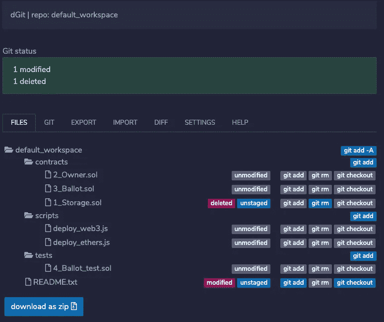

# Remix IDE 可以做什么？

> 原文：<https://medium.com/coinmonks/what-can-i-do-with-remix-ide-85e6803986e0?source=collection_archive---------3----------------------->

## 探索 Remix IDE 上的插件——智能合约开发者的视角

除了 Remix IDE 提供的显而易见的功能，例如在以太坊区块链上编译、部署和运行智能合约，Remix IDE 还提供了大量其他功能，这些功能可能对新的智能合约开发人员特别有帮助。这些以插件的形式提供，通过使智能合同开发者能够可视化他们的执行控制图、分析他们的智能合同代码、记录他们的代码并保护他们免受不寻常的智能合同执行模式的影响，来满足增强智能合同开发者的编码体验的需要，因为它们具有可靠性和区块链特定的特征。

## 1.坚固性静态分析

静态代码分析—通过静态检查代码而不执行代码来调试代码。一旦智能合同被编译，该插件检查安全漏洞和不良开发实践，以及其他问题。该分析器允许用户选择要分析的模块，并可通过点击`Run`对最近编译的合同进行分析。每次编译合同时，提供`Auto run`选项进行分析。

Solidity Static Analysis Plugin and Modules

## 2.Eth **erscan 合同验证**

一个用部署的合同验证您的代码并在 Etherscan 上发布代码的工具。要更新以太网扫描上的令牌信息，必须验证令牌的令牌合同地址。这是为了确保合同代码与部署到区块链上的代码完全一致，并允许公众审核和阅读合同。Etherscan 确保所有令牌合同必须经过验证，然后才能使用合同所有者提交的信息进行更新。

A contract verification use case

## 3.控制流程图

一个可视化智能合同执行控制流的工具。它从智能契约的字节码中生成控制流图(CFG ),并突出显示其执行跟踪。

Visualization of the execution of a smart contract

## 4.Sol2UML

[统一建模语言(UML)](https://en.wikipedia.org/wiki/Unified_Modeling_Language)契约的类图生成器。sol2uml 使用的是由 Franco Victorio (@fvictorio)领导的 solidity 工具社区维护的 [@solidity-parser/parser](https://github.com/solidity-parser/parser) 。使用 [viz.js](https://github.com/mdaines/viz.js/) 生成图表，js 使用 [Graphviz](http://www.graphviz.org/) 呈现一个[可缩放矢量图形(SVG)](https://en.wikipedia.org/wiki/Scalable_Vector_Graphics) 文件。 [Graphviz Online](https://dreampuf.github.io/GraphvizOnline/) 允许编辑点文件并动态渲染成 SVG。

A UML diagram generated for a Solidity Smart Contract

## 5.DGIT——一个用于混合的分散式 GIT 插件

这个工具将文件存储在 Remix 中，作为 IPFS 的 git 存储库。存储库存储在浏览器中，但是可以使用插件从 IPFS 导出和导入。存储库的每次导出都会生成一个新的唯一 IPFS 散列。
来自 Remix 和 git 存储库本身的已提交浏览器文件(。git)可以在 IPFS 找到。这些哈希存储在浏览器的本地存储中，可以导出到 Pinata Cloud。为了确保 IPFS 上的数据持久性不受垃圾收集等过程的影响，可以将数据无限期地固定到一个或多个 IPFS 节点上。Pinata 支持自由锁定高达 1GB 的数据(参见 [Pinata 云](https://pinata.cloud/)

## 6.可证明—数据 Oracle 服务

Provable 是领先的 oracle 智能合约和区块链应用服务，每天在平台上服务成千上万的请求，如[以太坊](https://docs.provable.xyz/#ethereum)、[根茎](https://docs.provable.xyz/#rootstock)、 [R3 Corda](https://docs.provable.xyz/#corda) 、 [Hyperledger Fabric](https://docs.provable.xyz/#fabric) 和 [EOS](https://docs.provable.xyz/#eos) 。该插件旨在与 JavaScript VM 一起使用，它在加载时为您的会话部署所有需要的基础设施和监听器。此后，您可以通过继承 usingOraclize 契约来部署任何利用 Provable 的契约，并跟踪任何已完成的查询请求。

Provable — A Data Oracle Service Tool

# 你也可以为 Remix IDE 开发一个新插件

怎么会？—查看 remix-plugin 存储库中的自述文件，地址为—[https://github . com/ether eum/remix-plugin/blob/master/README . MD](https://github.com/ethereum/remix-plugin/blob/master/readme.md)。

> 加入 [Coinmonks 电报频道](https://t.me/coincodecap)，了解加密交易和投资

## 另外，阅读

*   [尤霍德勒 vs 科恩洛 vs 霍德诺特](/coinmonks/youhodler-vs-coinloan-vs-hodlnaut-b1050acde55a) | [Cryptohopper vs 哈斯博特](https://blog.coincodecap.com/cryptohopper-vs-haasbot)
*   [币安 vs 北海巨妖](https://blog.coincodecap.com/binance-vs-kraken) | [美元成本平均交易机器人](https://blog.coincodecap.com/pionex-dca-bot)
*   [如何在印度购买比特币？](/coinmonks/buy-bitcoin-in-india-feb50ddfef94) | [WazirX 审查](/coinmonks/wazirx-review-5c811b074f5b) | [BitMEX 审查](https://blog.coincodecap.com/bitmex-review)
*   [比特币主根](https://blog.coincodecap.com/bitcoin-taproot) | [Bitso 点评](https://blog.coincodecap.com/bitso-review) | [排名前 6 的比特币信用卡](/coinmonks/bitcoin-credit-card-bc8ab6f377c6)
*   [双子座 vs 比特币基地](https://blog.coincodecap.com/gemini-vs-coinbase) | [比特币基地 vs 北海巨妖](https://blog.coincodecap.com/kraken-vs-coinbase) | [硬币罐 vs 硬币点](https://blog.coincodecap.com/coinspot-vs-coinjar)
*   [印度加密交易所](/coinmonks/bitcoin-exchange-in-india-7f1fe79715c9) | [比特币储蓄账户](/coinmonks/bitcoin-savings-account-e65b13f92451) | [Paxful 审核](/coinmonks/paxful-review-4daf2354ab70)
*   [杠杆令牌](/coinmonks/leveraged-token-3f5257808b22) | [最佳密码交易所](/coinmonks/crypto-exchange-dd2f9d6f3769) | [密码交易机器人](https://blog.coincodecap.com/best-crypto-trading-bots)
*   [Godex.io 审核](/coinmonks/godex-io-review-7366086519fb) | [邀请审核](/coinmonks/invity-review-70f3030c0502) | [BitForex 审核](/coinmonks/bitforex-review-c4bb28d9e271) | [HitBTC 审核](/coinmonks/hitbtc-review-c5143c5d53c2)
*   [Crypto.com 费用](/coinmonks/binance-fees-8588ec17965) | [僵尸密码审查](/coinmonks/botcrypto-review-2021-build-your-own-trading-bot-coincodecap-6b8332d736c7) | [替代品](https://blog.coincodecap.com/crypto-com-alternatives)
*   [BlockFi 信用卡](https://blog.coincodecap.com/blockfi-credit-card) | [如何在币安购买比特币](https://blog.coincodecap.com/buy-bitcoin-binance) | [网格交易机器人](https://blog.coincodecap.com/grid-trading)
*   [加密副本交易平台](/coinmonks/top-10-crypto-copy-trading-platforms-for-beginners-d0c37c7d698c) | [五大 BlockFi 替代方案](https://blog.coincodecap.com/blockfi-alternatives)
*   【Crypto.com 评论】|[|](/coinmonks/crypto-com-review-f143dca1f74c)|[信用交易](/coinmonks/huobi-margin-trading-b3b06cdc1519)
*   [顶级付费加密货币和区块链课程](https://blog.coincodecap.com/blockchain-courses) | [币安评论](/coinmonks/binance-review-ee10d3bf3b6e)
*   [在美国如何使用 BitMEX？](https://blog.coincodecap.com/use-bitmex-in-usa) | [BitMEX 回顾](https://blog.coincodecap.com/bitmex-review) | [币安 vs Bittrex](https://blog.coincodecap.com/binance-vs-bittrex)
*   [最佳免费加密信号](https://blog.coincodecap.com/free-crypto-signals) | [YoBit 评论](/coinmonks/yobit-review-175464162c62) | [Bitbns 评论](/coinmonks/bitbns-review-38256a07e161)
*   [OKEx 评论](/coinmonks/okex-review-6b369304110f) | [Kucoin 交易机器人](/coinmonks/kucoin-trading-bot-automate-your-trades-8cf0ca2138e0) | [期货交易机器人](/coinmonks/futures-trading-bots-5a282ccee3f5)
*   [比特币基地跑马圈地](https://blog.coincodecap.com/coinbase-staking) | [Hotbit 评论](/coinmonks/hotbit-review-cd5bec41dafb) | [KuCoin 评论](https://blog.coincodecap.com/kucoin-review)
*   [最佳加密交易信号电报](/coinmonks/best-crypto-signals-telegram-5785cdbc4b2b) | [MoonXBT 评论](/coinmonks/moonxbt-review-6e4ab26d037)