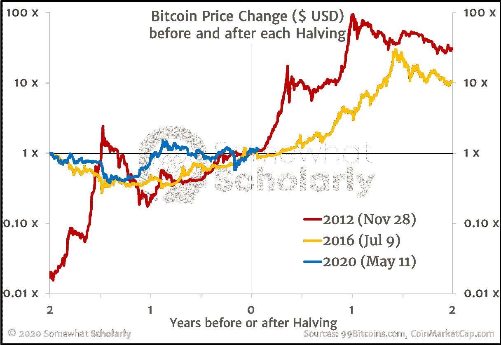
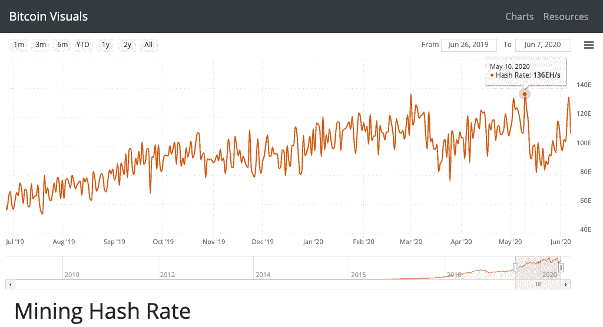

# 比特币 2020 年减半的 5 个关键点

> 原文：<https://medium.com/coinmonks/what-can-we-learn-from-bitcoins-2020-halving-2bda8f90606e?source=collection_archive---------2----------------------->

## 最重要的一点是

## 1.价格基本上没有受到影响

尽管大肆宣传，减半几乎是一个“非事件”作为比特币的看涨者，我实际上认为这对比特币来说是一件好事，因为任何短期的价格波动都会引起比特币和其他密码的“错误”关注(在我看来)。

这里有一张比特币价格历史图表，显示了每减半之前(和之后)的价格历史[系列指数在每减半之日为 1 倍]:

Bitcoin Price Change before and after each Halving

注意价格在减半后的几天或几周内实际上可能如何*下跌*，但是一两年后，收益已经是减半前价格的 5 倍、10 倍或 100 倍左右。

## 2.比特币的**用例**仍然相同，现在得到了更广泛的认可。

在他最初的白皮书中，中本聪将比特币描述为“纯粹的点对点版本的电子现金”，但这并不是全部。任何熟悉比特币和货币历史的人都知道，比特币不仅仅是“现金”——它是整个世界的一个新的、稳定的货币系统。

【没错，交易缓慢且昂贵(这意味着可伸缩性是一个主要挑战)，但这些问题可以用第二层技术解决；正如黄金在日常交易中使用起来太慢太贵一样，我们创造了纸黄金证书，作为建立在沉重、稳定的“金币和金条”第一层之上的轻量级第二层技术。随着时间的推移，比特币也会有类似的发展。]

Satoshi 通过在第一块(即创世纪块)嵌入一条消息暗示了比特币产生的原因:

> 《泰晤士报》2009 年 1 月 3 日财政大臣濒临第二次银行救助

Satoshi 指出，央行官员从事不计后果的货币操作，经常从穷人和中产阶级那里窃取，然后给富人。

**比特币是一种将权力交还给人民的尝试，它拥有一个完全去中心化(即民主)的货币体系，不会选择性地偏袒任何一个群体。**

在最近的减半(2020 年 5 月 11 日)中，在减半之前开采倒数第二个区块的区块生产商 F2Pool 在其区块(即区块 629，999)中包含了非常相似的信息:

> *《纽约时报》2020 年 4 月 9 日报道美联储注入 2.3 万亿美元，其计划远远超过 2008 年的救助*

我们再次看到世界各地央行行长盗窃和不道德行为的增加。它不局限于一个国家，而是一种全球性的流行病。其实 F2Pool 总部在**中国**；他们提到的文章引用了美国中央银行。Satoshi 引用的原文引用了**英国**。问题还不止于此。

2009 年，是 Satoshi 告诉世界，需要比特币。
2020 年，是世界认同了 Satoshi，需要比特币。

## 3.代码如预期的那样工作。

换句话说，格挡奖励减半(从每格挡 12.5 BTC 降至 6.25 BTC)，*完全如大家所料*。

这可能看起来不够重要，不足以成为一个“关键外卖”，但请考虑一下，准确知道在任何给定的时间点有多少美元将是多么有价值。你将能够对你的钱做出很好的决定，并且决定储蓄、消费、投资或借贷的风险会小得多。

事实上，这种知识将为社会所有成员带来更大的繁荣。

相反的情况——即*不*知道在任何时间点存在多少美元(更不用说利率、规则&规定等。)—导致相反的命运:人们不知道储蓄还是消费会带来更好的结果。如果央行下周再印一万亿美元呢？如果政府不再允许我们使用纸质钞票怎么办？

当人们对未来没有明确的预期时，经济就会陷入瘫痪状态:企业倒闭(新企业不开张)，人们失业，没人知道“省钱”是个好主意还是个糟糕的主意。的确，不确定性是进步的主要障碍。

如果我们建立了一个国家(或全球！)经济在一个有保证的、100%可预测的货币体系上，商业会繁荣，雇主和雇员(以及顾客)都会繁荣。

比特币最有价值的属性之一是其固定的、可预测的供应时间表。没有惊喜，没有失信，没有可疑的政客或银行家。这种“确定性”的价值不可低估。

## 4.激励措施塑造了一个可预测的未来。

继续关于可预测性的主题，我们可以预计，一旦集体奖励减半，相当大比例的矿工将决定关掉他们的机器。毕竟，矿工的存在是为了盈利，他们的利润来自于出售他们开采的比特币。

随着新出售的比特币数量减少一半，许多矿商不再盈利，我们预计他们中的许多人会停止运营。这就是事实。

请注意减半前一天(2020 年 5 月 10 日)的采矿活动高峰:

Total Mining Hash Rate of the Bitcoin Network around the May 11, 2020 Halving

[还要注意的是，更多的矿工已经回来接替他们的位置(或者，相当于，现有的矿工已经扩大了他们的业务)。]

这里的关键是，如果参与者知道未来会发生什么，他们可以为自己做出好的决定。

## 5.比特币的知名度正在迅速增长。

我敢打赌，你，不管是谁，现在正在读这篇文章，在事情发生之前就知道 2020 年减半，但直到事情发生之后的一段时间(T2)，才知道 2012 年或 2016 年减半。

这说明比特币的*认知度正在提高。*

我也愿意打赌，你的许多家人和朋友都不知道 2020 年的“比特币减半”是什么，但我可以非常自信地说，当 2024 年到来时，他们中的绝大多数人会确切知道这意味着什么。

到 2028 年，“理解”比特币减半的人的比例将非常接近 100%。

总结一下，五个最重要的要点:

1.  价格基本上没有受到影响。
2.  比特币的**用例**还是一样的，现在得到了更广泛的认可。
3.  **代码**按预期工作。
4.  激励措施塑造了一个可预测的未来。
5.  比特币的知名度正在迅速增长。

正如承诺的那样，这里是“最重要的要点”,概括了其他五个要点:

***着眼长远——信号，而不是噪音。***

2020 年比特币减半并非偶然，因为比特币协议在 2009 年推出时，与 2020 年减半“相关”的一切都已经存在。

想了解比特币，*缩小*，研究 09 年的事件；)

> [直接在您的收件箱中获得最佳软件交易](https://coincodecap.com/?utm_source=coinmonks)

-——————
你可以在*推特*上 [**AlanHibbard**](https://twitter.com/AlanHibbard) 找到我。我什么都发微博。
你可以在 *YouTube* 上找到我 [**有点学究气的**](https://www.youtube.com/channel/UCEuHspbTE_ik2uxW3UgGQTg) 。