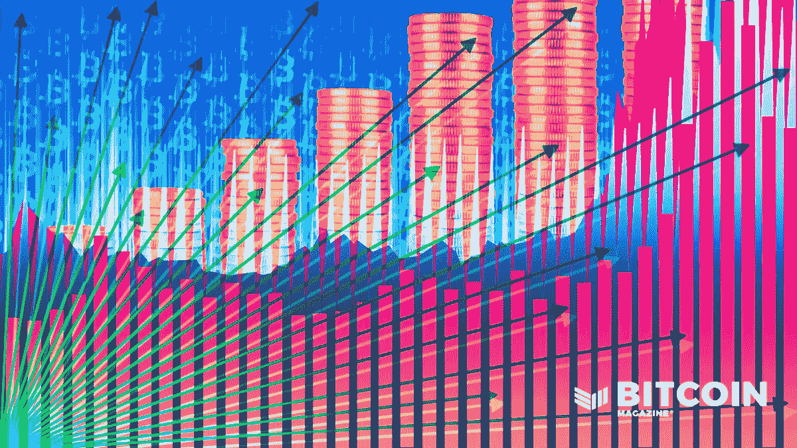
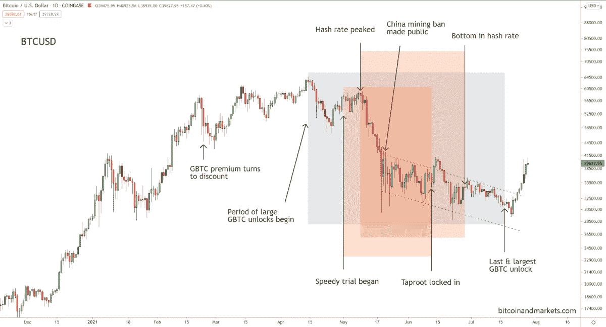
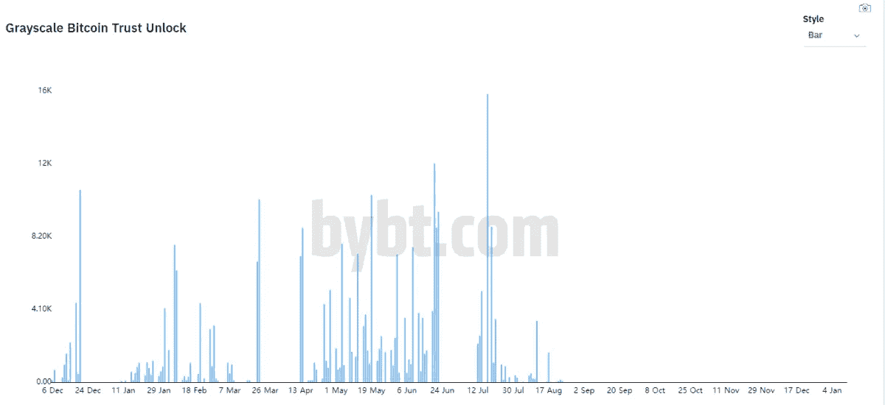

# 是什么导致了本轮中期比特币价格回调

> 原文：<https://medium.com/coinmonks/what-caused-this-mid-cycle-bitcoin-price-correction-5b8222b36b9e?source=collection_archive---------8----------------------->

比特币价格上周有所回升，但这一举动并不出人意料。虽然一些人将价格飙升归因于关于亚马逊计划接受比特币的假消息，但图表一直在暗示一个行动即将到来，接近一个决定性的时刻。

我将这一周期中期的修正归因于三种主导性的同时发生的叙事，这三种叙事在解决之前导致了重大的不确定性和价格下跌。这些事件影响了比特币市场所有领域的情绪——矿商和散户、开发商和高净值个人。这些叙述中的任何一个本身都可能导致价格下跌，但这三个因素加在一起会对价格造成重大拖累。

# 中国新的采矿禁令

由于[中国的采矿禁令](https://bitcoinmagazine.com/business/latest-china-ban-impacting-bitcoin)(上面用红色突出显示)导致的采矿杂碎率暴跌，使采矿业发生了天翻地覆的变化。矿业公司受到了戏剧性的影响，已经在应对全球芯片短缺，然后这个消息被添加到他们的盘子里。散户投资者和交易者也受到了这一发展的影响，连续几周受到负面新闻的轰炸。

哈希速率(矿工搜索下一个区块的累积计算机速度)在 5 月 9 日禁令前达到峰值。我怀疑这是中国矿工开始听到将要发生什么的谣言的时候。中国共产党禁止采矿的官方公开声明于 5 月 21 日在 T4 发布。在接下来的四周里，哈希速率持续下降，从每秒 190 万亿次哈希(Eh/s)下降到底部的每秒 58 Eh/s。

这无疑是许多散户投资者的一大担忧。网络能够应对这种根本性的打击吗？然而，那些深陷比特币泥沼的人对这种情况就没那么担心了。比特币适应性强。积木被发现慢了一点，但继续滴答走。难度按照设计下调了几次，网络本身没有受到持久的损害。哈希利率暴跌终于在 6 月 27 日反弹，截至本文撰写之时，已经从低点上涨了 98%。

随着中国采矿设备被转移或出售，复苏将是缓慢但稳定的，最终会进入更友好和更分散的管辖区，并带来更强劲的采矿业。随着哈希利率反弹持续到 7 月，投资者的不确定性迅速降低。今天，网络稳定而强大。

# 灰度信托的记录解锁

这一时期不确定性的第二个主要原因是灰色的比特币信托(GBTC)发行时间表(上面用灰色突出显示)。这种说法影响了该领域高净值投资者和专业交易机构的情绪。鲸鱼中有一个相当强烈的信念，他们的同行将在解锁期后立即利用杠杆进行套利交易。

[*Source*](https://bybt.com/grayscale)

GBTC 速成 101:GBTC 是一种封闭式信托，投资者可以投资于信托的基础资产比特币，而无需亲自持有比特币，类似于交易所交易基金(ETF)。合格投资者可以以净资产值(NAV)(相当于现货价格)的价格直接从 grady 购买新股，增加已发行股票的供应，然后在 6 个月的锁定期后，可以在二级市场上向所有类型的投资者出售股票。从灰度购买新股需要灰度走出去进入市场购买比特币，引起价格上涨。

还有一个反馈回路方面。随着比特币价格的上涨，它推动了更多的二级市场需求和更高的溢价，然后是对新 GBTC 股票的更多需求和更多的现货购买。只要二级市场的溢价持续，它就能带来丰厚回报。例如，如果溢价为 20%，投资者可以以资产净值买入一股 GBTC 股票，六个月后，以 20%的收益卖出。(比那个稍微复杂一点，但基本思路就是这样。)

由于 GBTC 的寿命很短，它一直享有溢价，但在 2 月 23 日的一周，二级市场的价格滑入折价，这意味着二级市场的价格低于资产净值。它有效地切断了反馈回路，合格投资者购买新股的需求突然停止，因此灰度购买比特币也停止了。

长话短说，市场参与者在追踪大宗股票的 6 个月锁定期。一些分析师预计，在 7 月 17 日最后一次也是最大一次解锁时，价格会大幅下跌。听到 20，000 美元左右的价格预测并不少见。当衰退未能实现时，围绕 GBTC 的不确定性消失了。

GBTC 折扣率已经从 15%恢复到今天的 6%，并很快接近平价。

# 比特币的主根升级

比特币的第三个故事是[主根升级](https://bitcoinmagazine.com/technical/taproot-locks-in)(上面用橙色突出显示)。这种叙述影响了开发商和长期承包商。他们很清楚最近比特币升级变脏的历史，并且可以理解地担心这次升级可能导致类似的分裂。毕竟，自 2017 年备受争议的 SegWit 升级以来，Taproot 是比特币的第一个软分叉。总的来说，这次升级从一开始就没什么戏剧性，人们仍然不确定它会如何发展。

比特币的升级是一件缓慢而细致的事情，因为以一种分散且不可信的方式完成这一过程需要数年时间。没有一个人或一个团体负责告诉人们升级。最难的事情就是让每个人都同意。

比特币升级为软分叉的本质使这一过程变得稍微容易一些。软分叉是向后兼容以前版本的变化，它不支持会破坏旧的、未升级的节点的新行为。(这句话遗漏了许多细微差别，但这是总体思路。)更集中的 altcoins 所使用的协调技术在比特币中是不可能的，所以它变成了一个漫长的、不确定的公开和公众辩论的过程。

尽管如此，还是达成了一个宽松的妥协，在 5 月 1 日，启动了两个激活机制，一个叫做[快速审判](https://bitcoinmagazine.com/technical/there-are-now-two-taproot-activation-clients-heres-why)，另一个是未来激活的简单日期。如果快速审判成功地在 8 月 11 日达到关键的支持水平，这两个机制将合并为一个。否则，比特币的主要应用程序将不得不从头开始，这可能会导致网络分裂。

社区没有等待很长时间，快速试验是一个巨大的成功，在 6 月 12 日很快锁定激活。整个过程被证明是相对无痛和透明的，但它是多年来反复讨论、规划和妥协的结果。直根将在 11 月全面激活。

今年夏天，这一升级在一定程度上没有引起人们的注意，但当它被锁定时，许多铁杆比特币创造者，即深深卷入该领域的人，都松了一口气。不会出现像 2017 年那样的社区分裂。

# 2021 年剩余时间

这三大叙事大部分已经结束，但仍有一些小的挥之不去的问题。一些相对不重要的 GBTC 解锁被安排在 7 月的剩余时间和 8 月。矿工们还没有完全康复，但已经在康复的路上了。我预计，到今年年底，hashrate 将恢复全部实力，并在计算速度上打破历史新高。主根被锁定但未激活。那要到 11 月份。一些在这个领域很受尊敬的赛弗朋克仍然很担心，但他们是微妙的争论，并不是每个人都同意。

令人兴奋的是现在发生了什么。如果 GBTC 价格回归溢价，将为投资者从 gray 购买新 GBTC 提供强大的激励，迫使 gray 在公开市场上购买比特币。因此，GBTC 对今年剩余时间价格的影响可能是积极的。

矿业公司将不再受制于像中国这样变化无常的威权政府。如果在一个更友好、腐败更少的司法管辖区，这可能会导致成本节约，导致更多的囤积或杂碎率的扩大。

最后，Taproot 在比特币协议中启用了许多新的高性能功能。它将为所有类型的金融服务和企业带来许多看不见的机会。

本轮牛市的后半段将会非常激烈。

为了获得更多类似的内容，安塞尔·林德纳在 BitcoinAndMarkets.com 的**撰写每周时事通讯。**

*这是安塞尔·林德纳的客座博文。所表达的观点完全是他们自己的，不一定反映 BTC 公司或比特币杂志的观点。*

**原载于 2021 年 7 月 30 日 https://bitcoinmagazine.com***。***

> **加入 Coinmonks [电报频道](https://t.me/coincodecap)和 [Youtube 频道](https://www.youtube.com/c/coinmonks/videos)了解加密交易和投资**

## **另外，阅读**

*   **[尤霍德勒 vs 考尼洛 vs 霍德诺特](/coinmonks/youhodler-vs-coinloan-vs-hodlnaut-b1050acde55a) | [Cryptohopper vs 哈斯博特](https://blog.coincodecap.com/cryptohopper-vs-haasbot)**
*   **[币安 vs 北海巨妖](https://blog.coincodecap.com/binance-vs-kraken) | [美元成本平均交易机器人](https://blog.coincodecap.com/pionex-dca-bot)**
*   **[新加坡十大最佳加密交易所](https://blog.coincodecap.com/crypto-exchange-in-singapore) | [购买 AXS](https://blog.coincodecap.com/buy-axs-token)**
*   **[投资印度的最佳加密软件](https://blog.coincodecap.com/best-crypto-to-invest-in-india-in-2021) | [HitBTC 评论](/coinmonks/hitbtc-review-c5143c5d53c2)**
*   **[加拿大最好的加密交易机器人](https://blog.coincodecap.com/5-best-crypto-trading-bots-in-canada) | [赌注加密](https://blog.coincodecap.com/staking-crypto)**
*   **[如何在印度购买比特币？](/coinmonks/buy-bitcoin-in-india-feb50ddfef94) | [瓦济克斯评论](/coinmonks/wazirx-review-5c811b074f5b)**
*   **[比特币主根](https://blog.coincodecap.com/bitcoin-taproot) | [Bitso 回顾](https://blog.coincodecap.com/bitso-review) | [排名前 6 的比特币信用卡](/coinmonks/bitcoin-credit-card-bc8ab6f377c6)**
*   **[最佳免费加密信号](https://blog.coincodecap.com/free-crypto-signals) | [YoBit 评论](/coinmonks/yobit-review-175464162c62) | [Bitbns 评论](/coinmonks/bitbns-review-38256a07e161)**
*   **[huo bi 的加密交易信号](https://blog.coincodecap.com/huobi-crypto-trading-signals) | [BitMEX 评论](https://blog.coincodecap.com/bitmex-review)**
*   **7 个最佳零费用加密交易平台**
*   **[分散交易所](https://blog.coincodecap.com/what-are-decentralized-exchanges) | [比特 FIP](https://blog.coincodecap.com/bitbns-fip)**
*   **[用信用卡购买密码的 10 个最佳地点](https://blog.coincodecap.com/buy-crypto-with-credit-card)**
*   **[OKEx 评论](/coinmonks/okex-review-6b369304110f) | [Kucoin 交易机器人](/coinmonks/kucoin-trading-bot-automate-your-trades-8cf0ca2138e0) | [期货交易机器人](/coinmonks/futures-trading-bots-5a282ccee3f5)**
*   **[AscendEx Staking](https://blog.coincodecap.com/ascendex-staking)|[Bot Ocean Review](https://blog.coincodecap.com/bot-ocean-review)|[最佳比特币钱包](https://blog.coincodecap.com/bitcoin-wallets-india)**
*   **[霍比评论](https://blog.coincodecap.com/huobi-review) | [OKEx 保证金交易](https://blog.coincodecap.com/okex-margin-trading) | [期货交易](https://blog.coincodecap.com/futures-trading)**
*   **[Godex.io 审核](/coinmonks/godex-io-review-7366086519fb) | [邀请审核](/coinmonks/invity-review-70f3030c0502) | [BitForex 审核](https://blog.coincodecap.com/bitforex-review)**
*   **[Crypto.com 费用](/coinmonks/binance-fees-8588ec17965) | [僵尸加密审查](/coinmonks/botcrypto-review-2021-build-your-own-trading-bot-coincodecap-6b8332d736c7) | [替代品](https://blog.coincodecap.com/crypto-com-alternatives)**
*   **[有哪些交易信号？](https://blog.coincodecap.com/trading-signal) | [Bitstamp vs 比特币基地](https://blog.coincodecap.com/bitstamp-coinbase) | [买索拉纳](https://blog.coincodecap.com/buy-solana)**
*   **[ProfitFarmers 点评](https://blog.coincodecap.com/profitfarmers-review) | [如何使用 Cornix 交易机器人](https://blog.coincodecap.com/cornix-trading-bot)**