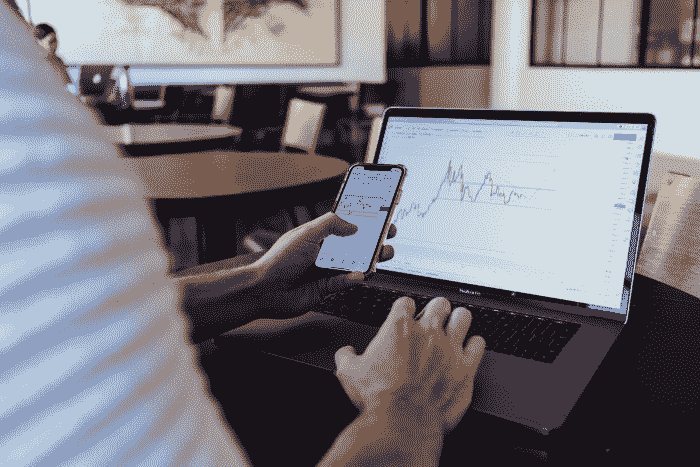
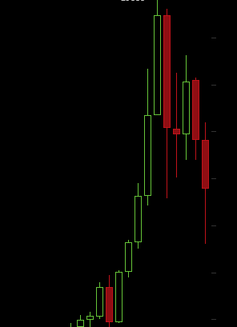

# 新 BTC·ATH 之后是什么？炒作列车！

> 原文：<https://medium.com/coinmonks/what-comes-after-a-new-btc-ath-the-hype-train-e63f50057e2e?source=collection_archive---------8----------------------->

BTC 将很快实现一个新的 ATH。

中国 5 月份的禁令导致 BTC 价格下跌 50%,也导致密码行业损失 1 万亿美元。然而，价格慢慢恢复，大多数加密货币今天达到新高。

8 月期间有恢复，以太坊领先。它缩小了与比特币的差距，看起来仍然是市值第一的有力候选人。

我们还目睹了 BTC 的主导地位最近有所上升。它在 40%的底部，现在在几周内上升到 47%以上。这是美国证交会批准 BTC 交易所交易基金的结果，也是交易所对 BTC 的支持增强了其主导地位。

我昨天写了这篇文章，在 BTC 到达新 ATH 之前。不过，这里的信息是关于接下来的几个月，以及我们到底应该期待什么。

# 这个数字上升了

[*Source*](https://unsplash.com/photos/Gw_sFen8VhU)

分析当前的 BTC 趋势，我发现进入新 ATH 的几率是 99%,在找到阻力之前达到一个非常高的估值，可能是 7-8 万。在我写这篇文章的时候，可能是几天，也可能是几分钟。

目前没有人卖出，在这个特殊的时刻(在新 ATH 爆发)，积极的情绪通常不会错。

对于其他加密货币的投资者(像我一样)，我建议不要犯错。我记得我是如何在 2017 年以 35 美元的价格观看 LTC 图表的，以及我是如何卖掉所有股票，只为了跳到另一个“上涨”的东西上。这样漏了一个 10x。

我持有零 BTC，虽然前几年我曾经交易过，但现在我对它不再感兴趣了。不过，如果我交易的话，我今天不会在 BTC 投入大量资金。回报非常低，而其他机会(如比特币现金)很难找到。

去年，当 BTC 在 1 万点交易时，这是买入的好时机，这次我发现这是一个非常短期的机会，风险很高。

# 最后阶段是如何发生的

一旦 BTC 闯入新 ATH，它将带着巨大的绿色蜡烛呈抛物线上升。既然没人卖，情况就是这样。

不过，它总是得到交易所的大力支持，这些交易所也通过出售其“替代硬币”储备来提高其价格。最终，其余的加密货币赶上来了，尽管我记得在 2017 年，有 25%的损失和漫长的等待时间的痛苦时期。给它时间，如果你打算短期获利，不要过早卖出。目前，我没有，计划是继续持有。此外，我还投资了 SmartBCH tokens 和 DeFi，它们的长期增长潜力远远超过 BTC。

在 BTC 超过某个门槛后(我还不知道鲸鱼是如何工作的)，其他价格总会上涨。

鲸鱼从 BTC 迁出，BTC 开始失去主导地位和价格，而所有加密货币都享受着短期的热潮。这也是牛市的最后阶段，BTC 将试图恢复之前的 ATH，但会失败，因为鲸鱼将开始大量出售每一枚硬币，兑换成美元和欧元。

还是会一样，不要幻想这个市场只会一直涨。这可能需要几个月或更长时间。在 BTC 被推翻、另一枚硬币占据市场首位之前，牛市和熊市将会持续数年。

# 最后

如今，我们有太多已经被高估的股票，它们还会继续上涨。在 BTC 之后，将会有一个以太坊的“泵”。通常是这样的。然后其他的。加密资产价格每天将上涨 20-30%。巨大的水泵最终会崩溃到更现实的价格。

一个忠告在这一点上，将会有大量的先令。一枚硬币将会翻 10 倍，随之而来的是大规模的广告宣传，并突然变得非常受欢迎，只是为了获得足够多的买家，这样这枚硬币就可以大卖了。

根据我的经验，这就是 XVG、IOTA、TRX 以及 2020 年更多公司的情况。如果你在这些炒作列车的早期(在炒作开始之前)，将有很高的风险，它不会成功。如果你进来晚了，你就是在赌博，风险太大了。

在我看来，炒作列车不值得，所以坚持基本面。既然我们知道比特币现金如今被低估了，那么最好不要冒险转向其他任何一种货币，以免浪费这个计划。

在几乎所有加密货币再次大幅增长后，实现的时刻到来了。价格涨到无法持续的高度，崩盘开始了。每个人都会很快退出，人们的兴趣也会恢复正常。

ETF、CME、Bakkt、灰度等。，并没有很大的区别。熊市就在那里，因为这是 BTC 投机浪潮的结构。

现在还是五月初，那些认为事情还没有结束的人是对的。

Follow me on: ● [ReadCash](https://read.cash/@Pantera) ● [NoiseCash](https://noise.cash/u/Pantera99) ● [Medium](/@panterabch) ● [Hive](https://hive.blog/@pantera1) ● [Steemit](https://steemit.com/@pantera1) ●[Vocal](https://vocal.media/authors/pantera) ● [Minds](https://www.minds.com/pantera99/) ● [Twitter](https://twitter.com/Panterabch) ● [LinkedIn](https://www.linkedin.com/in/panterabch/) ● [email](https://read.cash/@Pantera/localcryptos-p2p-exchange-is-now-offering-bitcoin-cash-trading-06637230#bad-link)

**相关文章:** [年底比特币兑现 5000 美元！](https://read.cash/@Pantera/bitcoin-cash-at-5000-by-the-end-of-the-year-1a7c645b)

***支持内容创作者。***

如果你喜欢这个故事，就订阅吧！

*原发布于*[*https://read . cash*](https://read.cash/@Pantera/what-comes-after-a-new-btc-ath-the-hype-train-a5967bc1)*。*

> 加入 Coinmonks [电报频道](https://t.me/coincodecap)和 [Youtube 频道](https://www.youtube.com/c/coinmonks/videos)了解加密交易和投资

## 也阅读

*   [非洲最佳密码交易所](https://blog.coincodecap.com/crypto-exchange-africa) | [胡交易所评论](https://blog.coincodecap.com/hoo-exchange-review)
*   [eToro vs robin hood](https://blog.coincodecap.com/etoro-robinhood)|[MoonXBT vs Bybit vs Bityard](https://blog.coincodecap.com/bybit-bityard-moonxbt)
*   [Stormgain 回顾](https://blog.coincodecap.com/stormgain-review) | [Bexplus 回顾](https://blog.coincodecap.com/bexplus-review) | [币安 vs Bittrex](https://blog.coincodecap.com/binance-vs-bittrex)
*   [Bookmap 评论](https://blog.coincodecap.com/bookmap-review-2021-best-trading-software) | [美国 5 大最佳加密交易所](https://blog.coincodecap.com/crypto-exchange-usa)
*   [如何在 FTX 交易所交易期货](https://blog.coincodecap.com/ftx-futures-trading) | [OKEx vs 币安](https://blog.coincodecap.com/okex-vs-binance)
*   [如何在势不可挡的域名上购买域名？](https://blog.coincodecap.com/buy-domain-on-unstoppable-domains)
*   [印度的秘密税](https://blog.coincodecap.com/crypto-tax-india) | [altFINS 审查](https://blog.coincodecap.com/altfins-review) | [Prokey 审查](/coinmonks/prokey-review-26611173c13c)
*   [布洛克菲 vs 比特币基地](https://blog.coincodecap.com/blockfi-vs-coinbase) | [比特坎评论](https://blog.coincodecap.com/bitkan-review) | [币安评论](/coinmonks/binance-review-ee10d3bf3b6e)
*   [Coldcard 评论](https://blog.coincodecap.com/coldcard-review) | [BOXtradEX 评论](https://blog.coincodecap.com/boxtradex-review)|[uni swap 指南](https://blog.coincodecap.com/uniswap)