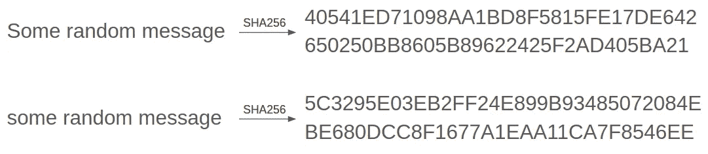

# 你说你的地址是什么？

> 原文：<https://medium.com/coinmonks/what-did-you-say-your-bitcoin-address-was-19d0c1997b81?source=collection_archive---------3----------------------->

Photo by [Glenn Haertlein](https://unsplash.com/@htack210?utm_source=unsplash&utm_medium=referral&utm_content=creditCopyText) on [Unsplash](https://unsplash.com/s/photos/public-mailbox?utm_source=unsplash&utm_medium=referral&utm_content=creditCopyText)

## 比特币地址、钱包和交易脚本的解释。

本文是详述比特币内部运作的系列文章的一部分。在这里找到 [*介绍*](/@barp.edoardo/understanding-bitcoins-a-series-6c557a6fe844?sk=b7d559aee312c413253fb1c9885b7ebb) *，在这里找到* [*比特币交易基础介绍*](/coinmonks/a-basic-introduction-to-bitcoin-transactions-5633b83d518a) *。*

正如我们在[比特币交易基础介绍](/coinmonks/a-basic-introduction-to-bitcoin-transactions-5633b83d518a)中看到的，比特币只作为与一个地址相关的金额存在，如果一个人能够向网络证明他拥有相关的私钥，他就拥有了一个地址。在它们最初非常简单的外观(非常类似于银行账号)下，隐藏着许多复杂的现象。这篇文章介绍了一些密码学基础，以解释密钥和地址是如何生成的，介绍了一些地址类型，并解释了一些有趣的前述现象，如地址重用和复杂的事务脚本。

## 密码学评论

密码学在当今社会无处不在。它是整个互联网安全通信、敏感信息加密等的支柱。当谈到区块链时，使用一种特定类型的加密技术，称为公钥-私钥加密技术。它基于成对数字之间存在的特殊关系，称为私钥和公钥。

对于加密来说，分发公钥就像打开带锁的箱子。人们可以把他们想要的任何信息放进去并锁上它，因为他们知道只有私人钥匙的主人才能打开这把锁。因此，他们不需要担心有人拦截它，因为入侵者无论如何也无法打开它。技术上的解释超出了本文的范围，但是如果感兴趣的话[这篇文章](/crypto-0-nite/understanding-rsa-cryptosystem-5e82af321cff)提供了 RSA 的简单解释，这是最古老的密码系统。

对于签名，不需要传输消息。相反，他们的目标是证明他们是信息的来源。这些算法的工作方式是，它们处理任何带有私钥的消息，并生成签名。这些方法具有这样的特性:公钥可以验证签名是否由相关的私钥生成。因此，通过提供消息、其签名和公钥，消息的来源可以被公开地认证。

> 因此，通过提供消息、其签名和公钥，消息的来源可以被公开地认证

在比特币中，使用椭圆曲线数字签名算法(ECDSA)进行签名(顾名思义！).对于 ECDSA 如何工作的更详细的技术解释，我建议[这篇伟大的文章](/@blairlmarshall/how-does-ecdsa-work-in-bitcoin-7819d201a3ec)，它详细解释了它(警告:这是一篇技术文章！).

另一个与加密技术相关并广泛用于比特币交易的重要概念是**哈希算法**。这些算法在给定任何消息的情况下，生成特定长度的“散列”(即看似随机的字符串)，以这种方式可以直接从输入字符串中找到散列，但很难从散列中恢复输入消息。[这里有一个互动网站](http://www.convertstring.com/Hash/SHA256)来看看哈希是什么样子的。

Example of SHA256 hashing. A single letter difference (S to s) completely changes the hash.

## 比特币地址

地址有几种形式，每一种都有其特点。到目前为止，我一直使用公钥作为比特币地址，但实际上这只是比特币地址的一种类型，它有自己的支付方法，称为 *Pay To Public Key* ，这种支付方法越来越不被看好。相反，如今大多数比特币地址都是由公钥生成的。有两种重要的比特币地址格式:公钥哈希和 Bech32。

两者都是通过以特定方式散列公共密钥而简单生成的。创建这些地址类型有两个主要原因:通过缩短地址使其更易读，以及增加一层额外的隐私。

## 你的钱包

许多钱包软件和服务将你的钱包显示为一个单一的银行账户，有给定的余额，这样当你进行交易时，你只需指定目标地址和金额，其余的就交给你了。正因为如此，它会让人认为您只有一个私有-公共密钥对，所有的事务要么是 in，要么是 out。事实上，这些软件隐藏了你所拥有的(或者应该拥有的！)多个私钥和相关的公钥以及地址。

正如上一篇文章中提到的，事务不要求所有输入都来自同一个地址，它只要求您证明每个地址的所有权。由于这一点，让你的比特币分散到几个地址不成问题。该软件的工作是充当合并，在进行交易时照顾所有的细节，包括经常创建新的密钥对，通常甚至在每次交易之后。

这是有充分理由的。最主要的是隐私。比特币去中心化属性的一个缺点是，所有人都可以获得所有信息。如果你每次都使用同一个比特币地址，那么只需监控你的地址，就可以非常容易地追踪你参与的每一笔交易。除了它的侵扰性，它也可能是危险的。如果有人能够追踪到你(例如，你在自己的网站上公布了你的比特币地址)，他们就会确切知道你拥有多少，并能找到你，以某种方式敲诈你。相反，通过不断改变地址，你使得这种跟踪几乎不可能。

> 如果你每次都使用同一个比特币地址，跟踪你的每一笔交易将变得非常容易，只需监控那个地址。

## 使用过去的交易输出

如前所述，交易是通过比特币地址进行的。当您希望将未用完的输出用于某项事务处理时，首先需要提供在区块链中找到它的信息。然后，在最简单的情况下，提供公钥和签名，它们一起证明您是私钥-公钥对的所有者，并将允许您使用未用完的金额作为交易的输入。

您可以对多个未使用的输出重复此操作，以达到您希望交易的金额。比特币产出不可分割的一个后果是，你不太可能完全累加到你希望交易的价值。相反，你几乎每次都会得到比你希望使用的更高的总数。

如果你不采取任何措施，这笔额外的金额将自动转化为交易费，该区块的矿工(即处理交易的计算机)将把这笔费用据为己有。当然，你可能不希望这样做，因为比特币的“变化”可能非常大，所以通常的做法是简单地将其作为未用输出发送回你的新地址。

## 交易脚本

然而，交易实际上可能要复杂得多。创建输出时，发送者可以选择添加条件，这些条件编码在 *scriptPubKey* 中。这些条件可能变化很大，包括需要密码、多个特定签名等。

脚本可能会变得很长很复杂，由于较重的事务需要更长的时间来挖掘，并且会给网络带来更大的压力，因此它们通常需要更高的事务费才会有趣。核心开发人员注意到了这一点，并决定创建付费脚本散列地址。

在比特币世界中，脚本是一系列指令，可以由任意数量的转换组成。这里有一个允许功能的列表，你可以在这里找到。你能想到的大多数基本操作都是允许的，比如 if 条件、位逻辑，显然还有一些更复杂的加密函数，比如哈希算法。

这些地址非常有趣，因为它们是直接从包含所有条件的脚本散列中生成的，称为“赎回脚本”。也就是说，我们对指令的文本进行哈希运算，并将其用作地址。除了获得内存(以及交易费用)之外，它还将编写兑换脚本的责任从发送方转移到接收方。

赎回脚本就是设置支付条件的脚本。这个脚本中最常见的操作类型是 *OP_MULTISIG* ，它允许多个公钥来兑换比特币输出。重要的是要注意，这个兑换脚本是不公开的，直到未用完的输出被用作输入:提供脚本是收款人的责任！

多重签名操作只是常规的基本脚本之一。如前所述，这些脚本允许多种操作，从而可以创建复杂的条件，通常称为“数字合同”。比如，我们来想一个实际的例子。假设我是一份协议中的中间人，负责在发生纠纷时收取押金。我可以制作一个脚本，让客户或所有者得到钱，但只有当我提供一些隐藏的信息，例如使用我的私钥签名，才能解锁。这样，在发生纠纷的情况下，这笔钱将被冻结(免费)，直到我作为法官做出选择，并向其中一方提供解锁存款所需的信息。

关于交易还有很多信息要说。例如，我们没有仔细检查交易是如何签名和验证的。此外，没有讨论 segwit soft fork(它是对网络的更新),尽管它直接关系到如何签署交易，以及为什么 P2SH 和 bech32 地址变得越来越受欢迎，我将在未来进一步讨论。

在接下来的文章中，我们将更深入地研究区块链，并讨论事务的安全性。如果你喜欢这个系列到现在为止，不要犹豫跟随，这样你会在下一集出版时得到通知！

再见。

> [在您的收件箱中直接获得最佳软件交易](https://coincodecap.com/?utm_source=coinmonks)

