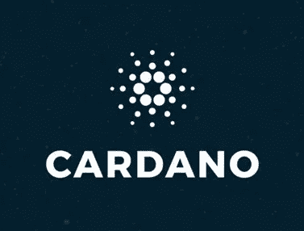

# 卡尔达诺的本土代币是什么意思？

> 原文：<https://medium.com/coinmonks/what-do-we-mean-by-native-tokens-in-cardano-6e926b70d686?source=collection_archive---------4----------------------->

**Cardano 正在缓慢实施其最终解决方案阶段，最新的是在 Cardano 推出本地令牌。这被认为是雪莱下水后最重要的一步。Cardano 的本地令牌架构有望使其相对于竞争对手拥有相当大的优势。**

Cardano Hard Fork combinator 活动于 3 月 1 日启动。这增强了卡尔达诺在区块链发行土著代币的能力。这是迈向完全释放**戈根**的一步，导致了卡尔达诺的智能合同。这意味着卡尔达诺已经从单一资产体系走向多资产体系。

卡尔达诺社区的每个人都可以在卡尔达诺铸造他们自己的本地资产。

这些**资产/代币将拥有与卡达诺本国货币 ADA** 相似的所有关键功能，例如与 ADA 本身相同的安全级别。

最令人惊讶的发展是**人们不需要使用或编写智能合同或自定义代码来创建这些令牌**。这种逻辑是基于 Cardano 分类账，而不是智能合约。

当前的以太坊令牌化过程需要自定义代码，这增加了复杂性和安全性。使用智能合约创建的令牌是非本机令牌。基础分类帐不支持这些令牌。智能合约容易出现漏洞，从而带来安全风险。Mary Hardfork 和 Cardano 原生令牌架构为以太坊令牌迁移到 Cardano 创建了零障碍。

与区块链对话不需要支付智能合约费用，因此交易的总成本很低。

就发送和接收而言，任何钱包地址都可以用于发送和接收 ADA 和本机令牌。另外，**您可以在一次交易中发送多个代币**，这进一步降低了由多次交易费用产生的交易成本。

**然而，在本地令牌和 ADA 之间有两个明显的区别。**

1.与 ADA 不同，本机令牌可以被创建和销毁。

2.服务费、奖励和押金只能使用 ADA 支付。

Cardano 分类帐支持可替换和不可替换的令牌，无需专门的合同。它可以在单个输出中混合存储这两种类型。

**驱动本地令牌框架的核心原则是:**

**1。轻量级:** Cardano 的多资产分类账结构是围绕原生束(值)构建的。令牌包是 ADA 和其他令牌的混合。令牌具有资产 id，其中包括铸造策略的散列，因为这是不存储在分类帐中并且可定制的部分。令牌包具有 2 级映射结构，使得可替换和不可替换令牌能够被统一表示。

**2。可负担性:**生态系统中的资产转移不带有任何执行自由，这使得它更便宜。

**3。安全性:**在 Cardano 中，所有本地令牌传输逻辑都在分类帐中编码。这确保了系统的可预测和一致的行为。本地令牌共享相同的安全 ad 和 ADA 本身。

**4。统一流程:**考虑到总账中通用的逻辑编码，所有的令牌都将以相同的方式处理，创建一个统一的流程。这将导致更快的发展和更好的决策。

在代币飞行中，就在 Ada 天平的下面，你会看到一个新的‘代币’按钮。到目前为止，可替换和不可替换的令牌都可以使用 CLI 界面来创建。这需要一定的技术知识。在接下来的几天里，一个用户友好的界面将会出现，这将使任何人都更容易铸造他们的可替换代币。之后，NFTs 将在 UI 中可用。

下一个硬叉是阿隆索。随着时间的推移，随着 Babel transactions 和第三个 hard fork 的出现，Cardano 将成为 stablecoins 和安全令牌的良好平台。有一些团体已经开始在卡尔达诺铸造 NFT。这些将被认为是卡尔达诺区块链的第一个。

**阅读上一篇:** [卡达诺基金 4 概述及主要提案—第一部分](https://tulip311bit.medium.com/cardano-fund-4-overview-and-top-proposals-part-1-5555b5f7f96)

***注:*** *本帖最初发表于* [*此处*](https://www.voice.com/post/@tulip/what-do-we-mean-by-native-tokens-in-cardano-1615290702-549863068) *为与 voice.com 有关联的密码作者。*

**通过我的推荐加入**

[Crypto.com](https://binance.com/en/register?ref=E8PCD3AF)——[币安](https://platinum.crypto.com/r/sut3pd9bzn)

跟我来吧

**👉** [推特](https://twitter.com/rumadas123)

**👉** [Linkedin](https://www.linkedin.com/in/ruma-das-a1439320/)

> 加入 Coinmonks [Telegram group](https://t.me/joinchat/EPmjKpNYwRMsBI4p) 学习加密交易和投资

## 另外，阅读

*   最好的[密码交易机器人](/coinmonks/crypto-trading-bot-c2ffce8acb2a) | [网格交易](https://blog.coincodecap.com/grid-trading)
*   [3 商业评论](/coinmonks/3commas-review-an-excellent-crypto-trading-bot-2020-1313a58bec92) | [Pionex 评论](/coinmonks/pionex-review-exchange-with-crypto-trading-bot-1e459d0191ea) | [Coinrule 评论](/coinmonks/coinrule-review-2021-a-beginner-friendly-crypto-trading-bot-daf0504848ba)
*   [AAX 交易所评论](/coinmonks/aax-exchange-review-2021-67c5ea09330c) | [德里比特评论](/coinmonks/deribit-review-options-fees-apis-and-testnet-2ca16c4bbdb2) | [FTX 交易所评论](/coinmonks/ftx-crypto-exchange-review-53664ac1198f)
*   [n ave 零点回顾](/coinmonks/ngrave-zero-review-c465cf8307fc) | [Phemex 回顾](/coinmonks/phemex-review-4cfba0b49e28) | [PrimeXBT 回顾](/coinmonks/primexbt-review-88e0815be858)
*   [Bybit Exchange 审查](/coinmonks/bybit-exchange-review-dbd570019b71) | [Bityard 审查](/coinmonks/bityard-review-7d104239be35) | [CoinSpot 审查](https://blog.coincodecap.com/coinspot-review)
*   [3 commas vs crypto hopper](/coinmonks/3commas-vs-pionex-vs-cryptohopper-best-crypto-bot-6a98d2baa203)|[赚取加密利息](/coinmonks/earn-crypto-interest-b10b810fdda3)
*   最好的比特币[硬件钱包](/coinmonks/the-best-cryptocurrency-hardware-wallets-of-2020-e28b1c124069?source=friends_link&sk=324dd9ff8556ab578d71e7ad7658ad7c) | [BitBox02 回顾](/coinmonks/bitbox02-review-your-swiss-bitcoin-hardware-wallet-c36c88fff29)
*   [莱杰 vs n 平均](/coinmonks/ledger-vs-ngrave-zero-7e40f0c1d694) | [莱杰纳米 s vs x](/coinmonks/ledger-nano-s-vs-x-battery-hardware-price-storage-59a6663fe3b0)
*   [密码本交易平台](/coinmonks/top-10-crypto-copy-trading-platforms-for-beginners-d0c37c7d698c)
*   [Vauld 评论](/coinmonks/vauld-review-2021-lend-trade-and-buy-bitcoin-in-india-e37a96374961) | [YouHodler 评论](/coinmonks/youhodler-4-easy-ways-to-make-money-98969b9689f2) | [区块链评论](/coinmonks/blockfi-review-53096053c097)
*   最好的[加密税务软件](/coinmonks/best-crypto-tax-tool-for-my-money-72d4b430816b) | [硬币追踪评论](/coinmonks/cointracking-review-a-reliable-cryptocurrency-tax-software-5114e3eb5737)
*   最佳[加密借贷平台](/coinmonks/top-5-crypto-lending-platforms-in-2020-that-you-need-to-know-a1b675cec3fa) | [杠杆代币](/coinmonks/leveraged-token-3f5257808b22)
*   [block fi vs Celsius](/coinmonks/blockfi-vs-celsius-vs-hodlnaut-8a1cc8c26630)|[Hodlnaut 审查](/coinmonks/hodlnaut-review-best-way-to-hodl-is-to-earn-interest-on-your-bitcoin-6658a8c19edf)
*   [Bitsgap 审查](/coinmonks/bitsgap-review-a-crypto-trading-bot-that-makes-easy-money-a5d88a336df2) | [Quadency 审查](/coinmonks/quadency-review-a-crypto-trading-automation-platform-3068eaa374e1) | [Bitbns 审查](/coinmonks/bitbns-review-38256a07e161)
*   [埃利帕尔泰坦评论](/coinmonks/ellipal-titan-review-85e9071dd029) | [赛克斯斯通评论](/coinmonks/secux-stone-hardware-wallet-review-15-discount-coupon-2020-7577032faa6e)
*   [本地比特币评论](/coinmonks/localbitcoins-review-6cc001c6ed56)
*   最佳[区块链分析](https://bitquery.io/blog/best-blockchain-analysis-tools-and-software)工具| [赚比特币](/coinmonks/earn-bitcoin-6e8bd3c592d9)
*   [加密套利](/coinmonks/crypto-arbitrage-guide-how-to-make-money-as-a-beginner-62bfe5c868f6)指南| [如何做空比特币](/coinmonks/how-to-short-bitcoin-568a2d0b4ae5)
*   最佳[加密制图工具](/coinmonks/what-are-the-best-charting-platforms-for-cryptocurrency-trading-85aade584d80) | [最佳加密交易所](/coinmonks/crypto-exchange-dd2f9d6f3769)
*   [如何在印度购买比特币？](/coinmonks/buy-bitcoin-in-india-feb50ddfef94) | [瓦济克斯评论](/coinmonks/wazirx-review-5c811b074f5b)
*   [印度比特币交易所](/coinmonks/bitcoin-exchange-in-india-7f1fe79715c9) | [比特币储蓄账户](/coinmonks/bitcoin-savings-account-e65b13f92451)
*   [CoinDCX 评论](/coinmonks/coindcx-review-8444db3621a2)

包括附属链接

> [直接在您的收件箱中获得最佳软件交易](/coinmonks/newsletters/coinmonks)

