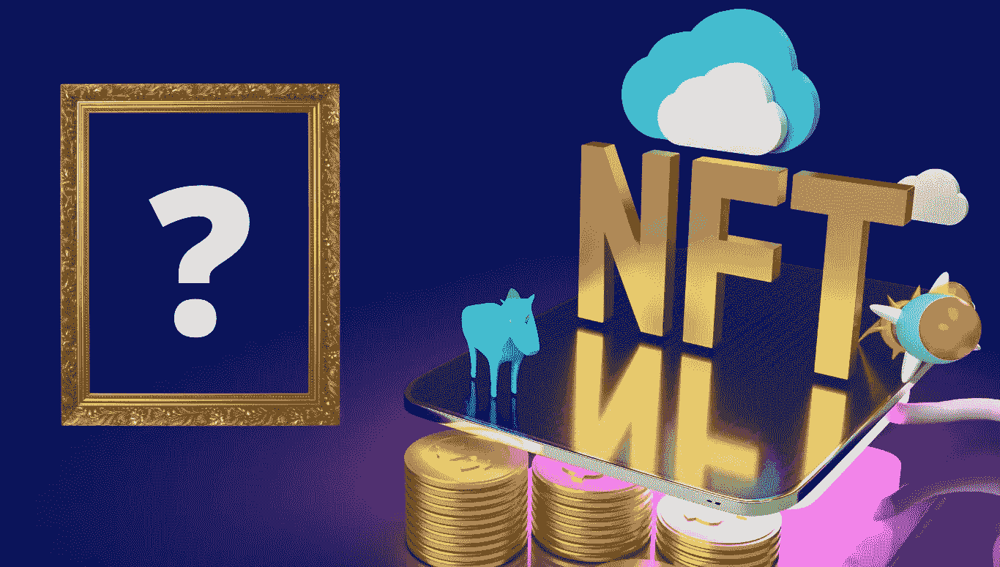

# 当你买了一个数字艺术 NFT，你会得到什么？

> 原文：<https://medium.com/coinmonks/what-do-you-get-when-you-buy-a-digital-art-nft-a13209c88119?source=collection_archive---------2----------------------->

不可替代的代币在网上拍卖中的价值暴涨后成为焦点。NFT 是在区块链上表示的独特资产。大多数加密货币令牌都不是 NFT。相反，它们是可替换的，这意味着同一种货币的代币彼此之间并不唯一。你可以通过许多不同的市场 ***、*** 购买 NFT，但你实际上买的是什么？数字艺术可能并不像它们看起来那样。

当你购买 NFT 的数码艺术品时，你可能会期望真正的艺术品或视频剪辑会被转移到你的钱包里。这不是真的。您可能会收到记录在区块链上的“元数据”。说白了，你买的是艺术品的数字描述。

# NFT 代表所有权，但是底层资产存储在其他地方

数字艺术 NFT 令牌代表艺术作品，但在令牌中存储图像或视频剪辑的成本很高。相反，您将在 NFT 令牌中找到一个指向互联网上某个位置的 URL(web 链接)。如果您跟踪该地址，通常会找到一个包含图像数据的文件，如图像 URL、描述和文件名。当您点击并跟随图像 URL 时，实际图像可能存储在第三方公司的网站上。NFT 安全地证明了在这个位置的任何图像的所有权。虽然该证明安全地存储在区块链上，但实际图像有多安全呢？

# 存储在区块链之外的数据无法从区块链的安全性中获益

区块链被广泛认为是存储数据的安全之地。存储在区块链上的 NFT 数据(如所有权证明和交易历史)受益于这种安全性。然而，存储在区块链以外的关键图像数据可能不那么安全。如果包含艺术作品的网站关闭或内容被切换，你的 NFT 会发生什么？现实情况是，NFT 艺术品所有者受到这些公司的摆布。他们并不实际控制他们购买的艺术品，甚至元数据。如果公司愿意，他们可以改变你购买的图片或剪辑。公司控制着数据。如果一家公司使用私人服务器来控制其图像，而该公司即将倒闭，你的 NFT 将失去价值。虽然您的 NFT 令牌继续证明所有权，但您拥有的资产可能会丢失，留给您一个加密安全但死链接。

打个比方，如果你把房契存在银行，你可以保护你的所有权证明，但这并不能保护你的房子免受火灾、纵火或盗窃等事件的影响。幸运的是，还有锁和保险等其他产品可以帮助你。同样，也有保护你的数字作品的方法。

# 有多种方法可以保护以 NFTs 为代表的数字艺术品

防止存储你的图片的公司损失的一个方法是使用 IPFS 链接。IPFS 链接是指向分布式存储系统中的资产的 URL 的替代物。在分布式存储系统中，资产可以存在于系统内部的多个位置，而不是存在于单个服务器中，从而降低了因服务器问题而造成损失的可能性。这个原则类似于使公共区块链安全的分权。如果你的文件在 IPFS，那么 NFT 平台不能交换信息，改变图像或完全删除它。IPFS 的问题是，当系统空间不足时，不用的文件通常会被删除，而新的文件需要上传。系统将删除一段时间内未查看的文件。发生这种情况时，不能保证该文件已在另一台 IPFS 服务器上备份。由于这些问题，IPFS 链接不是一个理想的解决方案；然而，相对于私有服务器的 URL 链接，它们是一个显著的改进。

为了保护您的 NFT 不消失，您需要采取额外的预防措施。为 Pinata 和类似的服务付费可以确保 IPFS 服务器上的文件永远不会消失。他们通过全天周期性地请求文件来做到这一点。这可确保文件永远不会被视为非活动文件并被删除。如果 IPFS 的文件是由你购买 NFT 的公司保存的，那么还是有风险的。但是，另一台 IPFS 服务器很有可能会拥有该文件。

# 为了使 NFTs 变得广泛、分散和安全，存储解决方案是必要的。

如果人们开始失去他们在 NFT 的资产，NFT 泡沫将不可避免地破裂。这给 NFTs 和区块链提出了问题。比如，什么是知识产权故事？你如何处理欺诈和争议解决？是什么阻止了相同的数字资产在多个区块链上出售？在 NFTs 变得有用和广泛之前，系统需要让用户相信他们的资产是安全的。就像 2018 年的 ICO 泡沫一样，当用户集体购买毫无价值的加密货币时，没有监管框架来让用户和提供商承担责任。虽然社区需要解决一些风险和问题，但我们相信 NFTs 能够为创造者提供真正的价值，并成为分散融资不可或缺的一部分。我们很高兴看到 NFTs 作为一项技术走向成熟。

> 加入 [Coinmonks 电报频道](https://t.me/coincodecap)，了解加密交易和投资

## 另外，阅读

*   [什么是保证金交易](https://blog.coincodecap.com/margin-trading) | [美元成本平均法](https://blog.coincodecap.com/dca)
*   [BigONE 交易所评论](/coinmonks/bigone-exchange-review-64705d85a1d4) | [电网交易机器人](https://blog.coincodecap.com/grid-trading)
*   [3 商业评论](/coinmonks/3commas-review-an-excellent-crypto-trading-bot-2020-1313a58bec92) | [Pionex 评论](/coinmonks/pionex-review-exchange-with-crypto-trading-bot-1e459d0191ea) | [Coinrule 评论](/coinmonks/coinrule-review-2021-a-beginner-friendly-crypto-trading-bot-daf0504848ba)
*   [莱杰 vs Ngrave](/coinmonks/ledger-vs-ngrave-zero-7e40f0c1d694) | [莱杰 nano s vs x](/coinmonks/ledger-nano-s-vs-x-battery-hardware-price-storage-59a6663fe3b0) | [币安评论](/coinmonks/binance-review-ee10d3bf3b6e)
*   [Bybit Exchange 审查](/coinmonks/bybit-exchange-review-dbd570019b71) | [Bityard 审查](/coinmonks/bityard-review-7d104239be35) | [CoinSpot 审查](https://blog.coincodecap.com/coinspot-review)
*   [3 commas vs crypto hopper](/coinmonks/3commas-vs-pionex-vs-cryptohopper-best-crypto-bot-6a98d2baa203)|[赚取加密利息](/coinmonks/earn-crypto-interest-b10b810fdda3)
*   最好的比特币[硬件钱包](/coinmonks/the-best-cryptocurrency-hardware-wallets-of-2020-e28b1c124069?source=friends_link&sk=324dd9ff8556ab578d71e7ad7658ad7c) | [BitBox02 回顾](/coinmonks/bitbox02-review-your-swiss-bitcoin-hardware-wallet-c36c88fff29)
*   [BlockFi vs 摄氏度](/coinmonks/blockfi-vs-celsius-vs-hodlnaut-8a1cc8c26630) | [Hodlnaut 审核](/coinmonks/hodlnaut-review-best-way-to-hodl-is-to-earn-interest-on-your-bitcoin-6658a8c19edf) | [KuCoin 审核](https://blog.coincodecap.com/kucoin-review)
*   [Bitsgap 评审](/coinmonks/bitsgap-review-a-crypto-trading-bot-that-makes-easy-money-a5d88a336df2) | [Quadency 评审](/coinmonks/quadency-review-a-crypto-trading-automation-platform-3068eaa374e1) | [Bitbns 评审](/coinmonks/bitbns-review-38256a07e161)
*   [加密复制交易平台](/coinmonks/top-10-crypto-copy-trading-platforms-for-beginners-d0c37c7d698c) | [Coinmama 审核](/coinmonks/coinmama-review-ace5641bde6e)
*   [印度的加密交易所](/coinmonks/bitcoin-exchange-in-india-7f1fe79715c9) | [比特币储蓄账户](/coinmonks/bitcoin-savings-account-e65b13f92451)
*   [n rave ZERO Review](/coinmonks/ngrave-zero-review-c465cf8307fc)|[phe MEX Review](/coinmonks/phemex-review-4cfba0b49e28)|[PrimeXBT Review](/coinmonks/primexbt-review-88e0815be858)
*   最佳[区块链分析](https://bitquery.io/blog/best-blockchain-analysis-tools-and-software)工具| [赚比特币](/coinmonks/earn-bitcoin-6e8bd3c592d9) | [Swapzone 评论](/coinmonks/swapzone-review-crypto-exchange-data-aggregator-e0ad78e55ed7)
*   [加密套利](/coinmonks/crypto-arbitrage-guide-how-to-make-money-as-a-beginner-62bfe5c868f6)指南| [如何做空比特币](/coinmonks/how-to-short-bitcoin-568a2d0b4ae5) | [Prokey 回顾](/coinmonks/prokey-review-26611173c13c)
*   [币安交易机器人](/coinmonks/binance-trading-bots-d0d57bb62c4c) | [OKEx 审查](/coinmonks/okex-review-6b369304110f) | [Atani 审查](https://blog.coincodecap.com/atani-review)
*   [最佳加密交易信号电报](/coinmonks/best-crypto-signals-telegram-5785cdbc4b2b) | [MoonXBT 评论](/coinmonks/moonxbt-review-6e4ab26d037)
*   [Godex.io 审核](/coinmonks/godex-io-review-7366086519fb) | [邀请审核](/coinmonks/invity-review-70f3030c0502) | [BitForex 审核](/coinmonks/bitforex-review-c4bb28d9e271)