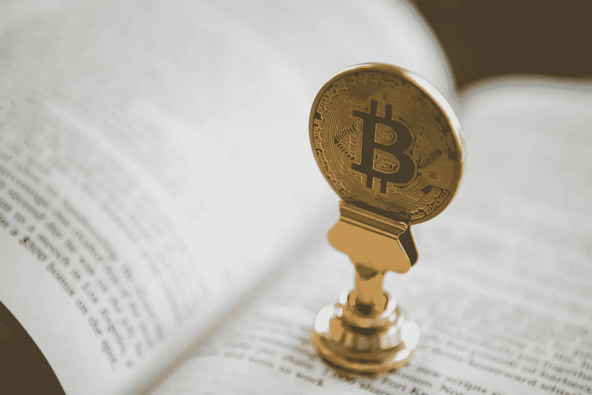

# 你用比特币合法拥有什么？

> 原文：<https://medium.com/coinmonks/what-do-you-legally-own-with-bitcoin-97b083ed6a04?source=collection_archive---------0----------------------->

Credit: [fiatjustitia.nl](https://www.fiatjustitia.nl/archief/legal_tech_en_innovatie_in_de_advocatuur_vervangt_bitcoin_straks_het_uurtarief/)

比特币的所有权问题——当一个人在非常基本的层面上持有比特币时，他到底拥有什么——不仅困扰了法律讨论一段时间。这场辩论固有的技术性质常常提出更多的问题，而不是提供答案。据我们所知，比特币或类似的东西(硬数字货币)会一直存在，这就引出了一个问题——它(在法律上)是什么？

鉴于这是一个跨司法管辖区的问题，我将努力控制我对德国和 EU-法律的偏见，并更普遍地处理手头的问题。我认为这是一项正在进行的工作，并总是欢迎礼貌的异议。

*这不是投资或法律建议。我不是你的律师。*

# 财产——所有权——占有

不同的司法管辖区对财产、所有权或占有权的定义不同。从法律上来说，它们可以被归入表示不同的东西。对于这种高层次的方法，我们将它们结合起来表示“财产”,因此，所述财产的所有权应授予我们以下权利:

> “只要法律或第三方权利不反对，X 的所有者可以随意处理 X，并排除其他人的任何影响。"

如果你手里拿着手机走在街上，一般没人会怀疑这是不是你的手机。如果有争议，你应该能够提供合理的证据，通过相应的法案参考一个序列号，这将是它的结束。如果你拥有一块土地，证明是由所有权链提供的，它说明了导致你拥有土地的历史转让顺序。

在数字领域，稀缺很少成为一件事，因此在复制粘贴的世界里，提供产权证明不是一件小事。

# 输入比特币

在[中本聪](https://bitcoin.org/bitcoin.pdf)用他的工作链证明解决了[拜占庭将军的问题](https://satoshi.nakamotoinstitute.org/emails/cryptography/11/)之前，所有之前的数字货币尝试都缺少至少一个主要成分。然而，如果比特币是硬数字货币——或者正如[安德烈亚斯·安东诺普洛斯](https://twitter.com/aantonop)恰当地描述的那样“ [*货币是一种内容类型*](https://www.youtube.com/watch?v=6vFgBGdmDgs)*——稀缺性、提供所有权证明以及能够排除他人对你的货币的任何影响就变得至关重要。*

*在法律出版物中，什么真正构成了“一个”比特币的问题通常要么通过简单地将其归入一个非物质物体来避免，要么(更好地)通过将其与物理物体(不能碰这个)或权利主张(没有一个硬币发行者)区分开来进行消极处理。在我看来，有不同的原因。最主要的一点是，弄清比特币到底是什么变得非常技术性。*

*然而，如果我们要更好地理解“区块链技术”提供的机会，并正确看待现有的法律框架，就必须更仔细地了解比特币到底是什么。(大写 B)比特币与其他“区块链网络”的共同点是，它包含一个本地令牌——(小写)比特币——但这通常是可比性的终点。这就是为什么近距离观察是必不可少的。问题仍然是…*

# *什么是比特币(合法)？*

*问题“比特币是什么？不同的人有不同的回答是可以理解的。就法律角度而言，将其描述为一种[去中心化的数字货币很可能不会太不准确，这种货币能够向世界上任何地方的任何人进行即时支付。](https://en.bitcoin.it/wiki/Bitcoin)*

*当评估你在“持有”比特币时，在法律意义上实际“拥有”什么时，看看这些支付是如何产生的可能是一个不错的起点。*

## *UTXOs*

*当你的钱包告诉你在你的余额中有 1 个 btc，这意味着你在一个或多个 [UTXOs](https://bitcoin.org/en/developer-guide#term-utxo) 中有 1 个 btc，而整个比特币 UTXO 集基本上是一个显示网络上所有可消费输出的数据库。*

*这些 UTXOs——未使用的事务输出——可以作为新事务的输入使用。因为特定交易的每个输出只能花费一次，所以包括在比特币区块链中的所有交易的输出可以被分类为 UTXOs 或已花费的交易输出。为了使事务有效，它只能使用 UTXOs 作为输入。*

## *集体奖励*

*所有“硬币”最初都来自于集体补贴，这是集体奖励的一部分。一个块中的第一个交易必须是一个 [coinbase 交易](https://bitcoin.org/en/developer-reference#term-coinbase-tx)，该交易应收取并使用该块中包含的交易支付的任何交易费用。*

*所有积木高度低于 693 万的积木(大概在 2140 年每十分钟就有一个新积木被创造出来)都有资格获得新创造的比特币价值的积木补贴，这笔钱也应该花在硬币交易上(积木补贴每四年减半，从 50 开始，现在是 12.5 个比特币)。大宗补贴和交易费用加在一起，就是矿商竞相争取的大宗报酬。矿工出售他们的比特币(UTXOs)是为了支付他们的运营费用，简而言之，这就是他们最终在你的钱包里显示为数字的方式。*

## *拥有和使用比特币*

*如果您打算使用 UTXO 或部分 UTXO，您需要创建一个输入，该输入引用了通过其散列(txid)获得比特币的交易，以及使用的特定输出和 sigscript ( [公钥](https://bitcoin.org/en/glossary/public-key) + [签名](https://bitcoin.org/en/glossary/signature))。那些[输出](https://bitcoin.org/en/glossary/output)还包含一个“*”一个 pubkey 脚本，用于指示那些要进一步度过的 satoshis 必须满足什么条件*。*

*签名被定义为与公钥相关的值，只有拥有创建该公钥的私钥的人才能合理地创建该值。本质上，这归结为当您*签署*一个交易时，您正在使用您的私钥来创建一个签名。通过这个签名，可以验证您是否有权访问与地址相关联的私钥，而另一方(验证方)不知道该私钥实际是什么(非常详细的解释[(此处为](/digitalassetresearch/a-guide-to-bitcoins-technical-brilliance-for-non-programmers-e28211e797c0))。*

*从法律上讲，签名向公共密钥脚本发出信号，表明个人拥有(或正拥有)创建公共密钥的私钥。换句话说，私钥对所讨论的 utxo 具有“T12”处置权，或者换句话说:与现实世界中令人垂涎的触摸相比，私钥对相应的 utxo 或“比特币”赋予了拥有者“T14”数字触摸权。*

*回到开始:*

> *“只要法律或第三方的权利不反对,**私钥的所有者可以在比特币网络**上任意使用**相应的 UTXOs** ，并将他人排除在任何影响之外。"*

*还有很多后续问题，例如，如何区分私钥和 UTXOs，因为从技术上讲，即使您丢失了私钥，UTXO 仍然存在，但这超出了本文的范围。*

# *结论*

*历史上第一次，公钥加密、哈希函数和 merkle 树与比特币的货币政策相结合，赋予了我们数字稀缺性和独特的数字触觉。因此，毫不奇怪，在过去几年中，关于这个主题的(法律)讨论一直在努力将比特币和这一新范式纳入现有法律术语。*

***那么，你合法拥有比特币吗？**对我来说，你拥有唯一分配给你的比特币 UTXO 集的一部分，并且只有你拥有相应的私钥。随之而来的是巨大的责任。如果你丢失了你的私钥，你就失去了你的比特币。如果您的私钥被盗，民法可能会规定密钥本身和它访问的 UTXOs 仍然是“您的”。就比特币网络而言，私钥赋予拥有该密钥的任何人处置权。*

*上述特征是比特币特有的。其他加密货币可以利用类似甚至相同的方法。然而，在仔细观察之后，很明显我们必须检查每一个“T4”令牌或“T6”硬币，特别是通过在所讨论的网络中设置的属性和规则。*

*我想对我的朋友 [hasufly](/@hasufly) 表示感谢，感谢他宝贵的反馈。我是推特上的@KnutKarnapp ,希望能收到读者的来信。*

> *[直接在您的收件箱中获得最佳软件交易](https://coincodecap.com/?utm_source=coinmonks)*

**