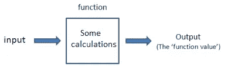
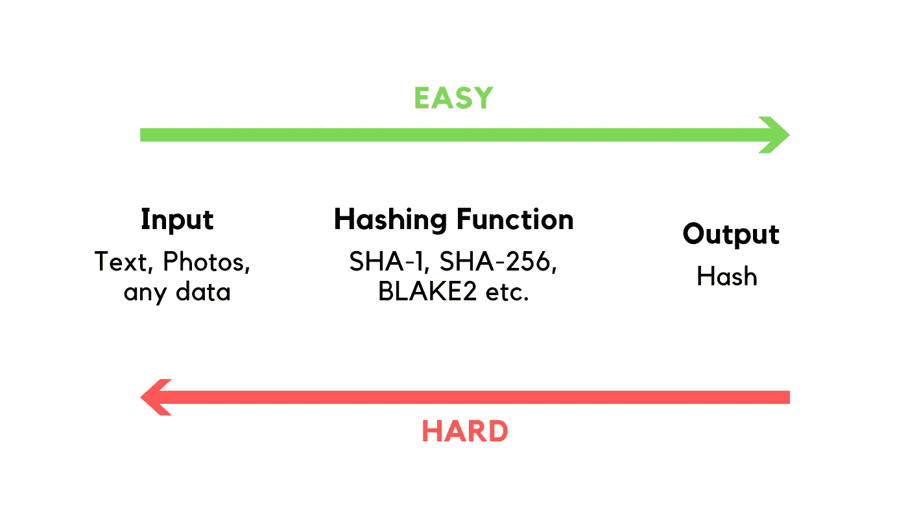
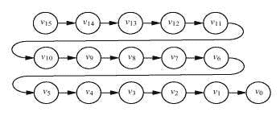
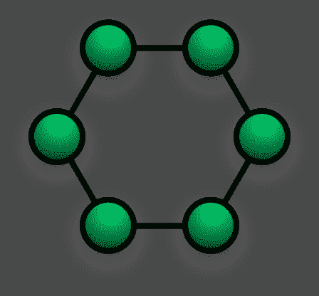
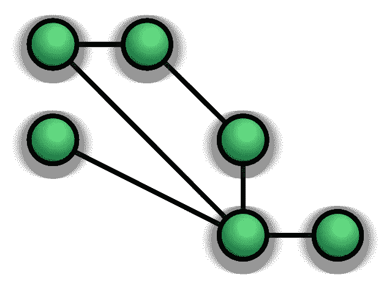
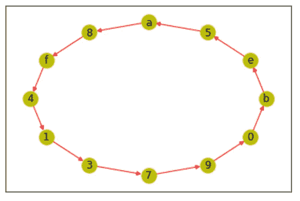
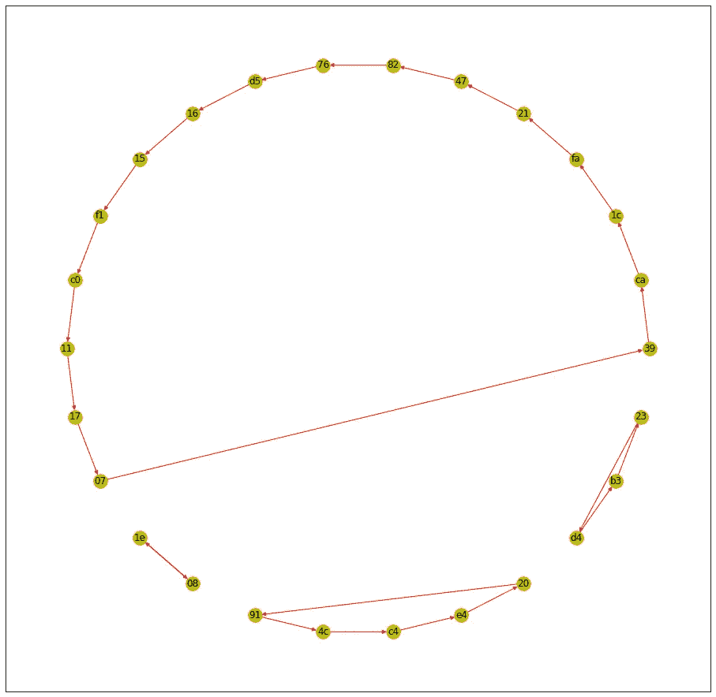
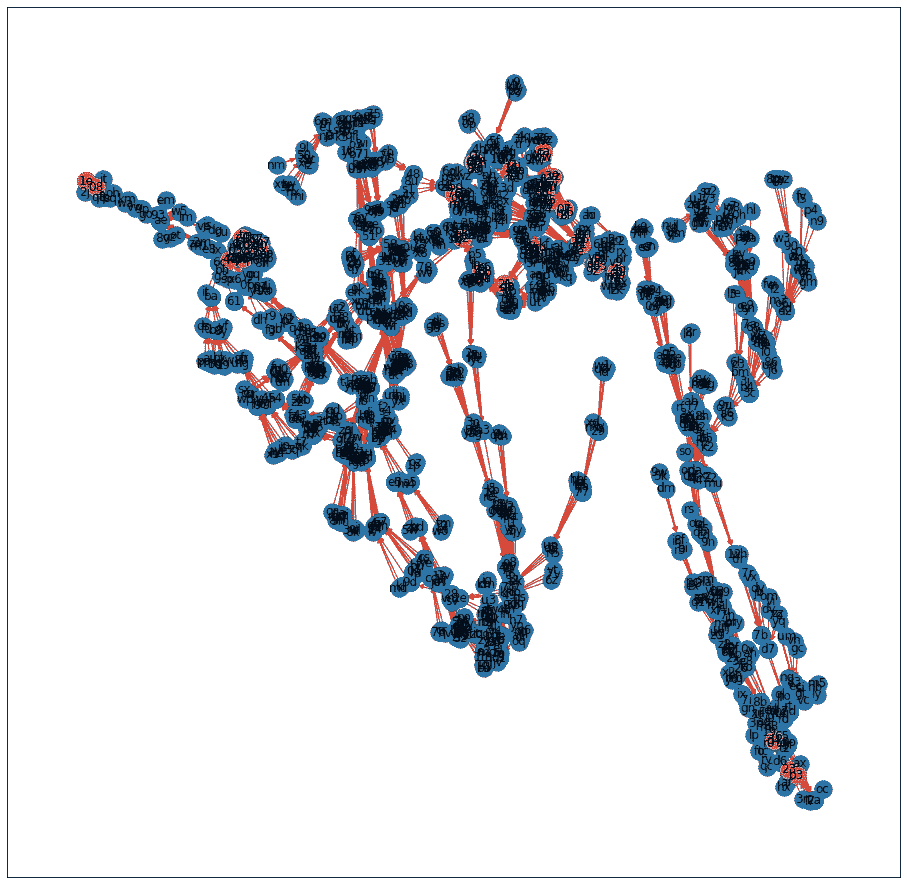
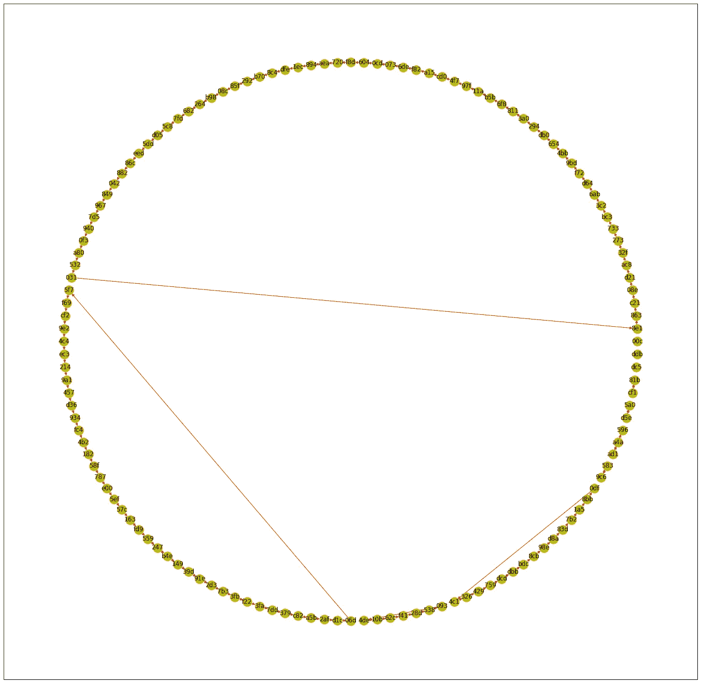

# 哈希函数是什么样子的？

> 原文：<https://medium.com/coinmonks/what-does-a-hash-function-look-like-3f1bddd22d1?source=collection_archive---------2----------------------->

你向一个函数发送数据，不同的数据从另一端出来。这就是函数:一台机器。

有一种函数有一个特殊的属性:知道输出并不能给你多少关于输入的信息。这是一个哈希函数。

Hash Functions

这是确定性的，计算繁琐，难以逆向工程。就是这样。哦，输出是固定长度的。

**问题**

所以，你可能想知道，散列函数的输入输出空间是什么样的？

当然，任何现代的、有用的散列函数都有一个巨大的空间，以至于我们实际上无法在地球上所有的内存中保存所有的散列，更不用说可视化它们了。也许这是一个愚蠢的差事，但也许有一些见解，我们可以推断出空间，而不实际看它。

首先，我们必须给这个问题下一点定义。这样做没有太大意义，因为您可以将任意长度的任意输入放入哈希函数中。

因此，为了简化，我们应该限制输入，使其看起来像输出(具有相同的固定长度)。在某种程度上，这实际上是分析所有散列空间的一种非常自然的方式，因为输入空间与输出空间大小相同。

一旦我们假设这个限制——所有的输入都是散列——我们就可以开始想这个空间看起来像什么。

**形状**

我们可以推断出几件事。知道了每个输入导致一个且只有一个输出，我们可以想象一条线，一个散列链。

hashing a hash produces a new hash

然而，由于所有可能的散列的空间在某一点上是有限的，所以一个散列必定导致先前在链中发现的散列。所以我们要找到一个循环。

A perfect hash function

然而，不能保证循环会包含所有可能的散列。事实上，像这样完美的散列函数很难设计。更确切地说，循环看起来更像这样(原谅我缺乏方向，但是想象一下箭头指向循环)。

A practical hash function

让我们花点时间来探讨一下这个问题。请注意，在哈希函数空间中，作为输入的哈希没有被表示为输出。还要注意它们会发生冲突，也就是说，两个不同的输入会产生相同的输出。终端节点的数量(2)等于冲突的数量(2)。最后，请注意，总是存在一个有保证的循环，即使该循环是一个自己产生的散列。

有点像有向无环图(DAG ),除了在原点有一个保证循环。将环路视为单个节点(原始节点)，它就是一个 DAG。如果散列的次数足够多，所有的散列都会导致循环。

在我们看到一些例子之前，让我们再注意一件事。哈希空间没有理由不能由多个循环组成，但是这些循环中的每一个都必须相互独立。这直接源于这样一个事实，即每个输入只有一个输出(确定性地产生一个散列)，尽管每个输出可以有多个输入导致它(冲突)。

不管怎样，那很有趣。也许我们应该看看实际情况。

**例题**

我们将使用一个 1 位数、2 位数和 3 位数的散列函数来感受一下。我制作了一个笔记本，在我清理一下之后，我会把它公之于众，下面的图片来自它。

首先，让我们看看 1 位数的散列函数。我探索了它的整个空间，所以它可以被展示。它是一个数字，包括所有小写字母和 10 个数字，所以总共 36 个字符。

这么小的空间只有一个环。

1-digit hash function loop

然而，正如我们上面讨论的，循环不必包括散列空间的所有节点。该循环具有循环中 36 个节点中的 12 个；正好 1/3。

当“尾巴”也包含在图表中时，事情就更有趣了。在这里，用蓝色表示的是，您可以看到所有未包含在循环中的其他节点。

All 36 hashes

注意每个蓝色节点代表一次碰撞。考虑一下 ***y*** 节点: ***y*** 引出 ***9*** 正如 **7** 所做的那样，所以它与 ***7*** *相碰撞。*再者， ***h*** 和 ***q*** 碰撞在一个还没有循环的节点上， ***2*** 。最长的尾巴，在循环中没有节点的最长的链是 3 个节点长。

好了，接下来是两位数的玩具散列函数。记住，每个散列现在有 2 个数字，所以每个组合都被探索。整个空间由 36*36 组成，即 1269 个散列或节点。

我们将首先检查回路。

Loops of the 2–digit hash function

有趣的是，也许很自然地，不再只有一个循环了。有多个，最小的是 ***1e*** 引出 ***08*** 引出回 ***1e*** 。我们可能还会发现有趣的是，环的大小往往遵循幂律分布，因此在这种情况下，最大的环要比第二大环的大小大得多。

同样令人着迷的是这些循环中的节点数量:节点总数的一小部分。1296 人中的 16 人:1.23%。仅仅通过增加空间中的散列数，我们很快就将循环节点的百分比从 33%减少到了近 1%。

这里我们应该提一下。看到环路是如何被隔离的了吗？我们现在可以推断，连接到这些循环的任何尾部也是孤立和独立的，因为每个散列的散列只导致另一个散列。这两个回路根本无法连接。

好吧，让我们把尾巴收进来，看看还有什么事。

2–digit hash space... my visualization skills are limited.

哇哦。长尾龙。很多很多的碰撞，相当均匀的分布。

我实际上没有研究过它，从上面的图表中很难验证，但我会假设故事的长度与循环的大小遵循相同的分布；即幂律分布。许多小尾巴，许多小环，一个非常长的尾巴，一个非常大的环(相对于其他环的大小)。

看一下图的右边，看到底部那个***【D4】******B3******23***循环了吗？沿着它的尾巴一路向上，我们会看到我们之前推导出的东西，它们与其他循环是隔离的。这个 3 哈希的小循环有一个巨大的尾巴。

让我们绘制一个 3 位数函数的整个空间:36*36*36 或 46，656 个节点。

3-digit hash loops

还是那句话，循环遵循幂律分布，在这里我们终于看到了直接通向自己的节点: ***00c*** ， ***ddb*** ， ***dc5*** 。

不幸的是，所有节点的图形太复杂，无法呈现，但我们可以想象它只是蓝色尾巴的海洋，上面稀疏地点缀着黄色的循环。

**那又怎样？**

是啊，那又怎样？我上面走过的逻辑步骤看起来很简单，所以我确信这种分析对真正的密码学家来说并不陌生。

几个月前，我在一本 jupyter 笔记本上探索了这些概念，然后把它保存起来，离开了，因为我真的不确定还能从中得出什么结论。我们能收集到什么样的有用见解？不是密码专家，我不知道。

但是，我可以推测。我的一个推测是，如果私钥-公钥加密完全类似于哈希，正如我听说的那样，它可能在一些加密方案中(我想是椭圆曲线加密)，那么我们可以通过这个分析认识到，可能有许多许多(绝对地说，尽管不是相对地说…)私钥能够绑定到(或导致)每个公钥。这也使得所有的公钥都必须是非终端节点，从而导致公钥比预期的要少得多的结论。也就是说:并不是所有的哈希都可以作为公钥。

但是，我真的不知道私钥-公钥加密是如何工作的，所以这些结论可能完全是错误的。

这种见解不会让我们破解密码学或任何东西，因为任何有用的哈希函数的空间都是如此之大，我们永远无法希望在任何特定的哈希上找到循环或冲突。但是如果散列空间小得多会怎么样呢？

另一个与此相关的思考过程是，寻找这些循环(甚至是尾巴)是一件需要大量工作的事情。

我想知道哈希空间的这种逻辑结构是否可以直接导致新的工作证明算法；由于产生散列所需的资源(计算)是微不足道的，因此是普遍存在的，知道找到的散列最终是否有用所需的资源(存储器)是有限的，因此是稀缺的，并且协调共享结构所需的资源(带宽)需要少数富人和大多数穷人之间的合作。

当然，带宽是主要资源，因此有理由认为，消耗带宽的分布式共识算法最适合保持分布式。但这也是我自己的直觉和推测。

我希望这对你来说是个有趣的话题。基于基本原则的纯演绎逻辑总是让我觉得有趣或有启发性的练习，这个旅程——演绎散列函数状态空间的性质和形状——结果是两者兼而有之。

> [在您的收件箱中直接获得最佳软件交易](https://coincodecap.com/?utm_source=coinmonks)

