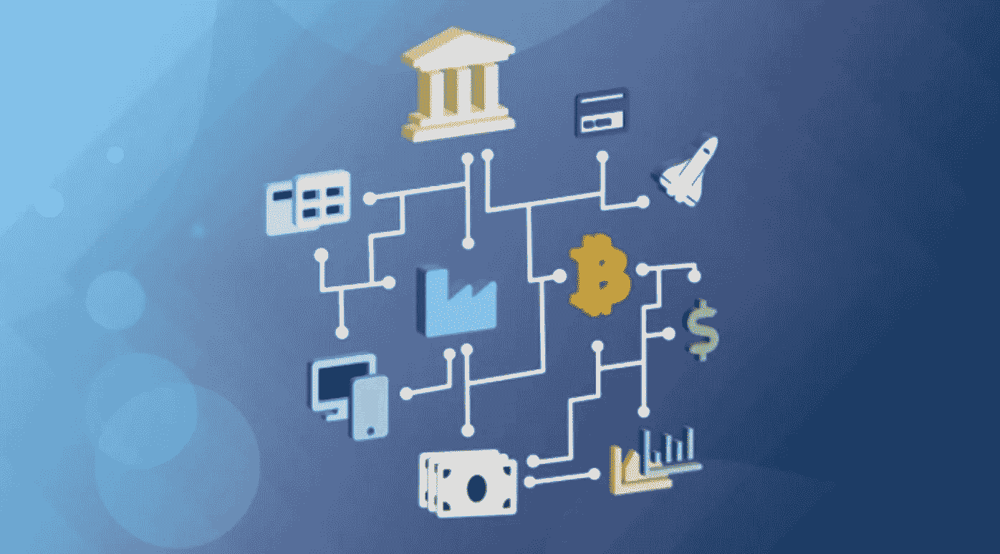
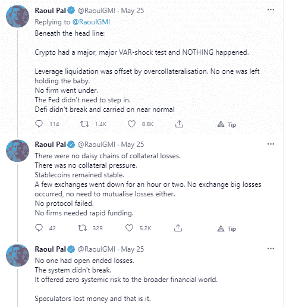

# 是什么推动了高 DeFi 产量，这对 DeFi 的未来意味着什么

> 原文：<https://medium.com/coinmonks/what-drives-high-defi-yields-and-what-this-means-for-the-future-of-defi-ddfa0cde493d?source=collection_archive---------0----------------------->

# 介绍

DeFi 已经成为数字生态系统的支柱之一，并被广泛誉为数字资产领域的关键颠覆者之一。在许多情况下，DeFi 已经成为任何人向非创造者解释加密用例的自动回复。

截至本文撰写之时，DeFi(仅以太坊一项)已锁定约 630 亿美元的总价值(TVL)，从大多数角度来看，这都是相当可观的。在较新的协议上，收益率从 15%一直到 1000%以上，lending DeFi 已经成为自动收益率聚合等几个分支业务的基础。因此，DeFi 成为人们谈论的话题也就不足为奇了。然而，这确实提出了一个问题:是什么推动了对 DeFi 贷款以及更广泛的 DeFi 生态系统的需求？谁以如此高昂的价格获得贷款？

# 贷款 DeFi 如何运作

让我们首先从对借贷协议如何工作的高度理解开始。

*   借款人可以提交加密抵押品，并获得无限期贷款，只要抵押品价值保持在一定范围内
*   鉴于基础抵押品的不稳定性，所有贷款都被超额抵押，以确保贷款安全
*   只要借款人希望收回他们的抵押品，他们就必须连本带利偿还这些贷款
*   贷方可以抵押他们的加密资产来为协议提供流动性，并从中赚取利息
*   利率是根据可用流动性的利用情况和一套预定义的规则自动确定的

# 是什么推动了高收益

DeFi 的平均收益率一直处于历史高位——这最终使得像 Yearn Finance 这样的收益率聚合平台得以生存和发展。这自然意味着利用率一直处于历史高位，这让我们质疑这种需求来自哪里。

根据当前的激励结构，有四个潜在的驱动因素:

1.  真实用例(真实世界贷款)
2.  对治理令牌的需求
3.  协议活动
4.  杠杆交易

## **1/正版用例**

这个用例围绕着那些想要 HODL 他们的密码但仍然需要在现实生活中购买的用户，或者那些目前没有银行账户并被传统金融系统边缘化的用户。当然，有一些用户属于这些类别，他们使用贷款购买家用电器和其他物品。

然而，考虑到高利率和超额抵押要求，我们预计这些用户只占整体借贷需求的一小部分。

## **2/对治理令牌的需求**

一些平台，如复合金融，根据借贷金额，每周向借贷双方分发其本地令牌(本例中为 COMP)。治理令牌需求论点认为，用户可能被激励更多地参与，以便获得对这些令牌的访问。

这不太可能成为贷款需求的重要组成部分，因为高利率和过度抵押会使在公开市场上购买这些本地代币更加经济。

此外，希望利用这一点的人宁愿参与贷款，并在空投之外赚取收益。

## **3/协议活动**

这个论点类似于治理令牌，除了参与是通过回购/分红而不是空投令牌来激励的。同样，这不太可能构成贷款需求的重要部分。

## **4/杠杆交易**

这让我们想到了我们认为最有可能的用例。最有可能接受高利率的群体是那些从贷款中获得的收益比他们支付的利息多得多的人。

这些杠杆交易者利用违约贷款来获利的一种特殊类型的市场无效率被称为期货溢价。它是这样工作的:

*   存在对密码的自然需求，特别是投资者/零售商的长期需求
*   投资一项资产最便宜的方式是购买期货(最低利润)
*   因此，期货价格高于现货价格(被称为期货溢价)
*   鉴于对这些资产的需求，期货溢价非常高
*   这使得套利者可以非常有利可图地利用 DeFi 池以特定的 IRR 借入加密，然后卖空加密期货，从而锁定套利
*   当期货价格收敛于现货价格时，套利者回购期货，并返还他们的密码以实现 USDT 回报

这就是为什么我们总是会在 Aave、Maker、Compound 等平台上看到极高的收益率。在基于清算的崩溃之前。

# 这对 DeFi 的未来意味着什么？

这可能导致的一个关键问题是，如果 DeFi 目前的主要目的是杠杆交易，那么它从长期来看是否是可持续的。当波动性降低时，这个市场将如何发展？

理解导致今天 DeFi 的过度抵押贷款与黄金贷款(仅在印度就有约 550 亿美元的市场)没有太大的不同是很重要的。唯一的区别是抵押资产处于价格发现波动阶段(相对于价格稳定)。这将类似于淘金热时期的黄金贷款，当时价格对需求/供给冲击极其敏感。

我们相信，DeFi 目前还处于不可思议的初期阶段，但已经具备支持即将到来的革命的基础。DeFi 最有希望的是，尽管它目前支持易变的活动，但系统本身是抗脆弱的(Raoul Pal 在这篇推文中捕捉到了这一点)。

DeFi 的当前版本与系统的最终目标相去甚远。然而，基础已经奠定。这就引出了一个问题:那么，DeFi 的未来会是什么样子呢？

我们提出了四个用例，我们认为它们可能是 DeFi 超越其交易杠杆用例之旅的理想后续步骤:

1.  为真实世界购买提供稳定的超额抵押贷款
2.  数字可识别资产的抵押不足贷款
3.  学生/医疗贷款等的区块链原生信用评分。
4.  消费者信用卡

## **1/用于真实世界购买的稳定超额抵押贷款**

随着时间的推移，随着比特币和以太坊等资产真正的价值存储地位和价格波动性变得越来越小，这种用例将自动实现。当这种情况发生时，所有领域的投机水平将稳定下来，与传统股票市场的水平相似。

这将促使当前过度抵押贷款的组合从交易杠杆转变为真正的用例，从而降低整体利率水平。这个市场现在看起来会更像黄金贷款市场，仅在印度，这个市场的规模就高达 550 亿美元。

## **2/数字可识别资产的抵押不足贷款**

随着真实世界的资产，如房屋，通过非金融交易获得区块链本地身份，我们将看到抵押贷款市场在 DeFi 出现。然后，客户将能够使用加密资产或 stablecoins 来抵押他们的部分贷款(类似于当前抵押贷款市场的首付款)，NFT-d 资产将支持其余的贷款。

如今，这个市场中的摩擦非常多，这使得它成为了 DeFi 生态系统的完美用例。

## **3/学生/医疗贷款等区块链原生信用评分。**

最终，我们希望选择加入 KYC 程序，让用户建立和维护链上信用评分。根据他们的信用评分，他们可以降低某些贷款的抵押水平，如医疗保健和学生贷款。

这种数字身份(对于那些选择建立数字身份的人来说)可以用作基础层来建立过多的金融产品，就像传统市场一样。关键的区别将是易用性、速度、对数字资产的接受度和可访问性，以及最重要的信任度

## **4/消费信用卡**

这将是网上和现实世界之间的桥梁。客户将能够进行交易并获得数字资产形式的奖励。这个用例是最深入的，由 Gemini、Nexo Mutual 和比特币基地领导。

# 结论

DeFi 目前处于起步阶段，许多建设工作尚未完成。虽然当今最突出的用例是对其他加密资产的投机性杠杆交易，但我们认为，系统中的抗脆弱性使其成为许多真实世界用例的坚实基础，这些用例可以真正扰乱金融服务行业。

## **也读作**

*   [CoinLoan 点评](/coinmonks/coinloan-review-18128b9badc4)|【Crypto.com】点评 | [火币保证金交易](/coinmonks/huobi-margin-trading-b3b06cdc1519)
*   [顶级付费加密货币和区块链课程](https://blog.coincodecap.com/blockchain-courses) | [币安评论](/coinmonks/binance-review-ee10d3bf3b6e)
*   [在美国如何使用 BitMEX？](https://blog.coincodecap.com/use-bitmex-in-usa) | [BitMEX 回顾](https://blog.coincodecap.com/bitmex-review) | [币安 vs Bittrex](https://blog.coincodecap.com/binance-vs-bittrex)