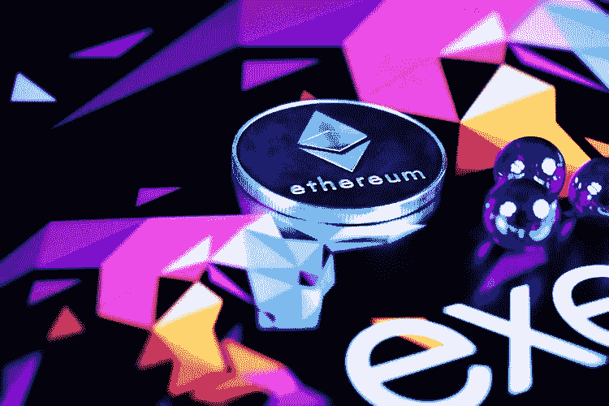

# EIP-1559 对用户、矿工和钱包提供商意味着什么

> 原文：<https://medium.com/coinmonks/what-eip-1559-means-for-users-miners-and-wallet-providers-6c10c507df2d?source=collection_archive---------0----------------------->

USDC 2.0 推出的“无气发送”在以太坊网络上引起了人们对高额燃气费的议论。早些时候，Tether 集成了 Omsisego(一种第 2 层解决方案)来处理以太坊主链中的拥塞，突出了以太坊网络中的拥塞如何成为 DeFi 贸易商关注的原因，使他们争夺解决方案。

以太坊很清楚周围正在发生的事情，正在加班加点带来 EIP(以太坊改进提案)1559，这是区块链以太坊最受期待的升级之一。该提议源于 2018 年 8 月以太坊联合创始人 Vitalik Buterin 撰写的一篇关于以太坊价格拍卖模式的论文。布特林还与以太坊开发者埃里克·康纳、马修·斯利珀、伊恩·诺登和里克·达德利共同撰写了该提案。

## **4 点目标**

EIP-1559 计划完成四个设计目标:

## **算法收费模式**

该提案试图通过用“算法价格发现”取代“价格拍卖”机制来解决天然气费用问题。价格拍卖模式虽然简单易行，但也有其自身的问题。EIP 试图让所有交易尽可能采用相同的燃气费。用户将能够决定是否付费，但他们不能出价。这个系统的支持者认为，费用越低，费用估算就越好。

## **柔性挡块设计**

正如以太坊的创造者所设想的那样，所有的积木都要一样大。然而，对于块空间的需求在每个块形成中是不同的。结果，一些块半满，而在一些块中，事务争夺空间。

所提出的松弛机构允许形成不同尺寸的块，一些较大，另一些较小。目标是提供长期的平均块大小限制，但允许在形成单个块时具有灵活性。

## **永久区块补贴**

当整体补贴结束时，依赖交易费保障安全的第一代区块链可能会面临挑战。EIP-1599 提议将交易费用与网络安全脱钩。交易费将从流通环节中取消，永久性的整体补贴将用于激励矿商。

## **防止经济抽象化**

用户以他们选择的稳定币支付交易费用的能力对本地代币的货币溢价和储备状态造成了不利的情况。EIP-1559 将要求交易中和特定数量的 ETH，使得经济抽象更加困难。

## **EIP-1599 打算如何结束费用困境**

以太坊一直在使用一种简单的拍卖机制来定价费用，这种机制被称为首价拍卖。这要求用户提交他们的报价(天然气价格)，这往往导致向矿工支付过多的费用。

EIP-1599 试图通过结构上的两个基本变化来改变以太坊收费市场:

两个值——一个“长期平均目标”(1000 万天然气)和一个“硬每块上限”(2000 万天然气)——取代了当前的 1000 万天然气限制。

交易需要支付一笔基本费用，这笔费用会被烧掉。该算法逐个区块地调整基本费用，以保持平均区块用气量保持在 1000 万 gwai 左右。

升级将使网络容量增加到 1600 万 gwai。如果网络以超过 50%的容量运行，基本费用将会上升，而如果容量达到<50%, it will go down a bit. However, the increments and decrements are pretty much restricted.

Users won’t need to set up the gas fees manually and the wallets compatible with EIP-1559 will auto-set it even when there is high activity in the network. The wallet will also add a tip for miners as a compensation for their job.

## **弹性块大小上限**

区块链开发者一致认为区块大小需要更大的灵活性。然而，过大的块有其自身的一系列问题:

激励矿工集中

如果验证成本过高，网络将不再不可信

EP-1559 在弹性块大小机制中找到了一种解决方案，这意味着矿工将能够制造更大的块，但只能以可证明的成本。该机制将把协议内燃烧费用视为成本的一部分，但不会增加孤儿率，因为矿商可以通过提高集中化程度来降低孤儿率。

上述两个数值——每区块 1000 万天然气的长期目标和每区块 200 万天然气的新硬性上限——允许矿商在用户需求高的情况下提高区块规模上限。该提议通过引入“烧钱”(一种真正的成本),阻止矿商故意扩大区块。

该算法调整 BASFEE 以达到期望的平均块大小。为了鼓励需求，费用会随着时间的推移而降低。当区块超过限制时，费用会随着时间的推移而增加，从而降低需求。对于每个块，变化的大小在两个方向上都被限制在 12.5%。

## **网络的各种状态**

用户和钱包提供商的用户体验只有在系统处于不同的网络状态时才能确定:

## **无拥堵状态**

当交易的大宗费用低于 20 立方米汽油的最高限额时，用户没有理由增加超过最低限额的小费。在这种情况下，基本费用是包含在块中的唯一因素。任何人谁推出了最低小费的基础费，包括在块。

如果用户可以等待更晚的块以换取更好的成本，他们可能会继续设置他们的费用较低。

## **偶尔拥塞的状态**

当超过 1000 万天然气的区块开始开采时，基本费用开始上升。这种上升趋势将持续下去，直到一个 10 米或以下的区块被开采。如果即将到来的区块是 1000 万，基本费用将稳定下来。然而，如果下一个块低于一千万，它将开始管道。如果区块在一段时间内保持在 1000 万以上，交易成本就会变得相当高，最终会压低需求。

## **扩展拥塞状态**

EIP-1559 提供了更大的块，但只有很短的一段时间。一个 30 分钟的突发需求和基本费用将飙升。只有当 10m 以下的矿块被开采时，它才开始恢复正常。

## **永久轮挡补贴**

以太坊一直遵循反通胀的货币政策，这意味着新铸造的以太坊数量会随着时间的推移而减少。然而，总有一天，硬币的发行量会下降到足够低的水平，人们认为交易费将用来支付安全性。

然而，EIP-1559 与只收费的安全模式不同步，因为交易的主要部分将被烧掉，而不能用作激励。这使得永久的整体补贴成为一个更可靠的安全选择，因为它应该为矿商创造更多的收入来源。

**防止经济抽象化**

由于经济上的抽象，用户可以用开发者创造的任何加密货币支付。另一方面，矿工也可以通过 MEV(矿工可开采价值)获利，通常比交易费多。他们有能力部署像抢跑这样的技术。

EIP-1559 试图解决这个问题。基本费用必须以 ETH 计价，并停止流通。矿商可能包括较低的基本费用交易，但他们将支付其 ETH 计价的大宗补贴的差额。

然而，该协议并没有强制执行小费。这种非 ETH 交易将采用链外路线，但协议设计者决定另寻出路，因为在大多数情况下，tip 不太可能超过最小阈值。

## **反方**

EIP-1559 的诽谤者逮捕矿工操纵基地费。他们辩称，当基本费用为零时，矿商将获得全部投标。只有当争夺地块空间的交易增加了可用供应量时，tip 拍卖才会出现。

批评者预计，矿商将设计出一种策略，将费用保持在接近于零的水平，这样他们就能获得全部基本费用。然而，这种担忧是错误的，因为矿商无法控制需求。

此外，作为一个群体工作的矿工的示范策略可能对单个矿工不那么有效。这就是所谓的集体行动问题。只需一名矿工就能受到激励并打破联盟。

一群矿工垄断采矿的唯一方法是矿工激活的软叉(MASF)。这是一个超过 50%的 hashrate 决定不决定任何大于 10M 天然气的区块的场景。

由于这种攻击媒介不是以太坊特有的，可能出现在任何网络中，因此将其与 EIP-1559 联系起来是不合适的。

## **共同提案**

有些人甚至试图彻底改变算法。

元掩模开发者丹·芬利提出了 EIP-2593，这是一个建议和算法，它根据用户的相对需求，为用户提供费用结构的变化。它通过逐渐增加交易费用，直到矿商将其纳入下一个区块，将交易费用削减到最低可能的阈值。

以太坊开发团队对 ides 和 EIP-2593 印象深刻，或者说它的一些特性，可能会和 EIP-1559 一起投入使用。

为了解决 Besu 的 RLP 编码问题，以太坊开发团队正在考虑的一个解决方案是使用引入类型化事务的 EIP-2718。

## **实施者呼叫**

为了讨论 EIP-1559 提案，已经有三个实施者打来电话，每个都是直播的。这些电话的官方记录在 Github 上。

这些会议的议程如下:

## **第一次通话，2020 年 4 月 30 日**

提供状态更新的实施者

各种与 1559 相关的问题

EIP-2593 综述

## **第二次通话，2020 年 5 月 28 日**

提供状态更新的实施者

消除 EIP 1559 中的块大小和交易大小附加条款

联盟网络影响

1559 vs .自动扶梯费用模型

## **第三次电话，2020 年 6 月 24 日**

提供状态更新的实施者

EIP-1559 &自动扶梯费用组合/拆分

德尔比特对自动扶梯的分析

测试网

测试/分析

形式分析/证明

模拟

EIP-2718:打字交易信封

社区资助

## **第四次呼叫，2020 年 8 月 28 日**

提供一般更新的实施者和研究人员

推广计划的最新情况

新类型的事务信封

额外资源的部署

## **总结**

EIP-1559 是人们最期待的区块链以太坊升级版本之一。正如 Zeeve 建议的那样，升级的设计目标是更好的 UX、松弛机制、更好的安全性和防止经济抽象。算法收费模式将推动 BASEFEE+tip，从而改善 UX，结束收费困境。该提案规定了不同大小的区块形成，重点是长期平均区块大小限制。

EIP-1599 的实施也将导致交易费用从网络安全中分离出来，建立永久的集体补贴来激励验证者。它还将强制要求矿商燃烧特定数量的以太网，以压低流通中的货币，并使以太坊用户更难进行经济抽象。

EIP-1559 的诋毁者有他们自己的论点，但是他们谈论的攻击媒介不是以太坊特有的。

关于 EIP-1599 的执行，到目前为止已经有三个执行者打来电话。

这个提议肯定会让以太坊更受欢迎。

## 另外，阅读

*   最好的[密码交易机器人](/coinmonks/crypto-trading-bot-c2ffce8acb2a)
*   [密码本交易平台](/coinmonks/top-10-crypto-copy-trading-platforms-for-beginners-d0c37c7d698c)
*   最好的[加密税务软件](/coinmonks/best-crypto-tax-tool-for-my-money-72d4b430816b)
*   [最佳加密交易平台](/coinmonks/the-best-crypto-trading-platforms-in-2020-the-definitive-guide-updated-c72f8b874555)
*   最佳[加密贷款平台](/coinmonks/top-5-crypto-lending-platforms-in-2020-that-you-need-to-know-a1b675cec3fa)
*   [最佳区块链分析工具](https://bitquery.io/blog/best-blockchain-analysis-tools-and-software)
*   [加密套利](/coinmonks/crypto-arbitrage-guide-how-to-make-money-as-a-beginner-62bfe5c868f6)指南:新手如何赚钱
*   最佳[加密制图工具](/coinmonks/what-are-the-best-charting-platforms-for-cryptocurrency-trading-85aade584d80)
*   [莱杰 vs 特雷佐](/coinmonks/ledger-vs-trezor-best-hardware-wallet-to-secure-cryptocurrency-22c7a3fd391e)
*   了解比特币最好的[书籍有哪些？](/coinmonks/what-are-the-best-books-to-learn-bitcoin-409aeb9aff4b)
*   [3 商业评论](/coinmonks/3commas-review-an-excellent-crypto-trading-bot-2020-1313a58bec92)
*   [AAX 交易所评论](/coinmonks/aax-exchange-review-2021-67c5ea09330c) |推荐代码、交易费用、利弊
*   [Deribit 审查](/coinmonks/deribit-review-options-fees-apis-and-testnet-2ca16c4bbdb2) |选项、费用、API 和 Testnet
*   [FTX 密码交易所评论](/coinmonks/ftx-crypto-exchange-review-53664ac1198f)
*   [n 零审核](/coinmonks/ngrave-zero-review-c465cf8307fc)
*   [Bybit 交换审查](/coinmonks/bybit-exchange-review-dbd570019b71)
*   [3Commas vs Cryptohopper](/coinmonks/cryptohopper-vs-3commas-vs-shrimpy-a2c16095b8fe)
*   最好的比特币[硬件钱包](/coinmonks/the-best-cryptocurrency-hardware-wallets-of-2020-e28b1c124069?source=friends_link&sk=324dd9ff8556ab578d71e7ad7658ad7c)
*   最佳 [monero 钱包](https://blog.coincodecap.com/best-monero-wallets)
*   [莱杰 nano s vs x](https://blog.coincodecap.com/ledger-nano-s-vs-x)
*   [bits gap vs 3 commas vs quad ency](https://blog.coincodecap.com/bitsgap-3commas-quadency)
*   [莱杰 Nano S vs 特雷佐 one vs 特雷佐 T vs 莱杰 Nano X](https://blog.coincodecap.com/ledger-nano-s-vs-trezor-one-ledger-nano-x-trezor-t)
*   [block fi vs Celsius](/coinmonks/blockfi-vs-celsius-vs-hodlnaut-8a1cc8c26630)vs Hodlnaut
*   [bits gap review](/coinmonks/bitsgap-review-a-crypto-trading-bot-that-makes-easy-money-a5d88a336df2)——一个轻松赚钱的加密交易机器人
*   为专业人士设计的加密交易机器人
*   [PrimeXBT 审查](/coinmonks/primexbt-review-88e0815be858) |杠杆交易、费用和交易
*   [埃利帕尔泰坦评论](/coinmonks/ellipal-titan-review-85e9071dd029)
*   [赛克斯石评论](https://blog.coincodecap.com/secux-stone-hardware-wallet-review)
*   [BlockFi 评论](/coinmonks/blockfi-review-53096053c097) |从您的密码中赚取高达 8.6%的利息