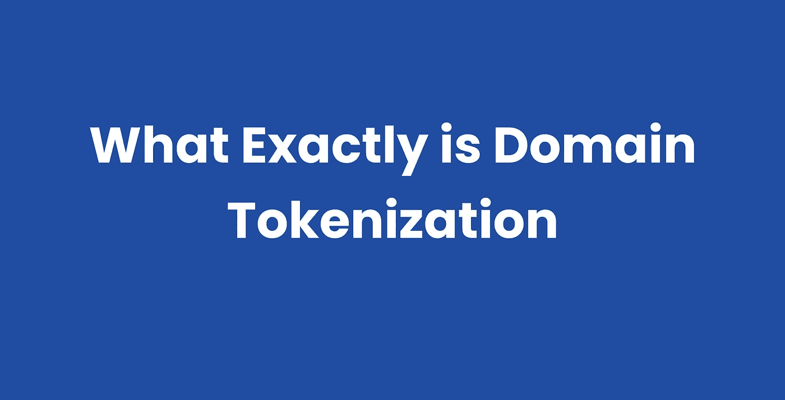

# 到底什么是领域标记化？

> 原文：<https://medium.com/coinmonks/what-exactly-is-domain-tokenization-9521beb56fc5?source=collection_archive---------10----------------------->

令牌化是将物理或非物理资产转换为数字令牌的过程。这就像将资产的所有权转化为代币。这是区块链新的融资方式。

令牌化的应用在参与者之间的支付交易中是显而易见的，因为它还创建了资产的多方所有权。代币还提供了一种转移资产所有权的简单方法。

域名就像一种资产，我可以称之为数字世界中的不动产。就像你拥有作为实物资产的房地产一样，域名也是一种可以被标记化的数字资产。

结合域名作为一种资产和令牌化的定义，我们可以说，域名令牌化是将域名转换为数字令牌的过程，以实现更好的所有权和共享所有权。自 20 世纪 70 年代以来，资产令牌化就被用于将客户信息转换成不敏感的字符串，以保证安全性。

## **为什么需要对资产进行令牌化？**

让我们以房地产为例:你有一套价值 10 万美元的公寓，而你需要 2 万美元。你能利用你现在的公寓得到你需要的钱吗？这就是区块链记号化的用武之地，除了它有助于所有权转换的事实之外，让我们看看记号化在这里是如何工作的。

资产令牌化可以帮助将价值 100，000 美元的公寓转换为 100，000 个令牌，这意味着每个令牌将拥有公寓的 0.001%的份额。如果用户购买了代币，则该用户拥有公寓的 0.001%的份额。另一方面，购买 80，000 个代币使个人有权拥有相关资产的近 80%。

令牌化可以轻松实现更好的流动性、更快的结算和更低的成本。

## **域名标记化**

假设你喜欢宠物，你想创建一个网站，人们可以看到宠物，喜欢他们的照片。你得到域名，比如说 petlovers.com，然后输入一些内容，你的网站就建成了。

如果你将域名令牌化，并向你的宠物爱好者朋友提供部分所有权，会怎么样？

假设你给你的 100 个朋友提供了部分所有权，这意味着你有 100 倍的人有经济动机通过增加内容和推广来促进网站的发展。

因此，当有人来获得域名时，他不会只是从一个人那里获得，而是从每个拥有该域名的人那里获得，收入根据部分所有权进行分配。

这就是域名令牌化，幸运的是，通过令牌化，像域名这样的现有资产可以由多人拥有。

## **如何标记你的域名？**

[Cloudname](http://cloudname.io) 是通过 NFTs(不可替代令牌)交易和令牌化域名的领先平台之一，它运行在以太坊、索拉纳、波尔卡多特和币安的多链上，允许资产在网络之间自由流动和通信。

你可以加入[社区](http://t.me/cloudnameofficial)来获得你的第一枚 CNAME 代币。

> 加入 Coinmonks [电报频道](https://t.me/coincodecap)和 [Youtube 频道](https://www.youtube.com/c/coinmonks/videos)了解加密交易和投资

## 另外，阅读

*   [n ave 零点回顾](/coinmonks/ngrave-zero-review-c465cf8307fc) | [Phemex 回顾](/coinmonks/phemex-review-4cfba0b49e28) | [PrimeXBT 回顾](/coinmonks/primexbt-review-88e0815be858)
*   最佳[区块链分析](https://bitquery.io/blog/best-blockchain-analysis-tools-and-software)工具| [赚比特币](/coinmonks/earn-bitcoin-6e8bd3c592d9)
*   [加密套利](/coinmonks/crypto-arbitrage-guide-how-to-make-money-as-a-beginner-62bfe5c868f6)指南| [如何做空比特币](/coinmonks/how-to-short-bitcoin-568a2d0b4ae5)
*   [德国最佳加密交易所](https://blog.coincodecap.com/crypto-exchanges-in-germany) | [Arbitrum:第二层解决方案](https://blog.coincodecap.com/arbitrum)
*   [币安交易机器人](/coinmonks/binance-trading-bots-d0d57bb62c4c) | [OKEx 审查](/coinmonks/okex-review-6b369304110f) | [阿塔尼审查](https://blog.coincodecap.com/atani-review)
*   [最佳加密交易信号电报](/coinmonks/best-crypto-signals-telegram-5785cdbc4b2b) | [MoonXBT 评论](/coinmonks/moonxbt-review-6e4ab26d037)
*   如何在 Bitbns 上购买柴犬(SHIB)币？ | [买弗洛基](https://blog.coincodecap.com/buy-floki-inu-token)
*   [Godex.io 审核](/coinmonks/godex-io-review-7366086519fb) | [邀请审核](/coinmonks/invity-review-70f3030c0502) | [BitForex 审核](https://blog.coincodecap.com/bitforex-review)
*   [10 本关于加密的最佳书籍](https://blog.coincodecap.com/best-crypto-books) | [英国 5 个最佳加密机器人](https://blog.coincodecap.com/uk-trading-bots)
*   [ko only Review](https://blog.coincodecap.com/koinly-review)|[Binaryx Review](https://blog.coincodecap.com/binaryx-review)|[Hodlnaut vs CakeDefi](https://blog.coincodecap.com/hodlnaut-vs-cakedefi-vs-celsius)