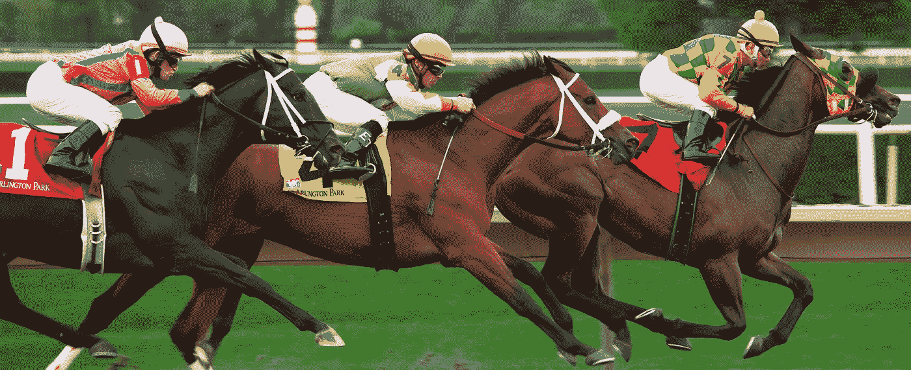

# 什么力量会推动 ADA 的价格？

> 原文：<https://medium.com/coinmonks/what-forces-will-drive-the-price-of-the-ada-b8747b863ed9?source=collection_archive---------4----------------------->

有一种广泛传播的说法是，加密货币之所以有价值，主要是因为数字稀缺。除了稀缺性，技术方面也提供了将加密货币与黄金区分开来的独特特征。什么才是真正更有价值的特性，稀缺性还是技术特性？

# 关于两匹马的故事