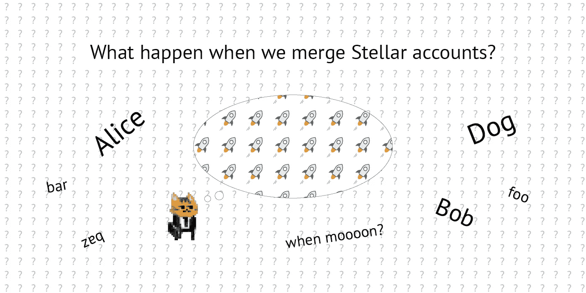
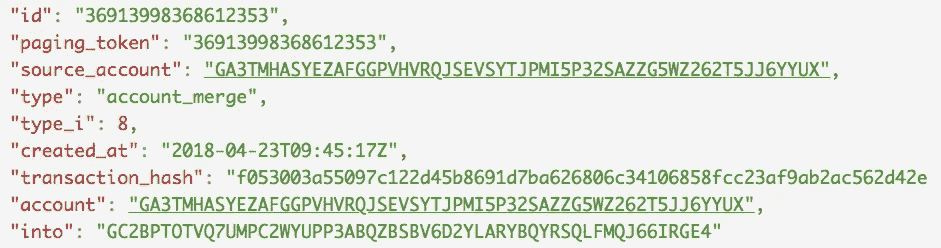

# 🚀当我们合并恒星账户时会发生什么？

> 原文：<https://medium.com/coinmonks/what-happen-when-we-merge-stellar-accounts-857b5923b0ea?source=collection_archive---------4----------------------->

## 爱丽丝的账户消失了还是还在？鲍勃还是鲍勃吗？月亮？



when moon!?

# 问题

1.  我们会丢失被替换的帐户历史记录吗？
2.  我们可以将激活的帐户合并到未激活的帐户吗？
3.  爱丽丝数据合并到鲍勃数据了吗？覆盖 Bob 数据？
4.  我们可以将多重签名帐户与已激活帐户合并吗？怎么会？
5.  我们可以将多签名帐户与多签名帐户合并吗？怎么会？
6.  我们能阻止帐户合并吗？怎么会？
7.  (Form [**reddit**](https://www.reddit.com/r/Stellar/comments/8mfvej/what_happen_when_we_merge_stellar_accounts_katopz/dznhy5f) )如果通过合并去掉发行方，发行的资产会怎么样？

让我们来了解一下！现在去[恒星实验室进行测试网](https://www.stellar.org/laboratory/#account-creator?network=test)和资金账户。

## 创建 Alice 帐户(+10，000XLM)

```
**Public Key** GA3TMHASYEZAFGGPVHVRQJSEVSYTJPMI5P32SAZZG5WZ262T5JJ6YYUX
**Secret Key** SA53NUOKSV3Y247ICLWFZNH3N5JP7JYGLA63UWSDF4XQFY6LQCOSNX6Y
```

## 创建 Bob 帐户(+10，000XLM)

```
**Public Key** GC2BPTOTVQ7UMPC2WYUPP3ABQZBSBV6D2YLARYBQYRSQLFMQJ66IRGE4
**Secret Key** SAQVRSJTSNO4CILPXXVR3KG6YMD5Y56IR3XUM5EH4JQHMMHMB4ANSZXI
```

## 创建卡特彼勒帐户(+10，000XLM)

```
**Public Key** GAGPBFTZFMTG7FWREWH2IDN263GXGILUC4LEFLN3BLLSTUCMWMC6WULU
**Secret Key** SBJNNYJQLTXZFUALBDC5E2QZAPV3JSDCJOIHYXBQXYUP5JDKF6GMTIIS
```

## 问题#1 —我们会丢失被替换的帐户历史记录吗？

让我们通过[用两个操作](https://www.stellar.org/laboratory/#txbuilder?params=eyJhdHRyaWJ1dGVzIjp7InNvdXJjZUFjY291bnQiOiJHQTNUTUhBU1lFWkFGR0dQVkhWUlFKU0VWU1lUSlBNSTVQMzJTQVpaRzVXWjI2MlQ1Sko2WVlVWCIsInNlcXVlbmNlIjoiMzY5MTIyNzYwODY3MTg0NjUiLCJtZW1vVHlwZSI6Ik1FTU9fVEVYVCIsIm1lbW9Db250ZW50IjoiRk9PIn0sIm9wZXJhdGlvbnMiOlt7ImlkIjowLCJhdHRyaWJ1dGVzIjp7ImRlc3RpbmF0aW9uIjoiR0FHUEJGVFpGTVRHN0ZXUkVXSDJJRE4yNjNHWEdJTFVDNExFRkxOM0JMTFNUVUNNV01DNldVTFUiLCJhc3NldCI6eyJ0eXBlIjoibmF0aXZlIiwiY29kZSI6IiIsImlzc3VlciI6IiJ9LCJhbW91bnQiOiIxMDAwIn0sIm5hbWUiOiJwYXltZW50In0seyJpZCI6MTUyNDQ3NTIwNzAyMywibmFtZSI6InBheW1lbnQiLCJhdHRyaWJ1dGVzIjp7ImRlc3RpbmF0aW9uIjoiR0FHUEJGVFpGTVRHN0ZXUkVXSDJJRE4yNjNHWEdJTFVDNExFRkxOM0JMTFNUVUNNV01DNldVTFUiLCJhc3NldCI6eyJ0eXBlIjoibmF0aXZlIiwiY29kZSI6IiIsImlzc3VlciI6IiJ9LCJhbW91bnQiOiIxMDAwIn19XX0%3D&network=test)进行支付来创造一些历史

*   **1000 个 XLM** 从**爱丽丝**到**鲍勃**，以**“FOO”**作为备忘录
*   **1000 只 XLM** 从**爱丽丝**到**猫**，以**【FOO】**作为备忘录


[ref](https://www.stellar.org/laboratory/#explorer?resource=transactions&endpoint=single&values=eyJ0cmFuc2FjdGlvbiI6IjY0ZjFiN2FmMDhkNzQ0OTQ0OWZlNGZjZjNmOTkwYmU5ZTQzMjEzZDhjMDdmNTU2NWM3NzQwNGU2ZTQyYTRkNjkifQ%3D%3D&network=test)

以及[另一笔来自**爱丽丝**对**猫**的付款](https://www.stellar.org/laboratory/#txbuilder?params=eyJhdHRyaWJ1dGVzIjp7InNvdXJjZUFjY291bnQiOiJHQTNUTUhBU1lFWkFGR0dQVkhWUlFKU0VWU1lUSlBNSTVQMzJTQVpaRzVXWjI2MlQ1Sko2WVlVWCIsInNlcXVlbmNlIjoiMzY5MTIyNzYwODY3MTg0NjYiLCJtZW1vVHlwZSI6Ik1FTU9fVEVYVCIsIm1lbW9Db250ZW50IjoiQkFSIn0sIm9wZXJhdGlvbnMiOlt7ImlkIjoxNTI0NDc1MjA3MDIzLCJuYW1lIjoicGF5bWVudCIsImF0dHJpYnV0ZXMiOnsiZGVzdGluYXRpb24iOiJHQUdQQkZUWkZNVEc3RldSRVdIMklETjI2M0dYR0lMVUM0TEVGTE4zQkxMU1RVQ01XTUM2V1VMVSIsImFzc2V0Ijp7InR5cGUiOiJuYXRpdmUiLCJjb2RlIjoiIiwiaXNzdWVyIjoiIn0sImFtb3VudCI6IjUwMCJ9fV19&network=test)

*   **500 XLM** 从**爱丽丝**到**猫**，以**“杠”**作为备忘录


[ref](https://www.stellar.org/laboratory/#explorer?resource=transactions&endpoint=single&values=eyJ0cmFuc2FjdGlvbiI6ImY5OTI3MTAxNGU4MDJlYTcxYzU2OGI1ZTZjNzQwNjhmZmQ0NjY1MjlhYjQyODA0NGVhOTg0OWNmYWUzMGM4NDYifQ%3D%3D&network=test)

然后[合并**爱丽丝**到**鲍勃**](https://www.stellar.org/laboratory/#txbuilder?params=eyJhdHRyaWJ1dGVzIjp7InNvdXJjZUFjY291bnQiOiJHQTNUTUhBU1lFWkFGR0dQVkhWUlFKU0VWU1lUSlBNSTVQMzJTQVpaRzVXWjI2MlQ1Sko2WVlVWCIsInNlcXVlbmNlIjoiMzY5MTIyNzYwODY3MTg0NjciLCJtZW1vVHlwZSI6Ik1FTU9fVEVYVCIsIm1lbW9Db250ZW50IjoiQWxpY2UgaXMgZGVhZCJ9LCJvcGVyYXRpb25zIjpbeyJpZCI6MTUyNDQ3NTIwNzAyMywibmFtZSI6ImFjY291bnRNZXJnZSIsImF0dHJpYnV0ZXMiOnsiZGVzdGluYXRpb24iOiJHQzJCUFRPVFZRN1VNUEMyV1lVUFAzQUJRWkJTQlY2RDJZTEFSWUJRWVJTUUxGTVFKNjZJUkdFNCJ9fV19&network=test)

## 结果([参考](https://www.stellar.org/laboratory/#explorer?resource=transactions&endpoint=single&values=eyJ0cmFuc2FjdGlvbiI6ImYwNTMwMDNhNTUwOTdjMTIyZDQ1Yjg2OTFkN2JhNjI2ODA2YzM0MTA2ODU4ZmNjMjNhZjlhYjJhYzU2MmQ0MmUifQ%3D%3D&network=test)


**Alice** is [dead](https://www.stellar.org/laboratory/#explorer?resource=accounts&endpoint=single&values=eyJhY2NvdW50X2lkIjoiR0EzVE1IQVNZRVpBRkdHUFZIVlJRSlNFVlNZVEpQTUk1UDMyU0FaWkc1V1oyNjJUNUpKNllZVVgifQ%3D%3D&network=test)



**Bob** [kill](https://www.stellar.org/laboratory/#explorer?resource=operations&endpoint=single&values=eyJvcGVyYXRpb24iOiIzNjkxMzk5ODM2ODYxMjM1MyJ9&network=test) **Alice**


**Cat** still [see](https://www.stellar.org/laboratory/#explorer?resource=payments&endpoint=for_account&values=eyJhY2NvdW50X2lkIjoiR0FHUEJGVFpGTVRHN0ZXUkVXSDJJRE4yNjNHWEdJTFVDNExFRkxOM0JMTFNUVUNNV01DNldVTFUifQ%3D%3D&network=test) **Alice** account

## 答案 1

**爱丽丝**账户出现 404，**鲍勃**拿走所有的钱，**猫**还记得**爱丽丝** ID 但是她不见了……可怜的**爱丽丝。**所有与她有关的历史都消失了**(不是真的！见** [**更新自 reddit**](https://www.reddit.com/r/Stellar/comments/8mfvej/what_happen_when_we_merge_stellar_accounts_katopz/dznz4el) **)下面**但是其他账号上的历史仍然保留。

> **更新**:爱丽丝的账户已经消失了 404，但她的历史永远还在，耶！爱丽丝历史就在这里【https://www.stellar.org/laboratory/#explorer? resource = effects&endpoint = for _ account&values = eyjhy 2 nvdw 50 x2 lkijoir 0 ezve 1 qvnzrvpbrkdhufzivljrslnfvlnzvepqtuk 1 udmyu 0 faw KC 1 v1 ynjjunupknllzvvgifq % 3D % 3D&network = test

## 问题#2 —我们可以将激活的帐户合并到未激活的帐户吗？

让我看看…

## 创建狗帐户(0 XLM)

```
**Public Key** GATZLBQUVOIDL24HOHAMTVCNM5YHZJHIWVUNKOWSB2TPSYCH4NFNLTRE
**Secret Key** SAVHUVVZGMXQE4EXLJ7CFENTZMKZNWZV536MRSGQH6UOR4R4S4FYIKH2
```

然后[合并**鲍勃**为**狗**](https://www.stellar.org/laboratory/#txbuilder?params=eyJhdHRyaWJ1dGVzIjp7InNvdXJjZUFjY291bnQiOiJHQzJCUFRPVFZRN1VNUEMyV1lVUFAzQUJRWkJTQlY2RDJZTEFSWUJRWVJTUUxGTVFKNjZJUkdFNCIsInNlcXVlbmNlIjoiMzY5MTI1MTY2MDQ4ODcwNDEifSwib3BlcmF0aW9ucyI6W3siaWQiOjAsImF0dHJpYnV0ZXMiOnsiZGVzdGluYXRpb24iOiJHQVRaTEJRVVZPSURMMjRIT0hBTVRWQ05NNVlIWkpISVdWVU5LT1dTQjJUUFNZQ0g0TkZOTFRSRSJ9LCJuYW1lIjoiYWNjb3VudE1lcmdlIn1dfQ%3D%3D&network=test)


[ref](https://www.stellar.org/laboratory/#explorer?resource=transactions&endpoint=create&values=eyJ0eCI6IkFBQUFBTFFYemRPc1AwWThXcllvOSt3QmhrTWcxOFBXRmdqZ01NUmxCWldRVDd5SUFBQUFaQUNESTcwQUFBQUJBQUFBQUFBQUFBQUFBQUFCQUFBQUFBQUFBQWdBQUFBQUo1V0dGS3VRTmV1SGNjREoxRTFuY0h5azZMVm8xVHJTRHFiNVlFZmpTdFVBQUFBQUFBQUFBWkJQdklnQUFBQkExZTV0anNuZUY2YlVZVWw4bHExdmYwNXZlNEd1SmgwM1ZmRDl0U0hvd3YrNWEvNVpaa3F4SW45S3RPaGYvOHgrcGVibUI0SmUyaktKL2M3NnVEa0NCdz09In0%3D&network=test)

## 答案 2

**鲍勃**拒绝与空**狗**合并并返回 **op_no_account** ，明智的选择**鲍勃**！

## 问题# 3—Alice 数据合并到 Bob 数据了吗？覆盖 Bob 数据？

这是爱丽丝

```
**Public Key** GARQGJEDJGMRYNVZGBF7PON4HNCGGYR23NMPUXBXXX3AX2CIZ5Z2MRSM
**Secret Key** SCJZUWZL42UXT34JCHXWF7CE5NKD7TYSPKKQHANYWCEPJZZJVYZECATE
```

用她的数据


Appear as **“YmFy”** which mean **“bar”** in base64

还有**鲍勃**

```
**Public Key** GAHQG767G5WR66W7W2WZ7ZR6DDDJXWUOY3SHIJT3OWPGQF5EMK7MQ6W4
**Secret Key** SD7OWHLU5GD4J4WLUOLK22TOYA3C3BBQ3LTHAINDOHI5NHYPRA25V2E2
```

用他的数据


baz

然后将**爱丽丝**合并到**鲍勃**


[Aww](https://www.stellar.org/laboratory/#explorer?resource=transactions&endpoint=create&values=eyJ0eCI6IkFBQUFBQ01ESklOSm1SdzJ1VEJMOTdtOE8wUmpZanJiV1BwY043MzJDK2hJejNPbUFBQUFaQUNMNXhBQUFBQUNBQUFBQUFBQUFBQUFBQUFCQUFBQUFBQUFBQWdBQUFBQUR3Ti8zemR0SDNyZnRxMmY1ajRZeHB2YWpzYmtkQ1o3ZFo1b0Y2Uml2c2dBQUFBQUFBQUFBVWpQYzZZQUFBQkFlS01LRW1TdU0rN1lHL2hSRUJqT044VUczalcveld4U0QvS04wREZsMHhKYXpySDk1dHJoUm9KVTNnWjhNcFp2a3hDZ2c1OW4yeElSOE94ckJWVHhEZz09In0%3D&network=test)

## 答案 3

**Bob** 拒绝合并并返回 **op_has_sub_entries** ，我们需要先清理 **Alice** 子条目(信用额度、报价、数据)！


[“subentry_count”: 1](https://www.stellar.org/laboratory/#explorer?resource=accounts&endpoint=single&values=eyJhY2NvdW50X2lkIjoiR0FSUUdKRURKR01SWU5WWkdCRjdQT040SE5DR0dZUjIzTk1QVVhCWFhYM0FYMkNJWjVaMk1SU00ifQ%3D%3D&network=test)

# 待办事项

对于第 4、5、6、7 题，你需要自己解决，或者在下面留言，让我来揭晓答案🚀，所有捐赠都属于我的猫食！🐈

```
GDI6FBVJSHMF5PF6C7DDM57NAGYTYWMQQW2A6BVA6DTS2ZL7ZDRZBI2S
```