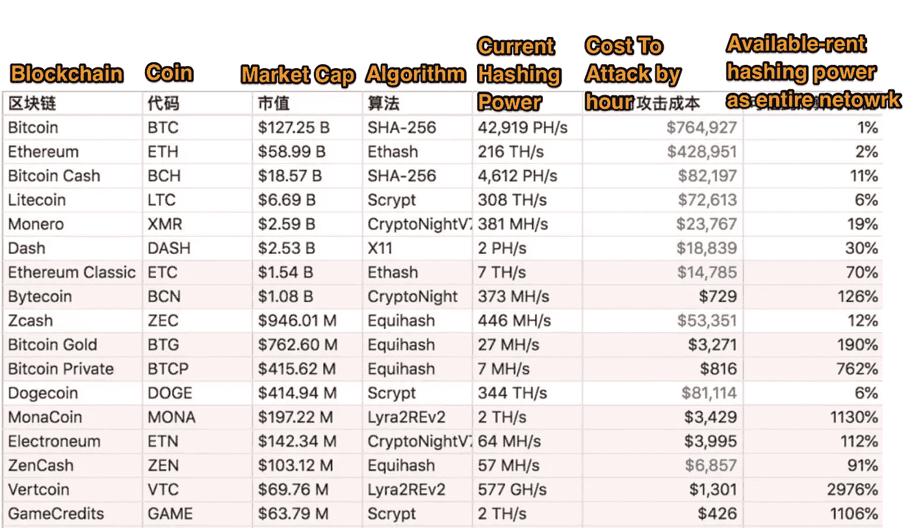

# 当你在引擎盖下发送 1 个比特币会发生什么？程序员解释

> 原文：<https://medium.com/coinmonks/what-happen-when-you-send-1-bitcoin-under-the-hood-programmer-explain-35fe4fc487ce?source=collection_archive---------2----------------------->

如果你使用区块链技术，让我们深入了解引擎盖下发生的事情，以及当你进行交易时潜在的安全问题！

> 你想过送比特币和送美元的区别吗？

Sending 1 Bitcoin

> R **在你按下〖发送〗按钮之后**

你的`**signed transactions**`会被放在一个叫做【Mempool】的盒子里，等待被**的比特币矿工**取走。
仅供参考，所有已签名的交易将一起放入“内存池”中。

**「**[**Bitcoin Mempool**](https://blockchain.info/charts/mempool-size)**」**

矿工将填满**固定大小的篮子**交易。
仅供参考，**固定大小篮子**的原因是因为比特币块有`**1M**` 的限制。

您可能想知道如果「Mempool」中有太多的事务，miner 会如何选择，它会从所有事务中挑选出费用**较高的事务，并填满**固定大小的篮子**。**

Miner will filled up the basket with transactions appends higher fee

一旦矿工填满了**固定大小的篮子**，就该开始「解决数学问题」了。

为什么「解决数学问题」你可能会想？
**简答:**有了这个，就可以**保护**分布式**数据库。
**技术回答:** [**看 Youtube 视频**](https://www.youtube.com/watch?v=_160oMzblY8&t=225s)**

**Solving Math Problem**

一旦矿工解决了「数学问题」，一个新的「区块」就会产生。

**B**`**lock is appended in a blockchain**`

> **待转**

我会贴出区块链系统的「缺陷」。

破绽 1 解释—[双花](/cobinhood/double-spend-blockchain-security-programmer-explain-db6ed2fe026e)
破绽 2 解释—【51%攻击】
…

攻击区块链基地网络的「成本」与「可能性」概要。此快照拍摄于 2018 年 6 月 7 日 00:00(UTC+0)

Column with 「red」means it is currently possible to be attacked

> 有用的链接

**关于我**
我是一名全栈 javascript 开发人员，也是新区块链项目的贡献者之一。

**在 NEO 之上用 Javascript 构建去中心化应用？** [尼奥·区块链，编程教程，Javascript](https://medium.com/blockchain-under-the-hood)

如果你认为自己是个人才？
[科班出身](https://cobinhood.com/careers)