# $CRV 怎么了？

> 原文：<https://medium.com/coinmonks/what-happened-with-crv-7ccf9c7df131?source=collection_archive---------1----------------------->


## 哎呀——我的汽油用完了！

这一定是 Crypto 和 DeFi 最近最重要的一周。在$YAM 出生后的第二天，$CRV 由一名“社区成员”生下。

我使用了各种工具来理解发生了什么，我邀请你跟随。

这是事件的大概情况。

1.  Chad [将 20 Eth 放入](https://etherscan.io/address/0xc4ad0ef33a0a4dda3461c479ccb6c36d1e4b7be4?fromaddress=0x6871EaCd33fbcfE585009Ab64F0795d7152dc5a0)“deploy from”地址
2.  乍得创造了 CRV 令牌合同和刀
3.  他的汽油用完了，需要再加一些
4.  该合同创建了 13 亿个令牌，并向所有令牌发送了最初的 8 个地址
5.  一定数量的个人开始接受他们的收益，并且几乎立即将它们转换成 ETH
6.  查德在推特上宣布了他的所作所为
7.  曲线金融“勉强”接受发生的事情，并使$CRV 官方

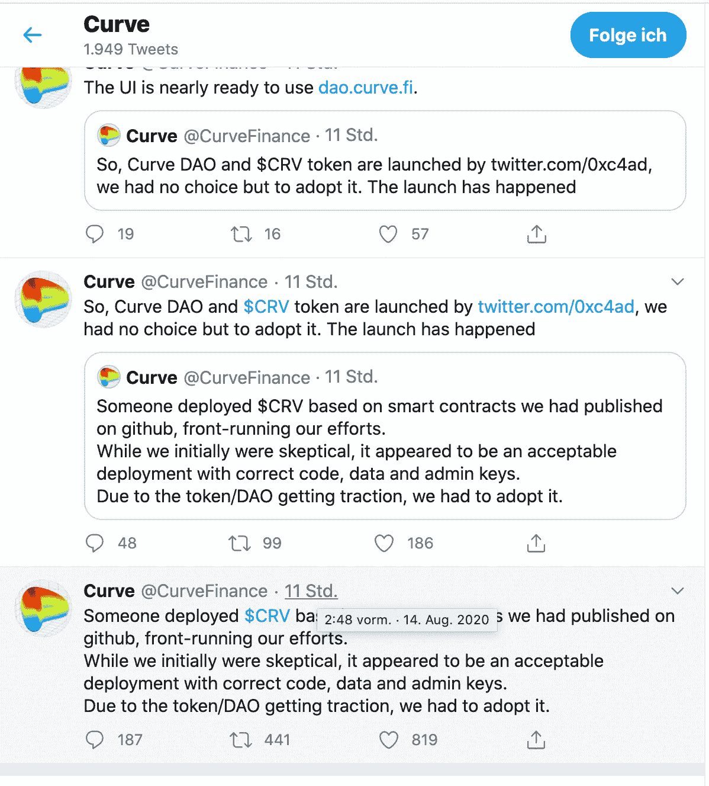

几个交易所，在几分钟之内，彼此开始交易美元 CRV 或宣布，至少。

(2020–08–14 3:07:00–5:27:00):

> @okex:新上市:
> @OKEx
> 将在一小时后(04:00 UTC)上市
> @CurveFinance
> $CRV。#CRV 存款现已开放。很高兴成为第一个列出#DeFi 项目的主要交易所！
> 上市详情:[https://bit.ly/30ZoDDX](https://bit.ly/30ZoDDX)
> 
> 了解更多关于$CRV:[https://bit.ly/3iDA2iv@HuobiGlobal:](https://bit.ly/3iDA2iv@HuobiGlobal:)
> #火币推出$ CRV！
> 存款现已开通！
> 当存款满足市场需求时，即可进行交易。
> 加入霍比，交易$CRV
> 
> @BinanceResearch
> 新#币安房源:
> @CurveFinance $CRV。
> #Curve 是以太坊上的交易所流动性池，专为高效稳定的币交易而设计。
> 阅读#CRV 研究简介

让我们收集一些事实和证据，看看我们是否能弄清楚发生了什么。

# 创世纪

在创世纪之前，查德需要天然气。所以他在 2020-08-12 20:07:48 放了大约 [20 ETH。](https://etherscan.io/address/0xc4ad0ef33a0a4dda3461c479ccb6c36d1e4b7be4?fromaddress=0x6871EaCd33fbcfE585009Ab64F0795d7152dc5a0)

创世纪时刻是 2020 年 8 月 12 日 2 2 时 17 分 28 秒。有了这个气体量，代币本身就产生了。但是没有足够的汽油继续。于是他在 2020-08-13 12:29:27 加了更多的气。

[https://ethers can . io/address/0x C4 ad 0 ef 33 a 0 a4 DD 3461 c 479 CCB 6 c 36d 1 e 4 b 7 be 4 # token txns](https://etherscan.io/address/0xc4ad0ef33a0a4dda3461c479ccb6c36d1e4b7be4#tokentxns)

在 2020 年 8 月 13 日 12:52:02 和 15:55:42 之间，13 亿个代币被分配给 8 个合约。我们来看看这 8 个账户的一些汇总数据。我已经下载了从
t1 = 2020–08–12 22:17:28 到 T2 = 2020–08–14 02:17:56，
之间的所有 CRV 交易，并查看了汇总统计数据来探究这些数据。第一个日期时间来自上面，第二个更随意一些:etherscan 让我下载第一批 5000 笔交易，第二个日期时间在公告之后，所以我相信数据涵盖了最有趣的时期，即$CRV 存在的最初几个小时。

# 初次分配

[https://ethers can . io/address/0xd 533 a 949740 bb 3306d 119 cc 777 fa 900 ba 034 CD 52 #代码](https://etherscan.io/address/0xd533a949740bb3306d119cc777fa900ba034cd52#code)

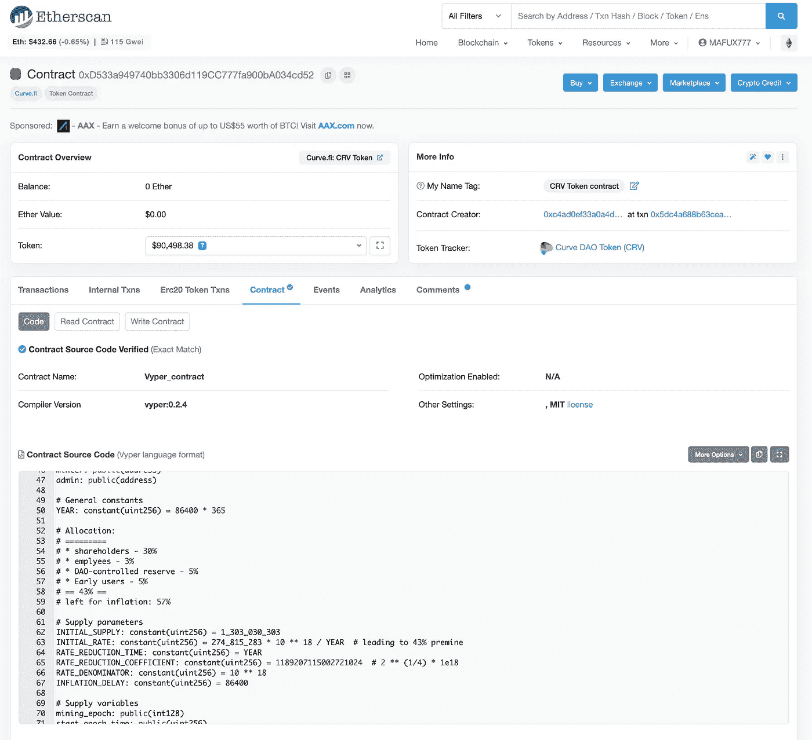

这 8 个合同可以与源代码和[文档](https://guides.curve.fi/crv-launches-curve-dao-and-crv/)中提到的类别相匹配:

1.  股东:30%
2.  雇员:3%
3.  道控制的储备:5%
4.  早期用户:5%
5.  考虑到通货膨胀:57%(即我们开始时只有 43%)

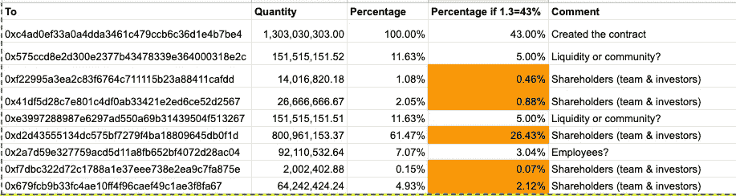

Orange highlights: make up the 30% shareholders

# 凌晨交易(t1-T2)

我们在此考虑以下几类事件:

1.  收益农业，即将新 CRV 分配给曲线金融平台的用户。这些可能大多是小数目，除非这个人是一条鲸鱼(大量持有)，或者受益于奖励在少数早期农民之间分配的事实
2.  将 CRV 从一个账户转移到另一个账户，可能是为了掩盖资金流动
3.  将 CRV 兑换成乙醚或其他货币。这里的问题是:是谁在供应 ETH 和购买 CRV，尤其是在早期？

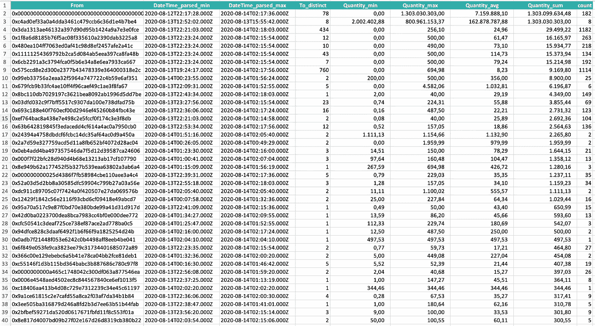

Figure 1 “From”

上面的数据显示了排名靠前的 CRV 交易，按“发件人”地址分组，具有聚合数据，并按“数量总和”降序排序。

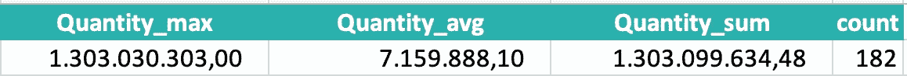

在第 1 行中，我们可以看到主合同地址有 182 笔交易，其中一笔我们已经知道(genesis ),另外 181 笔交易代表奖励支出，总计 69，631 CRV。我们可以估计这大约值 70 万美元。这似乎是内部人员或内部人员团队能够逃脱惩罚的上限。

图 1 中的下一行我们也已经讨论过了，这是将初始令牌发送给 8 个“归属”合约。

然后，数据中有一个有趣的模式，告诉我们最有趣的地址是这里橙色的地址。

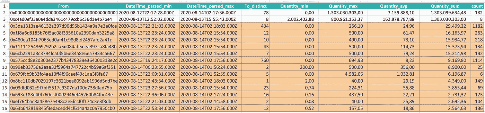

Figure 2 “From” (selection)

他们几乎都有很高的交易数(最后一栏)，远远高于排行榜上的其他人。

如果我们现在再次按时间排序(min=earliest)，我们会看到四个非常相似的行。

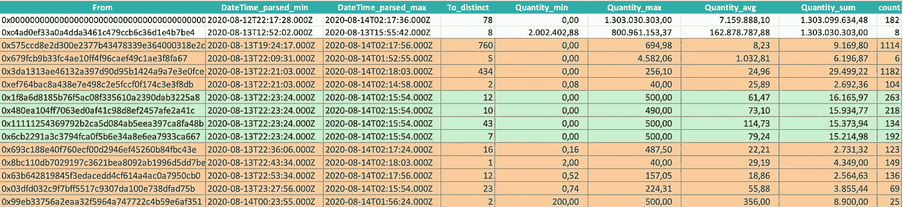

这四个地址似乎是在创世纪 24 小时后，查德的推文之后触发的。最大数量有奇怪的整数。总量也非常相似。他们似乎还利用了开源 DeFi 应用程序 [OneSplit](https://github.com/CryptoManiacsZone/1inchProtocol) 来寻找正确的索引组合，以编程方式交换令牌。

第一个[和第二个](https://etherscan.io/address/0x1f8a6d8185b76f5ac08f335610a2390dab3225a8)是由 OneSplit 创建的。第三个是[1 英寸。交换](https://etherscan.io/address/0x11111254369792b2ca5d084ab5eea397ca8fa48b)。第四个也是 [OneSplit](http://OneSplitWrap) 。我怀疑这些都是同一个人吸走资金的工具。

我们过会儿应该回到这些。最好能看看资金是否在循环流动，也就是以抬高价格为目的的自我交易。为此，像 [breadcrumbs.app](https://www.breadcrumbs.app/report.aspx?address=0x6871EaCd33fbcfE585009Ab64F0795d7152dc5a0&currency=1&childrenleftmax=10&childrenrightmax=10) 这样的图表分析会很有用。

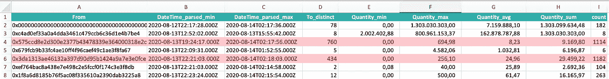

中的第 4 行和第 6 行似乎是奖励支出，因为它们涉及大量地址(与不同)和大量交易(计数)。

的确，[0x 575 ccd8e 2d 300 e 2377 b 43478339 e 364000318 e2c](https://etherscan.io/address/0x575ccd8e2d300e2377b43478339e364000318e2c)是 8 个合约之一，初始预算 1.51 亿令牌。

不过另外一个[0x3da 1313 AE 46132 a 397d 90d 95 b 1424 a 9 a 7 e 3 e 0 FCE](https://etherscan.io/address/0x3da1313ae46132a397d90d95b1424a9a7e3e0fce)是 Uniswap。为什么会有这么多交易？也许这代表了人们在公告后交易 CRV。

另一个出现在图 2 中的[用户是一个优秀的高产农民。他有 25 种不同的代币，现在还在叫唤。](https://etherscan.io/address/0x99eb33756a2eaa32f5964a747722c4b59e6af351#tokentxns)

# 乍得的推特

在他发布推文之前，2020-08-13 18:25，没有任何交易。这似乎表明，他要么想要公平，要么需要其他人与他合作。

# 价格行为

2020 年 8 月 17 日，[币安](https://info.binance.com/en/all)仍未将 CRV 上市。(更新:2020–08–18:就是现在。)

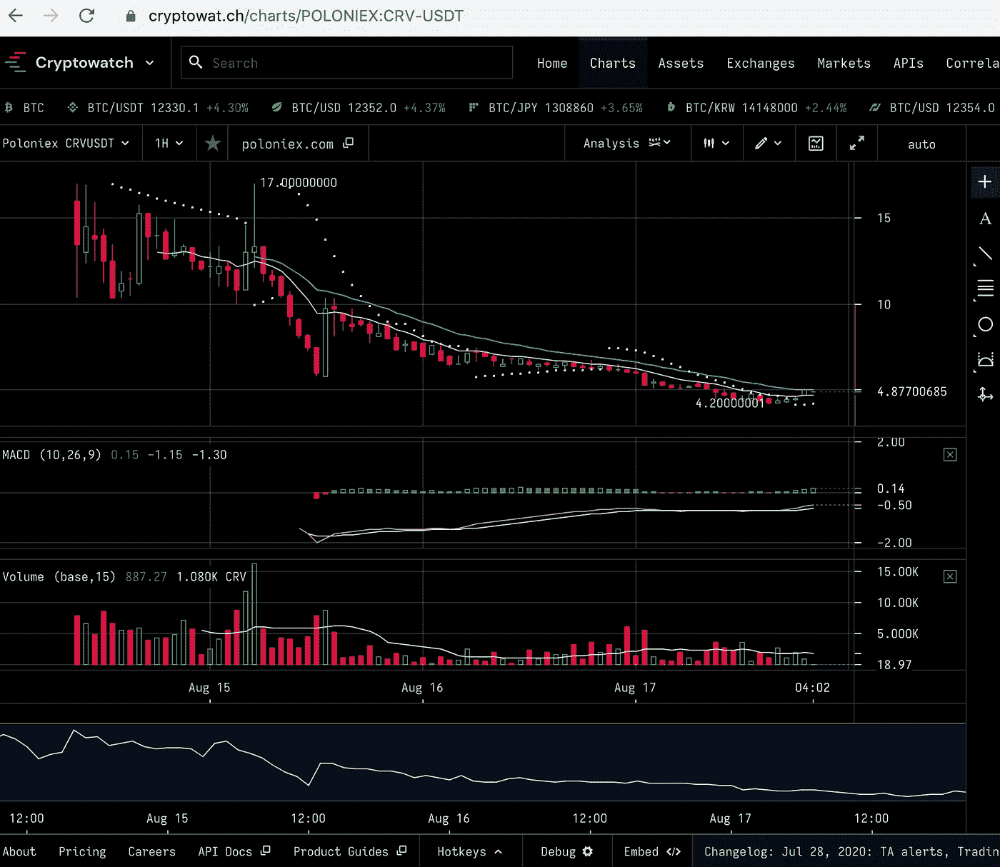

在交易所上市的最初几个小时，波洛涅克斯交易所的 CRV 股票价格大幅波动。我们没有关键的前 24 小时的价格数据，这可以通过查看与 Eth 的掉期交易来获得，或许可以从 etherscan 获得。我很乐意在这方面与密码分析师社区的成员合作。

# 乍得的概况

如果你想知道查德是一个什么样的有钱人，看看他的钱包，例如:

 [## 加密货币跟踪器

### 跟踪您的加密货币并分析您的持有量

地狱犬](https://cerberus.saren.io/) 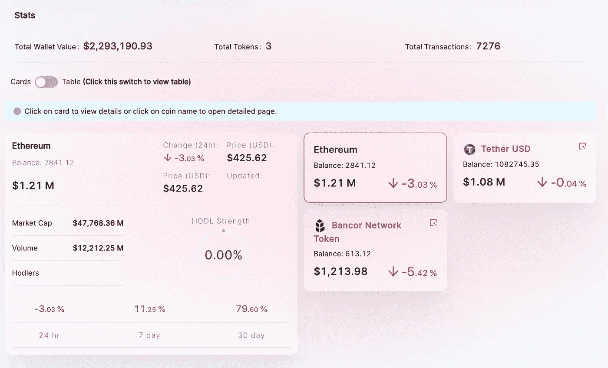

[Nansen](https://nansen.ai/) 的高级钱包探险家展示了他的活动:

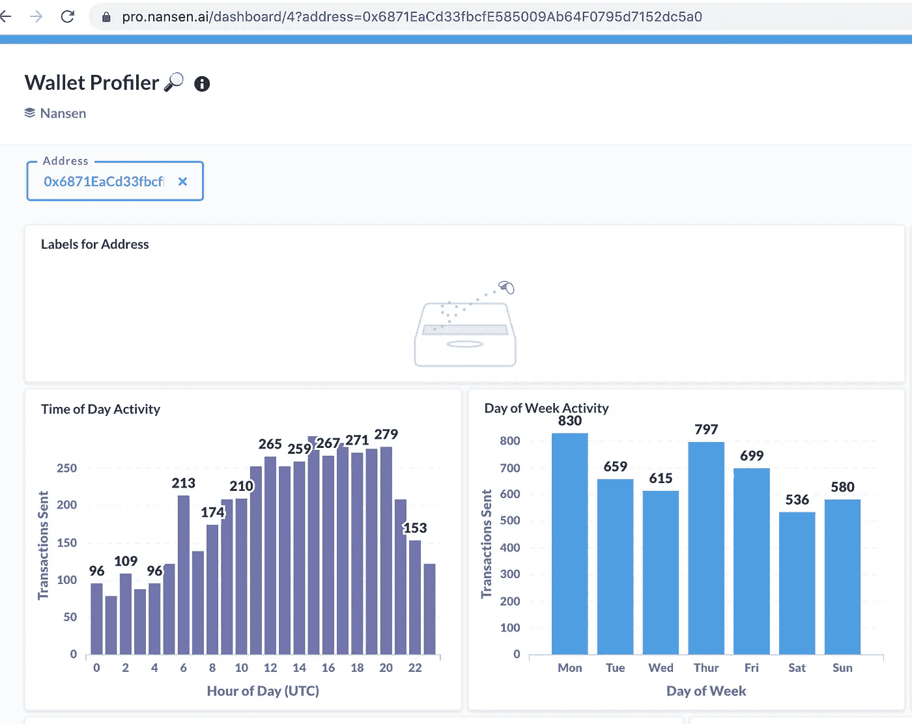

Source: nansen.ai (7-day-trial account)

从这里，我们看到他在一天的所有时间都在积极交易，这表明他在使用交易机器人，或者有一个团队。根据世界协调时早上 6 点(欧洲中部时间早上 8 点)开始的峰值，我猜他在欧洲。

使用上面提到的[面包屑应用](https://www.breadcrumbs.app/report.aspx?address=0x6871EaCd33fbcfE585009Ab64F0795d7152dc5a0&currency=1&childrenleftmax=10&childrenrightmax=10#)，我们可以看到他获得老菲亚特的首选方式是币安。

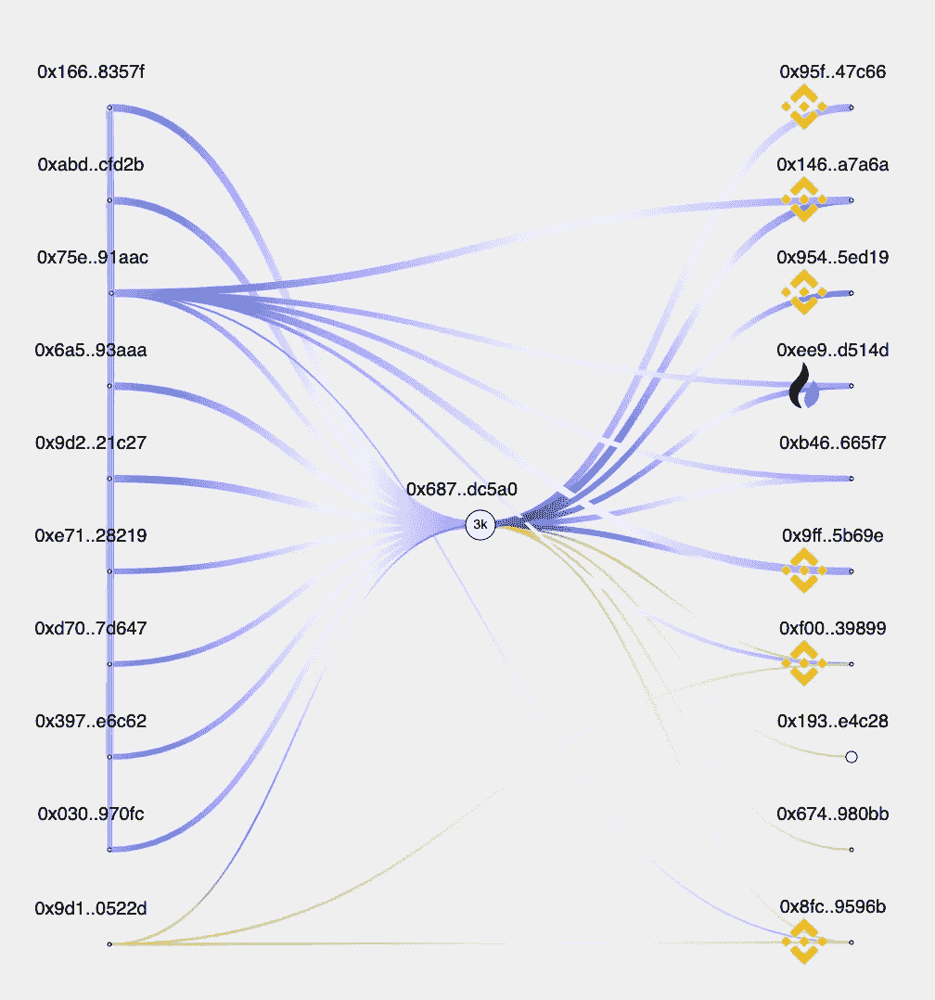

# 后续步骤

这篇文章是我在空闲时间一天工作的结果，还没有定论。我很想和读者们一起集思广益，看看我们是否能解开更多关于 CRV 发射的前 36 个小时到底发生了什么的秘密。

# 更新时间 2020 年 8 月 24 日

如果您想在聚合级别上进行自己的分析，可以使用下面的查询作为起点。

```
-- CRV is 0xD533a949740bb3306d119CC777fa900bA034cd52
WITH crv as(
  SELECT address,
        "timestamp",
        args->0->>'hex' as "from",
        args->1->>'hex' as "to",
        (args->2->'num')::numeric /1e18 AS "num_value",
        "event" as event,
        transaction_hash as hash
  FROM event
  WHERE address = '0xD533a949740bb3306d119CC777fa900bA034cd52'
  and "event" != 'Approval'
  and block_number>10636346 and block_number<=10655284 -- time of the official announcement
)-- find top addresses for events since roughly 2020-08-13 12:00 (block number filter)
select
 "from",
 count(distinct "to") as distinct_to,
 min("timestamp") as min_timestamp,
 max("timestamp") as max_timestamp,
 min(num_value)::NUMERIC(18, 2) as value_min,
 max(num_value)::NUMERIC(18, 2) as value_max,
 avg(num_value)::NUMERIC(18, 2) as value_avg,
 sum(num_value)::NUMERIC(18, 2) as value_sum,
 count(*) as count
from crv
group by 1
order by 8 desc
```

这个查询的数据可以通过一个免费的测试账户[这里](https://www.anyblockanalytics.com/)获得。

## 另外，阅读

*   最好的[密码交易机器人](/coinmonks/crypto-trading-bot-c2ffce8acb2a)
*   [加密复制交易平台](/coinmonks/top-10-crypto-copy-trading-platforms-for-beginners-d0c37c7d698c)
*   最好的[加密税务软件](/coinmonks/best-crypto-tax-tool-for-my-money-72d4b430816b)
*   [最佳加密交易平台](/coinmonks/the-best-crypto-trading-platforms-in-2020-the-definitive-guide-updated-c72f8b874555)
*   最佳[加密贷款平台](/coinmonks/top-5-crypto-lending-platforms-in-2020-that-you-need-to-know-a1b675cec3fa)
*   [最佳区块链分析工具](https://bitquery.io/blog/best-blockchain-analysis-tools-and-software)
*   [加密套利](/coinmonks/crypto-arbitrage-guide-how-to-make-money-as-a-beginner-62bfe5c868f6)指南:新手如何赚钱
*   最佳加密制图工具
*   [莱杰 vs 特雷佐](/coinmonks/ledger-vs-trezor-best-hardware-wallet-to-secure-cryptocurrency-22c7a3fd391e)
*   了解比特币的[最佳书籍有哪些？](/coinmonks/what-are-the-best-books-to-learn-bitcoin-409aeb9aff4b)
*   [3 商业评论](/coinmonks/3commas-review-an-excellent-crypto-trading-bot-2020-1313a58bec92)
*   [AAX 交易所审核](/coinmonks/aax-exchange-review-2021-67c5ea09330c) |推荐代码、交易费用、利弊
*   [Deribit 审查](/coinmonks/deribit-review-options-fees-apis-and-testnet-2ca16c4bbdb2) |选项、费用、API 和 Testnet
*   [FTX 密码交易所评论](/coinmonks/ftx-crypto-exchange-review-53664ac1198f)
*   [n 零审核](/coinmonks/ngrave-zero-review-c465cf8307fc)
*   [Bybit 交换审查](/coinmonks/bybit-exchange-review-dbd570019b71)
*   [3Commas vs Cryptohopper](/coinmonks/cryptohopper-vs-3commas-vs-shrimpy-a2c16095b8fe)
*   最好的比特币[硬件钱包](/coinmonks/the-best-cryptocurrency-hardware-wallets-of-2020-e28b1c124069?source=friends_link&sk=324dd9ff8556ab578d71e7ad7658ad7c)
*   最佳 [monero 钱包](https://blog.coincodecap.com/best-monero-wallets)
*   [莱杰纳米 s vs x](https://blog.coincodecap.com/ledger-nano-s-vs-x)
*   [bits gap vs 3 commas vs quad ency](https://blog.coincodecap.com/bitsgap-3commas-quadency)
*   [莱杰纳米 S vs 特雷佐 one vs 特雷佐 T vs 莱杰纳米 X](https://blog.coincodecap.com/ledger-nano-s-vs-trezor-one-ledger-nano-x-trezor-t)
*   [block fi vs Celsius](/coinmonks/blockfi-vs-celsius-vs-hodlnaut-8a1cc8c26630)vs Hodlnaut
*   Bitsgap 评论——一个轻松赚钱的加密交易机器人
*   为专业人士设计的加密交易机器人
*   [PrimeXBT 审查](/coinmonks/primexbt-review-88e0815be858) |杠杆交易、费用和交易
*   [埃利帕尔泰坦评论](/coinmonks/ellipal-titan-review-85e9071dd029)
*   [赛克斯·斯通评论](https://blog.coincodecap.com/secux-stone-hardware-wallet-review)
*   [BlockFi 审查](/coinmonks/blockfi-review-53096053c097) |赚取高达 8.6%的加密利息