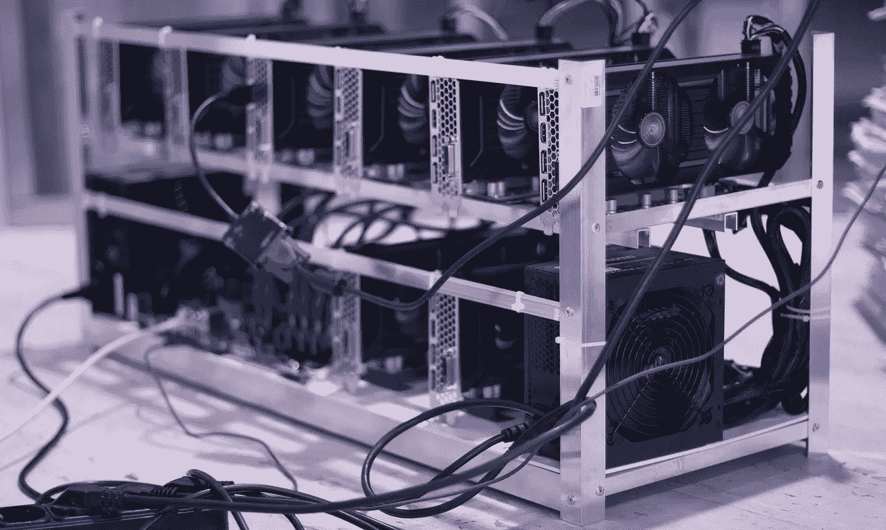

# 以太坊验证机的验证硬件是什么？

> 原文：<https://medium.com/coinmonks/what-hardware-for-an-ethereum-2-0-validator-e8f5f89de43e?source=collection_archive---------0----------------------->

Image by [Лечение Наркомании](https://pixabay.com/users/rebcenter-moscow-6351207/?utm_source=link-attribution&amp;utm_medium=referral&amp;utm_campaign=image&amp;utm_content=2852024) from [Pixabay](https://pixabay.com/?utm_source=link-attribution&amp;utm_medium=referral&amp;utm_campaign=image&amp;utm_content=2852024)

就这样，合并迟早会发生。你已经收集了 32 个珍贵的以太，你只是在等待一件事，能够把它们作为赌注，并成为以太坊的验证者！但是现在，一个问题出现了:我需要什么样的硬件？更好奇的人已经开始研究正在开发中的客户的安装过程的可用文档，如 Prysm、Lighthouse 或库特。但是关于获得的硬件，信息是有限的！因此，我通过在网上、各种各样的讨论和做测试来探索这个问题。这是我们可以利用的不同可能性的概述。

# 选择标准是什么？

不幸的是，目前规范只是部分定义。开发中的客户端仅集成信标链和合并规范。因此，一旦完整的路线图出台，进行的第一批测试并不一定代表该协议的长期前景。

同时，Prysmatic Labs 在其客户 Prysm 的[文档中公布了以下技术规范:](https://docs.prylabs.network/docs/install/install-with-script/)

> 最低规格
> 
> 操作系统:64 位 Linux、Mac OS X 10.14+、Windows 64 位
> 处理器:英特尔酷睿 i5–760 或 AMD FX-8100 或更好
> 内存:4GB RAM
> 存储:20GB 可用空间 SSD
> 
> 推荐规格
> 
> 处理器:英特尔酷睿 i7–4770 或 AMD FX-8310 或更高性能
> 内存:8GB RAM
> 存储:100GB 可用空间固态硬盘

因此，典型的计算机将能够运行信标链以及一个或几个验证器。然而，这个选择不一定是最明智的。

一台基本的计算机远不节能。当你一周只运行几个小时的时候，它的消耗是合理的。但是如果你不得不让它 24/7 运行，这就成问题了，因为过度的电力消耗会降低你的投资回报(并伤害地球🌏🔥😢).如果我们以一个传统的 500W pc 电源和 0.23€每千瓦时的价格(是的，这是目前欧洲的平均价格)为例，这相当于每年 1000€的电力！因此，有必要找到一种使用更少能量的替代物。

此外，有一个稳定的机器(不太可能崩溃)以避免被 stake 算法的证明所惩罚是必不可少的。这要经历两件事:

*   拥有一台专用机器，专门用于运行验证程序。运行其他进程可能会导致冲突，并剥夺我们的以太坊共识和执行客户端的机器资源。这些崩溃也会影响到我们的客户。
*   用 Linux，因为它极其稳定，不需要经常重启。此外，它轻便、安全。这也强调了拥有专用机器的必要性，因为很少有人愿意将 Windows 或 MacOS 留在自己的个人机器上，转而使用这种可怕的机器🙂

一旦想到这一点，就会出现两种选择:拥有自己的硬件或使用 VPS。

# 自托管与使用 VPS

基于上面提到的限制，我们有两个选择:买一台电脑并把它插在家里，或者通过所谓的 VPS(虚拟专用服务器)从主机上租一台电脑。每种解决方案都有其优点和缺点。

## 拥有自己的硬件

第一个解决方案，购买针对我们的需求优化的设备，并在家中运行。

好处:

*   成本优化通过自己处理每一件事，你避免了花钱请人做这件事。
*   转售设备的可能性
    如果您想升级设备或停止验证活动，您可以通过转售购买的设备收回部分投资。
*   最优参与去中心化
    除了验证者提供的经济回报，我们不能忘记我们在那里支持一个去中心化的网络，因此需要它的参与者尽可能地从地理、网络和责任的角度分开。对于这一点，没有什么比每个人都在家里托管他们的节点更好的了。
*   物理安全性
    您的验证器在家里，没有外部人员可以物理地访问它以连接到它并检索信息

## 缺点:

*   电力和互联网供应商的可靠性
    你可能知道，以太坊的利益证明算法会在验证者离线时惩罚他们。请放心，这种惩罚仍然很低，根据保罗·霍纳的估计，离线一周的惩罚约为 0.3%。然而，针对个人的互联网合同可能存在许多不稳定性，这取决于具体情况，以及在发生中断时的长恢复时间。专业链接价格过高。同样，停电也不会让我们安全。所有这些都意味着潜在的短缺。
*   电价
    即使使用高能效的机器，电力消耗仍然是一项需要考虑的成本。
*   设备维护
    计算在工作时很棒，但当它不工作时就很麻烦，尤其是当它要花我们钱的时候！通过托管您自己的验证器，在出现硬件故障的情况下，您有必要自己负责维护它。知道故障可能随时发生，这可能非常令人不安。
*   拥有不合适设备的风险
    如上所述，我们还不知道整个路线图投入生产后的最终规格。通过今天购买设备，如果你以更低的价格购买，你可能会以性能不佳而告终，并且以后不得不购买其他设备。相反，如果你想要安全，你可能会以超额表现告终，并且不必要地增加了你的投资成本。

## 使用 VPS

第二种解决方案是从数据中心的主机租赁硬件。这种解决方案的优点和缺点实际上与第一种相反。

好处:

*   电气、网络和硬件安全
    该解决方案的主要优势在于，无论是安装还是维护，您都无需管理任何硬件。你所需要做的就是在一个主机的网站上进行订阅，以访问一台机器。万一停电，互联网或者硬件故障，你什么都不用做，主机搞定一切。它们中的大多数都有超过 99%的正常运行时间(理解为一切正常工作的一部分时间)!
*   可升级性
    大多数网络主机都提供了一个实时迁移选项，允许你在不同的计划之间切换，而不必关闭你机器上正在运行的服务。因此，很容易根据您的需求和以太坊客户的规格来调整您的报价。
*   您的电费中没有额外费用
    能源已包含在报价中。

## 缺点:

*   支付额外费用
    从长远来看，VPS 服务通常比购买硬件和自己托管更昂贵。但是我们稍后会看到，通过选择正确的主机，VPS 仍然是一个有竞争力的解决方案。
*   投入的资金被浪费了
    我们在任何时候都不是硬件的所有者，因此在活动中断时不能转售它。
*   更少的去中心化
    如果每个人都通过 VPS，验证者将会被集中在世界各地的几个数据中心，这给网络去中心化带来了许多问题。在电源故障、网络攻击、破产或主机恶意的情况下，以太坊网络的整个部分都处于危险之中。
*   物理攻击面
    任何有权访问数据中心的人都可以物理地访问您的验证器，连接到它，并从中检索信息。尽管主机不太可能让这种事情发生，但它仍然构成了攻击面。

## 两者如何取舍？

这两种解决方案各有利弊，很难做出选择！我们来盘点一下重点。

首先要考虑的是你的电力网络和互联网连接的质量。你们经常互相割伤吗？你的速度够吗？一切都必须稳定，以便能够安心地自托管验证器。举例来说，如果你住在乡下，并且有一条 1 兆 ADSL 链路，这就不是一个好主意。因此，通过 VPS 是非常合适的。

第二点要考虑的是你的参与程度。你准备好在半夜醒来，或者在环游世界的途中花半天时间在手机上解决服务器上的问题吗？您是否具备预测潜在硬件问题并相应储备备件的知识？你家有没有一个地方可以让机器免受事故或与你同住的人操作失误的影响？如果是这样，托管自己的机器是一个好主意。如果没有，就需要仲裁。

从长远来看，托管自己的硬件将为您节省资金，这将增加您的投资回报。此外，如果验证器被短时间停止(从几个小时到几天)，来自 POS 算法的惩罚仍然可以忽略不计。因此，这一解决方案仍然可行。另一方面，VPS 提供和平和宁静。知道您将运行这个验证器好几年，维护它所带来的负载对您来说是可以忍受的，这一点很重要。因此，选择将基于最后一个标准。

也可以在最初的几个月/几年里，先在 VPS 上安装验证器，然后在协议更加成熟，我们对它的工作方式和需求有了更好的了解后，再移植到您自己的硬件上。

你现在应该对我们拥有的各种可能性有一个很好的想法。现在我们来看具体的部分！有哪些有趣的硬件和 VPS 提供？

# 硬件选择

## 纳米计算机，一个好主意？

许多人的第一直觉是想到像 Raspberry Pi 或其他 Odroid 这样的纳米计算机。事实上，这些机器花费不多(不到 100€)，效率相当高，几乎不消耗任何东西。以每千瓦时 0.23€的平均成本计算，这样一台机器每年的电费不会超过 6€！

与当前客户进行的测试是决定性的，信标链在树莓 Pi 4 4 Go 上工作。Prysm 的 ARM 处理器(用于纳米计算机)版本也是可用的。

然而，从长远来看，现在说这些机器足够用还为时过早。如上所述，一旦完整的路线图投入生产，当前的客户不一定代表未来的客户。

对于共识层的 [Nimbus 客户端](https://our.status.im/tag/nimbus/)仍然是一个可行的选择，它专注于智能手机等功率有限的机器，而 [Erigon 客户端](https://github.com/ledgerwatch/erigon)用于超级优化的执行。这些客户端可以适应纳米计算机的资源，但这仍然是一场赌博，因为它还没有最终确定，我们不能保证它将长期保持。

如果你还想尝试这个选项，你需要做的是:

*   [8 GB 内存的树莓 Pi 4](https://www.raspberrypi.org/products/raspberry-pi-4-model-b/)—95€
*   [电源](https://www.raspberrypi.org/products/type-c-power-supply/) — 9€
*   [带冷却系统的机箱](https://www.amazon.fr/iUniker-Raspberry-dissipateur-radiateur-ventilateur/dp/B07ZVKN262/ref=sr_1_5?__mk_fr_FR=%C3%85M%C3%85%C5%BD%C3%95%C3%91&dchild=1&keywords=iUniker+Raspberry+Pi+4&qid=1600254578&sr=8-5) — 13€
*   [微型 SD 卡](https://www.amazon.fr/dp/B06XYHN68L/?tag=rpitips-21&th=1) — 12€
*   [Usb 3 转 Sata 连接器](https://www.amazon.fr/Adaptateur-EasyULT-Convertisseur-Adapter-Supporte/dp/B079QQJB9L/ref=sr_1_5?__mk_fr_FR=%C3%85M%C3%85%C5%BD%C3%95%C3%91&crid=2ZJ9FUJIPEHLW&keywords=usb+3+sata&qid=1655737588&sprefix=usb+3+sata%2Caps%2C97&sr=8-5) — 9€
*   [固态硬盘存储](https://www.ldlc.com/fiche/PB00402116.html)—1tb 中 140 个€&2tb 中 260 个€

总计:278 个 1 TB 存储的€/398 个 2 TB 存储的€

ARM 上的[以太坊](https://twitter.com/EthereumOnARM?s=20)团队利用 ROCK 5B 板开发了另一个更强大的选项。访问他们的 twitter 了解更多见解！

## 更适合的:微型电脑

作为纳米计算机的近亲，我们发现微型计算机(也称为准系统)在部件方面与传统计算机非常相似。然而，它们的体积非常小，而且更加节能。因此，它们使得将合适的长期性能结合起来运行一个或多个验证器以及正确的消费成为可能。

你会发现机器适应我们的情况下，预算为 800€到 1000€。根据型号不同，每千瓦时的电价为 0.23€，每年的电费在 130€和 170€之间。

我向您推荐的品牌是 Zotac 及其 C 系列。它比其他的稍微贵一点，但是它的优势是提供的产品在年消费价格的下限。以其总体质量为后盾，使产品更具长期吸引力。

这里有两个适合验证器的机器的例子。

满足最低先决条件的小型配置:

*   搭载 i5 处理器的微型电脑 — 630€
*   [1 TB 固态硬盘](https://www.ldlc.com/fiche/PB00402116.html) — 140€
*   [4 GB 内存](https://www.ldlc.com/fiche/PB00256599.html) — 33€

总计:803€

符合推荐先决条件的大型配置:

*   搭载 i7 处理器的微型电脑 — 800€
*   [1 TB 固态硬盘](https://www.ldlc.com/fiche/PB00402116.html) — 140€
*   [8 GB 内存](https://www.ldlc.com/fiche/PB00459161.html) — 60€

总计:1000€

对于这两种方案，您还可以改变 SSD 和 RAM 的容量。一个 [2 TB SSD](https://www.ldlc.com/fiche/PB00402117.html) 或 [4 TB SDD](https://www.ldlc.com/fiche/PB00402118.html) 将让您在满之前运行更长时间(目前，执行客户端+共识客户端应该已经差不多填满 1 TB)。同样，您可以切换到 8gb 或[16gb RAM](https://www.ldlc.com/fiche/PB00494249.html)以获得更多便利，并为未来保留一些空间。

# VPS 选择

让我们转到 VPS。如果你已经对这个主题有所了解，你就知道它在市场上的主要参与者如 Google Cloud，AWS 甚至 Digital Ocean 中非常昂贵。你必须每月支付不少于 40€才能得到合适的报价。

这些主机提供了拥有最强健的基础架构的优势，但它们的价格大大降低了我们的投资回报，以当前的以太网价格计算。他们的提议更适合需要无可挑剔的服务质量的大公司。

这可能是合理的，在我们的情况下，几年后，如果乙醚达到峰值价格，最轻微的削减代表着收入的重大损失。但目前来看，没必要。

此外，他们的基本产品不太符合我们的需求，因为他们只提供几十 GB 的存储空间。这对以太坊节点来说是不够的。

## 哪些 VPS 提供选择？

有更小的主机提供更好的价格。我能找到的最具竞争力的服务质量良好的报价是 [Contabo](https://contabo.com/en/vps/) ，他们的 VPS SSD 报价为每月 5€。在这种价格下，委托物料管理变得相当可行。它还提供欧洲或美国的位置。

根据我的测试，S 的提议是足够的，甚至允许增加像 Prometheus + Grafana 这样的监控工具。未来，如果客户需要更高的性能，甚至可以转而使用 VPS M SSD 产品，该产品以每月 10€的价格提供丰富的资源。一个梦！

如果您还想运行执行客户端(强烈建议合并后运行)，您将需要选择 VPS XL SSD 来拥有足够的存储空间。这将使价格上升到每月 27€，但仍然非常有竞争力！

还有其他打折的 VPS 主机。我不会引用更多，因为康塔博仍然是我的最佳选择，但你可以自由地做你的研究。

## 人身安全

唯一的缺点是:物理攻击更有可能发生在小折扣主机上。我并不是说 Contabo 不值得信任，但像 AWS 等公司这样规模较小的公司所采取的内部安全措施可能不会像 AWS 等公司那样严厉。

然而，这不应该吓到你。这是最符合所有网络主机的利益的，尽一切努力保证他们的产品的安全性和保密性，以吸引和留住他们的客户。因此，物理攻击是极不可能的。

此外，以太坊共识客户端有一个机制来对抗物理或在线入侵。在为您的验证器创建钱包时，您将获得两个密钥。一个是停止验证器，另一个是提取资金。只有第一个必须留在机器上。在最坏的情况下，成功闯入您的机器的攻击者因此只能停止您的验证器。你的资金将保持安全。

# 最后一句话

我们已经浏览了托管验证器的不同选项。由你根据自己的情况，自己的喜好，自己的预算做出选择！

在 mainnet 上启动您的验证器之前，我强烈建议您已经在 testnet 上安装了一个共识客户端，如 Lighthouse、Lodestar、库特、Nimbus 或 Prysm。

操作不是很复杂，但对计算机新手来说可能很有挑战性。中级和高级玩家也可能会碰到一些在 D 日进入 mainnet 之前必须掌握的微妙之处，避免失去 32 ETH。

为此，我为您提供了优秀的 Somer Esat 文章，这些文章详细解释了服务器的配置、执行和共识客户端的安装、通过 launchpad 激活验证器以及非常有用的监控工具的安装。

*   [灯塔安装](https://someresat.medium.com/guide-to-staking-on-ethereum-2-0-ubuntu-prater-lighthouse-794d3cd7cf4e)
*   [库特安装](https://someresat.medium.com/guide-to-staking-on-ethereum-2-0-ubuntu-prater-teku-3249f1922385)
*   [光轮安装](https://someresat.medium.com/guide-to-staking-on-ethereum-2-0-ubuntu-prater-nimbus-e7cefd318749)
*   [Prysm 安装](https://someresat.medium.com/guide-to-staking-on-ethereum-2-0-ubuntu-prysm-56f681646f74)

我还想提一下 Dappnode 的存在，它为[提供了一个开源操作系统](https://github.com/dappnode/DAppNode/wiki/DAppNode-Installation-Guide)，允许通过可视化界面安装不同的客户端。对于那些讨厌使用命令行的人来说，这就容易多了🙂

你可以自由选择任何客户端，但是请记住，客户端的多样性对于安全性非常重要。因此，避免运行 Prysm，它仍然是多数共识客户。其他客户也一样好！

如果你有任何问题或建议，你可以通过 Linkedin 联系我。

祝你好运！

## 注意

这里提到的消耗估计值是为了比较不同的解决方案，而不是为了预测使用这些解决方案所产生的成本。

这是因为电源的工作水平随时间和条件而变化。因此，不可能准确预测它们在真实情况下的消耗量。

提到的值是基于电源始终以最大容量运行的假设。因此，在现实生活中使用它们的成本可能会更低。

最后更新日期:2022 年 6 月

> 加入 Coinmonks [电报频道](https://t.me/coincodecap)和 [Youtube 频道](https://www.youtube.com/c/coinmonks/videos)获取每日[加密新闻](http://coincodecap.com/)