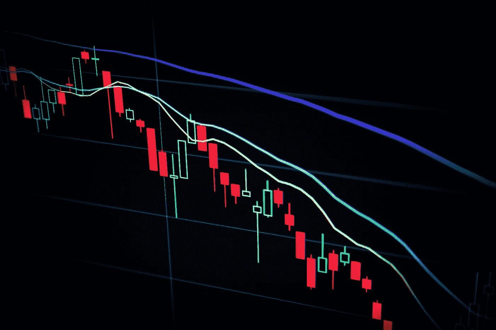

# 我从 3 年外汇交易中学到了什么。

> 原文：<https://medium.com/coinmonks/what-i-learned-after-3-years-of-forex-trading-f805068074bc?source=collection_archive---------12----------------------->

> 外汇交易简单但不容易。

Photo by [Maxim Hopman](https://unsplash.com/@nampoh?utm_source=medium&utm_medium=referral) on [Unsplash](https://unsplash.com?utm_source=medium&utm_medium=referral)

说实话，外汇交易的确很简单。你所要做的就是预测价格是上涨还是下跌..对吗？但是为什么仍然有 90%左右的交易者每天还在亏损？而且即使交易了 3 年，我还是时不时的属于亏损的队伍。