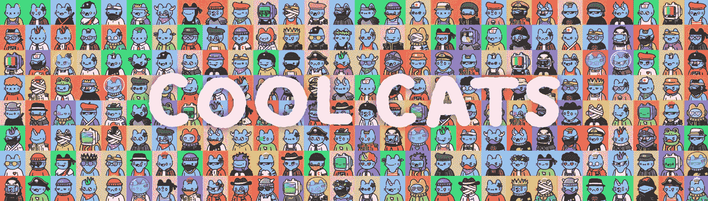
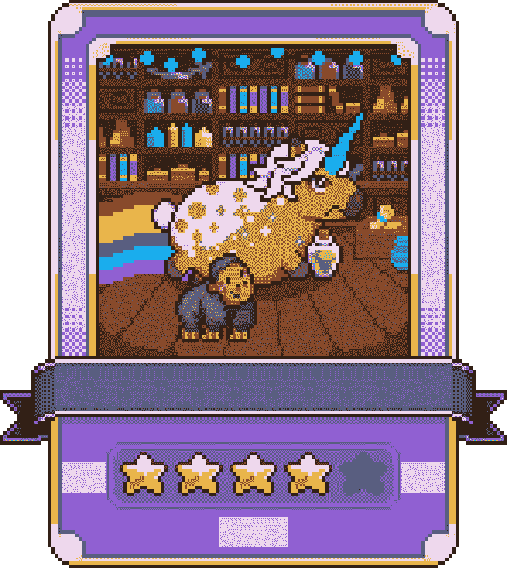

# 我从建立酷猫 NFT 中学到了什么

> 原文：<https://medium.com/coinmonks/what-i-learned-from-building-cool-cats-nft-4057f279d400?source=collection_archive---------0----------------------->

## 坚实——真的



《酷猫》是我在以太坊区块链上发表的第二份实实在在的合同，而我是一个彻头彻尾的实实在在的新手。

我们都必须从某个地方开始，我想与你分享我的整个 NFT 之旅。

# 这一切是如何开始的

有一天，我发现了一个可爱的像素 NFT，我立刻爱上了可爱的动画人物。我很早就去看比赛了，但是我的钱包里没有多少钱，所以我只买了一个。

我没有太注意我的新 NFT，直到它在 reveal 事件中孵化出来。然后，我花了一整天时间查看所有已经生成的新角色，四处挖掘以弄清楚一切是如何工作的，并勾勒出我认为是铸造过程的草图，但一切似乎都与 solidity 合同有关，看起来很可怕。

几天过去了，一天早上我醒来，感觉自己很勇敢。打开谷歌，开始尝试理解一些可靠性合同。

我失败了。

最后，我请 Lynq 帮助我深入研究一些东西，我们终于开始在理解 NFTs 方面取得了一些进展。直到我写完[这篇文章](/pinata/how-to-build-erc-721-nfts-with-ipfs-e76a21d8f914)，一切才真正明白过来。

## 测试测试测试 MoonKids

对 NFTs 如何工作有了基本的了解，我开始在 Rinkeby testnet 上构建自己的项目——[moon kids](https://testnets.opensea.io/collection/moonkids-yt4oykg2yh)。


我知道我想创建一个生成像素项目，但我没有时间真正像素化大量的图形，所以我前往这个令人敬畏的[玩偶制造商](http://www.avatarsinpixels.com/chibi/clothing/Body)并创建了大量的测试图像。

添加了一些层:宠物、行星、气球和背景，我拥有了所有我需要的图形资产。可怕的时刻到了——稳固。

老实说，我已经记不清我写了多少 MoonKids 测试合同了。我花了很长时间才最终确定 Opensea 在其网站上显示元数据中的图像背后的逻辑。

我告诉过你我是个可靠的 noob:)

最后，我让一切都工作了，我甚至设法弄清楚如何屏蔽预先生成的元数据，这样人们就无法通过数据寻找最稀有的令牌。

## 该上主网了

我很有信心，我现在可以建立一个坚实的合同，所以我说服了 Lynq(花了 5 秒钟)来帮助我，雇佣了一些像素艺术家，并开始工作[fati goens](https://twitter.com/faticorns)。

早期主要是试图找出我们的角色设计，并用 PHP 建立我们的角色分层系统。这是容易的部分，因为 Lynq 和我都有超过 30 年的 PHP 经验。是的，我们比你想象的要老:)



艺术品是一个不断发展的过程，但我们最终决定采用上述卡片格式。该示例缺少随机名称和#id。

我整理了一份合同，然后我们开始销售，卖给一个人——令人敬畏的 Shamdoo。可悲的是，我们还没有完善我们的系统，他觉得气体太高。我们立即停止销售，重新开始。是的，我们全额退款给他，包括汽油费和所有费用。

排队是我一生中最头疼的事…

# 优化可靠性合同

实际上，我喜欢优化代码(完全是个怪胎)。我已经花了无数个小时让代码版本互相竞争，试图减少毫秒和 CPU 的使用，但优化可靠性感觉像是一个完全不同的野兽。

## 为更便宜的铸币修剪 gwei

一开始，我会对我的合同做些小改动，然后通过 [remix](https://remix.ethereum.org/) 把它们部署到 Rinkeby。然后我会运行一个交易并比较气体。

史诗 noob 就在这里:P

显然，这种方法既慢又疯狂。我知道一定有更好的方法——回到谷歌和 StackOverflow。

我最终找到了这篇关于[安全帽](https://rahulsethuram.medium.com/the-new-solidity-dev-stack-buidler-ethers-waffle-typescript-tutorial-f07917de48ae)的文章和这些关于优化可靠性合同的文章:

[](/layerx/how-to-reduce-gas-cost-in-solidity-f2e5321e0395) [## 如何降低燃气成本

### 在大多数情况下，气体效率的优先级往往较低。由于许多项目关注安全性或…

medium.com](/layerx/how-to-reduce-gas-cost-in-solidity-f2e5321e0395) [](/coinmonks/gas-optimization-in-solidity-part-i-variables-9d5775e43dde) [## 固体中的气体优化第一部分:变量

### Gas 优化是开发以太坊智能合约所特有的挑战。

medium.com](/coinmonks/gas-optimization-in-solidity-part-i-variables-9d5775e43dde) [](/coinmonks/math-in-solidity-part-3-percents-and-proportions-4db014e080b1) [## 坚实的数学(第三部分:百分比和比例)

### 这篇文章是关于在 Solidity 中做数学的系列文章的第三篇。这次的主题是:百分之……

medium.com](/coinmonks/math-in-solidity-part-3-percents-and-proportions-4db014e080b1) 

最后，我有了一些可靠的信息，我们出发去比赛了。

我在生活和 IRL 工作之间偷偷进行了一些合同优化，但是进展太慢了，我不喜欢，所以我拉了另一个朋友，Adam。接下来的周末真的很有趣:Lynq、Adam 和我都拿出了我最新的 git 回购协议，并尝试了我们能想到的任何降低汽油价格的方法。

我们的目标是获得尽可能低的汽油，因此铸造对用户来说更便宜，我们发现了一些有趣的方法。

## 局部变量

许多 NFT 合同似乎借用了代码，而没有完全理解它是做什么的，甚至懒得纠正错误或优化它。一个非常普遍的问题(如果你可以这么说的话)是不必要的使用 **totalSupply()** 函数。

```
function adopt(uint256 num) public payable {
  require(totalSupply() < MAX_TOKENS, "Sale has already ended");
  require(num > 0 && num <= 20, "You can adopt minimum 1, maximum 20");
  require(totalSupply().add(num) <= MAX_TOKENS, "Exceeds MAX_TOKENS");
  require(msg.value >= calculatePrice().mul(num), "Ether value sent is below the price");

  for (uint i = 0; i < num; i++) {
    uint mintIndex = totalSupply();
    _safeMint(msg.sender, mintIndex);
  }
}
```

每次调用 totalSupply()都会增加用户的成本，从而导致更高的油价。

这可以这样写:

```
function adopt(uint256 num) public payable {
  uint256 totalSupply = totalSupply();
  require(totalSupply < MAX_TOKENS, "Sale has already ended");
  require(num > 0 && num <= 20, "You can adopt minimum 1, maximum 20");
  require(totalSupply.add(num) <= MAX_TOKENS, "Exceeds MAX_TOKENS");
  require(msg.value >= calculatePrice().mul(num), "Ether value sent is below the price");

  for (uint i = 0; i < num; i++) {
    _safeMint(msg.sender, totalSupply + i);
  }
}
```

这个简单的改变大大减少了汽油，但是等等，还有更多！

## 条件式

每个人都知道如何使用条件，但我们什么时候真正考虑过实际发生的事情呢？

看看这一行:

```
require(num > 0 && num <= 20, "You can adopt minimum 1, maximum 20");
```

它的功能很清楚，但实际上，它做得太多了。

假设没有用户会尝试铸造 0 代币是安全的，因此我们可以立即删除它，节省一些汽油——大约 3 或 4 gwei(全部加起来)

```
require(num <= 20, "You can adopt maximum 20");
```

这种小于或等于实际上是在做两件事，而且都耗费汽油:

*   安全数学解决方案。
*   我对安全数学唯一的问题是它的过度使用。你不必使用 safeMaths 来做(如果我错了，请纠正我):

为此使用 safeMaths 只会增加额外的汽油成本。

```
require(num < 21, "You can adopt maximum 20");
```

然而，请做你自己的研究，因为我显然不是专家。

## 打造酷猫

在制作 Faticorns 的时候，Lynq 和我与[克隆](http://www.twitter.com/cloncast)和[埃文](http://www.twitter.com/evanluza)合作，开始制作酷猫。我们觉得多积累点经验也无妨。

```
function calculatePriceForToken(uint _id) public view returns (uint256) {
  require(_id < MAX_TOKEN, "Sale has already ended");

  if (_id >= 9900) {
    return 1000000000000000000;
  } else if (_id >= 9500) {
    return 640000000000000000;
  } else if (_id >= 7500) {
    return 320000000000000000;
  } else if (_id >= 3500) {
    return 160000000000000000;
  } else if (_id >= 1500) {
    return 80000000000000000;
  } else if (_id >= 500) {
    return 40000000000000000;
  } else {
    return 20000000000000000;
  }
}
```

酷猫固体合同

## 这份合同真的没有花哨的功能，它只是允许用户铸造一个 NFT 令牌，并给我开始和暂停销售、改变价格和改变 baseUri 的能力——基本上就是这样。

您可以在此查看合同

元数据服务器

你可能见过很多盲目铸造的 NFT。人们铸造他们的代币，在未来的某个时刻，它们会被揭示。

盲目铸造可能是一个很酷的功能，但酷猫通过它们的背景显示出它们的稀有性:

```
uint256 value = 100 / 2;
```

我们希望用户能够创造新的游戏，并且能够立即看到他们的猫，重现小时候打开口袋妖怪卡片的感觉。这意味着我们需要一种方法来屏蔽造币前的元数据，并立即显示造币后的真实元数据。

我尝试了几种不同的方法，最终确定了一个非常简单的解决方案(分享测试版本，而不是最终版本)。

# 我只是使用 web3 监听事务，并检查该文件是否存在于 sold_tokens 目录中。如果它不见了，就把相关文件复制到适当的位置。

这段代码还运行在一个 5 分钟的计时器上，以捕捉 web3 可能错过的任何内容。

## 简单，没有复杂的运动部件出错。

字符生成器

这简单地使用良好的旧 PHP 将资产图像层叠在彼此之上，以创建期望的最终产品:

## 下一步是什么？

我们对酷猫有很大的计划，其中之一是在未来的合同和第二代繁殖。社区仍在讨论如何实现这一点。

现在，我们正专注于建立酷猫世界。他们共同生活的城镇或城市。一个简单的方法来扎根社区，将他们结合在一起，创造一种归属感和拥有感。


Random screenshot of cats from opensea

部分所有权甚至可能包括给你的猫重新命名的方法。更多信息请见另一篇文章。

尽管如此，我们接受社区的命令。如果社区决定反对任何东西，我们就废除它。

```
async writeIfMissing(id){
    //check if file exists
    try {
      const file = `./sold_tokens/${id}`;
      const final_file = `./final_metadata/${id}`;
      // file missing
      if (!***fs***.existsSync(file) && ***fs***.existsSync(final_file)) {
        try {
          await this.logTransfer(id);
        } catch (err) {
          ***console***.log(err);
        }
      }
    } catch(err) {
      ***console***.error(err)
    }
  }
}async logTransfer(id) {
  try {
    var oldPath = `./final_metadata/${id}`;
    var newPath = `./sold_tokens/${id}`;

    ***fs***.copyFile(oldPath, newPath, function (err) {
      if (err) throw err
    })
  } catch (err) {
    ***console***.log(err);
  }
}...
```

去哪里找我

我通常可以在酷猫不和频道找到 https://discord.gg/WhBAAHnSz4
T3

或者在推特上
[https://twitter.com/xtremetom](https://twitter.com/xtremetom)

## [https://twitter.com/coolcatsnft](https://twitter.com/coolcatsnft)

最后一句话

```
<?php$x = $y = *1080*;
$final_img = imagecreatetruecolor($x, $y);
imagealphablending($final_img, *true*);
imagesavealpha($final_img, *true*);

// background
$hex = hex2rgb($GLOBALS['config']->tier_bg_colors->$tierName);
$bg_color = imagecolorallocate($final_img, $hex[*0*], $hex[*1*], $hex[*2*]);
imagefill($final_img, *0*, *0*, $bg_color);

// BODY
$body = imagecreatefrompng("./animated_images/Body/basic blue/1.png");
imagecopy($final_img, $body, *0*, *0*, *0*, *0*, $x, $y);

// SHIRT
$shirt = imagecreatefrompng("./animated_images/Shirt/$combo->shirt/1.png");
imagecopy($final_img, $shirt, *0*, *0*, *0*, *0*, $x, $y);...
```

# 我觉得这么说很傻，但我收到了太多的信息，我觉得这可能会为你我节省一些时间。

我有一份全职工作，再加上酷猫，我工作忙得不可开交，所以很遗憾，我不得不拒绝每一份工作邀请。

但是我总是愿意尽我所能分享资源和建议。

使用 Rarible [2021]创建并出售您的第一个 NFT

在本文中，我将讨论加密硬币和代币之间的区别。然后，我将讨论可替代的和…

# blog.coincodecap.com

加入 Coinmonks [电报频道](https://t.me/coincodecap)和 [Youtube 频道](https://www.youtube.com/c/coinmonks/videos)获取每日[加密新闻](http://coincodecap.com/)

另外，阅读

[复制交易](/coinmonks/top-10-crypto-copy-trading-platforms-for-beginners-d0c37c7d698c) | [加密税务软件](/coinmonks/crypto-tax-software-ed4b4810e338)

## [网格交易](https://coincodecap.com/grid-trading) | [加密硬件钱包](/coinmonks/the-best-cryptocurrency-hardware-wallets-of-2020-e28b1c124069)

[密码电报信号](http://Top 4 Telegram Channels for Crypto Traders) | [密码交易机器人](/coinmonks/crypto-trading-bot-c2ffce8acb2a)

[最佳加密交易所](/coinmonks/crypto-exchange-dd2f9d6f3769) | [印度最佳加密交易所](/coinmonks/bitcoin-exchange-in-india-7f1fe79715c9)

开发人员的最佳加密 API

[](https://blog.coincodecap.com/create-nft)[](https://blog.coincodecap.com/create-nft)[](https://blog.coincodecap.com/create-nft)

## [最佳](https://blog.coincodecap.com/create-nft)[密码借贷平台](/coinmonks/top-5-crypto-lending-platforms-in-2020-that-you-need-to-know-a1b675cec3fa)

### [免费加密信号](/coinmonks/free-crypto-signals-48b25e61a8da) | [加密交易机器人](/coinmonks/crypto-trading-bot-c2ffce8acb2a)

[杠杆代币](/coinmonks/leveraged-token-3f5257808b22)终极指南

> [Bookmap 评论](https://coincodecap.com/bookmap-review-2021-best-trading-software) | [美国 5 大最佳加密交易所](https://coincodecap.com/crypto-exchange-usa)

## 最佳加密[硬件钱包](/coinmonks/hardware-wallets-dfa1211730c6) | [Bitbns 评论](/coinmonks/bitbns-review-38256a07e161)

*   [新加坡十大最佳加密交易所](https://coincodecap.com/crypto-exchange-in-singapore) | [购买 AXS](https://coincodecap.com/buy-axs-token)
*   [红狗赌场评论](https://coincodecap.com/red-dog-casino-review) | [Swyftx 评论](https://coincodecap.com/swyftx-review) | [造币厂评论](https://coincodecap.com/coingate-review)
*   [投资印度的最佳密码](https://coincodecap.com/best-crypto-to-invest-in-india-in-2021)|[WazirX P2P](https://coincodecap.com/wazirx-p2p)|[Hi Dollar Review](https://coincodecap.com/hi-dollar-review)
*   [Best Crypto Exchange](/coinmonks/crypto-exchange-dd2f9d6f3769) | [Best Crypto Exchange in India](/coinmonks/bitcoin-exchange-in-india-7f1fe79715c9)
*   [Best Crypto APIs](/coinmonks/best-crypto-apis-for-developers-5efe3a597a9f) for Developers
*   Best [Crypto Lending Platform](/coinmonks/top-5-crypto-lending-platforms-in-2020-that-you-need-to-know-a1b675cec3fa)
*   [Free Crypto Signals](/coinmonks/free-crypto-signals-48b25e61a8da) | [Crypto Trading Bots](/coinmonks/crypto-trading-bot-c2ffce8acb2a)
*   An ultimate guide to [Leveraged Token](/coinmonks/leveraged-token-3f5257808b22)
*   [Bookmap Review](https://coincodecap.com/bookmap-review-2021-best-trading-software) | [5 Best Crypto Exchanges in the USA](https://coincodecap.com/crypto-exchange-usa)
*   The Best Crypto [Hardware wallet](/coinmonks/hardware-wallets-dfa1211730c6) | [Bitbns Review](/coinmonks/bitbns-review-38256a07e161)
*   [10 Best Crypto Exchange in Singapore](https://coincodecap.com/crypto-exchange-in-singapore) | [Buy AXS](https://coincodecap.com/buy-axs-token)
*   [Red Dog Casino Review](https://coincodecap.com/red-dog-casino-review) | [Swyftx Review](https://coincodecap.com/swyftx-review) | [CoinGate Review](https://coincodecap.com/coingate-review)
*   [Best Crypto to Invest in India](https://coincodecap.com/best-crypto-to-invest-in-india-in-2021) | [WazirX P2P](https://coincodecap.com/wazirx-p2p) | [Hi Dollar Review](https://coincodecap.com/hi-dollar-review)