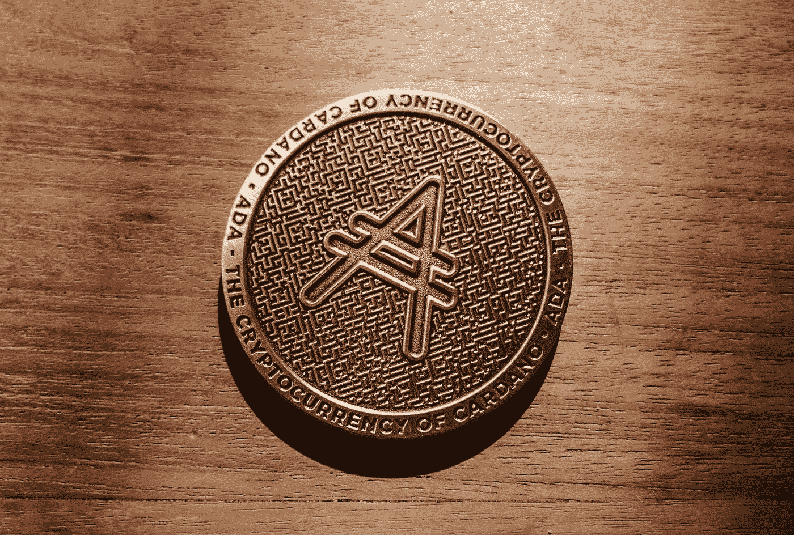

# 投资者需要了解的替代硬币

> 原文：<https://medium.com/coinmonks/what-investors-need-to-know-about-altcoins-3c9daddc38f6?source=collection_archive---------13----------------------->



Photo by [Ruben Hanssen](https://unsplash.com/@rhfhanssen?utm_source=medium&utm_medium=referral) on [Unsplash](https://unsplash.com?utm_source=medium&utm_medium=referral)

替代硬币是一种加密货币，使用一种名为“区块链”的技术，允许安全的点对点交易。他们在比特币成功的基础上，通过略微改变规则来吸引个人用户，并可能包括更少的能源使用。截至 2021 年 11 月，共有超过 7000 枚替代硬币。

了解更多信息，以便您决定是否投资替代硬币。

# 什么是山寨币？

Altcoins 是比特币(BTCUSD)以外的加密货币。它们与比特币有着共同的特征，但在其他方面也有所不同。例如，一些替代硬币使用不同的共识机制来创建区块或验证交易。或者，它们通过提供智能合约或更低的价格波动性等新的或额外的功能，将自己与比特币区分开来。

截至 2021 年 11 月，有超过 14，000 种加密货币。根据 CoinMarketCap 的数据，2021 年 11 月，仅比特币和以太就占了加密货币市场总量的 60%左右。其余的组成了所谓的 altcoins。因为它们通常源自比特币，所以替代比特币的价格走势模仿了比特币的轨迹。然而，分析师表示，加密货币投资生态系统的成熟和这些硬币新市场的发展将导致替代硬币的价格波动，而不受比特币交易信号的影响。

# 关键要点:

*   Altcoin 一词是指除比特币以外的所有加密货币。
*   有超过 14000 种加密货币。根据 CoinMarketCap 的数据，altcoins 占据了整个加密货币市场近 60%的份额。
*   替代硬币的一些主要类型包括基于采矿的加密货币、稳定硬币、安全代币和公用代币。
*   随着用户继续使用这项技术，替代硬币未来可能只包括比特币以外的基于采矿的加密货币。
*   索拉纳和币安硬币是市值最大的替代硬币。

# 了解替代硬币

“Altcoin”是“另类”和“币”两个词的组合，包括比特币的所有替代品。比特币和替代币的基础设施是一样的。因此，它们像对等系统或能够同时处理大量数据和事务的巨型计算机一样共享代码和功能。

在某些情况下，替代硬币渴望成为下一个比特币，成为更便宜的数字交易方式。

但是比特币和 altcoin 也有很多区别。比特币是加密货币的首批迭代之一，其理念和设计为其他货币的发展树立了标杆。然而，它的实现有几个缺点。例如，用于创建工作证明(PoW)块的共识机制需要耗费大量精力和时间。比特币的智能合约能力也是有限的。

```
**Important:** After its introduction in 2009, bitcoin became the first widely adopted application of proof of work (PoW). 2PoW is also the basis for many other cryptocurrencies, allowing for secure, decentralized consent.
```

替代硬币往往会纠正比特币的感知极限，以建立竞争优势。许多替代硬币使用利益证明(PoS)共识方法来减少能源消耗以及创建区块和验证新交易所需的时间。

例如，按市值计算，以太是世界第二大加密货币，在以太坊区块链的智能合约中被用作汽油(或支付交易成本)。正如备受期待的以太坊 2.0 的推出所表明的那样，替代币通常会解决对比特币的传统批评，如可扩展性和稳定性。

通过这种方式将自己与比特币区分开来，altcoins 为自己创造了一个市场。反过来，这也吸引了投资者，他们认为比特币有潜力替代比特币。随着替代硬币获得更多的牵引力和用户，价格上涨，投资者预计会有所收益。

# 替代硬币的类型

根据其功能和共识机制，替代硬币有不同的风格和类别。以下是一些较重要的问题的简要总结:

```
**Fast Fact:** It is possible for an altcoin to fall into more than one category.
```

# 基于采矿

顾名思义，基于采矿的替代币是存在的。大多数基于采矿的替代硬币使用 PoW，这是一种系统通过解决困难问题来创建块从而生成新硬币的方法。基于采矿的替代币的例子有 Litecoin、Monero 和 Zcash。2020 年初的顶级 altcoins 大部分都属于基于挖矿的类别。基于采矿的替代硬币的选择是预先确定的，并且通常是初始硬币发行(ICO)的一部分。这种硬币不是通过算法创造的，而是在加密货币市场上市之前进行分发。预制硬币的一个例子是 Ripple 的 XRP。

# 稳定的硬币

自推出以来，加密货币的交易和使用一直以波动性为标志。Stablecoins 旨在通过将其价值降至一篮子商品(如法定货币、贵金属或其他加密货币)来降低整体波动性。该篮子旨在作为储备，供持有者在加密货币出现故障或遇到问题时赎回。

稳定硬币的价格波动不会超过一个狭窄的范围。

值得注意的稳定硬币包括系绳的，马克道的戴，美元硬币(USDC)。2021 年 3 月，支付处理巨头 Visa Inc. (V)宣布，它将开始在区块链以太坊的 USDC 网络上结算某些交易，并计划在 2021 年晚些时候进一步扩大稳定的硬币结算能力。

# 安全令牌

证券代币类似于在证券交易所交易的证券，只是它们有一个数字来源。证券代币类似于传统的股票，它们通常以所有权或向持有人支付股息的形式承诺股权。这种代币潜在的价格升值是吸引投资者投资的主要因素。

2021 年，比特币钱包公司 Exodus 成功完成了证券交易委员会合格的 Reg A+代币发行，并出售了 7500 万美元的普通股，这些股票将在阿尔格兰德区块链上转换为代币。这是一个历史性的事件，因为它是第一个在美国发行公司发行股票的数字资产证券。

# 迷因硬币

顾名思义，迷因币的灵感来自一个笑话或对其他著名加密货币的愚蠢模仿。它们通常在短时间内受到欢迎，通常由主要的加密影响者和试图利用短期收益的散户投资者在网上推广。

例如，特斯拉公司(TSLA)首席执行官兼加密货币爱好者埃隆马斯克定期发布关于主要迷因币 Dogecoin (DOGEUSD)和柴犬币的神秘推特，经常推动它们的价格大幅上涨。2021 年 10 月，在马斯克在特斯拉上发布了他的宠物柴犬弗洛基的照片后，柴犬在 24 小时内增长了 91%。许多人将 2021 年 4 月和 5 月期间这些特定替代硬币的大幅上涨称为“meme coin season”，数百种加密货币基于纯粹的投机获得了巨大的百分比收益。

```
**Tip:** An initial coin offering (ICO) is the cryptocurrency industry's equivalent of an initial public offering (IPO). A company looking to raise money to build a new coin, app or service launched an ICO as a way to raise money.
```

# 实用令牌

公用令牌用于在网络内提供服务。例如，它们可以用于购买服务、支付网络费用或兑换奖励。与安全令牌不同，实用令牌不支付股息或分享所有权股份。Filecoin 用于购买网络上的存储空间，是实用令牌的一个例子。

# Altcoins 是好的投资吗？

替代硬币市场还处于萌芽阶段。这是不平等的一对。过去十年，加密货币市场上上市的替代硬币数量呈指数级增长，吸引了大批散户投资者，他们押注于价格走势，以获取短期收益。但这些投资者没有必要的资本来产生足够的市场流动性。市场疲软和缺乏监管导致另类投资的估值大幅波动。

以以太坊为例，它在 2018 年 1 月 12 日达到了 1299.95 美元的前峰值。仅仅几个星期后，它降到了 597.36 美元，到年底，乙醚的价格降到了 89.52 美元。然而，两年后的 2021 年 11 月，altcoin 的价格达到了创纪录的 4750 美元以上。定时交易可以为交易者提供丰厚的利润。

但是有一个问题。加密货币市场尚未成熟。尽管做出了许多努力，但没有定义好的投资标准或指标来评估加密货币。在很大程度上，比特币市场是由投机驱动的。大量死亡加密货币的案例存在，它们未能获得足够的牵引力，或在收集投资者的资金后消失。

因此，altcoin 市场是为那些愿意承担更大风险的投资者而设的，他们在一个不受监管、容易波动的新兴市场中运营。他们还应该能够应对价格大幅波动带来的压力。对于这些投资者来说，加密货币市场可以提供巨大的回报。

# 优点:

*   替代币是比特币的“改良版”，因为它们旨在解决加密货币的缺点。
*   与 stablecoins 一样，Altcoins 有可能实现比特币作为日常交易媒介的最初承诺。
*   某些替代硬币，如以太坊的以太和卡尔达诺的 ADA，已经在主流机构中获得了牵引力，导致了更高的估值。
*   投资者可以从各种替代硬币中进行选择，这些硬币在加密经济中执行各种功能。

# 缺点:

*   与比特币相比，替代币的投资市场很小。比特币约占整体加密货币市场的 42%。
*   缺乏监管和明确的投资标准意味着另类硬币市场的特点是投资者少，流动性差。因此，它们的价格比比特币更不稳定。
*   区分不同的替代币及其各自的用例并不总是容易的，这使得投资决策更加困难和混乱。
*   有许多“死”的替代硬币耗尽了投资者的美元，正在下沉。

# 替代硬币的未来

关于替代硬币和加密货币未来的讨论是导致 19 世纪联邦发行美元的环境的例证。当时，美国有多种当地货币在流通。每个都有独特的功能，并由不同的设备支持。例如，黄金证书由国库中的黄金存款支持。用于资助内战的美钞是由政府支持的。

当地银行也在发行自己的货币，在某些情况下是由虚拟储备支持的。货币和金融工具的多样性与替代货币市场的现状相似。如今市场上有成千上万的代用币，每一种都声称服务于不同的目的和市场。

替代硬币市场目前的状况不太可能被整合成一种单一的加密货币。但也有可能在加密市场上市的 1800 多枚替代硬币中的大部分将无法存活。替代硬币市场将围绕一群替代硬币聚合，这些替代硬币具有强大的效用和用例，将主导市场。

对于寻求多元化进入加密市场的投资者来说，替代硬币是一种廉价的方式，可以将他们的视野扩大到比特币之外。加密货币市场的上涨产生了数倍于比特币的回报。但另类投资也有风险，尤其是缺乏监管。加密货币市场的成熟将为该行业带来更多的复杂性和资本，为监管和减少波动铺平道路。

```
**Tip:** Investors looking to diversify into the crypto markets should look into altcoins, which produce returns that are often multiples of bitcoin.
```

# 什么是 Altcoin？

altcoin 一词是指比特币以外的加密货币(有时也指以太以外的货币)。这种硬币通过扩展其功能和解决其缺点来区分自己和比特币。

# 10 大山寨币有哪些？

截至 2021 年 11 月排名前 10 的 altcoins 分别是以太坊、币安币(BNB)、泰瑟(USDT)、索拉纳、卡尔达诺、XRP、波尔卡多特、Dogecoin、美元币、柴犬币。

# 一枚替代硬币要多少钱？

altcoins 的价格相差很大，从几分钱到几千元不等。例如，2021 年 11 月，以太坊的交易价格约为 4500 美元，而第六大最有价值的加密货币 Ripple 的 XRP 的交易价格为 1.10 美元。

# 哪个 Altcoin 是最好的投资？

按市值计算，以太是最大和最完善的替代硬币。7 它的智能合约功能已有成熟的用例，它是以太坊的一部分，可以说是近代最复杂的区块链平台之一。

# Altcoins 是好的投资吗？

替代币有许多与比特币相关的投资风险。此外，许多较小的替代硬币流动性较差。但以太和 XRP 等成熟的替代币是比特币的竞争对手。

# 结论

对于有意分散投资组合的加密货币市场投资者来说，替代硬币是很好的选择。虽然有些，如以太坊的以太，可以通过名字识别，但超过 10，000 个替代硬币中的大多数仍然留下了他们的印记。替代硬币代表了加密货币重塑现代金融的潜力。但是投资者在投资之前应该做好调查。与替代币相关的风险与投资比特币的风险相似，在某些情况下甚至更大。

# 阅读更多信息:

[2022 年该不该开始投资加密货币？](https://xbmproject.com/index.php/2021/12/16/should-you-start-investing-in-cryptocurrency-in-2022/)

【2021 年 12 月最佳加密货币应用和交易所

*原载于 2021 年 12 月 16 日*[*https://xbmproject.com*](https://xbmproject.com/what-investors-need-to-know-about-altcoins/)*。*

> 加入 Coinmonks [电报频道](https://t.me/coincodecap)和 [Youtube 频道](https://www.youtube.com/c/coinmonks/videos)了解加密交易和投资

# 另外，阅读

*   [币安期货交易](https://coincodecap.com/binance-futures-trading)|[3 commas vs Mudrex vs eToro](https://coincodecap.com/mudrex-3commas-etoro)
*   [如何购买 Monero](https://coincodecap.com/buy-monero) | [IDEX 评论](https://coincodecap.com/idex-review) | [BitKan 交易机器人](https://coincodecap.com/bitkan-trading-bot)
*   [CoinDCX 评论](/coinmonks/coindcx-review-8444db3621a2) | [加密保证金交易交易所](https://coincodecap.com/crypto-margin-trading-exchanges)
*   [红狗赌场评论](https://coincodecap.com/red-dog-casino-review) | [Swyftx 评论](https://coincodecap.com/swyftx-review) | [CoinGate 评论](https://coincodecap.com/coingate-review)
*   [Bookmap 评论](https://coincodecap.com/bookmap-review-2021-best-trading-software) | [美国 5 大最佳加密交易所](https://coincodecap.com/crypto-exchange-usa)