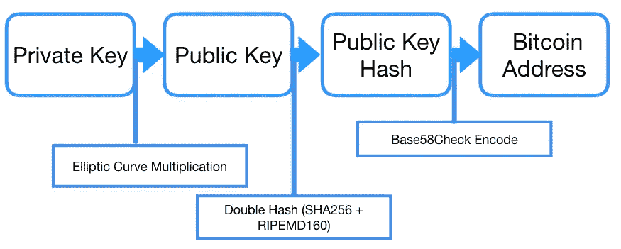

# 什么是比特币地址。

> 原文：<https://medium.com/coinmonks/what-is-a-bitcoin-address-6c822c857004?source=collection_archive---------1----------------------->

## 有没有想过这些字母和数字到底是什么意思？这是对什么是比特币地址以及它们如何工作的介绍。

**这里有一个随机的比特币地址:**

*19 ewdakxkr 7 tfujdmqm 2 lztcuhp8 jnzg 3*

正如你所看到的，是以数字“1”开头的数字和字母的混合(如果你看到一个不以“1”开头的比特币地址，它很可能是一个在头脑中产生的新的比特币地址——但那是另一篇博客文章)。这是用户为了接收和发送比特币而相互发送的字符串。比特币地址可以代表一个人或其他东西，比如支付脚本( [P2SH](https://en.bitcoin.it/wiki/Pay_to_script_hash) )。比特币地址也可以用二维码来表示，以便用户更容易复制粘贴该值。如果你想知道这个随机字符串是如何产生的，请继续阅读！

***首先，我们需要了解什么是公钥/私钥非对称加密方法，它是如何工作的。***

公钥密码是计算机和信息安全的数学基础。这是一对钥匙，一把*私人*和一把*公共*钥匙。私钥是随机选取的(稍后将详细介绍)，公钥是从私钥中派生出来的。在比特币中，公钥用于接收资金，私钥用于签署交易。

# **这对比特币有什么作用？**

比特币用户可以在交易中向另一个人发送一定数量的比特币，并用自己的私钥“签署”该交易，并给出自己的公钥。现在，这个签名可以由网络上的任何人根据公钥进行验证(无需透露私钥)，以检查发送者是否有“权利”在那个时刻“花费”这个数量的比特币。

总之，拥有私钥的人可以对交易进行唯一签名，拥有公钥的任何人都可以验证签名来自私钥所有者。

*注意:出于隐私和安全原因，每次交易的签名都是不同的，但都是由相同的私钥创建的。*

私钥和公钥之间的关系基于一个不可逆的“单向”数学函数，这意味着给定一个输入，您会得到一个输出，而您无法通过当前输出找到原始输入。比特币使用椭圆曲线乘法作为生成安全公钥的加密基础。

一旦我们有了公钥，我们就可以通过对公钥应用单向加密哈希函数来生成比特币地址。

Complete process to generate Bitcoin Address from a Private Key

需要注意的是，没有办法用公钥找到私钥，也没有办法用比特币地址找到公钥。

## **寻找私钥**

比特币的私钥只是一个在 1 到 2256 之间随机选取的数字，如何在这个范围内找到这个数字取决于软件开发者。我们唯一要考虑的是，随机的来源必须有足够的熵，不可预测或重复。不建议开发人员编写自己的随机数生成器，也不要使用为此提供的编程语言函数。相反，您可以使用一个安全的伪随机数发生器，该发生器使用来自足够熵的源的种子进行加密保护。

> **有趣的事实:** *如果一个比特币地址来自一个私钥，而这个私钥“只能”是一个介于* 1 和 2^256 *之间的数字，那么我们会不会有一天地址用完了？嗯，首先你得了解一下 2^256 有多大。这非常荒谬，相比之下，它大约是十进制的 10* ^ *77，可见宇宙估计包含 10* ^ *80 个粒子，所以可以肯定地说，我们不会用完比特币地址。某些计算表明，地球上每 64 个原子就有一个公共地址。*

## **椭圆曲线乘法和公钥**

椭圆曲线乘法背后的数学不在本文的讨论范围之内，所以我们将*假设*对私钥应用这个“单向函数”,就可以得到我们的公钥。

在这个[链接](http://www.bitaddress.org)中，你会发现一个比特币地址生成器，这个网页要求你四处移动指针，以便产生足够的随机性来挑选私钥，然后生成公钥和比特币地址。

## **从公钥到比特币地址**

我们怎么从公钥到比特币地址？我们通过对公钥应用一个“*单向散列函数*”来得到它。听腻了“*哈希*”？习惯吧！**哈希函数在比特币和区块链技术中被广泛使用**(比特币地址、脚本地址、工作证明挖掘等。).在比特币中，用于生成 btc 地址的两个哈希函数是“安全哈希算法”(SHA)和竞争完整性原语评估消息摘要(RIPEMD)，具体来说是 SHA256 和 RIPEMD160。

*首先，我们使用 SHA256 公钥散列，然后使用 RIPEMD160 再次散列结果。*

*结果，是比特币地址，但是等等！*

因为这个过程还多了一个步骤！哈！我们需要将结果字符串编码为“ **Base58** ”。那么，你可能想知道什么是“ **Base58** ”。这是一种基于文本的二进制编码格式，专门为比特币的使用而开发，其主要目标是通过排除一些可能令人混淆的字符，如 0(数字 0)、O(大写 O)、l(小写 l)、I(大写 I)以及符号“+”和“/”，使比特币地址更“可读”。

为了防止打字错误或抄写错误，在生成的 Base58 字符串上放置了额外的安全层。 **Base58Check** 是另一种编码格式，内置了错误校验码。这段代码只是添加到数据末尾的 4 个字节。 **Base58Check** 的主要用例是防止向无效地址发送比特币。当出现 **Base58Check** 字符串时，比特币钱包将计算数据的校验和，并与代码中包含的校验和进行比较。如果它们匹配，则是有效地址，如果不匹配，则地址无效。

所以伙计们，我希望你们学到了一些关于比特币的新知识，如果你们有任何问题或建议，请留下评论，我很乐意回答。

> [直接在您的收件箱中获得最佳软件交易](https://coincodecap.com/?utm_source=coinmonks)

# 行动呼吁

[如果您想了解更多关于区块链的信息，请加入我们的每周简讯，了解加密领域的所有新闻。](https://mailchi.mp/fe27d17793e9/cryptolitics)