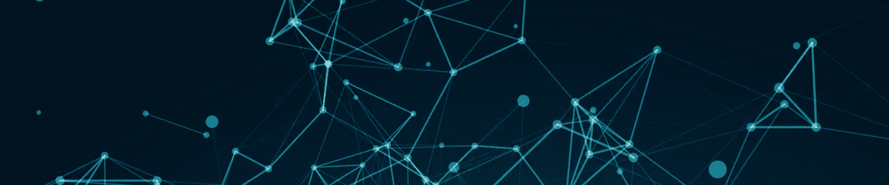
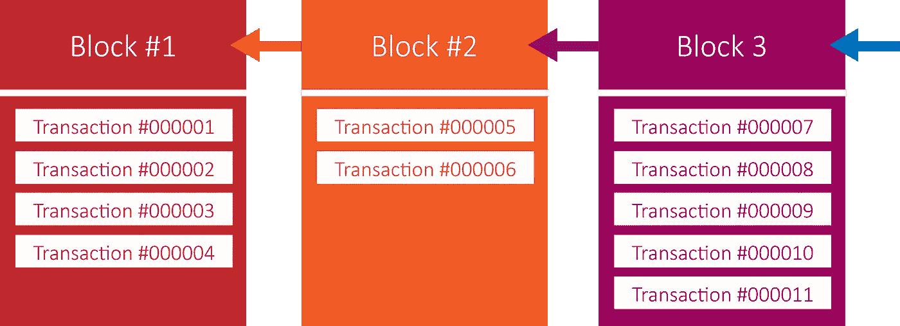
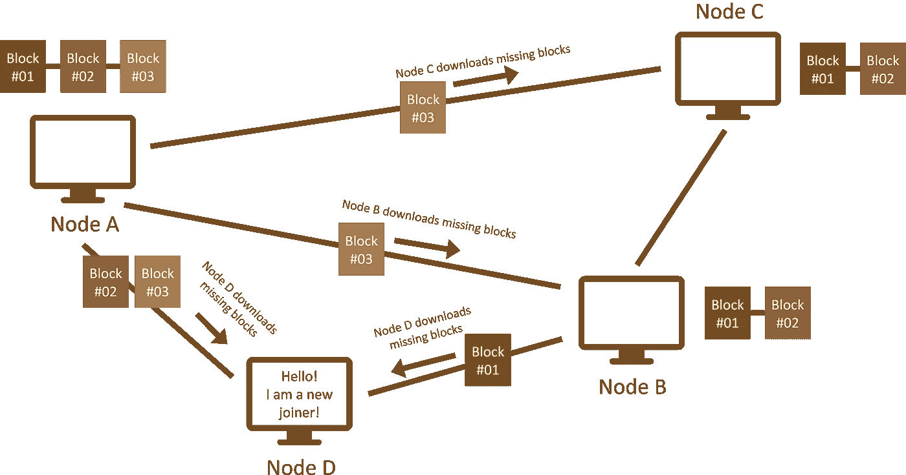
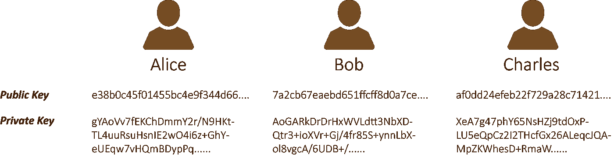
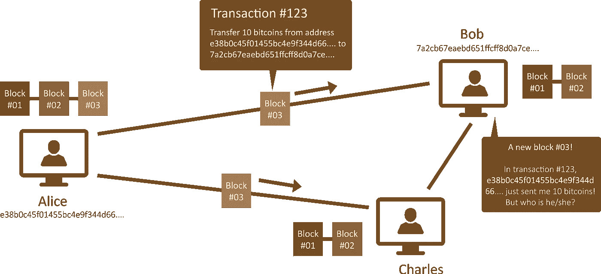
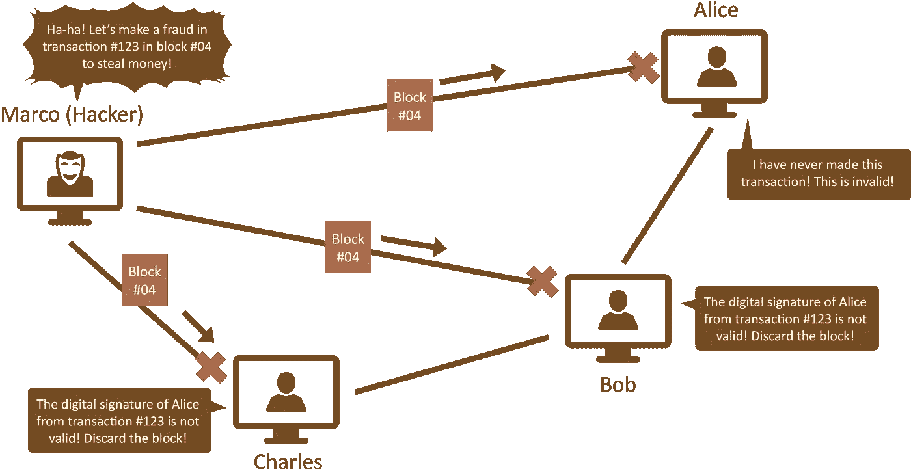
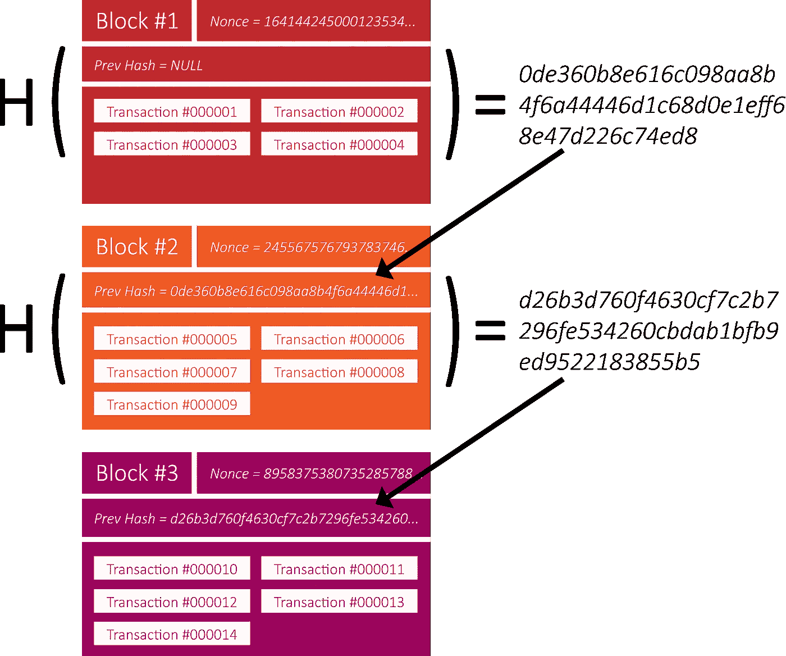
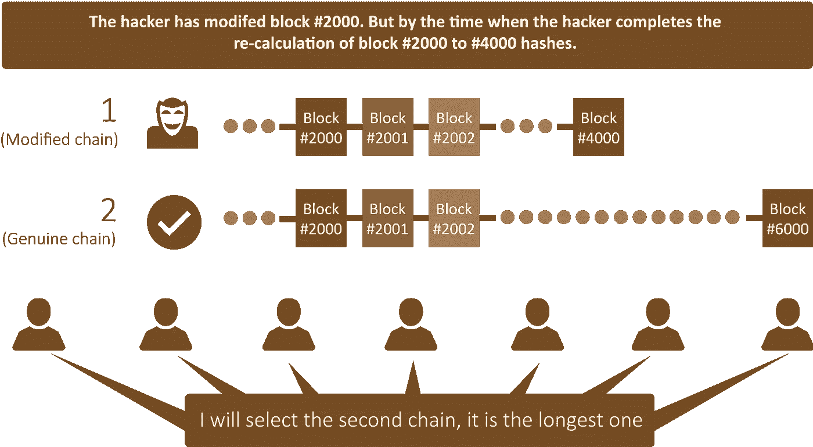
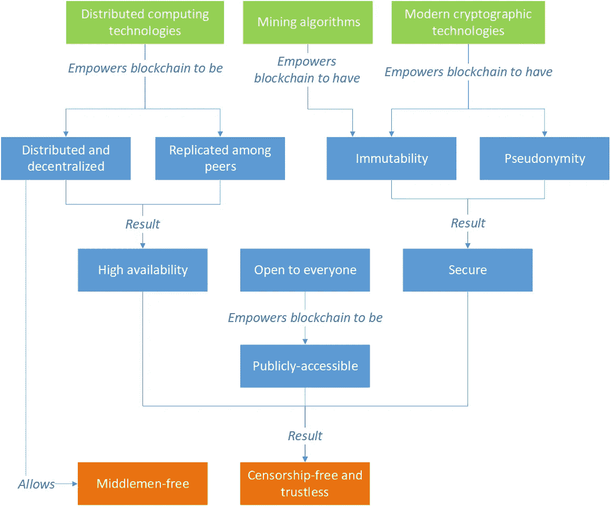

# 什么是区块链及其目的？

> 原文：<https://medium.com/coinmonks/what-is-a-blockchain-and-its-purpose-42f462e017ed?source=collection_archive---------2----------------------->

Image downloaded from Google Image Search

你好。今天，我想从最基本的东西开始这个系列——区块链介绍！

> [发现并回顾最佳区块链软件](https://coincodecap.com)

这篇教程帖子是为那些对区块链没有多少背景和知识的人，或者想更新知识的人准备的。接下来，我将分享以下内容。那么，事不宜迟，我们开始吧！

1.  什么是区块链和区块链网络？
2.  区块链及其网络的特点
3.  区块链网络如何实现匿名？
4.  区块链如何实现不变性？
5.  区块链及其网络的最终目标

# 区块链=数据结构

为了理解区块链，我们可以把这个词分成两个独立的词:块和链。块是一种数据结构，由块头和事务列表组成。另一方面，链是一系列连接在一起的东西。通过汇总两个定义，**区块链是指一系列块，由块标题和交易列表组成，按时间顺序排列**(见图 1) **。**

Figure 1

**事务是变化的记录，就像服务器日志**。这些变化对不同类型的区块链可能意味着不同的事情。例如，在比特币区块链中，一笔交易是指将数字资产(称为比特币)从 A 转移到 B；在以太坊区块链，一笔交易可能意味着数字资产(称为以太)从 A 到 B 的转移，或者一个小程序(称为智能合约)在区块链的执行记录。

由于交易是变化的记录，按时间顺序存储在一系列块中，我们可以通过查看从最早到最近的所有交易来推断区块链的最新状态。

# 区块链网络=分布式和去中心化网络

然而，当人们谈论区块链时，他们通常把它称为区块链网络，而不是数据结构。**区块链网络是一种分布式和分散式网络，其中每个网络节点相互同步，以存储相同的区块链数据结构，并以相同的顺序执行相同的事务。**

> **注:** 为了使事情不含糊，当我们提到“区块链网络”时，我们将其称为节点的网络，如下图 2 所示；当我们提到“区块链”时，我们称之为将一系列数据块组织成链的数据结构，就像上面图 1 中所示的那样。

区块链网络是对等的，意味着每个网络节点都是直接相互连接的，没有中间人、代理或中央服务器。这种设计使得网络**分散化、去中心化。**与现代 web 应用程序架构不同，在现代 web 应用程序架构中，应用程序由一方集中控制。在区块链网络中，没有中央控制点。网络上的每个网络节点都有权利和机会对区块链进行修改，因此我们称之为“**无权限**”。

# 每个人都拥有相同的数据

有时，不同的网络节点会创建数据块，并将其链接到现有的区块链。然后，在网络上的所有对等体之间复制和同步新数据块。结果，**每个网络节点将最终拥有完全相同的块副本**。换句话说，整个区块链(包括其中的所有事务和块数据)以分布式方式在所有对等体之间复制。

例如，在图 2 中，节点 A 创建一个新块(#03)，它将新块传播到其他连接的节点，这些节点通过保存该块与节点 A 同步。然后，假设有一个新的加入者，节点 D，它通过从网络上的一些节点下载所有现有的块来与网络同步。

Figure 2

# 高度可用

由于每个网络节点都有区块链数据的副本，并且节点是分布式和分散的，这使得区块链网络**没有停机时间，并且没有单点故障的问题**。只要一个或多个网络节点处于在线状态，区块链网络将持续运行，用户将能够从区块链检索数据。此外，分散化设计使区块链网络对 DDoS(即分布式拒绝服务)攻击具有很强的抵抗力。

# 向所有人开放，完全透明

如图 2 所示，区块链网络的规模可以扩大或缩小，这取决于网络节点的数量。一般来说，每个人都可以在任何时候加入或退出区块链网络。这个特点使得区块链网络是开放的。由于每个人都可以加入，交易和区块可以由这些新来者创建，而无需获得许可。

因为每个人都可以加入区块链网络并获得区块链的副本，因此，**存储在区块链中的每个事务和块都是完全透明的**。也就是说，地球上的每个人都可以查看区块链的详细信息。

# 假名:没有人透露他们的真实姓名

尽管该网络对用户开放，用户可以自由进出，但不需要注册就可以开始使用。据说区块链网络的用户享受着匿名的好处。也就是说，**他们不必在网络上公开自己的真实姓名或凭证来与他人交流或进行交易**。

要使用区块链网络，**每个用户至少应该拥有一个公钥和私钥对**(由加密技术支持，见图 3)，它们是在用户的本地机器上随机生成的。公钥(也称为地址)充当身份(像用户名一样)，私钥充当身份所有权的证明(像密码一样)。

Figure 3

**当用户试图在区块链网络上进行交易时，他们会使用相关人员的公钥作为参考。**例如，假设我们在 ABC 区块链网络上，Alice 想要向 Bob 发送 10 项数字资产。她将进行“从地址 e38b0c45f01455bc4e9f344d66…转移 10 项数字资产”的交易，而不是进行“从 Alice 向 Bob 转移 10 项数字资产”的交易。致 7 a2 CB 67 ea EBD 651 ffc F8 d0a 7 ce…。”。除非鲍勃知道地址“e38b0c45f01455bc4e9f344d66…”是由 Alice 拥有的，否则，他不知道是谁付给他这 10 笔数字资产(见图 4)。

Figure 4

# 交易由数字签名保护

为了确保没有人能够伪造交易并将其发布到区块链中，**每笔交易都需要由发起人进行数字签名以证明其真实性**。

例如，假设有一个恶意的人 Marco，他想要伪造一个交易，该交易声称“从 e38b0c45f01455bc4e9f344d66 转移 X 金额的数字资产…(爱丽丝的地址)到 5544427a02284717c9eaefb039……(马可的地址)”。他将不会成功，因为没有来自爱丽丝的数字签名，这样的交易是无效的，该数字签名是从爱丽丝的私钥生成的，并且该密钥由爱丽丝作为秘密保存。

当 Marco 试图将这个非法交易包含到一个块中并发布到其他网络节点时，这些节点将使用 Alice 的公钥验证该块的正确性和真实性。一旦发现非法交易，节点将立即丢弃该块，因此欺诈将失败(见图 5)。

Figure 5

# 不变性:一旦发布，任何人都不能更改或删除

区块链技术的突破之一是数据的不变性。也就是说，**一旦交易被执行或存储，实际上，没有人能改变或删除数据，或撤销操作**。这使得区块链的工作方式类似于只追加日志，类似于财务会计中的分类账。因此，区块链网络也被称为一种**分布式总账系统**。

为了理解区块链网络如何确保其数据的不变性，让我们回顾一下图 1。它说明了块通过箭头或指针链接在一起。然而，那只是一个过于简化的解释。

事实上，**个块通过其前一个块**的加密哈希(即，该块的指纹或 DNA)连接在一起。它是从块数据生成的非常长的、随机化的和固定长度的唯一令牌)，如图 6 所示。

Figure 6

如您所见，块通过使用加密散列来引用它的前一个块。块的哈希值是从其事务数据和块头的内容生成的，块头包含其先前的块哈希值。

## 机制#1:链接以前的哈希值

块 N 的加密哈希用于计算其下一个块 N+1 的加密哈希，块 N+1 的加密哈希用于计算其下一个块 N+2 的加密哈希，依此类推。**更改块 N 中的一个数据(甚至只是一个字符)将影响其块哈希以及块 N 之前的所有块哈希。**因此，如果有人(如黑客)试图修改块 N 中的块数据，他/她需要修改块 N+1、N+2、N+3 中的“以前的哈希值”，直到最新的块，以便使区块链有效。

## 机制#2:随机数值

此外，**恶意者需要重新计算 nonce 值**(即随机值，参见图 6) **，以通过称为**挖掘的过程来满足每个受影响块**的特定标准，**这就像彩票游戏:你必须尝试多次才能成功。这样的过程非常耗时。在中小规模的区块链网络中，仅仅计算一个块的 nonce 值就需要几分钟或几小时，在像比特币这样的全球区块链网络中甚至需要几天或几个月！(记住，黑客需要重新计算所有受影响的块，而不仅仅是一个…)

## 机制 3:最长链规则

嗯…这还不是故事的结尾！在重新计算所有块的散列值的漫长过程之后，**在我们可以宣称攻击成功之前，黑客仍然需要找到一种方法来使修改后的链被所有网络节点接受。怎么做呢？**唯一的办法就是做一个比正品更长的链条**。这就是所谓的“最长链规则”，它在网络节点之间执行。“最长链规则”规定:“如果你有两条或更多有效链，总是选择最长的一条”。**除非黑客控制了网络上一半以上的权力，否则他/她永远也不会创造出更长的链条。**是因为正版链的规模会随着时间的推移不断增长，黑客永远不会赢得比赛(见图 7)。**

Figure 7

这些设计使得破解或伪造区块链极其困难。因此，实际上，数据一旦发布到区块链中就不能被更改，这就是不变性。

# 最终目标

*   无中间人:区块链网络的分散化消除了对银行或代理等中间人的需求。数字资产转移的交易可以以点对点的方式直接完成。此外，用户可以通过一个名为 smart contract 的小型可编程应用程序进行交互，该应用程序包含自定义规则或逻辑，充当虚拟中间人。
*   **无审查**:区块链网络不是由单一政党控制，而是每个网络节点的参与。如果有人试图关闭网络，他/她将需要侵入每个网络节点才能成功，这几乎是不可能的，而且极其昂贵。此外，如果有人试图通过修改来隐藏区块链的一些信息，他/她将会失败，因为区块链的不变性。并且，由于区块链在所有网络节点上被复制，通过与真正的链进行比较，可以容易地识别被审查的材料。
*   **无信任**:这意味着区块链网络不需要人们明确地认识或信任对方，系统才能运行。由于网络是开放的，人们可以自由地加入或离开，而不需要从某人那里获得信任；假名使用户能够隐藏他们真实的身份，但同时交易得到现代密码技术的支持，确保没有人能够伪造交易。更重要的是，区块链的不变性允许用户追溯到第一天的所有交易。因此，人们可以依靠区块链网络提供的所有技术自由、安全地进行交易。

Summary

**感谢阅读！我希望这篇文章解释了我的意图并能够帮助你。请让我知道你的评论和意见(无论是好的还是坏的)来讨论，当然，如果你能鼓掌就太好了👏👏👏👏👏！**

