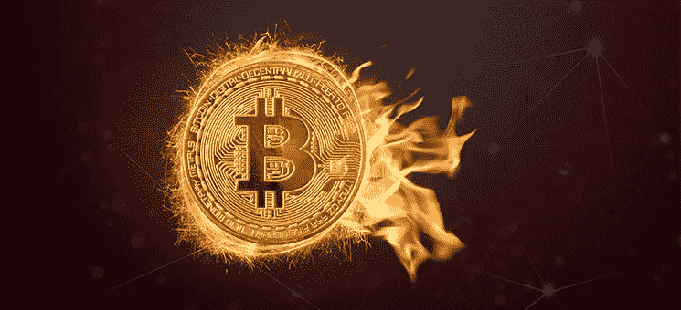

# 什么是硬币燃烧，硬币燃烧是如何工作的？

> 原文：<https://medium.com/coinmonks/what-is-a-coin-burn-and-how-does-coin-burning-work-c30131f5c4e3?source=collection_archive---------2----------------------->

术语“硬币燃烧”描述的是硬币从流通硬币库存中永久消失。因此，这种方法确保了市场上总供应量的永久减少。基本上，硬币燃烧是几乎所有加密货币都固有的程序，旨在抵消价值的下降。

# 硬币燃烧介绍