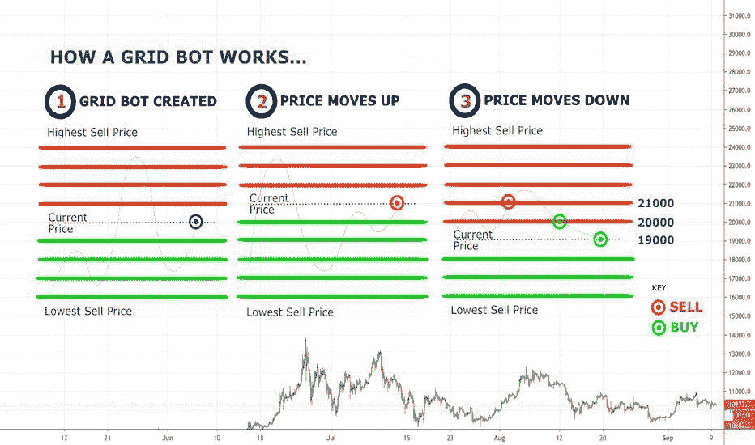
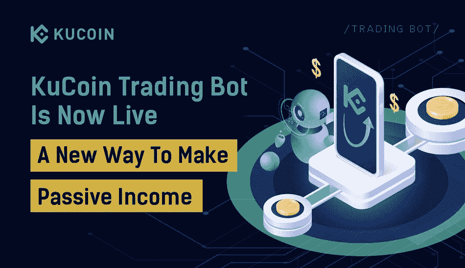
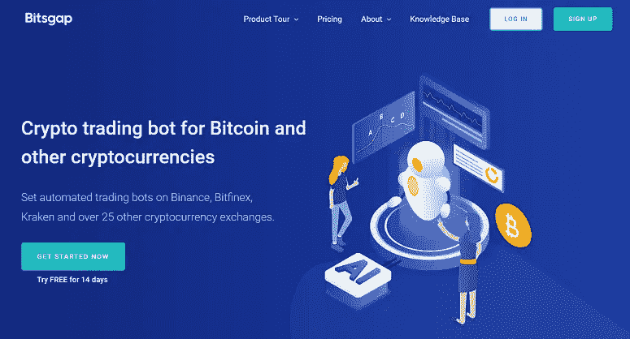
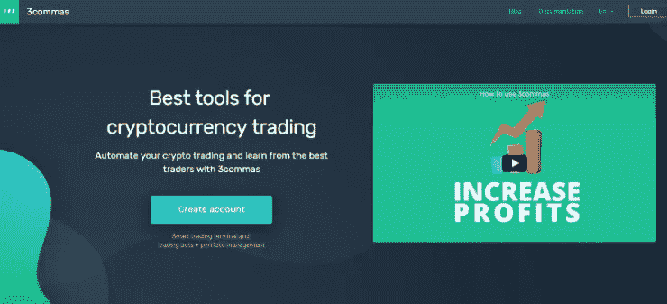
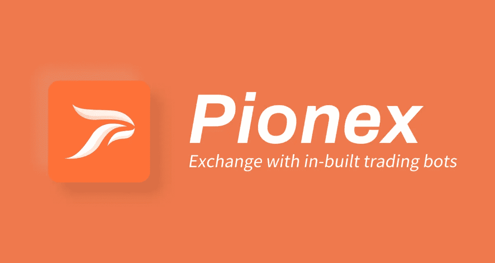
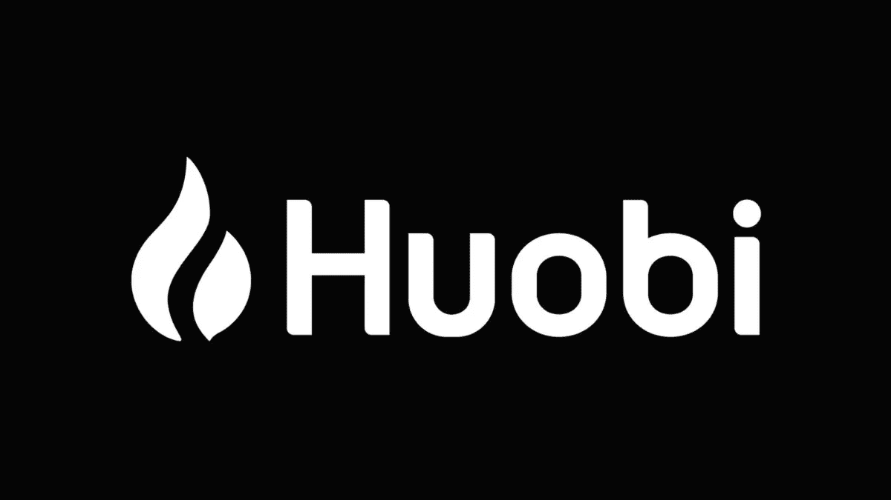

# 什么是网格交易机器人——2023 年 6 个最佳加密网格机器人

> 原文：<https://medium.com/coinmonks/what-is-a-grid-trading-bot-3b58f3ec059b?source=collection_archive---------0----------------------->

Photo by [Austin Distel](https://unsplash.com/@austindistel?utm_source=medium&utm_medium=referral) on [Unsplash](https://unsplash.com?utm_source=medium&utm_medium=referral)

# 什么是电网交易 Bot？

[**网格交易机器人**](https://coincodecap.com/grid-trading) 是一个协助你执行网格交易策略的交易机器人。

它使您能够在给定的价格范围内下达一系列买卖订单。当一个销售订单被完全执行时，机器人立即在较低的网格级别下另一个采购订单，反之亦然。

# 什么是网格交易？

[网格交易](https://coincodecap.com/grid-trading)是一种交易方法，包括围绕固定价格以预定的时间间隔发出一系列买卖订单。它以这种方式开发了一个商业网格。

网格交易在价格有规律变化的竞争性市场中最有效。它通过自动执行低采购订单导致高销售订单，消除了市场预测的需要，确保了横向价格变动期间每次销售价格超过采购价格时的盈利能力。

必须考虑多种因素来提高电网交易收益。如果我告诉你，有一种方法可以让你从这种波动中获利，会怎么样？如果你能自动完成交易，然后坐下来看着你的收入定期滚滚而来，会怎么样？

例如，一对频繁大幅波动但长期平均价格相当稳定的货币几乎肯定是网格交易的强有力选择。说完这些，让我们来看一下要点。

> ***免责声明*** *:在这篇文章中，我使用了引用链接。如果你使用推荐链接，大多数这些服务会给你额外的折扣。*

# 使用网格交易机器人的 5 个好处

**1。值得信赖的加密交易策略**
网格交易已经存在很长时间了，是一种成熟的、经过充分测试的、有利可图的交易方式。几十年来，一些成功的交易者在各种市场上都使用了它。特别是加密业务，由于其极端的波动性，已经被证明是网格交易方法最值得信赖的场所之一。

**2。可用性**
该策略易于理解和使用，因为它不包含复杂的计算、测量或市场指标。对于过去没有密码交易市场专业知识的实体来说，建立起来会很简单。

**3。适应性**
网格交易应用了最根本的交易理念(低买高卖，赚取差价)。因此，它可以应用于几乎任何市场，并有效地产生利润，独立于趋势或市场行为。

您可以通过选择价格范围和网格数量来主动确定策略的频率和周期。

可以在短期内建立网格，每小时进行数百笔交易，从一天中所有微小的变化中获取微利；也可以在长期内建立网格，选择一个大的范围，让它运行几个月，从每次较大的趋势变化中获取利润。

**4。增强风险管理**
选择你的网格策略的自由让你比大多数其他类型的交易更积极地控制风险/回报水平。你可以使用网格机器人以几乎没有风险的方式产生持续的适度利润(例如，通过选择像 BUSD/USDT 这样稳定的硬币对)，或者你可以冒更大的风险获得潜在的巨额回报(例如，使用具有高波动性的低市值硬币)

**5。自动化交易**
[网格交易](/coinmonks/grid-trading-cf4bba9b3fe5)对自动化特别开放，因为它的逻辑显而易见，而且它的所有行为都是预先定义的，与市场行为无关。不仅如此，通过交易机器人使用网格交易比试图通过手动交易遵循策略要容易得多，也更有效率。

这是交易者开始走向自动化的最好方法之一，因为它可以在任何市场、任何条件下 24/7 运行，并且可以设置任何时间范围。

> ***购买比特币&其他加密货币***
> 
> *在* [***报名***](https://bit.ly/3hlbBJb)*[***cex . io***](https://bit.ly/3vWdVKI)*[***FTX***](https://bit.ly/3eYG3Y6)*&[***比特币基地***](https://bit.ly/3fdPEcv) *购买比特币****

# *在运行网格机器人之前您应该知道的关键事情*

**

*Photo by [MinuteKEY](https://unsplash.com/@minutekey?utm_source=medium&utm_medium=referral) on [Unsplash](https://unsplash.com?utm_source=medium&utm_medium=referral)*

*费用是一个重要的考虑因素，因为它们会不断影响你的交易结果。成本最低的交易所，提供定期的零成本交易，或给予你作为做市商可能获得的费用退款，对你的电网交易有重大影响。*

*找到你能找到的最好的对子和市场环境，学习如何阅读市场，浏览图表，获得你需要寻找的感觉。*

*寻找横盘或小幅上涨的图表，但确保你没有观察到任何长期低迷的迹象。*

*寻找一双已经经历了频繁和显著的价格波动，但也不会很快退出你的价格范围的鞋。*

# *6 款最佳加密网格交易机器人*

## ***1。** [**库币**](https://bit.ly/3uJeZ4r)*

**

*[**Kucoin**](https://bit.ly/3uJeZ4r) 是一家成立于 2017 年 8 月的中国加密货币交易所。它提供了一个很好的贸易配对列表。在过去的 24 小时内，它在 432 个市场进行交易，交易总额为 2500 万美元。它还提供了一个复杂的 API，使用户能够创建一个安全和自动化的交易策略。*

***费用:**做市商和收单商 0.1%的交易费用。*

***价格:**交易机器人不需要订阅费。*

## ***2。** [**Bitsgap**](https://bit.ly/2SNjTiX)*

**

*[**Bitsgap**](https://bit.ly/2SNjTiX) 是顶级比特币交易机器人之一，可以让你轻松管理你的加密资产。这个工具可以评估超过 10，000 个加密货币对，并选择最有潜力的硬币。它允许你只需点击几下鼠标就能构建你的机器人策略。*

***价格:**初级许可的价格计划从 [**开始，每月**](https://bit.ly/2SNjTiX)19 美元，专业许可的价格计划从 [**开始，每月**](https://bit.ly/2SNjTiX)110 美元。在这里开始你的免费试用**。***

## ***3.[3 条消息](https://bit.ly/3w6LV7z)***

******

***[**3Commas**](https://bit.ly/3w6LV7z) 是最伟大的[加密交易机器人](/coinmonks/cryptocurrency-trading-bots-an-extensive-guide-130a6830394b)之一，让你在增加收益的同时减少损失和危险。这个平台让你事半功倍。它允许你建立一个基于 20 多个交易指标的策略。***

*****价格:**初级版许可的价格计划从**14.5 美元/月开始，专业版许可的价格计划从[**49.5 美元/月**](https://bit.ly/3w6LV7z) 开始。从这里开始你的免费试用**。*******

## *********4。** [**Pionex**](https://www.pionex.com/en-US/sign/ref/vhNZnG2c)*******

**************

*******[**Pionex**](https://www.pionex.com/en-US/sign/ref/vhNZnG2c) 是世界上第一个交易所，提供 12 个免费交易机器人。用户可以一周七天、一天 24 小时自动交易，而不必查看市场。它是币安最大的经纪商之一，从币安和火币环球汇集流动性。*******

*******费用:**做市商和收单商 0.05%的交易费用。*****

*******价格:**交易机器人不需要订阅费。*****

## *******5。** [**火币全局**](https://www.huobi.com/en-us/topic/invited/?invite_code=cph82223)*****

**********

*****[**火币**](https://www.huobi.com/en-us/topic/invited/?invite_code=cph82223) 是位于亚洲的主要加密货币交易所之一，为亚洲客户服务，自 2013 年开始营业。Huobi Worldwide 是其全球加密交易所，为加密货币交易提供了一个有吸引力的平台——广泛支持众多替代币和大量稳定币，以及自己的创新——美元支持的稳定币 HUSD——刚刚经历了一些品牌变化。*****

*******费用:**接受者和制造者各 0.20%。*****

*******价格:**交易机器人不需要订阅费。*****

## *****6.[奥特拉迪](https://blog.coincodecap.com/go/altrady)*****

**********

*****Altrady 独特的自动化加密交易工具每天都有成千上万的交易者使用，通过自动化交易来实现回报最大化。该公司提供几种类型的机器人，包括网格和信号机器人，为有经验的交易者提供了一种简单的方法，让他们在没有任何知识或技能的情况下，在快节奏的市场中占据优势。*****

*******具有上下拖动功能的 Altrady 网格机器人*******

*****对于想要利用市场涨跌趋势的交易者来说，Altrady 网格机器人是一个完美的工具。有了它，你可以指定价格上限和下限，这样你的交易将永远是安全的，即使有一个巨大的波动！你还可以止盈止损，这使得交易比以往任何时候都容易。*****

*******具有 TradingView Webhook 的备用信号机器人或基于加密的扫描仪信号*******

*****信号机器人是以最小的努力参与行动的好方法。只需配置您的进入和退出设置，然后让这个机器人为您做所有的工作！*****

*****为了使用带有自定义信号的信号机器人，您必须配置带有 webhook 的信号机器人*****

*******Altrady 为每种类型的加密交易提供完整的工具集:*******

*   *****在多个交易所和交易所账户进行交易*****
*   *****单个交易所的多个账户*****
*   *****实时盈亏平衡计算*****
*   *****离线价格和订单提醒*****
*   *****图表上的可视交易反馈*****
*   *****独特的集成市场扫描仪*****
*   *****交易自动化，带止盈和止损*****
*   *****带有 tradingview webhook 或基于加密的扫描器信号的信号机器人*****
*   *****上下拖动的网格机器人*****
*   *****具有子账户的投资组合管理*****
*   *****交易分析*****

*****值得一提的是，他们正在不断改进他们的功能集，在 2022 年第 3-4 季度的简短路线图中，他们将添加:*****

*   *****新的移动应用*****
*   *****具有外部钱包支持的投资组合*****
*   *****Dex 集成*****
*   *****票据交易*****

*******定价-** Altrady 定价提供三个订购级别，基本、基本&高级。您还可以选择 ***14 天免费加密交易订阅。********

## *******电网交易机器人会出什么问题？*******

*******场景 1 :** 如果价格超过你的承受范围，电网机器人就会卖掉所有头寸&你将无法从价格上涨中获益。在这种情况下，最好是买入并持有。*****

*******场景 2 :** 如果价格跌破你的区间，它会用所有的资金去买硬币&会因为价格跌破你的区间而产生亏损。在这种情况下，即使是世界上最好的网格机器人也不会轻易盈利。*****

## *****网格交易机器人的最佳策略？*****

*****根据 [KuCoin 的文章](/kucoinexchange/kucoin-trading-bot-is-coming-how-to-make-passive-income-with-it-ba5d62fbba48)，*****

> *****实际上，电网交易的利润由两部分组成:电网利润和浮动回报。电网利润总是正的，因为这是低买高卖的回报。这部分也是我们执行电网交易时的主要收入来源。浮动回报可能是正的，也可能是负的，因为它是由所选代币的价格变化决定的。如果你相信代币价格在长周期中会逐渐上涨，那么浮动回报也将为正。这也告诉我们，选择一种价格最近可能下跌的代币进行电网交易并不明智。*****
> 
> *****由于所有电网交易商都更加关注电网利润，以下是增加这部分收入的一些方法:*****
> 
> *****合理的起始价格:你最好在一个相对较低的价格进入市场，因为令牌价格的下降将导致浮动损失。*****
> 
> *****合理的价格范围:如果价格范围太大，你的资金将不会得到有效利用，而当价格范围太小时，即使很小的价格波动也可以驱动 bot 离开该范围。*****
> 
> *****合理的网格数:当网格过紧时，单个网格中的利润会相当低，勉强覆盖最坏情况下的交易费用；但如果定得太宽，资金就不能得到充分利用。*****
> 
> *****因此，总而言之，智能电网交易商将根据历史波动性、自有资金和交易成本，建立一个合理的电网，使资金利用率最大化。*****

## *******结论*******

*****网格交易不受人类情绪影响，完全由代码决定。网格交易通过了解市场动态，以递增和递减的价格创建订单，从市场波动中获利。个人投资者将因此从市场价格差异中获利。*****

> *******购买比特币&其他加密货币 *******
> 
> ******在* [***报名币安***](https://bit.ly/3hlbBJb)*[***cex . io***](https://bit.ly/3vWdVKI)*[***FTX***](https://bit.ly/3eYG3Y6)*&[***比特币基地***](https://bit.ly/3fdPEcv) *购买比特币&*********

********亦作阅读，*** [***加密货币交易机器人:广泛指南***](/coinmonks/cryptocurrency-trading-bots-an-extensive-guide-130a6830394b)*****

********披露—关联链接包括********

## *****也阅读*****

*   *****[Pionex 评论](/coinmonks/pionex-review-exchange-with-crypto-trading-bot-1e459d0191ea)*****
*   *****[Bitsgap 审查](/coinmonks/bitsgap-review-a-crypto-trading-bot-that-makes-easy-money-a5d88a336df2)*****
*   *****[库币点评](/coinmonks/kucoin-review-bb5e3071f0e)*****
*   *****[3 商业评论](https://blog.coincodecap.com/3commas-review-an-excellent-crypto-trading-bot)*****
*   *****[复制交易](/coinmonks/top-10-crypto-copy-trading-platforms-for-beginners-d0c37c7d698c) | [加密税务软件](/coinmonks/crypto-tax-software-ed4b4810e338)*****
*   *****[密码电报信号](http://Top 4 Telegram Channels for Crypto Traders) | [密码交易机器人](/coinmonks/crypto-trading-bot-c2ffce8acb2a)*****

***** [## 每当阿克谢·沙阿发表文章时，就收到一封电子邮件。

### 每当阿克谢·沙阿发表文章时，就收到一封电子邮件。注册后，如果您还没有，您将创建一个中型帐户…

medium.com](/subscribe/@akki11042011)*****