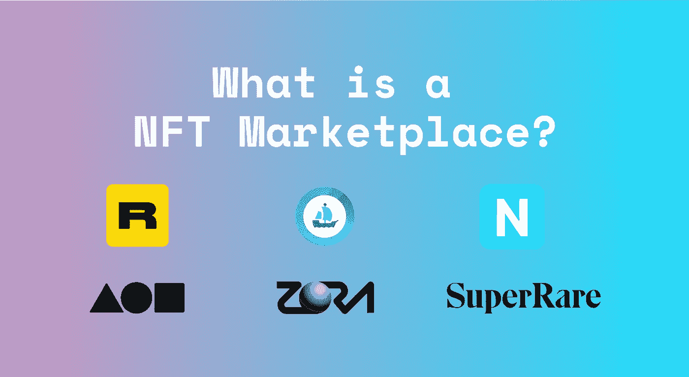

# 什么是 NFT 市场(OpenSea、仿植物怪兽佐拉、Rarible、Foundation、SuperRare & Nifty Gateway)？

> 原文：<https://medium.com/coinmonks/what-is-a-nft-marketplace-opensea-zora-rarible-foundation-superrare-nifty-gateway-c575987c61bd?source=collection_archive---------1----------------------->

不可替代的代币(NFT)一直在上升，最近一次拍卖是在毕普的 6900 万美元的佳士得艺术品拍卖会上。“数字艺术”的高转售获得了很大的兴趣，并引发了人们的好奇心。

NFT 变得很有趣，因为它们与禁忌词“密码”没有联系。它呼吁…