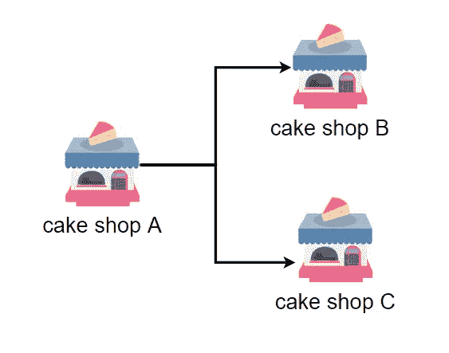
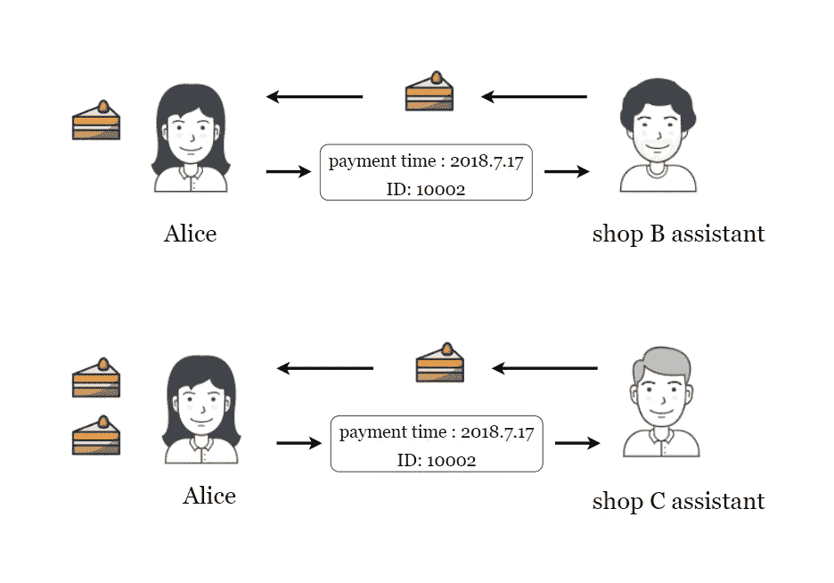

# 什么是重放攻击？

> 原文：<https://medium.com/coinmonks/what-is-a-replay-attack-b0e2c3b1dec4?source=collection_archive---------10----------------------->

重播也叫重放和回放。也就是说，消息或数据被重新发送给接收者一次，并且接收者接受该消息或数据。当这个动作建立时，接收者不能是有效的。确定数据已被接收，这将是一个重放漏洞。

重放攻击主要是在分叉链被分叉后，因为分离后的双方也共享分离前的信息，所以分离后双方可以做同样的交易。比如有一家蛋糕店 A 但是因为理念不同分成了蛋糕店 B 和蛋糕店 C。分离后，两家公司拥有相同的客户信息和交易信息，系统使用相同的验证支付报文系统。操作客户和交易彼此不交换信息。

现在爱丽丝把付款信息拿给了蛋糕店 B 的服务员，蛋糕店 C 的服务员用电脑确认了信息，把蛋糕给了爱丽丝。拿到爱丽丝，拿着同样的付款信息给蛋糕店 C 的服务员后，蛋糕店 C 的服务员用电脑确认了信息，然后把蛋糕给了爱丽丝，于是爱丽丝拿到了两块蛋糕。如果蛋糕店 B 和蛋糕店 C 通过确认支付消息就可以有，就不会有重放漏洞，不会有漏洞，不会有被攻击的机会，也不会有蛋糕丢失。

在区块链分叉后，你可以进行重放攻击。以比特币(BTC)和比特互联(BCC)为例。BCC 是从 BTC 分叉出来的，但是两者在所有基本功能上都是一样的。事实也是如此，只是 BCC 比 BTC 增加了块大小。此时，爱丽丝从 b 处购买了 10BTC，爱丽丝将交易消息交给 BTC 矿工以获得 10BTC，但爱丽丝将交易消息复制给 BCC 矿工，以便矿工在验证签名后将其放入 BTC。在密件抄送中，爱丽丝会得到 10BTC 和 10BCC。

# 案例研究:以太坊重放攻击

重放攻击最好的情况是以太坊硬分叉的时候。以太坊硬叉子出现 ETH 和 ETC 两条链。两个链上的交易数据结构完全相同，所以一个交易在 ETH 上有效，那么在 ETC 上就会被接受，反之亦然。。因为当时大家都认为 ETC 不会再存在了，所以在分叉之前没有人意识到两个链会造成相互重放的问题。后来很多矿工继续维护 ETC 链，发现 ETH 链上的事务继续重放 ETC 链，依然有效。

以太坊分叉的时候几乎所有交易所都没有发现这个问题。这时候只要有人从兑换处提取 ETH 币，就有可能获得等量的 ETC 币。许多人利用这一漏洞在交易所不断收取和提取硬币(ETH ),以获得额外的 ETC。云币，BTC e 等交易所表示，他们被重播，被骗走了几乎所有的 etc。