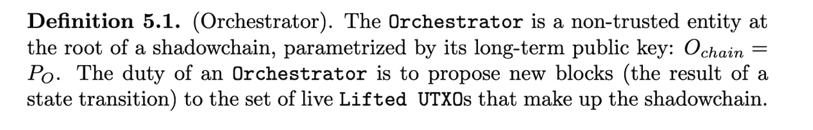
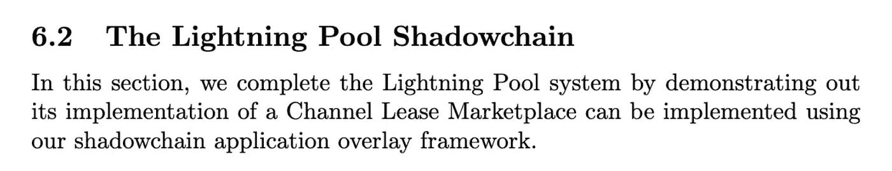
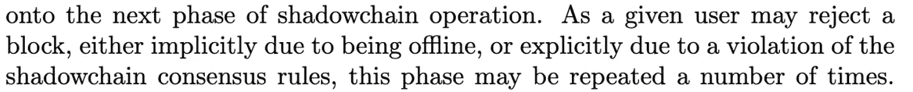
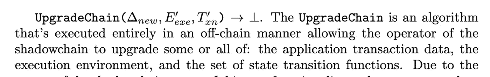

# 什么是暗影锁链？

> 原文：<https://medium.com/coinmonks/what-is-a-shadowchain-d24e2912a935?source=collection_archive---------2----------------------->

Are your bitcoins locked for ever in the shade?

最近发表的一篇论文描述了闪电池的概念[https://github . com/lightning labs/pool-paper/blob/main/liquidity . pdf](https://github.com/lightninglabs/pool-paper/blob/main/liquidity.pdf)

在本文中，介绍了用于构建该技术的 shadowchain，但根据作者的说法，它可以用作通用的链外智能合同执行。这篇文章旨在用通俗易懂的语言解释它的内容。

# 为什么是闪电池？

在目前扩大比特币规模的过程中，有两个主要活动正在得到改进，以使它们更安全，减轻区块链的负担:**支付**和**交易**。这两个用例在技术上不可能在链上发生。Lightning Network (LN)已被用于支付，但作为交易平台表现不佳。进入闪电池(LP)。有趣的是，作者将 LP 描述为一个市场驱动的平台，为 LN 提供流动性，但我将简化并提出一个交换的概念，因为本文不是关于解释 LP 的。

# LP 的机制

基本上，这个概念是提供一个平台，人们可以在一个 2–2 多签名 HTLC 上存放一些比特币。该平台将这些锁定的交易视为输入(“提升的 UTXOs”)，这些输入被吸收到使用比特币脚本编写的智能合同中。由于这种智能合约正在管理与用户交互的池，它将产生新的输出，这些输出将在某个时候作为比特币交易在链上发布，以解锁结算交易所的比特币。

为了与 LP 交互，用户向 LP 平台广播内部事务。此外，在“信任，不验证”的世界中，用户是共享智能契约状态的 LP 平台的节点。

然而，由于所有这些用户和反对者，很难就智能合同的状态达成一致。这将是有趣的东西，使国家同质 et 简单比较。你预见到了吗？

**进入影(块)链。**

# 阴影链，管弦乐队

我们都知道，区块链不足以确保智能合同的运作，自从中本聪会议以来，我们知道我们还需要一个共识和一个有激励作用的有价值的象征。但与此相反，作者们正朝着一种更集中的方式努力，用一个指挥者。

简而言之，orchestrator 是被提议的签名块之一。在我看来，“不可信实体”是误导。它事实上是可信的，除非背后有共识，但这在论文中没有描述。目前，实际的实现是一个可信的 orchestrator。不幸的是，没有更多的话要说——根据 2020 年 11 月 17 日——位于这里的源代码[https://github.com/lightninglabs/pool](https://github.com/lightninglabs/pool)还没有包含 shadowchain 实现。

Does it means you don’t need a blockchain for that?

# 验证机制

在影子链中创建和验证新块的方法如下:

*   **proposed block**:Orchestrator 向那些被要求“接受”块的事务的作者(用户)提议一个包含事务的新块，没有说太多，但猜测 Orchestrator 基本上是在接收签名。但是，没有太多关于块如何传播的描述:

*   **CommitBlock** :一旦区块被接受，它就被‘执行’，即编排者将区块内容压缩成一个比特币交易，解锁被解除的 UTXOs。稍后将详细介绍挤压机制。一旦脚本编写完成，它将被发送给链上的比特币所有者(记住一组 2–2 多重签名 HTLC)。然而，该交易不会发送到比特币。与 LN 类似，除非有争议或关闭通道，否则保留交易。
*   **直通**:挤压的方式可以将几个 shadowchain 块挤压成一个单独的比特币交易。
*   **链升级**:更新管理 LP 的池脚本的机制。这使得 LP 的集中方面更加清晰，因为升级是分布式的，并且不涉及共识。

This is what I call a fork

# 挤压阴影块

现在是重要和有趣的部分。shadowchain 中智能合约架构的一个特性是可以将区块压缩到一个比特币交易中。我相信这不是默认的任何脚本，最困难的部分将是能够编写兼容 **squashing 的** smartcontracts。

幸运的是，我们有一个例子，因为 LP 是实现 Shadowchain 的一个例子。如果我们查看白皮书中关于 LP 部分的描述，我们会了解到**批处理关键参数**或 **batchId** 的概念。这基本上是椭圆曲线上的加密操作(非常类似于 [BIP32](https://github.com/bitcoin/bips/blob/master/bip-0032.mediawiki) 中描述的推导路径是 HDwallets)。每次进行新的交易时，batchId 都会以与派生路径类似的方式递增。但是有了差异，就很容易计算从一个 batchId 到另一个 batch id(函数 incrementKey 和 decrementKey)。这里的要点是能够知道执行操作的顺序并标记脚本的状态。这样，知道了 batchId 和脚本的状态，我们就知道要应用什么事务，而不需要知道历史记录，甚至是之前发生的事务数量(增加了隐私)。

因此，挤压块基本上能够通过重放历史中的交易来防止双重花费。这显然在应该是双重花费证明的 shadowchain 脚本上提出了安全问题。在我看来，batchId 概念是一种非常有趣的方法，可以确定性地创建一个防止欺诈的随机数，而不会泄露太多的历史信息。

# 你需要一条暗影锁链吗？

有趣的是，本文将 LP 和影子链这两个概念分开，然后在最后一章描述了 LP **如何可以被实现为影子链。**

除此之外，shadowchain 中的一些概念显然没有很好地解决去中心化的问题，尤其是不可信的协调器。在 LP 实施提案中，编排者是拍卖者，在我看来，拍卖者是一个值得信赖的第三方。

另一方面，比特币是以非托管的方式使用的，即每次修改比特币的状态时，Orchestrator 都需要收集您的签名，您可以通过运行 Orchestrator 分发的(受信任的)智能合同来提供签名，Orchestrator 可能会决定升级签名。不要相信，验证！

# 结论

shadowchain 是一个区块链，它能够与智能合同的所有者迭代升级您的 2–2 多签名 HTLC。由于智能合约提供“历史性双重消费”保护的必要属性，您的智能合约的状态会定期以块的形式被清除，然后被压缩到比特币交易中。最终，最后一个被压扁的交易在双方签字后在比特币上提交，关闭了通道。

## 另外，阅读

*   什么是[闪贷](https://blog.coincodecap.com/what-are-flash-loans-on-ethereum)？
*   最好的[密码交易机器人](/coinmonks/crypto-trading-bot-c2ffce8acb2a)
*   [3 商业评论](/coinmonks/3commas-review-an-excellent-crypto-trading-bot-2020-1313a58bec92) | [Pionex 评论](/coinmonks/pionex-review-exchange-with-crypto-trading-bot-1e459d0191ea) | [Coinrule 评论](https://blog.coincodecap.com/coinrule-review-a-perfect-trading-bot)
*   [AAX 交易所评论](/coinmonks/aax-exchange-review-2021-67c5ea09330c) | [德里比特评论](/coinmonks/deribit-review-options-fees-apis-and-testnet-2ca16c4bbdb2) | [FTX 密码交易所评论](/coinmonks/ftx-crypto-exchange-review-53664ac1198f)
*   [n 零审核](/coinmonks/ngrave-zero-review-c465cf8307fc)
*   [Bybit Exchange 审查](/coinmonks/bybit-exchange-review-dbd570019b71) | [Bityard 审查](https://blog.coincodecap.com/bityard-reivew)
*   3Commas vs Cryptohopper
*   最好的比特币[硬件钱包](/coinmonks/the-best-cryptocurrency-hardware-wallets-of-2020-e28b1c124069?source=friends_link&sk=324dd9ff8556ab578d71e7ad7658ad7c)
*   [总账 vs 平均](https://blog.coincodecap.com/ngrave-vs-ledger)
*   [密码本交易平台](/coinmonks/top-10-crypto-copy-trading-platforms-for-beginners-d0c37c7d698c)
*   [莱杰纳米 s vs x](https://blog.coincodecap.com/ledger-nano-s-vs-x)
*   [Vauld Review](https://blog.coincodecap.com/vauld-review)|[you hodler Review](/coinmonks/youhodler-4-easy-ways-to-make-money-98969b9689f2)
*   最好的[加密税务软件](/coinmonks/best-crypto-tax-tool-for-my-money-72d4b430816b) | [硬币追踪评论](/coinmonks/cointracking-review-a-reliable-cryptocurrency-tax-software-5114e3eb5737)
*   最佳[加密借贷平台](/coinmonks/top-5-crypto-lending-platforms-in-2020-that-you-need-to-know-a1b675cec3fa)
*   [莱杰 Nano S vs Trezor one vs Trezor T vs 莱杰 Nano X](https://blog.coincodecap.com/ledger-nano-s-vs-trezor-one-ledger-nano-x-trezor-t)
*   [block fi vs Celsius](/coinmonks/blockfi-vs-celsius-vs-hodlnaut-8a1cc8c26630)vs Hodlnaut
*   [Bitsgap 审核](/coinmonks/bitsgap-review-a-crypto-trading-bot-that-makes-easy-money-a5d88a336df2) | [Quadency 审核](/coinmonks/quadency-review-a-crypto-trading-automation-platform-3068eaa374e1)
*   [埃利帕尔泰坦评论](/coinmonks/ellipal-titan-review-85e9071dd029) | [赛克斯斯通评论](https://blog.coincodecap.com/secux-stone-hardware-wallet-review)
*   [BlockFi 评论](/coinmonks/blockfi-review-53096053c097) |在您的密码中赚取高达 8.6%的利息
*   [DEX Explorer](https://explorer.bitquery.io/ethereum/dex) 和[区块链 API](https://explorer.bitquery.io/graphql)
*   [加密套利](/coinmonks/crypto-arbitrage-guide-how-to-make-money-as-a-beginner-62bfe5c868f6)指南:新手如何赚钱
*   最佳[加密制图工具](/coinmonks/what-are-the-best-charting-platforms-for-cryptocurrency-trading-85aade584d80)
*   了解比特币的[最佳书籍有哪些？](/coinmonks/what-are-the-best-books-to-learn-bitcoin-409aeb9aff4b)

> [直接在您的收件箱中获得最佳软件交易](/coinmonks/newsletters/coinmonks)

