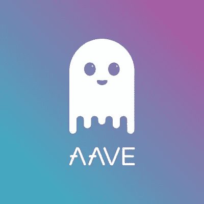

# 什么是 Aave，我为什么要关心它？

> 原文：<https://medium.com/coinmonks/what-is-aave-and-why-should-i-care-784995a0b81f?source=collection_archive---------0----------------------->

Aave 是一个分散的借贷系统。Aave 从竞争对手(MakerDAO、Compound 等)中脱颖而出..)由于闪贷和利率稳定。

Image Credit to [the Aave Team](https://aave.com/)

[DeFi](https://blog.coincodecap.com/the-ultimate-guide-to-defi-decentralized-finance) 的受欢迎程度持续爆炸，Aave 推动了这种增长，最近从本周开始在整个 DeFi 市场上占据了[第二的位置](https://defipulse.com/)。更具体地说，这意味着现在，领先的项目在 34.6 亿美元的市场价值中占有超过 25 亿美元。

因此，了解了 Maker、Aave 和 Compound 的来龙去脉，就能在很大程度上了解 DeFi 的发展方向。因为我在以前的帖子中讨论过另外两个，这里的[这里的](/@leviness.ian/what-is-compound-and-how-does-borrowing-on-it-work-95098fbbabf9)和这里的[这里的](/coinmonks/why-defi-lending-improves-global-lending-d1046158af20)，所以现在轮到 Aave 在显微镜下观察了。

# 什么是 Aave，它来自哪里？

Aave 最初是一个名为 EthLend 的项目，[于 2017 年](https://www.coinlore.com/coin/ethlend)推出，目的是在区块链以太坊引入[免费](https://kryptomoney.com/ethlend-cryptocurrency/#:~:text=ETHLend%20is%20an%20Ethereum%20Blockchain,the%20process%2Dheavy%20lending%20drill.)借贷。2019 年，项目团队决定[转向成为 Aave](https://www.p2pfinancenews.co.uk/2020/01/22/ethlend-winds-down-loanbook-in-favour-of-aave-flash-loans/) ，这是在 Aave 协议推出之后。

总而言之，这种转变的关键原因似乎是在他们的整个系统中引入了“[快速贷款](https://blog.coincodecap.com/what-are-flash-loans-on-ethereum)”即必须在同一批被购买的资产中偿还、完全不需要抵押品的贷款。

# Aave 为什么有用？:快速贷款和稳定利率

对于那些刚接触加密货币的人来说，快速贷款的第一个特点肯定需要更多的解释。如果你知道以太坊网络，那么你就会知道每 13 秒就会有块被添加到它的区块链[中。由于 Aave 依赖于](https://etherscan.io/chart/blocktime)[一个以太坊 DApp](https://app.aave.com/) ，它的协议存在于其中，那么这一次也适用于它的闪贷。

听到这些，你可能会认为快速贷款是不可能使用的，因为仅仅几秒钟就可以解决它们。

在与 Aave 的团队成员之一[马克·泽勒](/@pierarte)交谈后，我发现还有另外一种更好的方式来理解闪贷。

不要试图想象一笔贷款在 13 秒内被购买和使用，而是想象一笔贷款的购买和使用只发生在一次交易中。

## 谁需要闪贷？

如果快速贷款让你抓耳挠腮，不要担心。

而是考虑交易算法或者交易机器人。如果你对这些都不熟悉，想象一下一个电脑程序，它能让你在一瞬间完成一系列的交易动作。考虑到这一点，[快速贷款](https://blog.coincodecap.com/what-are-flash-loans-on-ethereum)最明显的用例是针对高频交易者或那些拥有这种机器人/算法的人，这些机器人/算法可以可靠地购买贷款，使用贷款进行交易并偿还贷款，所有这些都在一次交易中完成。

还存在其他的用例，我希望以后能讨论这些用例。

尽管如此，现在需要指出的是，考虑到普通的加密用户，很难想出他们为什么会觉得有必要进行快速贷款的原因。从表面上看，据说 Aave 更多的是为有技术倾向的人设计的，这从项目的历史上看是有意义的。

随着时间的推移，随着我的研究继续进行，我计划进一步研究闪贷，并在这里报告我的发现，但现在，我认为它们对需要在不同加密货币头寸之间快速移动的敏捷交易者极其有用。

# 快速贷款是 Aave 提供的唯一贷款类型吗？

号码

像所有分散的贷款系统(制造商，复合等..)，Aave 也提供超额抵押贷款，你可能还记得我在 Maker 上的上一篇文章[。一般来说，超额抵押贷款是一种你必须存入比你取出更多的资金。在 Maker 的情况下，这通常是你想要的贷款金额的](/coinmonks/why-defi-lending-improves-global-lending-d1046158af20) [150%](https://defipulse.com/maker) ，而在 Aave 的情况下，它会根据你想要的贷款计价的特定加密货币而变化。

Aave 使用一种称为 LTV(贷款价值比)的指标来确定每一种情况。一般来说，这个比率和我上面提到的制造商的比率是一样的。例如，如果您想在戴贷款，目前的 LTV 是 75%，这意味着您的贷款只能高达您预先存放的抵押品的 [75%](https://app.aave.com/reserve-overview/DAI-0x6b175474e89094c44da98b954eedeac495271d0f0x24a42fd28c976a61df5d00d0599c34c4f90748c8) 。在这里，重要的是要注意，抵押品是用以太来衡量的，你可以在本页看到[。](https://app.aave.com/reserve-overview/DAI-0x6b175474e89094c44da98b954eedeac495271d0f0x24a42fd28c976a61df5d00d0599c34c4f90748c8)

目前，大约有 1300 万美元的贷款以这种速度贷出。

## 稳定的利率

正如我过去说过的，分散式贷款主导着 DeFi 领域，为什么不应该呢？这是任何人赚取被动收入并同时保护协议及其各自 DApp 的活动的一种方式。

一般来说，像 Aave 这样的系统就像区块链的货币市场账户或储蓄账户。你不必是一个借款人，但如果你将你的货币存入 Aave 的一个资金池，那么你就是一个贷款人，为你的麻烦赚取利息。

虽然从历史上看，大多数分散式贷款系统对借贷双方使用可变利率，这些利率根据社区投票和整体交易活动而变化，但 Aave 也提供稳定的利率。

这并不意味着这些利率永远不变，只是它们比历史上更流行的可变利率变化更少。要了解这是如何发生的，您可以在这里跟踪 Aave [借贷系统上的活动，而无需进行交易。](https://app.aave.com/home)

从基本意义上说，Aave 的稳定利率并不完全稳定。它们只是可变利率的一个更好的版本，在这个意义上，它们随着 Aave 贷款市场活动的起伏而波动较小。根据一份报告，当借款利率下降到低于存款利率时，Aave 的稳定利率可能会发生变化。

贷款人的所有利息都通过 [aTokens](https://www.coinbureau.com/review/aave-lend/) 支付，这是 Aave 的本地令牌，为贷款人和借款人提供存款利息。一旦任何一方参与到该系统中，他们可以将他们的 aTokens 送回，以换取他们的原始资金。

## 什么是$LEND token？

如果你读过任何关于 Aave 的东西，那么你很可能见过它的 LEND token。现在，所有贷款都是用来最小化借贷双方的交易费用。换句话说，你持有的越多，你的交易费用就越低。

# ave 的未来是什么？

Aave 团队将很快推出一个提案，说明如何将其原生$Lend 用作治理令牌。如果你不熟悉这个术语，就想象每一枚硬币代表一张选票，你就成功了。

这使得那些拥有游戏[皮肤的人(出借用户)可以通过提议改变和投票来直接决定他们所投资的系统的未来。随着 LEND 用法转变的细节发布，我希望在我的下一篇关于 Aave 的文章中报道它们。](/coinmonks/how-numerais-erasure-improves-freelancing-db3129c67f39)

在那之前，一如既往，如果你喜欢我的内容，请在这里告诉我或者在 Twitter 上告诉我。

最后，我的大部分空闲时间都被我的时事通讯占用了，这是完全免费的，关注的是元宇宙的崛起如何改善每个人的生活。[此处短接](https://www.getrevue.co/profile/blockdemiclab)。

*免责声明:我拥有非常少量的 Aave，是在审查项目后购买的。这些或我其他帖子中的任何信息都不是为了说服你购买特定的加密货币。在购买加密产品之前，一定要做好自己的研究。*

> [*在您的收件箱中直接获得最佳软件交易*](https://coincodecap.com/?utm_source=coinmonks)

