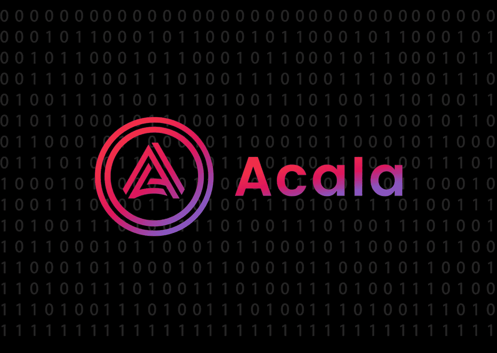

# 阿卡拉是什么？—对 DeFi 发电站的详细介绍

> 原文：<https://medium.com/coinmonks/what-is-acala-a-long-introduction-to-a-defi-powerhouse-f4d16dd54fe0?source=collection_archive---------3----------------------->

## 分散的稳定硬币、跨链转移、混合金融等等

去中心化融资在一年内增长了 88 %( T1 ),将 Maker、Compound、Uniswap 和 Aave 等平台的 TVL(锁定的总价值)从不到 10 亿美元增加到了 880 亿美元。鉴于这种增长水平，可以说…