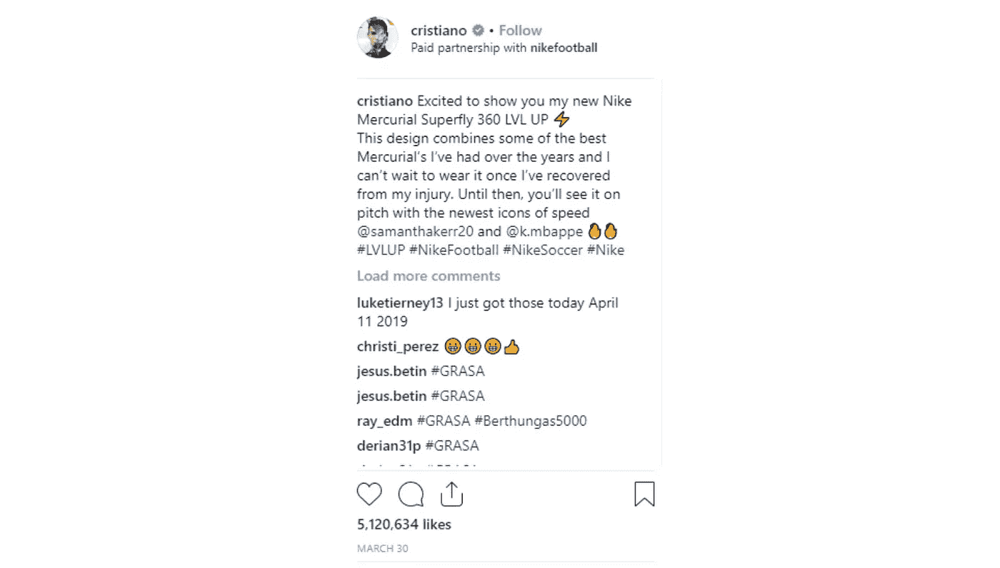

# 什么是 NFT？

> 原文：<https://medium.com/coinmonks/what-is-an-nft-simply-explained-8554402f70b4?source=collection_archive---------0----------------------->

pixabay

## NFT 又名不可替代的令牌

Source: slidebean.com

NFT 代表不可替换的代币，其中术语“不可替换”表示不可交换的，即完全唯一的，与例如 100 美元的钞票相反，100 美元的钞票是可替换的资产，因为任何人都可以将他们的 100 美元钞票兑换成另一张 100 美元钞票而不发行。然而，如果你碰巧有一张 100 美元的钞票有独特的特征，例如，它是由女王签署的，你不太可能去兑换它。有报道称，带有极其罕见序列号的 1 美元纸币被交易成了数千美元。

## 它们到底是如何工作的？

NFT 本质上是真实性的数字证书。它们被用来证明数字数据的所有权，或者将数字世界中的任何东西标记为你自己的。

考虑下面的例子:一件艺术品，比如一幅画。原画总是比复制品更有价值。如果你想买一幅安迪·沃霍尔的作品，只有你能证明它的真实性，你才会愿意支付溢价。通常，这将通过“真品证书”来完成这听起来很简单。

要对数字文件(如数字艺术品)执行同样的操作，并从副本中识别出原件，您需要利用 NFT 技术。在区块链上出现 NFT 技术之前，不可能鉴别数字“资产”。因为 NFT 的功能是作为一个数字证书的真实性，你可以很容易地验证它的合法性，同时也显示其以前的所有者和原作者的历史。通过这种方式，您可以检查数字艺术的真实性，并为创建 NFT 的数字艺术家支付额外费用。

Source: blog.indorse.io

非功能性测试以多种形式存在。它们可能是一张图片、一首歌、一部电影、一条推文，或者任何其他在线可用的东西。在智能合同区块链上，作者为这样的在线项目生成一个“令牌”。这个令牌将包括数字资产的信息，比如它的名称、符号和验证 NFT 合法性的唯一散列。然后可以交易代币。

## 它为什么有价值？

NFT 可以为任何独一无二且需要所有权证明的东西而创建，而不仅仅是数字艺术。除了可识别之外，NFT 还具有其他独特的特征，如不可分割、可交易、防欺诈、稀缺和可编程。NFT 创作者可以规定，每当 NFT 转手时，就要向他们支付版税。这意味着一个音乐家可以创作一首 NFT 的歌曲，每当这首歌被交易或交换时，他或她将自动得到一笔象征性的版税。

Source: instagram post

最终，你要为一个杰出艺术家或名人将他们的“创作”传给你的无可辩驳的证据支付额外费用。随着社交媒体上“blue ticks”的兴起，我们看到如今为数字赞助内容支付了类似的溢价。据《卫报》报道，罗纳尔多要求在 2021 年每个赞助帖子 160 万美元。实质上，巨额费用是因为赞助商“知道”账户背后实际上是罗纳尔多，以数字方式向全球观众宣传你的业务或产品，这些观众也“知道”他们正在关注罗纳尔多本人，而不是一个随机的粉丝账户。

## 今日 NFT 市场

现在有许多大的 NFT 市场和艺术家，而且更多的是定期出现。值得注意的例子包括:

***OpenSea***

世界上第一个也是最大的 NFTs 在线市场。它现在是购买、销售和交换 NFT 的主要市场。仅在 8 月份，OpenSea 就在以太坊上记录了 33 亿美元的数字商品交易量，是 7 月份销售额的十倍以上，增长非常显著。

***NBA 顶级投篮***

Source: coindesk.com

视频 NFT 市场，球迷可以交易官方许可的 NBA 时刻。这些是打包成 NFT 的视频片段，其中一些片段的售价为每段 100 万美元。NBA 球员可以通过这种销售的版税来赚钱。

*迈克·温克尔曼(Mike Winkelmann)是一位杰出的美国数字艺术家，英国佳士得拍卖行称他为“站在 NFTs 前沿的有远见的数字艺术家”。2021 年 3 月 12 日，他的图像拼贴画“Everydays”以 6940 万美元的价格售出，成为世界上在世艺术家中第四贵的艺术品。*

**

*Source: nftart.ch*

*一些 NFT 在美术馆或私人住宅中以数字方式展示，数字相框用于展示这些 NFT。一些人使用 NFT 的实物印刷，旁边有二维码，证明区块链的所有权。*

## *NFT 技术的其他应用*

*如前所述，NFT 技术正被应用于整个数字世界。例如，分散土地是一个虚拟世界(价值超过 70 亿美元)，用户可以在其中拥有数字土地，然后可以出售或用于广告。网络游戏中可以使用 NFT 来建立稀有数字物品的所有权，玩家可以在他们之间进行交易。在区块链或 NFTs 之外，游戏购买本身已经成为新闻。例如，一名游戏玩家为《反恐精英》系列中最强大的武器之一 AWP 支付了 61，000 美元购买了一件极其罕见的“皮肤”(模型)。这不是唯一的例子；粉丝们在像堡垒之夜这样的视频游戏中花了数千美元购买游戏内物品，那里的汇率是 3500 V-Bucks 兑换 79.99 美元。*

*耐克、可口可乐、NFL、迪斯尼，甚至麦当劳，以及众多的主要音乐公司，如环球，都加入了 NFT 音乐产业。*

## *没有诈骗？*

**

*Source: Brian Britigan for Reveal*

*尽管专家和顶级艺术科学家努力检测赝品，但全球赝品给奢侈品牌和艺术品经销商造成了数十亿美元的损失。有许多突出的事件，包括一位名为 Tatiana Khan 的艺术经销商出售她委托的价值 200 万美元的毕加索赝品。另一个突出的例子是 John Myatt，他完成了大约 200 件赝品，其中许多在著名的拍卖行出售，如飞利浦、苏富比和佳士得。他于 1995 年被苏格兰场逮捕，并承认伪造了马蒂斯、乔科梅蒂、布拉克、乔科梅蒂、勒·柯布西耶、莫奈和雷诺阿等画家的作品。*

*也许这是最终的反欺诈解决方案，因为 NFT 技术允许通过区块链追踪和认证任何数字资产，验证它是真的还是假的，没有成本，因为区块链上的数据永远不会被更改或销毁。*

**免责声明:本文包含的信息仅用于教育目的，并不构成 Wheatstones 的任何形式的建议或推荐，用户在做出(或避免做出)任何投资决定时也不打算依赖这些信息。**

> *加入 Coinmonks [电报频道](https://t.me/coincodecap)和 [Youtube 频道](https://www.youtube.com/c/coinmonks/videos)了解加密交易和投资*

## *另外，阅读*

*   *[A-Ads 审查](https://blog.coincodecap.com/a-ads-review) | [Bingbon 审查](https://blog.coincodecap.com/bingbon-review) | [Mudrex 投资](https://blog.coincodecap.com/mudrex-invest-review-the-best-way-to-invest-in-crypto)*
*   *[最佳卡达诺钱包](https://blog.coincodecap.com/best-cardano-wallets) | [Bingbon 副本交易](https://blog.coincodecap.com/bingbon-copy-trading)*
*   *[印度最佳 P2P 加密交易所](https://blog.coincodecap.com/p2p-crypto-exchanges-in-india) | [柴犬钱包](https://blog.coincodecap.com/baby-shiba-inu-wallets)*
*   *[八大加密附属计划](https://blog.coincodecap.com/crypto-affiliate-programs) | [eToro vs 比特币基地](https://blog.coincodecap.com/etoro-vs-coinbase)*
*   *[最佳以太坊钱包](https://blog.coincodecap.com/best-ethereum-wallets) | [电报上的加密货币机器人](https://blog.coincodecap.com/telegram-crypto-bots)*
*   *[交易杠杆代币的最佳交易所](https://blog.coincodecap.com/leveraged-token-exchanges)*
*   *[5 大最佳社交交易平台](https://blog.coincodecap.com/best-social-trading-platforms)|[NFT 瓦济克斯](https://blog.coincodecap.com/wazirx-nft-india)*
*   *[10 本关于加密的最佳书籍](https://blog.coincodecap.com/best-crypto-books) | [英国 5 个最佳加密机器人](https://blog.coincodecap.com/uk-trading-bots)*
*   *[ko only Review](https://blog.coincodecap.com/koinly-review)|[Binaryx Review](https://blog.coincodecap.com/binaryx-review)|[Hodlnaut vs CakeDefi](https://blog.coincodecap.com/hodlnaut-vs-cakedefi-vs-celsius)*
*   *[比斯勒评论](https://blog.coincodecap.com/bitsler-review)|[WazirX vs coin switch vs coin dcx](https://blog.coincodecap.com/wazirx-vs-coinswitch-vs-coindcx)*
*   *[7 大副本交易平台](https://blog.coincodecap.com/copy-trading-platforms) | [BuyCoins 点评](https://blog.coincodecap.com/buycoins-review)*
*   *《XT.COM 评论》的|*
*   *[SmithBot 评论](https://blog.coincodecap.com/smithbot-review) | [4 款最佳免费开源交易机器人](https://blog.coincodecap.com/free-open-source-trading-bots)*