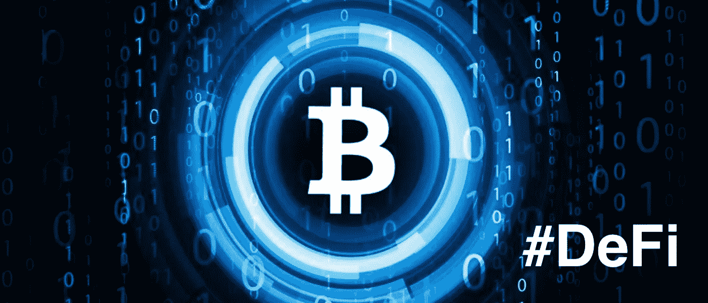

# 什么是分散融资(DeFi)以及如何从分散融资开始

> 原文：<https://medium.com/coinmonks/what-is-and-how-to-start-with-decentralized-finance-defi-67ea5ea0eca2?source=collection_archive---------0----------------------->

## 绝对初学者的分散金融(DeFi)指南

## **1。十亿美元的秘密就在你的指尖**

如果你最近对[加密货币](https://blockgeeks.com/guides/what-is-cryptocurrency/)不感兴趣，你可能会错过这样一条新闻:有一家叫做 [**DeFi**](https://blog.coincodecap.com/tag/defi/) **的**公司成为了独角兽**(一家十亿美元的公司)。**

这有点像一个笑话，因为 DeFi 不是一家公司或创业公司，而是某种建立在区块链基础上的独立且相互关联的金融服务。

术语**分散金融(**[**DeFi**](https://blog.coincodecap.com/tag/defi/)**)**或**开放金融**可以追溯到 2018 年末，当时十五个分散项目的[运动设定了一个共同目标，即创建一个不需要传统银行的更加开放的金融系统。](/defi-network/defi-summit-recap-bdc43a29c5cc)

## **2。那么什么是 DeFi 呢？**

长话短说: **DeFi 之于金融，就像加密货币之于货币。**它给金融带来了去中心化和数字化的信任。

稍微复杂一点:DeFi 是一套服务、协议和技术，提供各种方式来处理你的加密货币资金。

## **3。那么你能用 DeFi 做什么呢？**

你用你的钱和财务做同样的事情，但是不同的是你不需要使用银行或金融公司，你不需要提供任何证明或签署任何文件。

甚至不需要身份证或者额外的证明。一切都可以用手机和电脑在线完成。

所有这些证明和信任都是由区块链技术公司制造的，你不需要任何中间人来验证。

## **4。关键在哪里？**

没有。我们周围的聪明人创造了可编程货币、智能合约和区块链(以及其他一些)等技术。

这些技术的要点是，它们应该为管理和交换你的加密资金和金融业务提供一个安全和可信的环境。

## **5。好的，很好，你能给我更多的上下文吗？**

今天，我们使用传统的金融服务，所以我们借钱，投资，或者把辛苦赚来的钱存在一些安全的地方(通常是银行)。

现在，当我们需要贷款时，我们去当地银行，然后我们填写一些简单而苛刻的文件，如果一切顺利，我们就能得到贷款。然后我们必须做好人，确保我们偿还。

类似于我们的投资。当我们想投资时，我们必须找到有信誉的公司，在那里我们的钱被委托给一些聪明善良的人，期望他们会好好保管。

[DeFi](https://blog.coincodecap.com/tag/defi/) 也有同样的目的。它为我们提供了一个打理资金的机会。T4 与传统金融的不同之处在于，在这种情况下，我们完全控制自己的资金和投资，其他任何人都无法控制你拥有的和你同意的。因此，没有任何实体可以从你那里拿走任何东西或干涉你的资金。

## **6。我为什么要跳上这辆火车？**

在以下情况下，DeFi 是有意义的:

*   想尝试一下令人兴奋的技术并在酒吧里显得聪明吗
*   有一些存款，你想在没有风险的情况下赚取一些利息(理论上)
*   想要**投资**但是没有时间去处理所有的文书工作和机构提供者
*   没有**银行**或金融服务的权限
*   玩真正的投资模式(高级用户)

## **7。我需要的最低资金是多少？**

**真的取决于你**。你可以从 1 美元左右开始，但至少 10 美元开始是有意义的，不要把所有的钱都花在汽油(交易成本)和交易上。

## 8。有意思。是时候进行更高级的解释了。

记住，德菲是建立在区块链上的，大多是建立在 [**以太坊**](https://ethereum.org/) **上的。**

区块链的中心部分是存储所有数据的共享数据库(分类帐)。哪些数据将被写入该分类帐由一些算法处理(官方称为**一致算法**)。

重要的是，一旦某些东西被写入分类账，没有新的共识就无法更改。所以，如果共识算法达成了一个协议，你向某人支付了 10 个单位，那么这是任何人都不能改变的。

此外，存储在分类账中的所有数据和交易都与数千台计算机同步。所以账本分发给所有的电脑。

如果一台(或多台)计算机出现故障(或被政府、服务提供商或坏人关闭)，系统仍然可以工作。所以，你的 10 个单位的[付款](https://blog.coincodecap.com/tag/payment/)是分布式的，而不是写在每一台计算机(节点)上。

## 让我们得到基本的

**去中心化**意味着不需要中央权威机构(银行、公司、政府……)来管理这个账本，因为数字共识会管理它。

这意味着我们**将信任**数字化，或者将信任机制交给技术。我知道这听起来很怪异，但它有很多好处。其中之一是我们可以自动化许多事情。

加密货币是建立在区块链基础上的数字货币，所以技术是分散的，这意味着没有一个中央组织可以控制它们。所以他们不能决定你是否可以花你的钱，或者以任何方式阻止你的行动。

**智能合同是一种数字合同，其行为类似于纸质合同，但它们是在线编程的，受先进的加密技术保护，并通过区块链分发，因此是分散的。它们由一些动作触发，并以分散的方式执行，这意味着没有中央实体或不良参与者可以阻止它们的交付。这带来了许多好处。**

## ****9。啊，等等，停下。我们能像 5 岁的我一样回到 DeFi 吗？****

**你很容易把 DeFi 想象成共享的(金融)**乐高积木。****

**想象一下，红色的乐高积木代表硬币和代币(所以是加密货币)，黄色的乐高积木代表一些加密贷款服务(银行)，然后我们用不同颜色的乐高积木来代表我们从经典金融(投资、流动性提供者、保险和其他或多或少复杂的金融工具)中了解的所有不同事物。**

**在**classic financies 中，每块乐高积木都是独立的**，所以你必须去找一个供应商，填写并核实文件(如信用评分、收入)，然后带他们去其他供应商那里接受其他服务。**

****有了 DeFi，这一切都变得没有必要**。你所需要的只是一个 [**钱包**](https://blog.coincodecap.com/tag/wallet/) (想象一个口袋钱包，但用于加密货币)和加密资金。从那以后，你可以以一种非常自动化的方式做任何事情，因为这些乐高积木是经过验证的、可信的，并且是彼此共享的。**

**所以一旦你钱包里有了钱，你就可以开始组装乐高玩具了。例如，你可以用这些发现作为抵押，直接从其他 DeFi 服务中借入一些新的资金，然后你可以将这些资金进一步借给其他人，你可以获得利率保证金。至于 next Lego，比如预测基金，你可以将利率立即放到某个 DeFi 服务中。**

**有一百万种组合可以让你把乐高拼装起来，也可以让你管理好你的资金。新的服务每天都在涌现。**

**但更令人兴奋的是**如何创造新的 DeFi 服务**。**

**在 **DeFi 世界中，任何人都可以发行或创建自己的乐高玩具**。因此，您可以创建令牌或构建协议来实现贷款或一些金融选项(如期货)。美妙之处在于，任何人都可以在其他服务的基础上进行构建，而无需这些服务的任何许可，因为智能合同和数据是共享的，并且始终可用。**

## **10。我对这些新发行的代币和硬币感到困惑。他们怎么会有价值？**

**没错。在这个秘密的世界里，有很多敌意和骗局。如果认为我们已经过了那个阶段，那将是一种错觉。我们将在接下来的几集里讲述更多。**

## ****11。而这个共享的数据呢？其他人能看到我钱包里有多少钱，借了多少钱吗？****

**是的，他们可以看到钱包里有多少钱，或者有多少资金被锁定在智能合同中。他们不知道的是谁是那个钱包的主人。所以，如果你不公开宣传你的钱包，你是相当匿名的。**

****12。还有，这些智能合约有点混乱。****

**没错。**

**正如我们所说的，智能合约允许签署一份数字协议，在该协议中，你承诺采取一些行动或投入一些资金。你对这份合同的承诺是不可撤销的，因为它被写进了区块链，并被分发到了一千台电脑上。**

****智能合同是可执行的**并且不能被取下(消除)。**

***例如，如果我们约定我将在 2020 年 5 月 1 日向乔安娜支付 10 以太币(加密货币),并且我们将此签署为智能合同(我将我的 10 以太币锁定在此合同上),则无论如何都将执行此合同，乔安娜将获得她的钱。***

**另一件事是，这些**智能合约是公开可用的**，因此每个人都可以使用和重用它们。**

***现在，Joanna 可以使用此智能合同并将其用于另一个智能合同，即承诺在 5 月 1 日我将拥有 10 笔 Eth，第二天我将使用这些资金作为抵押品在 lending service 获得加密贷款。所有这一切都将是自动化的，并会完全按照合同中所写的那样执行。***

## **13。好吧，很公平。告诉我优点？**

****开始很容易**一切瞬间发生。你不需要任何文件或证明就可以开始。如果你生活在很难开立银行账户的国家，使用 DeFi 就没有障碍了。**

****它是透明的**，因为智能合同是开源的，所以你可以检查(或者其他人可以)合同到底做了什么。**

****它是安全的**，因为你不会真的花掉或输掉比你拥有的更多的钱(理论上)，你也不会用比你拥有的更多的钱去赌博。无论你做什么，你都必须有有价值的东西作为抵押(有价值的数字资产)**

**没有信用检查，金融公司也没有权力切断你的资金来源或对你的资金做任何不可预知的事情。**

## ****14。负号呢？****

**如果出了问题，没有中央实体会保护你，因为没有人控制这个系统。所以你不能跑到你的好财务经理那里要求退款或者抱怨。**

****还是实验性技术**。在一天结束的时候，你把一切都托付给技术，而技术可能会有问题、不稳定和不可预测。你要知道，智能合约一旦执行，就没有回头路了。**

**这是一个非常试验性的投资机制。如果人们开始恐慌会发生什么？协议是否稳定，金融体系是否可持续，某些服务背后的实体(公司)是否会信守承诺。**

## ****15。那么我需要从什么开始呢？****

**嗯，不多。你需要一些加密货币和一个加密钱包。**

**16。我能在哪里得到钱包？**

**我们有更多的钱包类型，我们将在下一集里讨论。**

**现在要记住的是，你应该始终使用**开源和非托管钱包**。这意味着您将您的资金(可以访问分类帐上自有资金的私钥)置于您的所有权和控制权之下。这就像把现金放在口袋里，而不是放在银行或其他金融服务账户里。**

**外面有很多钱包。如果你想把它放在手机上，安全的选择是 [**信任钱包**](https://trustwallet.com) 。**

> ****也读作:** [**最佳智能合约钱包(DeFi Wallets)**](https://blog.coincodecap.com/best-smart-contract-wallet/)**

**但在其他剧集中会有更多关于这方面的内容。**

**17。那么对我来说，第一个有用而简单的例子是什么呢？**

**[互换](https://en.bitcoinwiki.org/wiki/Coin_Swap)！**

**如果你有加密货币(比如说**以太坊**)并且你想把它换成其他的东西(比如叫做 [**戴**](https://daomaker.com/) **的稳定币)**最常见的方式就是通过**兑换**。但在交易所这样做通常非常昂贵。**

**有了互换，你可以**用最小的成本**把一个代币换成另一个，一切都在你的口袋(钱包)里完成。**

**因此，如果你想以尽可能低的成本交易代币，这是一个非常有用的方法。**

> ***在 Trust Wallet，您可以在 DEX 菜单中进行这些掉期交易- >掉期交易。***

****DEX 的意思是** [**分散交换**](https://blog.coincodecap.com/tag/decentralize-exchange/) (是的，我们很快就会谈到这一点)。**

## **18。我冒什么险？**

**还是那句话，你拿自己的钱玩，没有人会把你失去的钱还给你。不要贪心，不要花自己买不起的钱，不要做自己不懂的事。**

**还有，不管这些东西多么令人兴奋，它们仍然是一种**实验性的技术和实验性的商业模式****

**我们将在接下来的帖子中涉及更多令人兴奋的事情，所以系好安全带！**

****

> **[直接在您的收件箱中获得最佳软件交易](https://coincodecap.com/?utm_source=coinmonks)**

****