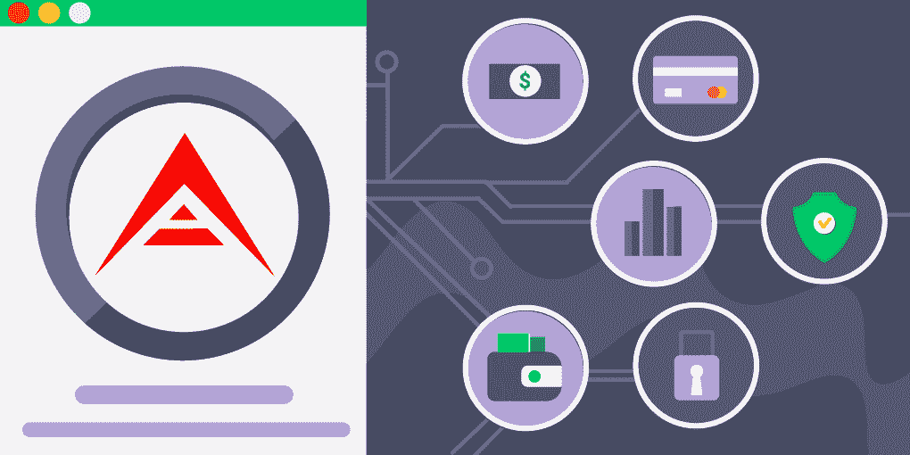
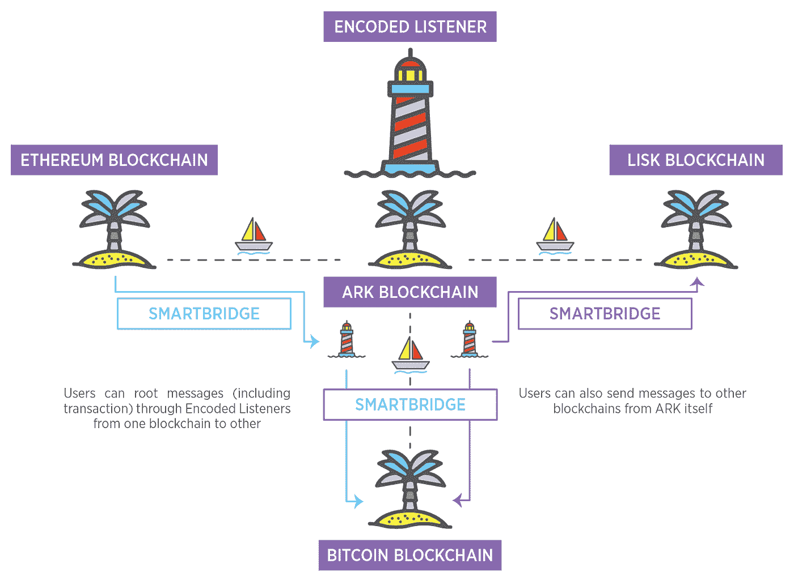
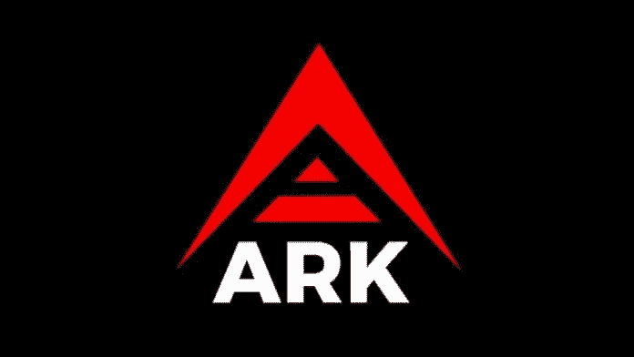
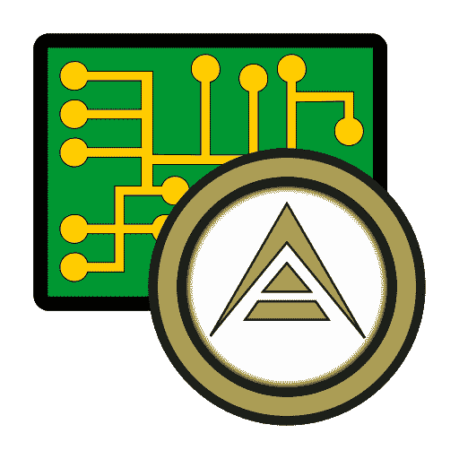

# 什么是 ARK，它对加密货币的采用有何贡献？

> 原文：<https://medium.com/coinmonks/what-is-ark-and-how-does-it-contribute-to-cryptocurrency-adoption-a5da18df9a01?source=collection_archive---------7----------------------->

区块链主流采用的障碍是什么？许多企业和个人甚至会使用分布式账本技术，但考虑到编程难度，进入门槛太高。ARK 旨在通过实现可在几秒钟内部署的可轻松定制的区块链来解决这个问题。在本文中，我们将看到为什么 ARK 称自己为“通往区块链的最简单的道路”,以及它如何为这项技术的采用做出贡献。

# 方舟是做什么的？

ARK 正在为企业和开发者创造一个生态系统，让他们能够轻松利用区块链技术。继 2016 年成功众筹 1 亿枚代币后，开源平台于 2017 年上线。

方舟公司称自己是一个“一体化的区块链解决方案”,旨在通过促进区块链的发展来推动其民主化。有了 ARK，企业和个人可以在几分钟内创建他们自己的区块链。ARK 链接这些链，并通过 ARK 核心区块链帮助它们定制各种用例。

然而，连接解决方案远远超出了专有的区块链连接:ARK 的智能桥旨在连接不同的区块链，如比特币和以太坊，以提高加密空间的互操作性。

ARK 的目标是成为解决区块链现实世界问题的最灵活的解决方案。让我们看看它是如何做到这一点的。

# 方舟的黑仔特色

1.  **智能网桥**是区块链连接具有相同和不同共识算法的网络之间的中介。这些桥从一个网络接收信号，并将它们传递到另一个网络，因此你可以在你的方舟钱包中触发跨链交易。为了实现这一点，需要在这些网络的代码中插入一行 ARK 代码，使它们与 ARK 兼容。

智能桥的两个核心元素是称为供应商屏蔽的数据部分和编码的监听器节点，监听器节点监控这些数据以执行它们可以执行的任务。

**2。多语言软件开发套件**允许开发人员在他们已经知道的编程语言上构建区块链，这极大地简化了开发过程。至少有 18 种语言可用。

**3。“按钮式可展开区块链”。通过使用方舟自身链的克隆，方舟使得部署区块链变得容易。通过链接所有创建的网络，ARK 促进了加密领域的通信。**

**4。ARK Logic 允许用户利用智能交易**——因此降低了对复杂智能合约的需求，并用用首选语言编写的易于构建的定制交易来替代它们。

# 方舟网络是如何保护的？

为了确保良好的网络去中心化和吸引更多的用户，ARK 实现了授权的利益一致性证明算法。它是这样工作的:有 51 个代表节点由用户用他们的方舟硬币选举产生，方舟硬币是方舟网络的公用设施令牌。每当委托人伪造一个方块，他们会得到 2 个方舟的奖励，并与投票给他们的用户分享这笔钱的一部分。

假设 ARK 阻塞时间是 8 秒，所有验证者和用户的总日奖励是 200 ARK。要成为一名代表谁伪造块，一个人必须支付 25 方舟，并等待，直到他们被选中。虽然那些没有进入 51 个验证者组的节点不能获得奖励，但他们可以作为中继节点为网络做出贡献。

你可以赌上你的方舟，投票给验证者，也可以赚取你的被动收入。这在我们将在下面回顾的方舟钱包中是可用的。

# 方舟显示了什么价格动态？

从 2017 年算起，方舟的投资回报率超过 8100%。它的历史高点是在 2018 年 1 月的加密热潮中，为 9.99 美元。ARK 在 2021 年 3 月达到了当地的最高值 3.2 美元；在 2020-2021 年牛市之前，其价格为 0.4 美元，在撰写本文时，其当前价值为 1.4 美元。

# 最好的方舟钱包是什么？

与许多其他加密货币不同，方舟团队开发了自己的钱包，可以访问生态系统的所有功能。

# 方舟桌面钱包

方舟桌面钱包可用于 Windows、macOS 和 Linux。在这里，您可以投票选举代表(将您的方舟作为赌注以提高被动收入)并启动智能桥交易。钱包支持 ARK 和 LISK 加密货币。它无需与区块链同步即可立即启动。至于交易费，送币要 0.1 方舟，一票就要你 1 方舟。

# 方舟手机钱包

这个钱包是一种在 iOS 或 Android 手机上利用 ARK 所有功能的方式。此外，该钱包支持 BTC，瑞士联邦理工学院，和超过 12 个其他加密资产，这使得这个钱包是一个成熟的多资产解决方案。

# 结论

方舟是一个分散的生态系统，有助于建立自定义的商人和个人区块链。有了 ARK，开发人员可以用 18 种可用编程语言中的一种在 10 分钟内构建一个新的链。其 ARK 逻辑允许构建简化版本的智能合约，而智能桥则支持不同区块链之间的互操作性。

在过去的几年里，ARK 展示了适度积极的价格动态。没有人知道它下一步会走向何方，但是如果区块链互操作性的话题继续得到关注，我们可以期待 ARK 价值的进一步增长。

> 加入 [Coinmonks 电报频道](https://t.me/coincodecap)，了解加密交易和投资
> 
> 加入 [Coinmonks 电报频道](https://t.me/coincodecap)，了解加密交易和投资

## 另外，阅读

*   [尤霍德勒 vs 考尼洛 vs 霍德诺特](/coinmonks/youhodler-vs-coinloan-vs-hodlnaut-b1050acde55a) | [Cryptohopper vs 哈斯博特](https://blog.coincodecap.com/cryptohopper-vs-haasbot)
*   [比特币基地跑马圈地](https://blog.coincodecap.com/coinbase-staking) | [Hotbit 点评](/coinmonks/hotbit-review-cd5bec41dafb) | [KuCoin 点评](https://blog.coincodecap.com/kucoin-review)
*   [最佳加密交易信号电报](/coinmonks/best-crypto-signals-telegram-5785cdbc4b2b) | [MoonXBT 评论](/coinmonks/moonxbt-review-6e4ab26d037)
*   [Coinswitch 俱吠罗评论](/coinmonks/coinswitch-kuber-review-1a8dc5c7a739) | [电网交易机器人](https://blog.coincodecap.com/grid-trading) | [比特币基地收费](/coinmonks/coinbase-fees-831e77d4f2c5)
*   [Bitget 评论](https://blog.coincodecap.com/bitget-review) | [双子星 vs BlockFi](https://blog.coincodecap.com/gemini-vs-blockfi) | [OKEx 期货交易](https://blog.coincodecap.com/okex-futures-trading)
*   [OKEx vs KuCoin](https://blog.coincodecap.com/okex-kucoin) | [摄氏替代品](https://blog.coincodecap.com/celsius-alternatives) | [如何购买 VeChain](https://blog.coincodecap.com/buy-vechain)
*   [币安期货交易](https://blog.coincodecap.com/binance-futures-trading)|[3 commas vs Mudrex vs eToro](https://blog.coincodecap.com/mudrex-3commas-etoro)
*   [如何购买 Monero](https://blog.coincodecap.com/buy-monero) | [IDEX 评论](https://blog.coincodecap.com/idex-review) | [BitKan 交易机器人](https://blog.coincodecap.com/bitkan-trading-bot)
*   [币安 vs Bitstamp](https://blog.coincodecap.com/binance-vs-bitstamp) | [Bitpanda vs 比特币基地 vs Coinsbit](https://blog.coincodecap.com/bitpanda-coinbase-coinsbit)
*   [如何购买瑞波(XRP)](https://blog.coincodecap.com/buy-ripple-india) | [非洲最好的加密交易所](https://blog.coincodecap.com/crypto-exchange-africa)
*   [非洲最佳加密交易所](https://blog.coincodecap.com/crypto-exchange-africa) | [Hoo 交易所评论](https://blog.coincodecap.com/hoo-exchange-review)
*   [eToro vs robin hood](https://blog.coincodecap.com/etoro-robinhood)|[MoonXBT vs by bit vs Bityard](https://blog.coincodecap.com/bybit-bityard-moonxbt)
*   [Stormgain 回顾](https://blog.coincodecap.com/stormgain-review) | [Bexplus 回顾](https://blog.coincodecap.com/bexplus-review) | [币安 vs Bittrex](https://blog.coincodecap.com/binance-vs-bittrex)