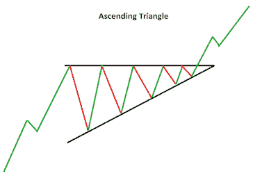

# 什么是上升三角形模式

> 原文：<https://medium.com/coinmonks/what-is-ascending-triangle-patterns-8f611ef92c50?source=collection_archive---------6----------------------->

上升三角形是一种[看涨](https://cryptoworldfinace.blogspot.com/2021/12/bullish-and-bearish.html)形态，通常在上升趋势的路线上分类，作为延续样本。有些情况下，上升三角形在下跌趋势结束时构成反转形态，然后它们通常又是延续形态。不管它们的位置如何，上升三角形都是看涨形态，表明在累积。

它是通过电荷冲击的能力产生的，允许在波动高点旁边画一条水平线，在波动低点旁边画一条上升趋势线。这两条轨迹形成一个三角形。交易者定期观察三角形形态的突破。突破看起来可能是向上的，也可能是向下的。上升三角形通常被称为延续形态，因为在三角形形成之前，流行的趋势是在相同的路线上突破。

你可能已经读过了:“[初学者和进阶者的完美策略加密货币交易](https://cryptoworldfinace.blogspot.com/2021/11/perfect-strategy-cryptocurrency-trading.html)”、“[突破和伪造加密货币](https://cryptoworldfinace.blogspot.com/2021/12/breakout-and-fakeout-in-cryptocurrency.html)”、“[加密泵和转储方案](https://cryptoworldfinace.blogspot.com/2021/11/crypto-pump-and-dump-schemes.html)。由于其形状，该样本还可以称为直角三角形。两个或更多相等的高点在高点上形成一条水平线。两个或两个以上的上升槽构成一条上升的时尚线，当它上升时，它会收敛到水平线。如果每条痕迹都被适当延长，上升的时尚线应该充当一个适当三角形的斜边。如果画一条垂直线，从水平线的左边向下延伸，就可以打出一个正确的三角形。

*   如果速度突破样本顶部，则进行延长变化。
*   如果价格跌破趋势线下方，就进行快速交易。
*   三角形的趋势线至少有两个波动高点和两个波动低点。
*   一个[止损点](https://cryptoworldfinace.blogspot.com/2021/12/stop-loss-strategy-in-cryptocurrency.html)通常位于突破模式的相反方向。
*   收入目标的计算方法是在三角形最厚的点取顶点，并在突破点加上或减去顶点。
*   上升三角形被认为是一个连续的模式，因为速度通常会比三角形更快地突破 fee 路径中的三角形。虽然，这不会经常发生。任何课程的突破都是值得注意的。

让我们观察模式的每个部分，然后看一个例子:

*   趋势:为了有资格作为延续样本，必须存在一个安排时尚。然而，由于现实中上升三角形是一个看涨形态，现代趋势的大小和区间并不那么重要，因为形成的稳健性是最重要的。
*   顶部水平线:至少需要两个响应高点才能形成顶部水平线。高点现在不应该是精确的，但是它们必须在每个不同的智能接近度之内。在高点和低点之间肯定有一段很长的距离。
*   下降上升趋势线:至少需要两个响应低点来形成下降上升趋势线。这些响应低点必须依次变大，并且在低点之间必须有很远的距离。如果更大的当前响应下限等于或远小于先前的响应下限，则上升三角形现在是不合法的。
*   持续时间:模式的测量可以从几个星期到几个月不等，频繁的采样持续 1-3 个月。
*   [成交量](https://cryptoworldfinace.blogspot.com/2021/12/what-is-volume-in-cryptocurrency-trade.html):随着形态的发展，成交量通常会收缩。当向上突破发生时，必须有一个范围的扩大，以确认突破。虽然数量肯定最受欢迎，但并不经常需要。
*   回到突破:技术评估的一个主要宗旨是[阻力变成支撑](https://cryptoworldfinace.blogspot.com/2021/12/uses-support-and-resistance-for-trading.html)。当上升三角形的阻力线被打破时，它就变成了帮助。有时，在十字架真正开始之前，可能会有一个返回到这个辅助程度的过程。
*   目标:一旦突破发生，通过测量样品的最大距离并利用它来观察电阻突破的电荷投射。

> 阅读:[加密货币交易量有多大？](https://cryptoworldfinace.blogspot.com/2021/12/what-is-volume-in-cryptocurrency-trade.html)
> [在您的业务中长期使用加密货币的好处](https://cryptoworldfinace.blogspot.com/2021/11/benefits-of-using-cryptocurrency-in.html)

与对称三角形不同，上升三角形比真正的突破更早出现明确的看涨倾向。如果你还记得，对称三角形是一个不偏不倚的形态，它依赖于即将到来的突破来决定下一步的走向。在上升的三角形上，水平线代表阻止保护提前转移一个确定水平的开销授权。这就好像在这个阶段下了一个大的促销订单，需要几个星期或几个月的时间来执行，从而阻止了价格的进一步上涨。即使速度不能上冲这个阶段，反应低点继续上升。正是这些较大的低点表明了加速买入的压力，并为上升三角形提供了看涨的偏向。

## **交易上升三角形的限制**

三角形和图表模式的主要问题，对于[假突破](https://cryptoworldfinace.blogspot.com/2021/12/breakout-and-fakeout-in-cryptocurrency.html)是可行的。价格也可能从样品中消失，然后再次降低，或者费用可能会进一步破坏完全不同的方面。因为趋势线之前的支付边缘仍然不能在突破过程中产生任何动力，所以一个模式也可能需要重新绘制多次。

虽然上升三角形提供了收益目标，但这个目标只是一个估计。这个速度甚至可以超过我们所关注的，或者没有实现它。[阅读更多](https://cryptoworldfinace.blogspot.com/2021/12/what-is-ascending-triangle-patterns.html)。

> 加入 Coinmonks [电报频道](https://t.me/coincodecap)和 [Youtube 频道](https://www.youtube.com/c/coinmonks/videos)了解加密交易和投资

## 另外，阅读

*   [OKEx 回顾](/coinmonks/okex-review-6b369304110f) | [Kucoin 交易机器人](/coinmonks/kucoin-trading-bot-automate-your-trades-8cf0ca2138e0) | [期货交易机器人](/coinmonks/futures-trading-bots-5a282ccee3f5)
*   [AscendEx Staking](https://blog.coincodecap.com/ascendex-staking)|[Bot Ocean Review](https://blog.coincodecap.com/bot-ocean-review)|[最佳比特币钱包](https://blog.coincodecap.com/bitcoin-wallets-india)
*   [霍比评论](https://blog.coincodecap.com/huobi-review) | [OKEx 保证金交易](https://blog.coincodecap.com/okex-margin-trading) | [期货交易](https://blog.coincodecap.com/futures-trading)
*   [比特币基地赌注](https://blog.coincodecap.com/coinbase-staking) | [热点评论](/coinmonks/hotbit-review-cd5bec41dafb) | [库币评论](https://blog.coincodecap.com/kucoin-review)
*   [最佳加密交易信号电报](/coinmonks/best-crypto-signals-telegram-5785cdbc4b2b) | [MoonXBT 评论](/coinmonks/moonxbt-review-6e4ab26d037)
*   [Coinswitch 俱吠罗评论](/coinmonks/coinswitch-kuber-review-1a8dc5c7a739) | [电网交易机器人](https://blog.coincodecap.com/grid-trading) | [比特币基地费用](/coinmonks/coinbase-fees-831e77d4f2c5)
*   [Bitget 回顾](https://blog.coincodecap.com/bitget-review)|[Gemini vs block fi](https://blog.coincodecap.com/gemini-vs-blockfi)|[OKEx 期货交易](https://blog.coincodecap.com/okex-futures-trading)
*   [OKEx vs KuCoin](https://blog.coincodecap.com/okex-kucoin) | [摄氏替代品](https://blog.coincodecap.com/celsius-alternatives) | [如何购买 VeChain](https://blog.coincodecap.com/buy-vechain)
*   [币安期货交易](https://blog.coincodecap.com/binance-futures-trading)|[3 commas vs Mudrex vs eToro](https://blog.coincodecap.com/mudrex-3commas-etoro)
*   [在印度利用加密套利赚取被动收入](https://blog.coincodecap.com/crypto-arbitrage-in-india)
*   [德国最佳加密交易所](https://blog.coincodecap.com/crypto-exchanges-in-germany) | [WazirX P2P](https://blog.coincodecap.com/wazirx-p2p)
*   [如何购买 Monero](https://blog.coincodecap.com/buy-monero) | [IDEX 评论](https://blog.coincodecap.com/idex-review) | [BitKan 交易机器人](https://blog.coincodecap.com/bitkan-trading-bot)