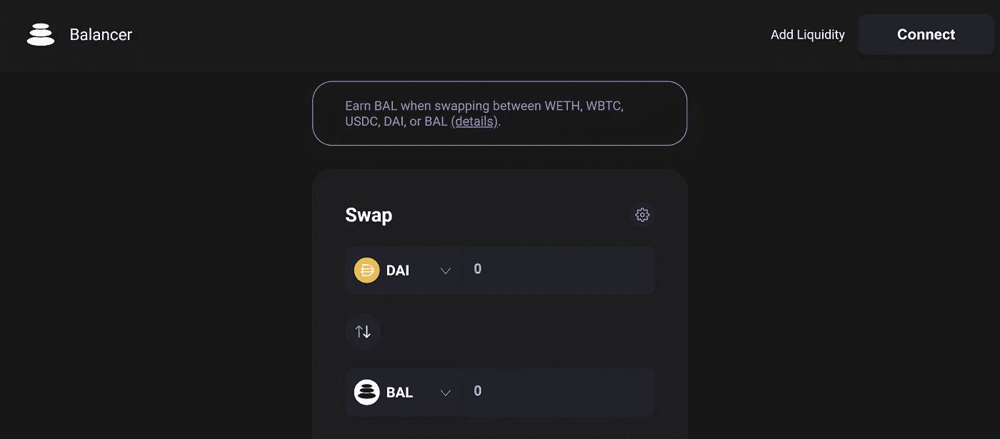

# 什么是平衡器(BAL)？—关于代币和流动性挖掘的一切

> 原文：<https://medium.com/coinmonks/what-is-balancer-bal-all-about-token-liquidity-mining-1e21678e6ab5?source=collection_archive---------2----------------------->

平衡器是今年的顶级 DeFi 硬币之一。治理令牌 BAL 能够在复合后不久迅速发展，并吸引了相当多的注意力。与 Compound 或 Aave 不同，Balancer 不是一种借贷协议，而是一种分散式交易所(DEX)，一种自动化做市商(AMM)。