# 什么是平衡器财务，如何使用它

> 原文：<https://medium.com/coinmonks/what-is-balancer-finance-and-how-to-use-it-d97de9c0e768?source=collection_archive---------3----------------------->

平衡器是一个自动做市商，提供诸如自平衡加权投资组合和价格传感器等独特功能。

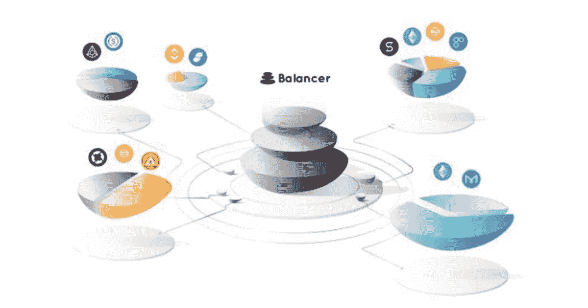

**平衡器是一个多令牌自动做市协议。它允许平台用户交换代币，向现有资金池添加流动性，并创建新的资金池。**

[平衡器](https://balancer.finance/)池可以通过使用两个或多个代币来创建，并允许用户设置代币权重，该权重代表总池值中每个代币的比例。用户在平衡器池中提供流动性，并接收与其池的流动性成比例的池代币。

**安全措施**

Balancer Finance 高度重视其安全标准。该协议的智能合约的设计主要关注安全性。核心协议代码已经过 [Consensys Diligence](https://consensys.net/diligence/) 的审核，并通过了 bit 和 [Open Zeppelin](https://openzeppelin.com/) 的[尾审。](https://www.trailofbits.com/)

**平衡器治理令牌(BAL)**

平衡器本机治理令牌 [BAL](https://www.coingecko.com/en/coins/balancer) 可用于治理活动，例如，对提案进行投票等。每周向流动性提供者发放 145，000 巴亚尔，即每年约 750 万巴亚尔。它们通常在每周二 2300 UTC 时直接分发给流动性提供者。

**平衡器池**

平衡器池是平衡器协议的核心。这些池是智能契约，有助于平衡器协议的正常运行。

可以使用两个或更多 ERC20 令牌创建平衡器池。您一次最多可以添加 8 个代币来创建一个池。平衡器池用户在创建池时还可以灵活地自定义令牌权重。例如，您可以创建一个包含三个令牌的池，比例如下:50% wet、25% USDT 和 25% DAI。

流动性提供者赚取部分交易费用。创建池时，池所有者甚至可以自定义费用百分比。

**平衡器池创建限制**

*   用户最多可以添加 8 个令牌。
*   互换费用必须在 0.0001%到 10%之间。
*   池令牌必须符合 ERC20 标准。

要了解更多关于其他限制的信息，请访问此[链接。](https://docs.balancer.finance/protocol/limitations)

**平衡器池的类型**

核心平衡器池由智能合约控制，可分为以下类别:

*   **最终确定/公开** —池参数(资产类型、权重和费用)是固定的，任何人都可以添加/删除流动性和交换令牌。
*   **受控/私有** —受控池仅由一个“控制器”地址管理。只有这个地址可以向池中添加或移除流动性(调用 join 或 exit)。池参数不是固定的，即池资产类型及其权重可以改变。

**发布**

*   **青铜发布**

这是平衡器协议三个计划版本中的第一个版本。在这个版本中，协议主要关注审计和验证的代码清晰性。

*   **银色发布**

这一阶段的重点是为受控池提供更大的灵活性。此外，平衡器协议将经历一些架构变化以减少事务开销，并将在 [gas](https://www.altcoinbuzz.io/cryptocurrency-news/blockchain-technology/are-there-any-possible-ethereum-gas-fee-solutions/) optimizations 方法上工作。

*   **黄金上映**

这个版本将结合整个系统及其功能。

**工作指南**

进入平衡器金融[主页](https://balancer.finance/)。

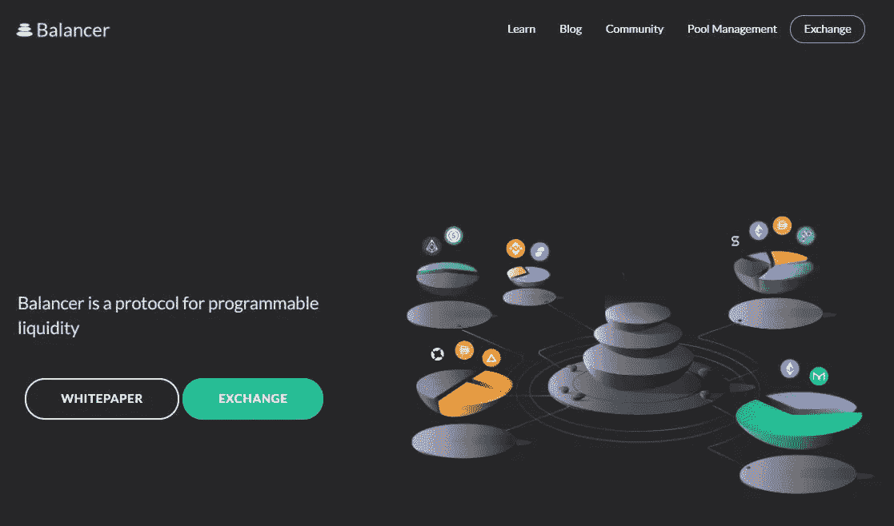

要访问交换，点击**交换**按钮。

它会把你重定向到一个页面。

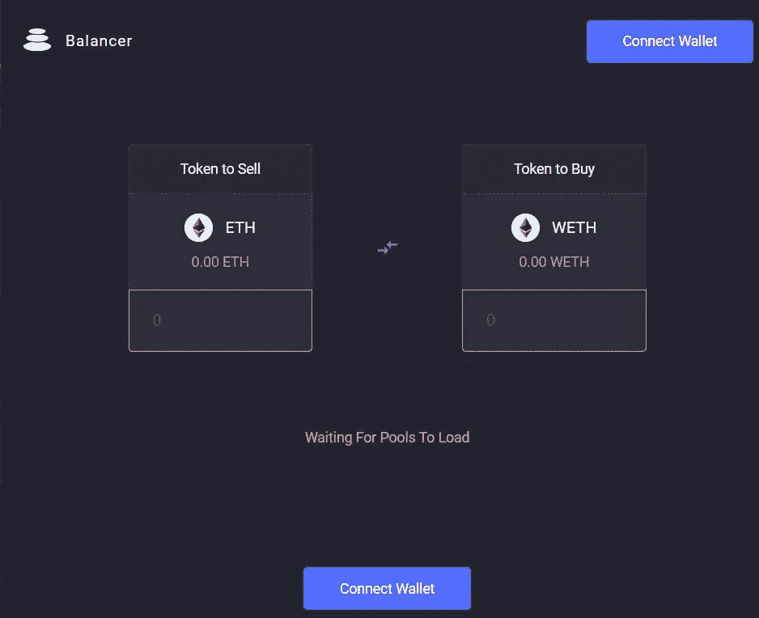

交易所默认登陆页面为**掉期**页面。

**连接钱包**

连接您的 MetaMask 钱包以访问平衡器金融平台。

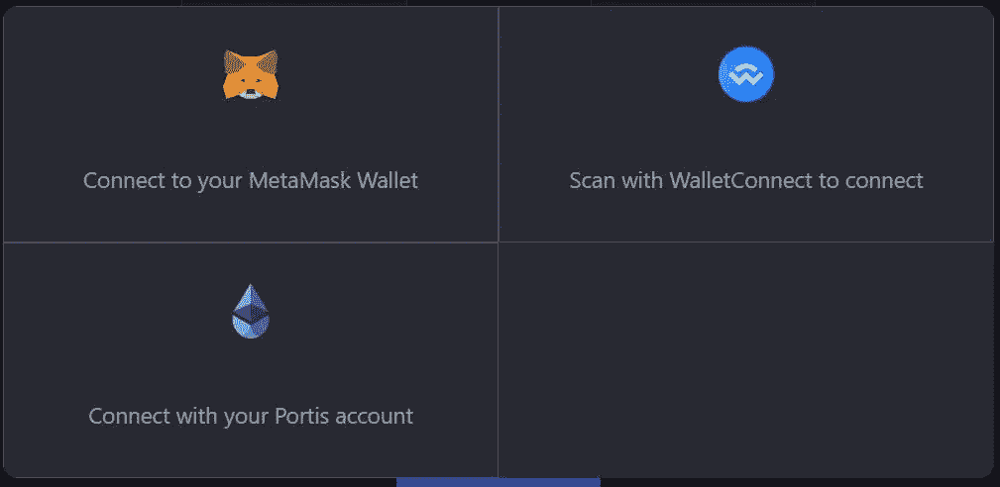

**互换**

使用交换功能，您可以将一个令牌与另一个令牌交换。

选择您想要出售的输入令牌和数量，同时选择您想要购买的输出令牌。该应用程序将显示交换后您将收到的输出令牌数。

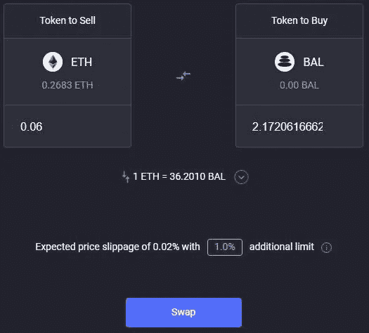

确认元掩码事务。现在，您可以在元掩码钱包中看到输出令牌。如果令牌不可见，则通过给出合同地址来添加令牌。

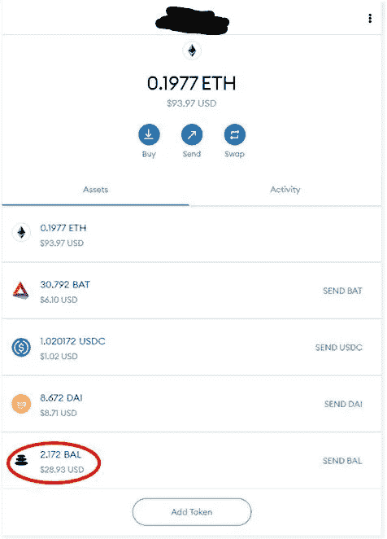

**探索泳池**

平衡器池分为三个部分:

*   共享的
*   聪明的
*   私人的

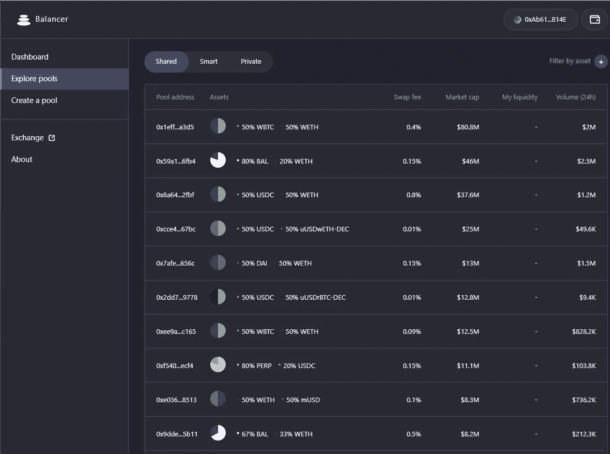

要获得任何现有池的更多详细信息，只需单击它。

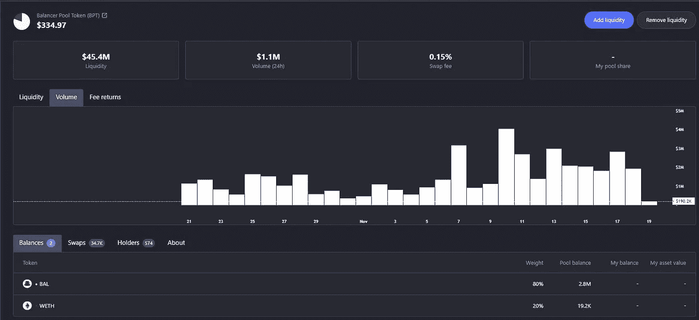

您可以从页面上显示的各种选项卡中获得有关池和其他参数的完整详细信息(带有余额的池令牌、池交换活动、持有人、池信息)。

**添加流动性**

通过此选项卡，用户可以向现有池中添加流动性。平衡器金融交易所允许您使用单一和多种资产增加流动性。

*   **单项资产**

顾名思义，它允许用户将单个令牌添加到流动性池中。

输入您要添加到流动性池的代币数量。

在将令牌添加到流动性池之前，您需要先解锁令牌。

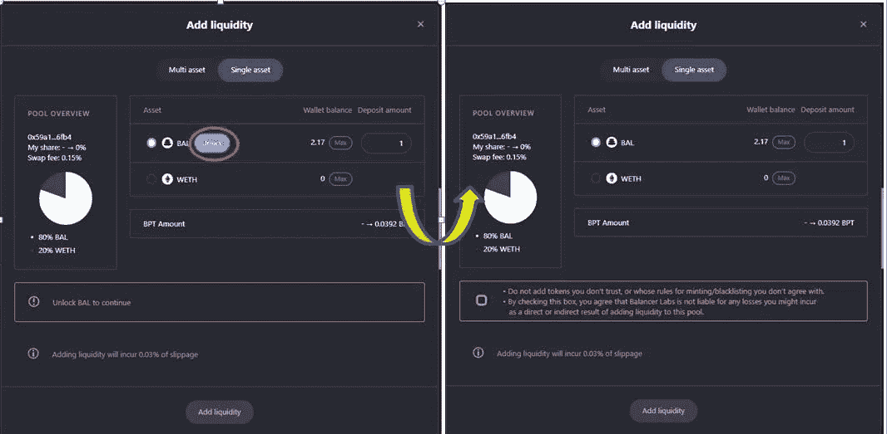

所需的令牌现在已解锁。你可以在流动性池中使用这种代币。

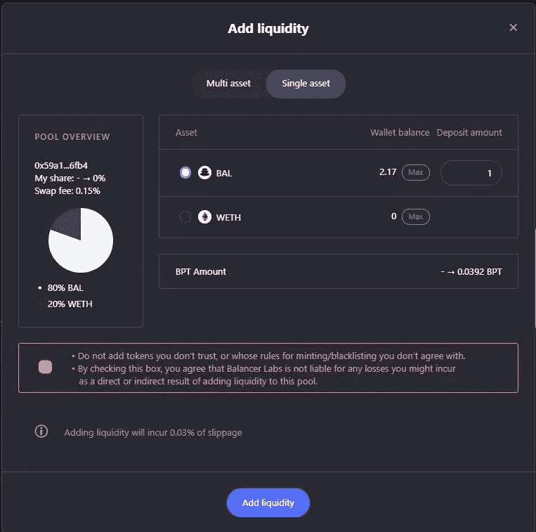

输入您想要存放的代币数量，并检查应用程序上显示的警告消息。如果您对条件满意，那么您可以通过点击**添加流动性**按钮继续。

它将触发元掩码交易，一旦交易成功，您就可以在您的仪表板中看到您的流动性令牌。

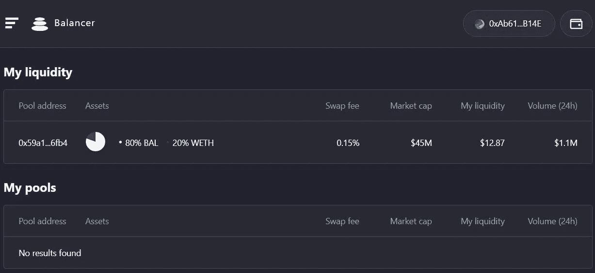

**多资产**

使用多资产，您可以向所需的流动性池添加两个令牌。

我们选择了一个需要包装 ETH (ERC20 令牌)的 BAL-WETH 流动性池。

要获得 WETH，可以使用 [Airswap](https://instant.airswap.io/swap) 。

访问上面提到的链接，连接您的钱包。

输入您想要转换成 WETH 的 ETH 量，并点击 **WRAP** 。

一旦交易成功，你就可以在钱包里看到 WETH 令牌。

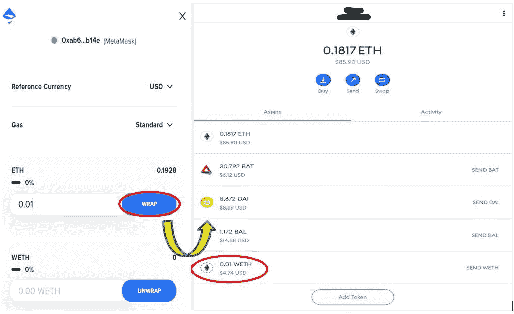

现在，您可以将此 WETH 令牌提供给选定的流动性池。

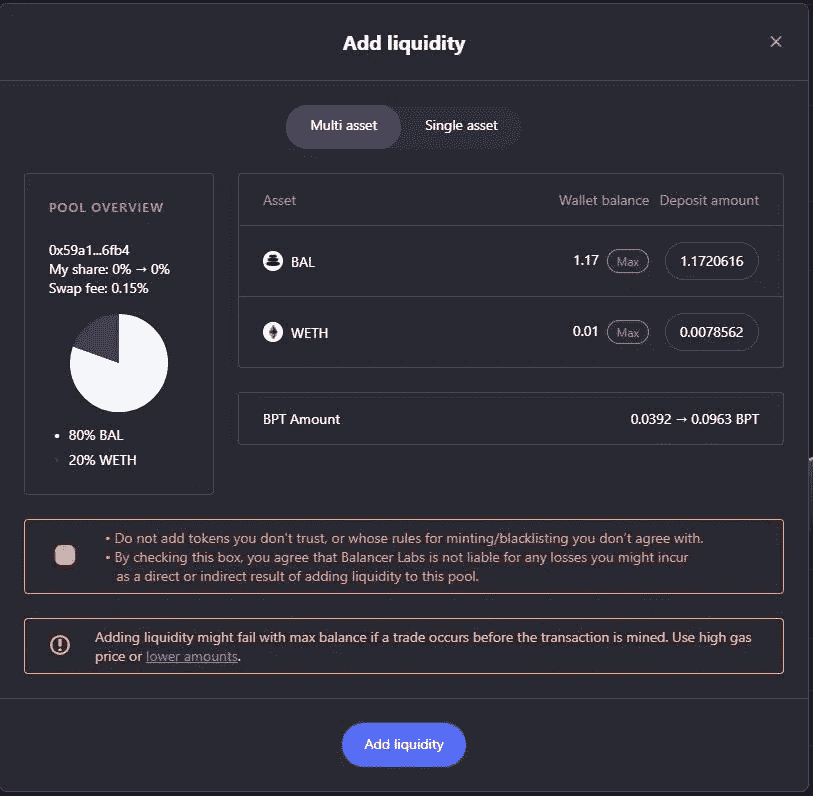

点击**添加流动性**并确认 MetaMask 交易。交易成功后，您可以在仪表盘中看到您的流动性余额。

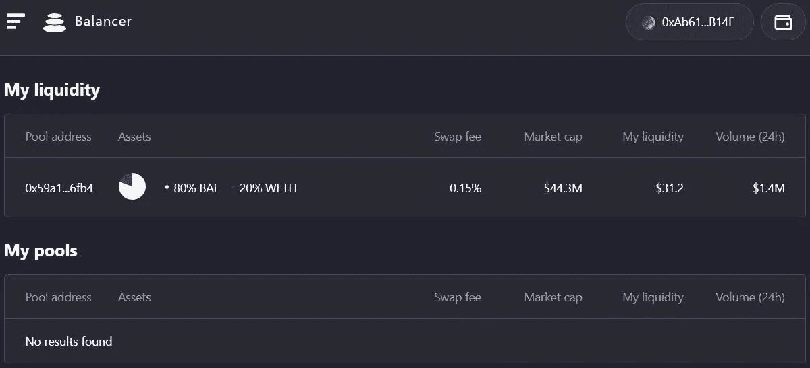

通过选择显示在仪表盘上的流动性池，您可以进一步详细了解您的资产构成。

**创建一个池**

使用此功能，用户还可以通过选择多个令牌来创建池。创建池时，最多可以添加八个令牌。池所有者还可以设置池的交换费。

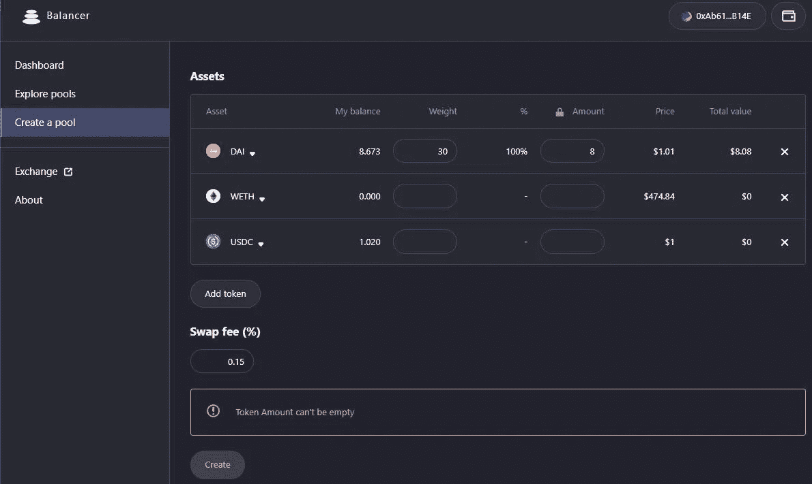

**去除流动性**

使用此功能，您可以从流动性池中删除您的池份额。

您只需输入想要移除的令牌数量。

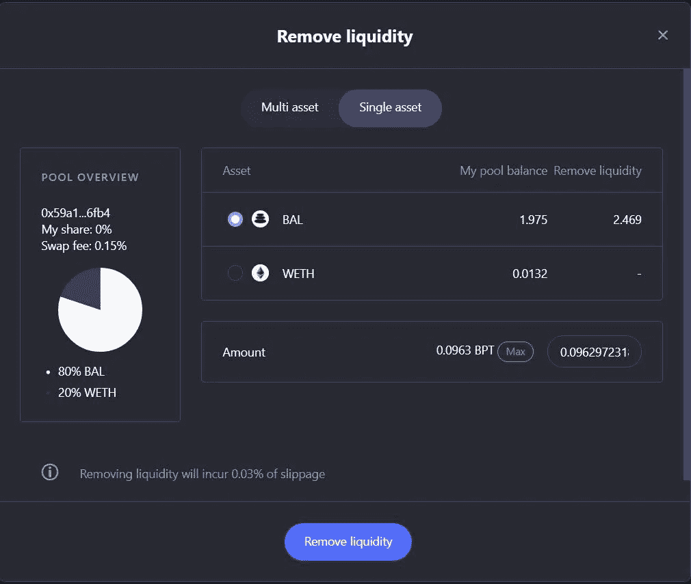

点击**移除流动性**并确认交易。

交易成功后，您现在可以看到您的流动性详细信息已从您的仪表板中删除。

代币现已移动到您的元掩码钱包中。

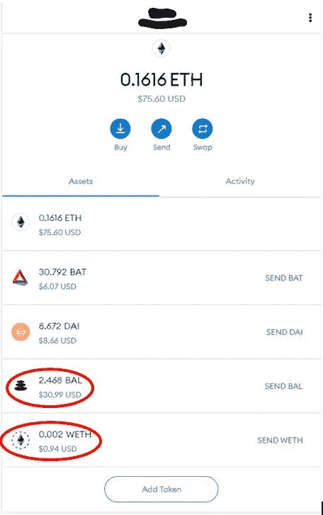

**结论**

平衡器金融是支持 AMM 的像 [Uniswap](https://uniswap.org/) 一样的 DeFi 协议之一。该协议具有创建具有多种资产和不同权重的池以及可定制的交换费用的独特特征。这使得协议更加灵活。然而，我们注意到平台有点慢，在加载每个标签、加载功能和完成交易时花费了太多时间。

**资源:**平衡器金融[白皮书](https://balancer.finance/whitepaper/)

***注:*** *本帖首发* [*此处*](https://www.altcoinbuzz.io/bitcoin-and-crypto-guide/what-is-balancer-finance-and-how-to-use-it/) *上*[***altcoinbuzz . io***](http://www.altcoinbuzz.io/)*。*

**通过我的推荐加入**

[Crypto.com](https://binance.com/en/register?ref=E8PCD3AF)——[币安](https://platinum.crypto.com/r/sut3pd9bzn)

跟我来吧

**👉** [推特](https://twitter.com/rumadas123)

**👉**[**Linkedin**](https://www.linkedin.com/in/ruma-das-a1439320/)

****披露—关联链接包括在内****

> **加入 [Coinmonks 电报频道](https://t.me/coincodecap)，了解加密交易和投资**

## **另外，阅读**

*   **[尤霍德勒 vs 科恩洛 vs 霍德诺特](/coinmonks/youhodler-vs-coinloan-vs-hodlnaut-b1050acde55a) | [Cryptohopper vs 哈斯博特](https://blog.coincodecap.com/cryptohopper-vs-haasbot)**
*   **[币安 vs 北海巨妖](https://blog.coincodecap.com/binance-vs-kraken) | [美元成本平均交易机器人](https://blog.coincodecap.com/pionex-dca-bot)**
*   **[如何在印度购买比特币？](/coinmonks/buy-bitcoin-in-india-feb50ddfef94) | [WazirX 评论](/coinmonks/wazirx-review-5c811b074f5b) | [BitMEX 评论](https://blog.coincodecap.com/bitmex-review)**
*   **[比特币主根](https://blog.coincodecap.com/bitcoin-taproot) | [Bitso 点评](https://blog.coincodecap.com/bitso-review) | [前 6 名比特币信用卡](/coinmonks/bitcoin-credit-card-bc8ab6f377c6)**
*   **[双子座 vs 比特币基地](https://blog.coincodecap.com/gemini-vs-coinbase) | [比特币基地 vs 北海巨妖](https://blog.coincodecap.com/kraken-vs-coinbase) | [硬币罐 vs 硬币点](https://blog.coincodecap.com/coinspot-vs-coinjar)**
*   **[印度加密交易所](/coinmonks/bitcoin-exchange-in-india-7f1fe79715c9) | [比特币储蓄账户](/coinmonks/bitcoin-savings-account-e65b13f92451) | [Paxful 审核](/coinmonks/paxful-review-4daf2354ab70)**
*   **[杠杆令牌](/coinmonks/leveraged-token-3f5257808b22) | [最佳加密交易所](/coinmonks/crypto-exchange-dd2f9d6f3769) | [AscendEX 评论](/coinmonks/ascendex-review-53e829cf75fa)**
*   **[Godex.io 审核](/coinmonks/godex-io-review-7366086519fb) | [邀请审核](/coinmonks/invity-review-70f3030c0502) | [BitForex 审核](https://blog.coincodecap.com/bitforex-review) | [HitBTC 审核](/coinmonks/hitbtc-review-c5143c5d53c2)**
*   **[Crypto.com 费用](/coinmonks/binance-fees-8588ec17965) | [僵尸密码审查](/coinmonks/botcrypto-review-2021-build-your-own-trading-bot-coincodecap-6b8332d736c7) | [替代品](https://blog.coincodecap.com/crypto-com-alternatives)**
*   **[MXC 交易所评论](/coinmonks/mxc-exchange-review-3af0ec1cba8c) | [Pionex vs 币安](https://blog.coincodecap.com/pionex-vs-binance) | [Pionex 套利机器人](https://blog.coincodecap.com/pionex-arbitrage-bot)**
*   **[我的密码交易经验](/coinmonks/my-experience-with-crypto-copy-trading-d6feb2ce3ac5) | [比特币基地评论](/coinmonks/coinbase-review-6ef4e0f56064)**
*   **[CoinFLEX 评论](https://blog.coincodecap.com/coinflex-review) | [AEX 交易所评论](https://blog.coincodecap.com/aex-exchange-review) | [UPbit 评论](https://blog.coincodecap.com/upbit-review)**
*   **[AscendEx 保证金交易](https://blog.coincodecap.com/ascendex-margin-trading) | [Bitfinex 赌注](https://blog.coincodecap.com/bitfinex-staking) | [bitFlyer 点评](https://blog.coincodecap.com/bitflyer-review)**
*   **[麻雀交换评论](https://blog.coincodecap.com/sparrow-exchange-review) | [纳什交换评论](https://blog.coincodecap.com/nash-exchange-review)**
*   **[加密货币储蓄账户](/coinmonks/cryptocurrency-savings-accounts-be3bc0feffbf) | [赌注加密](https://blog.coincodecap.com/staking-crypto) | [窃取 x 评论](/coinmonks/stealthex-review-396c67309988)**
*   **[BigONE 交易所评论](/coinmonks/bigone-exchange-review-64705d85a1d4) | [CEX。IO 审查](https://blog.coincodecap.com/cex-io-review) | [Swapzone 审查](/coinmonks/swapzone-review-crypto-exchange-data-aggregator-e0ad78e55ed7)**
*   **[最佳比特币保证金交易](/coinmonks/bitcoin-margin-trading-exchange-bcbfcbf7b8e3) | [Bityard 保证金交易](https://blog.coincodecap.com/bityard-margin-trading) | [Prokey 点评](/coinmonks/prokey-review-26611173c13c)**
*   **[加密保证金交易交易所](/coinmonks/crypto-margin-trading-exchanges-428b1f7ad108) | [赚取比特币](/coinmonks/earn-bitcoin-6e8bd3c592d9) | [Mudrex 投资](https://blog.coincodecap.com/mudrex-invest-review-the-best-way-to-invest-in-crypto)**
*   **[WazirX vs CoinDCX vs bit bns](/coinmonks/wazirx-vs-coindcx-vs-bitbns-149f4f19a2f1)|[block fi vs coin loan vs Nexo](/coinmonks/blockfi-vs-coinloan-vs-nexo-cb624635230d)**
*   **[BlockFi 信用卡](https://blog.coincodecap.com/blockfi-credit-card) | [如何在币安购买比特币](https://blog.coincodecap.com/buy-bitcoin-binance)**
*   **[火币交易机器人](https://blog.coincodecap.com/huobi-trading-bot) | [如何购买 ADA](https://blog.coincodecap.com/buy-ada-cardano) | [Geco。一次复习](https://blog.coincodecap.com/geco-one-review)**
*   **[加密复制交易平台](/coinmonks/top-10-crypto-copy-trading-platforms-for-beginners-d0c37c7d698c) | [五大 BlockFi 替代方案](https://blog.coincodecap.com/blockfi-alternatives)**
*   **[CoinLoan 点评](https://blog.coincodecap.com/coinloan-review)|[Crypto.com 点评](/coinmonks/crypto-com-review-f143dca1f74c) | [火币保证金交易](/coinmonks/huobi-margin-trading-b3b06cdc1519)**
*   **[顶级付费加密货币和区块链课程](https://blog.coincodecap.com/blockchain-courses) | [币安评论](/coinmonks/binance-review-ee10d3bf3b6e)**
*   **[在美国如何使用 BitMEX？](https://blog.coincodecap.com/use-bitmex-in-usa) | [BitMEX 回顾](https://blog.coincodecap.com/bitmex-review) | [币安 vs Bittrex](https://blog.coincodecap.com/binance-vs-bittrex)**
*   **[最佳免费加密信号](https://blog.coincodecap.com/free-crypto-signals) | [YoBit 评论](/coinmonks/yobit-review-175464162c62) | [Bitbns 评论](/coinmonks/bitbns-review-38256a07e161)**
*   **[OKEx 审核](/coinmonks/okex-review-6b369304110f) | [Kucoin 交易机器人](/coinmonks/kucoin-trading-bot-automate-your-trades-8cf0ca2138e0) | [期货交易机器人](/coinmonks/futures-trading-bots-5a282ccee3f5)**
*   **[AscendEx Staking](https://blog.coincodecap.com/ascendex-staking)|[Bot Ocean Review](https://blog.coincodecap.com/bot-ocean-review)|[最佳比特币钱包](https://blog.coincodecap.com/bitcoin-wallets-india)**
*   **[霍比评论](https://blog.coincodecap.com/huobi-review) | [OKEx 保证金交易](https://blog.coincodecap.com/okex-margin-trading) | [期货交易](https://blog.coincodecap.com/futures-trading)**
*   **[比特币基地赌注](https://blog.coincodecap.com/coinbase-staking) | [热点评论](/coinmonks/hotbit-review-cd5bec41dafb) | [库币评论](https://blog.coincodecap.com/kucoin-review)**
*   **[最佳加密交易信号电报](/coinmonks/best-crypto-signals-telegram-5785cdbc4b2b) | [MoonXBT 评论](/coinmonks/moonxbt-review-6e4ab26d037)**
*   **[Coinswitch 俱吠罗评论](/coinmonks/coinswitch-kuber-review-1a8dc5c7a739) | [电网交易机器人](https://blog.coincodecap.com/grid-trading) | [比特币基地费用](/coinmonks/coinbase-fees-831e77d4f2c5)**
*   **[Bitget 回顾](https://blog.coincodecap.com/bitget-review)|[Gemini vs block fi](https://blog.coincodecap.com/gemini-vs-blockfi)|[OKEx 期货交易](https://blog.coincodecap.com/okex-futures-trading)**