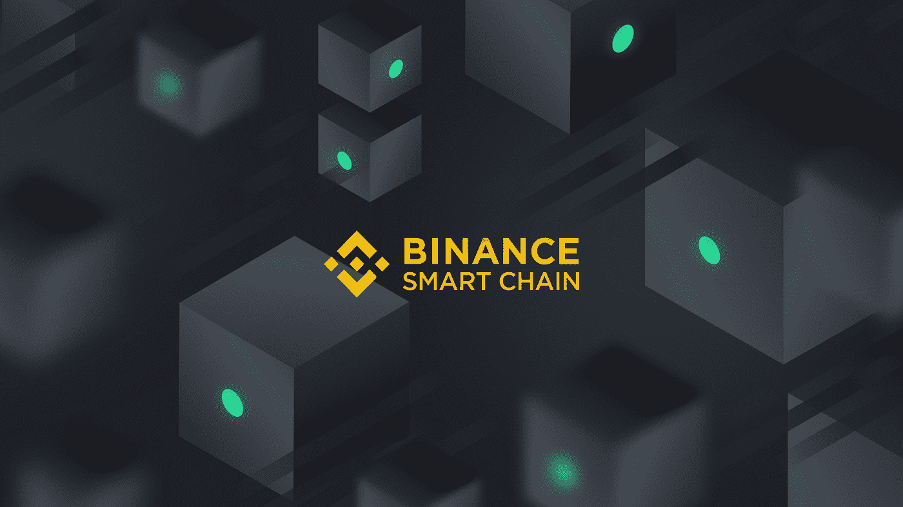

# 币安智能链的背后是什么？

> 原文：<https://medium.com/coinmonks/what-is-behind-the-binance-smart-chain-13d3ddcde207?source=collection_archive---------1----------------------->

以太坊区块链每秒的交易次数有限。这必然导致负载高的时候交易费用高，导致网络瘫痪。这种情况目前正在复兴替代网络，如币安智能链。

2015 年，以太坊通过智能合约彻底改变了加密市场。从那时起，它是可能的编程分散…