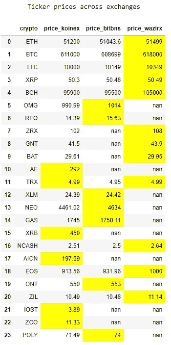
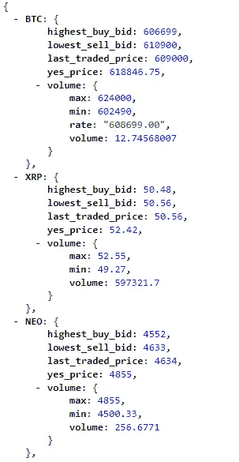

# 什么是比特币/Altcoin 套利？

> 原文：<https://medium.com/coinmonks/what-is-bitcoin-altcoin-arbitrage-92c8377d7b27?source=collection_archive---------17----------------------->

比特币/Altcoin 套利是在价格非常低的交易所买入比特币/Altcoin，在价格相对较高的交易所卖出。

它为投资者提供了一个获得一些被动收入的机会，前提是他们要注意可能存在的障碍。

Example of Market arbitrage

**什么是 Ticker API？**

大多数流行的交易所，如币安、bittrex、koinex 等，都以 web 服务的形式提供公开可用的 API。API 可以被编程地消费以确定交易所列出的硬币/代币的价格。

下面是 BitBns 的 API 在浏览器上触发时的样子:

**股票价格对比:**

通过汇总从单个 API 收集的数据，我们可以确定给定时间点的市场套利。

这里是我用 python notebook 做的一个这样的尝试。

这些列表示硬币在各自交易所的价格，最大值被突出显示。

可以在这里找到源代码:[https://github . wdf . sap . corp/Krishna jirao/myCryptoNotebook/blob/master/myCryptoNotebook . ipynb](https://github.wdf.sap.corp/krishnajirao/myCryptoNotebook/blob/master/myCryptoNotebook.ipynb)

以后我会继续增加新的交流。

希望你喜欢它，交易愉快:)