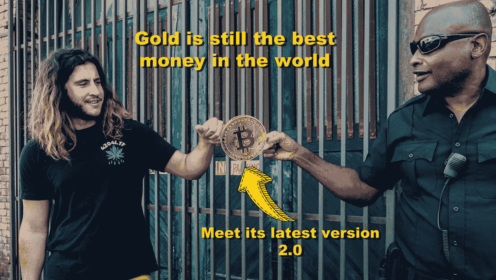
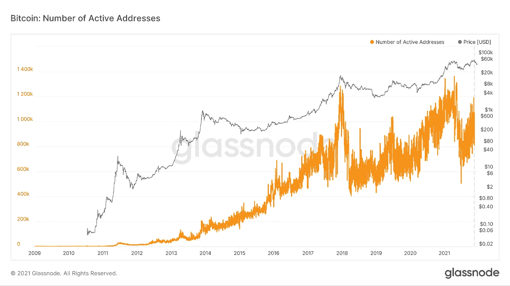

# 比特币是什么？能成为法定货币吗？

> 原文：<https://medium.com/coinmonks/what-is-bitcoin-can-it-become-legal-tender-1ccf6030e299?source=collection_archive---------2----------------------->

## 了解货币的特征是关键

Photo by [Kindel Media](https://www.pexels.com/@kindelmedia?utm_content=attributionCopyText&utm_medium=referral&utm_source=pexels) from [Pexels](https://www.pexels.com/photo/man-people-woman-street-7785086/?utm_content=attributionCopyText&utm_medium=referral&utm_source=pexels) | Edit: Cryptic Liberation

比特币是一种被越来越多的人采用的数字货币。让我们来研究一下比特币，看看我们能否为它的“野心”提供一个强有力的理由。

为了证明这一点，我们首先需要回答比特币是否配得上法定货币的地位。

**比特币的快速解释。**

通过投资比特币，人们投资于一个点对点的电子现金系统。中本聪发明了 BTC，让金融交易变得更容易、更安全、更容易。另一个好处是费用比中央银行低得多。

比特币矿工在 2009 年将[创世纪区块](https://en.bitcoin.it/wiki/Genesis_block)(第一个区块)加入了区块链。从那以后，网络每隔十分钟就验证并添加新的块，从未失败过。此外，黑客至今没有攻击过网络一次。

越来越多的人将采用比特币，正如下面的链上数据所示。该图显示了一段时间内活跃买卖的比特币钱包数量。我们正处于历史最高水平。

Source: Glassnode

加密的采用正在激增，新的交换似乎每天都在涌现。

如果你想了解更多关于比特币内部运作的信息，请点击访问[比特币白皮书。](https://bitcoin.org/bitcoin.pdf)

# 什么影响法定货币地位

任何以此为目标的法定货币或数字货币都必须至少具备这些特性。

*   价值储存(耐用性、密度、购买力、流动性)
*   交换媒介(可移植性、可分割性、可访问性、稳定性)
*   记账单位(粒度、一致性)

让我们来看看中本聪是否做得好。

但是首先，请阅读下面的引言来确定基调。

> **容易产生的钱根本就不是钱，容易的钱并不会让一个社会变得更富裕；相反，它将所有辛辛苦苦挣来的财富用于出售，以换取易于生产的东西，从而使自己变得更穷。** —
> 
> **Saifedean Ammous 博士——比特币标准:中央银行的分散化替代方案**

让它深入人心。

换句话说，印刷没有黄金或其他资产支持的货币是没有价值的，会让社会变得贫穷。不幸的是，金融机构不仅放任这种情况发生，还在其中扮演了积极的角色。

那么，比特币可能是法定货币吗？事实上，萨尔瓦多已经宣布 btc 法定货币。

# 作为价值储存手段的比特币

它是持久的，不可摧毁的，因为它不是物理的。

销毁一个完整的节点只会给该节点的所有者带来麻烦。比特币网络将继续毫不拖延地验证交易。

全球有数千份公共分类账，因此丢失一个完整的节点不会产生任何问题。公共账本不会受到影响，比特币也不会消失或被盗。

比特币挖矿到 2100 万流通就会停止。这一不可改变的事实确立了价值密度；比特币可以吸收并持有任意数量的价值。

很难说比特币是否会保持其购买力，因为它出现的时间不长。但是，到目前为止，比特币的价值仍在增加，在购买力方面超过了所有其他资产。

流动性增加；然而，人民币仍然是一种不稳定的资产。然而，现在的波动性远不如早期，所以普通用户可以在任何时候买卖，而不会对市场产生重大影响。

# 交换媒介

由于互联网无处不在，携带很容易。硬件钱包和私人钥匙可以去他们的主人在的任何地方，在线经纪人总是开门营业。

要购买比特币，用户需要接入互联网、一个在线加密货币钱包，以及在众多可靠的加密交易所之一拥有一个账户。

由于其波动性，特别是小型企业会犹豫是否接受比特币作为一种支付形式。想象一下，得到报酬后，比特币崩盘，导致报酬在几天内贬值 30%。

加密借记卡是可获得的，可以是一个顺利的工作场所。但大多数比特币制造者甚至不想花掉他们的硬币，因为人们倾向于保留最有价值的东西。这就是[格雷欣定律](https://en.wikipedia.org/wiki/Gresham%27s_law)现象。

# 比特币作为记账单位

比特币分成一亿个小智。这是合理的粒度，闪电网络[使比特币小额支付成为可能。](https://en.wikipedia.org/wiki/Lightning_Network)

一尺是一尺，一厘米是一厘米；这永远不会改变。记账单位必须是静态的，比特币很容易符合这个条件。一个聪就是一个聪。

# 比特币还有哪些优势？

## **工作证明**

纵观历史，工作就是金钱的后盾。任务总是先于代表价值的货币创造。那么工作的发生是为了创造比特币的价值吗？

是的，矿工们正在这样做，并因此得到回报。它们为比特币网络提供计算能力，以解决复杂的数学问题。

此过程保护区块链，验证事务，并将正确的块添加到链中。

没有办法以凭空创造的刺激的形式免费获得比特币。工作必须发生。不管是开采还是购买。

## **货币政策**

货币政策决定了货币供应量增加或减少的速度以及利率将如何变化。

易犯错误的人在中央集权的机构中创造了这些规则，因此金融大屠杀是不可避免的。自我、无知、利己主义和其他人类缺陷将确保这一切发生。

但是，没有人参与比特币的决策。因此，没有人会制造财务痛苦。

货币政策被硬编码到协议中，不能改变。所以，每四年，[减半事件](https://crypto.marketswiki.com/index.php?title=Halving)发生，就是这样。

下一次将是在 2024 年，比特币矿工因保护网络而获得的金额再次减少。

所以，供给在增加，但速度在下降；这使得比特币具有反通胀性。

然而，从购买力来看，随着时间的推移，BTC 处于通缩状态。

比特币开采将在 2140 年停止。在那之前，矿工们会做好诚实的工作来核实区块链；毕竟，他们就是这样得到报酬的。

## **难度调整**

如果矿工人数增加，石块开采的速度会更快，硬币的铸造速度也会更快。这完全有道理，但中本聪也想到了这一点。

当矿工人数增加时，采矿难度增加。但是，反过来也是正确的；如果矿工减少，采矿就变得容易了。这样，添加新块的时间间隔保持在十分钟左右。

## **中立**

比特币是一种工具，或者你可以称之为一种程序，它可以按照预期的方式工作；没有人拥有以任何方式印刷、创造或膨胀比特币的权利。

从某种意义上说，它与古腾堡的印钞机相反。它不是复制东西，而是限制和创造稀缺。然而，它赋予了人们力量，就像印刷机一样。

# 结论

*   越来越多的人投资加密来改善他们的财务状况。
*   萨尔瓦多是第一个宣布比特币为法定货币的国家。
*   不管彼得·希夫或杰米·戴蒙怎么说，比特币具备成为世界储备货币的条件。事实上，比特币是一种货币，同时也是一种价值储存手段和交换媒介。即使是黄金也赶不上。
*   在已知的人类历史上，从来没有比这更稀缺的资产了。
*   货币在历史上发生了变化，并将随着人类文化的发展而再次发生变化。因此，货币必须是可塑的，并成为环境所要求的那样。
*   通货膨胀的货币政策已经失去控制。他们像一个黑洞一样吞噬着自己和地球。
*   区块链给被中央银行垄断和腐败的金融市场带来了透明度。这项神奇的技术是不可阻挡的，因为它正是我们所需要的。我们在无声的绝望中等待了太久。
*   即使大多数人都没有意识到，革命就在这里，比特币很可能是我们有生之年将看到的最难赚的钱。
*   现在越来越多的人和公司投资比特币。他们知道，这是一种可靠的价值储存手段和交易媒介，他们可以在任何时间、任何地点使用。
*   不再需要让第三方介入，第三方会提出问题，将钱作为人质，并收取高昂的交易费用。
*   我们需要一个健全的电子现金系统来帮助我们改变地球的未来。比特币和整个区块链将在其中扮演重要角色。

现在如何评价比特币？

也可阅读:[金钱的演变及其腐败](/coinmonks/the-evolution-of-money-and-its-corruption-9d26990e428f)

如果你想无限制地访问所有媒体内容，请随意[使用我的会员链接](/@crypticliberation/membership)。每月 5 美元，我会收到一半。

你也可以[在推特](https://twitter.com/Cryptoliberator)上关注我或者用[电报](https://t.me/Mannish_Boy)联系我……

万事如意！

> 加入 Coinmonks [电报频道](https://t.me/coincodecap)和 [Youtube 频道](https://www.youtube.com/c/coinmonks/videos)了解加密交易和投资

## 也阅读

 [## 杠杆代币[多头代币]终极指南

### 杠杆化令牌是具有杠杆化风险敞口的 ERC20 令牌，不考虑保证金、要求、管理…

medium.com](/coinmonks/leveraged-token-3f5257808b22)  [## 最佳加密交易所| 2021 年十大加密货币交易所

### 加密货币交易所的加密交易需要了解市场，这可以帮助你获得利润。之前…

blog.coincodecap.com](https://blog.coincodecap.com/crypto-exchange)  [## 2021 年最佳加密交换平台| CoinCodeCap

### 如果我们看看今天的场景，许多加密货币交换平台提供了广泛的功能和深度…

blog.coincodecap.com](https://blog.coincodecap.com/best-swap-platforms)  [## 2021 年最佳加密借贷平台| 6 大比特币借贷平台

### 获得比特币和其他加密货币的最佳贷款利率

medium.com](/coinmonks/top-5-crypto-lending-platforms-in-2020-that-you-need-to-know-a1b675cec3fa)  [## 2021 年 6 大最佳硬件钱包|顶级加密硬件钱包[更新]

### 最好的加密货币硬件钱包是绝对必要的。我们将在 NGRAVE、Ledger Nano X 和…

medium.com](/coinmonks/the-best-cryptocurrency-hardware-wallets-of-2020-e28b1c124069)  [## 2021 年最佳免费加密交易机器人

### 2021 年币安、比特币基地、库币和其他密码交易所的最佳密码交易机器人。四进制，位间隙…

medium.com](/coinmonks/crypto-trading-bot-c2ffce8acb2a)  [## 最佳 4 个加密交易信号电报通道

### 这是乏味的找到正确的加密交易信号提供商。因此，在本文中，我们将讨论最好的…

medium.com](/coinmonks/best-crypto-signals-telegram-5785cdbc4b2b)