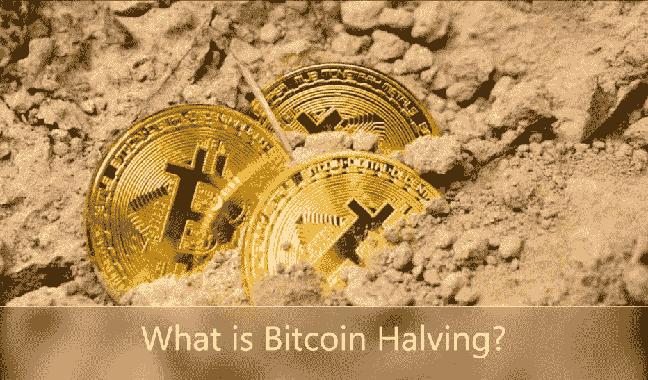
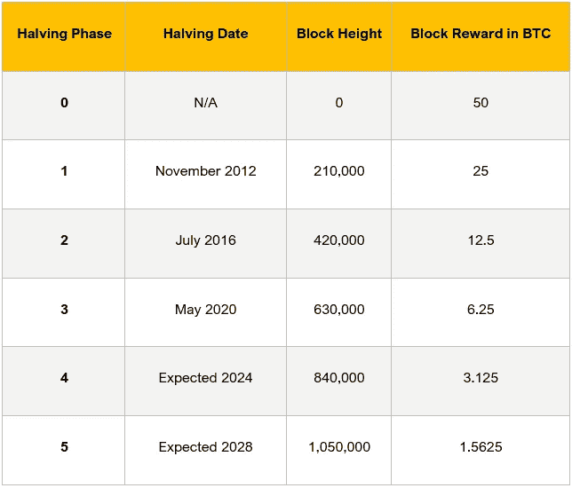

# 什么是比特币减半？

> 原文：<https://medium.com/coinmonks/what-is-bitcoin-halving-29098eb525b7?source=collection_archive---------2----------------------->

B 比特币减半是将待生成的新比特币单位的发行率减半的过程。确切地说，它指的是每四年一次的减半事件，该事件将矿工因验证比特币交易而获得的“整体奖励”减半。最近一次减半活动是在 2020 年 5 月进行的。

# 比特币减半的工作原理

当比特币网络的发行率被分成两半时，比特币减半就起作用了。发行利率的下调是基于给予比特币矿工(也被称为“区块验证者”)的 BTC 数量。块验证者是一群人，他们在强大的计算机上运行特殊和复杂的软件来解决复杂的数学问题。

每解决一个数学问题，比特币网络中就会形成一个新的“区块”。根据比特币协议，在[比特币核心](https://bitcoincore.org/)中发现的一段记录代码包含一条指令，即每 21 万个验证区块，区块补贴将减半。

每个块包含网络上等待解决的最新一批事务。一旦解决了，就会发现一个新的更难的数学问题，如此循环。

为了更好地理解这一点，考虑一下之前的减半事件是如何进行的。“零”或[创世纪阶段](https://en.bitcoin.it/wiki/Genesis_block)发生在 2009 年 1 月，在第一种也是最受欢迎的加密货币比特币诞生几个月后。

当时，块验证器努力解决所有比特币交易，并帮助保持系统安全。基本上，挖掘过程会将新的比特币引入系统，遵循一套可预测和可控的规则。

由于他们的努力，矿工们每通过一次验证就能获得 50 BTC 的奖励，而当时比特币的价格仅为几美分。应该注意的是，许多人会将创世区块称为第一个比特币区块。但是，这是一个特例，因为没有对前一个块的引用。

2012 年 11 月，比特币首次减半。矿工的奖励减少到 25 BTC。接下来的减半活动在 2016 年举行，整块奖励减半至 12.5 BTC，平均价值为每比特币 657.20 美元。

# 比特币减半的目的是什么？

比特币减半的首要目的是控制比特币的供应量。任何货币的过度供应都会导致货币价值的下降和恶性通货膨胀。比特币的供应算法旨在确保这种情况不会发生。

因此，减半过程降低了新比特币的铸造速度，降低了供应量。

根据中本聪(一个通常用来称呼比特币创造者的化名)的说法，他/她/他们设定的流通比特币数量只能是 2100 万。这种反通胀模型将确保硬币按照可预测的衰减公式逐渐进入市场。

# 比特币减半如何影响比特币价格？

长期来看，比特币减半往往会对比特币的价格产生积极影响。

例如，在 2012 年第一次减半事件后，比特币价格从区区几美分上涨到平均 12.27 美元。同样，在 2016 年第二次减半后，比特币价格暴涨至高达 19891 美元。

值得注意的是，在这两种情况下，比特币的市场飙升都花了一年多时间。事实上，在 2012 年和 2016 年价格减半事件发生后，价格立即暴跌。

从理论上讲，加密货币投资者预计，根据供求模型，比特币价格减半将提高比特币的市场价格，因为进入市场的 BTC 单位将减少。但事实是，没有人能确切预测。

# 会有多少比特币减半？

根据比特币减半日历，减半事件只能有 32 个。这意味着循环将持续到最后一组区块被解决，期间将达到 2100 万比特币的最大供应量。

已经发生了三起减半事件，让许多人不禁要问“下一次比特币何时减半？”具体来说，下一次减半定于 2024 年。

# 2020 年比特币减半:它如何影响比特币的当前价格

2020 年 5 月，发生了第三次减半事件。正如许多投资者所设想的那样，比特币的市场价格呈指数级上涨，达到历史最高水平[24209.66 美元](https://coinmarketcap.com/currencies/bitcoin/historical-data/)，市值达到 436129331482 美元。

这一历史记录是在 2020 年减半后 7 个月实现的，证明减半事件是该体系可预测货币政策的重要组成部分。

尽管之前的减半版本带来了比特币价格的显著上涨，但这并没有提供足够的数据来做出坚定的结论。几个因素——持续的挖矿集中化、网络的稳定性、比特币散列率的增减——都会影响减半的结果。

因此，你应该意识到，大多数观点，甚至来自密码专家，都只是基于过去减半历史和技术分析的有根据的猜测。在投资任何加密货币(包括比特币)之前，一定要做好自己的研究，权衡每一种可能的情况——最坏的和最好的。

> 加入 Coinmonks [电报频道](https://t.me/coincodecap)和 [Youtube 频道](https://www.youtube.com/c/coinmonks/videos)了解加密交易和投资

# 另外，阅读

*   [购买 Dogecoin 的 7 种最佳方式](https://coincodecap.com/ways-to-buy-dogecoin) | [ZebPay 评论](https://coincodecap.com/zebpay-review)
*   [最佳期货交易信号](https://coincodecap.com/futures-trading-signals) | [流动性交易所评论](https://coincodecap.com/liquid-exchange-review)
*   [火币加密交易信号](https://coincodecap.com/huobi-crypto-trading-signals) | [Swapzone 审查](/coinmonks/swapzone-review-crypto-exchange-data-aggregator-e0ad78e55ed7)
*   最佳[密码交易机器人](https://coincodecap.com/best-crypto-trading-bots) | [购买索拉纳](https://coincodecap.com/buy-solana) | [矩阵导出评论](https://coincodecap.com/matrixport-review)
*   [Coldcard 评论](https://coincodecap.com/coldcard-review) | [BOXtradEX 评论](https://coincodecap.com/boxtradex-review)|[uni swap 指南](https://coincodecap.com/uniswap)
*   [比特币基地评论](/coinmonks/coinbase-review-6ef4e0f56064) | [德里比特评论](/coinmonks/deribit-review-options-fees-apis-and-testnet-2ca16c4bbdb2) | [FTX 评论](/coinmonks/ftx-crypto-exchange-review-53664ac1198f)
*   [n rave ZERO Review](/coinmonks/ngrave-zero-review-c465cf8307fc)|[phe MEX Review](/coinmonks/phemex-review-4cfba0b49e28)|[PrimeXBT Review](/coinmonks/primexbt-review-88e0815be858)