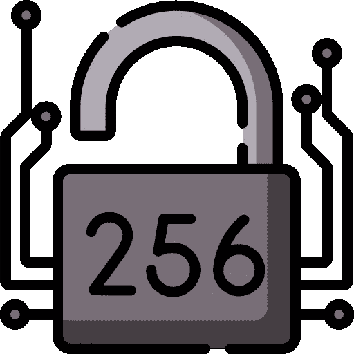
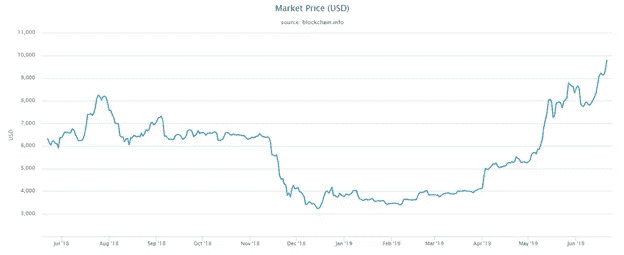
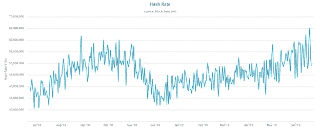
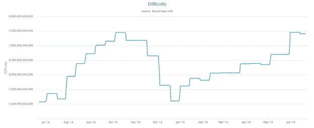

# 什么是比特币散列率？

> 原文：<https://medium.com/coinmonks/what-is-bitcoin-hash-rate-9e51298c4559?source=collection_archive---------0----------------------->

[Source](https://www.flaticon.com/free-icon/sha-256_2586106?term=hashing&page=1&position=7)

## *比特币哈希率价格相关性是什么，哈希率 vs 挖掘难度动态是什么？*

比特币散列率(也称为 hash rate)是比特币网络的计算机能力。它是在向共享账本添加新交易时，比特币网络处理数据的可测量、可量化的速度。

比特币网络上的每个挖掘节点都有它的哈希速率，它在挖掘过程中与其他节点的竞争中使用它。

挖掘节点组合它们的散列率进行挖掘的唯一上下文是当它们形成挖掘池时。这增加了他们在采矿竞争中获胜和获得采矿奖励的机会，他们根据贡献的散列率来分割这些奖励。

然而，比特币网络上所有采矿计算机的综合散列率已被用作一个有用的指标，来判断该网络有多大或有多强大。特别是，它表示专用于处理和记录比特币分类账交易的计算能力的数量。

> **也读:** [**对比特币的坦诚解释**](https://blog.coincodecap.com/a-candid-explanation-of-bitcoin/)

将比特币网络视为一个单一的计算单元，可以得出这样的结论:它是世界上最强大的超级计算机。在推出不到五年后，比特币网络[的处理能力超过了全球 500 强超级计算机](https://money.cnn.com/2013/05/23/technology/enterprise/bitcoin-supercomputers/index.html)的总和。

事实上，计算机能力(在这种情况下是散列率)促进了比特币的有用性，因此，它是其价值的关键贡献者。

# 什么是比特币哈希？

为了理解比特币*散列率*如何工作或如何测量，首先理解*散列*的概念是很重要的。这意味着我们必须了解比特币共享账本上交易记录的一些基础知识。

比特币交易以块为单位记录在共享账本上。每个块容纳大约十分钟内发送的事务。在一个新的交易块加入区块链(共享分类账)之前，它必须获得一个唯一的 ID。

唯一的块 ID 在使分类帐不可变方面至关重要，特别是因为它将块链接成一个链。ID 是从块中所有事务的组合数据、前一个块的 ID 以及自动生成的称为[随机数](https://en.bitcoin.it/wiki/Nonce)的值中得出的。

试图改变一个块中的细节，尽管这几乎是不可能的，但这不仅会影响它自己的 ID，还会影响链上其他块的 ID。

将事务数据、前一个节点的 ID 和随机数转换为新数据块的唯一 ID 的过程称为*哈希*。

数据经过哈希函数处理，哈希函数是一种将数据转化为特定的预定义结构的协议。比特币网络使用 SHA-256 的哈希函数，该函数将任意数量的数据转换、映射和简化为 256 位长的字符串。

然而，事实证明，当新块的数据、前一块的 ID 和随机数被散列时，结果往往不符合比特币协议中概述的要求。

每次散列过程未能产生根据协议可接受的值时，系统都会生成一个新的随机数，该随机数被添加到其余数据中，然后再次进行散列。在得到有效的散列值之前，这个过程可以重复几次。

比特币散列试图根据比特币协议中概述的要求，从块数据、前一块的 ID 和随机数中找到可接受的值。

# 比特币散列率单位

鉴于这一过程需要重复多次才能得到正确的值，比特币网络上的计算机对新块数据进行哈希运算的速度越快越好。用于测量每秒哈希数的单位类似于用于测量数据的单位。

因此，千哈希(千赫/秒)意味着一台计算机每秒进行 1000 次哈希运算。同时，每秒 100 万个哈希是兆哈希(MH/s)，每秒 10 亿个哈希是千兆哈希(GH/s)，每秒 1 万亿个哈希是太哈希(TH/s)。最大的哈希速率单位是 Petahash (PH/s)，每秒 1 千万亿次哈希。

整个比特币网络的综合哈希能力已经增长到超过 5000 万 TH/s。这一能力逐步向上增长，部分原因是硬件挖掘技术的发展。

早期普遍使用 CPU 电脑。普通计算机的哈希速率是几千哈希(KH/s)。然而，CPU 无法像更强大的 GPU 那样完成更多的哈希计算。目前广泛使用的 ASIC 挖掘器每秒进行更多的哈希运算。单个 ASIC 挖掘器的处理能力最高可达 15 千兆赫/秒。

# 比特币散列率与价格

有一个比特币散列率价格相关性也可以成立。随着比特币价格的上涨，网络上的哈希速率往往会激增。当比特币市场看跌时，散列率的大小往往会减小。

以下是 2018 年 7 月至 2019 年 6 月期间的比特币价格图表:

其原因是，鉴于矿工以比特币获得报酬，当比特币价格下跌时，收入就会缩水，这往往会迫使一些矿工断开他们的机器，剥夺网络的一些计算能力。

与此同时，当价格上涨时，更多的参与者受到激励进入采矿行业，那些已经这样做的人增加了他们机器的产能。[【1】](#_msocom_1)

以下是 2018 年 7 月至 2019 年 6 月的比特币散列率图表:

# 哈希速率与难度

另一个与比特币网络散列率的变化成比例变化的变量是挖掘难度。中本聪希望确保新的交易块添加到共享分类账的速度保持正常。

网络散列率的变化对这种规律性是一种威胁。如果网络可以进行更多的计算，挖掘数学问题可以在更短的时间内解决，从而更快地将事务块添加到共享分类帐中。

同时，如果散列率较低，可能需要几天时间才能找到正确的散列值，以便将下一个数据块添加到共享分类帐中。

为了确保不出现这种情况，挖掘难度根据网络可用的哈希速率的数量进行调整。这意味着当散列率很高时，挖掘难度会增加，这样就不会花更短的时间来找到下一个块。当散列率下降时，该协议降低了挖掘难度，因此不用花很长时间就能找到下一个块。

以下是 2018 年 7 月至 2019 年 6 月之间的挖掘难度图表:

# 各个国家的比特币散列率分布

事实证明，比特币散列率的分布甚至不在全球范围内。一些国家比其他国家产生更多的比特币杂凑率，有几个因素推动着这一点，但最主要的是电力成本。

中国等电力来源较便宜的国家，往往比美国等电力成本较高的国家拥有更多的比特币杂凑利率。[来自普林斯顿大学和佛罗里达国际大学的研究人员](https://arxiv.org/pdf/1810.02466.pdf)的一份报告表明，超过 70%的比特币网络散列率来自中国或由中国管理。

其他贡献显著散列率的国家包括捷克共和国(约 10%)、冰岛(约 2%)和日本(约 2%)。

总之，比特币散列率、价格和挖掘难度之间存在相关性。当比特币价格下跌时，一些矿商会因为采矿不再对他们有利可图而中断联系。这降低了散列率，反过来，协议调整了挖掘难度。

> [在您的收件箱中直接获得最佳软件交易](https://coincodecap.com/?utm_source=coinmonks)

