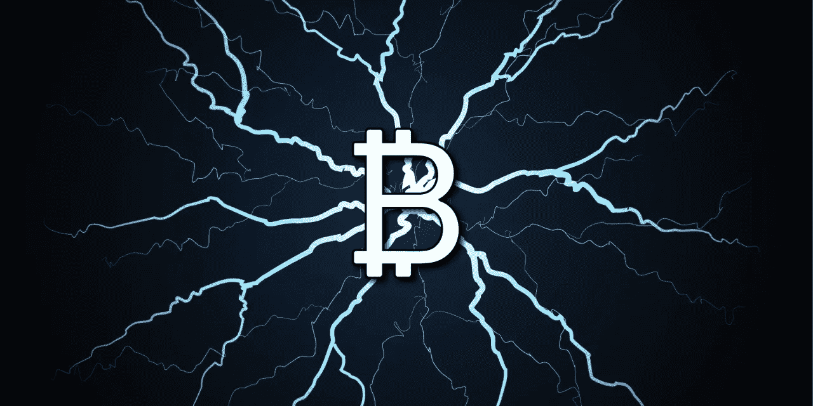

# 什么是比特币闪电网？

> 原文：<https://medium.com/coinmonks/what-is-bitcoin-lightning-network-c7195e40053b?source=collection_archive---------4----------------------->

## 闪电网络是比特币区块链顶上的一层。让我说得更详细些。

这是一种使比特币工作更快、可扩展和改进比特币的技术，比特币每秒可以处理数百或数千笔交易，目前比特币每秒处理约 7 笔交易，与每秒处理数百或数千笔交易的 Visa 和 MasterCard 相比，这是非常低的。比特币闪电网络(Bitcoin lightning network)是一项提案，它可以帮助从每秒 7 次交易转移到每秒数百或数千次交易，而无需任何中央实体，也不会失去节点之间的信任。

**闪电网络是如何工作的？**

你和我可以通过区块链以外的渠道互相发送比特币，因此我们在区块链建立了一个渠道，我们开始互相通信，并在区块链以外互相发送交易。我们可以做数以百计或数以百万计的此类交易，而无需将其传回区块链。当我们在区块链之外创建这个通道时，我们可以进行任意数量的交易，而不会加重整个网络的负担。

因此，在他们的白皮书中，他们也提出了这个想法，即我可以向其他人发送交易，而无需与其他人建立直接连接。让我解释一下，伙计们…

假设我和我的朋友在区块链之外互相发送交易，所以我的朋友可能连接到其他人 X，所以在闪电网络中，可以通过我的朋友将资金从我发送到人 X。我不需要与某人 x 有直接的联系。这确实是一个通过网络传播资金的好方法，而不需要建立许多直接的联系，这也会加重整个闪电网络的负担。

这与当今互联网的工作方式类似，当我发送一个数据包时，它可以通过许多不同的节点进行路由，这些节点并不真正关心数据包来自哪里和去往哪里，他们只关心下一步应该发送到哪里，所以下一个人可能会将它发送到其他地方，然后它最终会到达最终目的地。这类似于闪电网络如何工作，如果我连接到我的朋友，而我的朋友连接到其他人。我可以通过我的朋友将资金从我这里发送给其他人，我的朋友甚至不知道资金是打算给 X 人还是 X 人应该发送给 y 人。如果 X 人是接收者，则交易完成，并可以广播到原始区块链，这样我们可以在彼此之间进行数百万次交易，而不会给整个网络带来负担，这真的可以扩大比特币网络的规模。

**你能信任那个中间人吗？**

我想把我的一些资金寄给我的朋友萨钦，我想通过中间人 Shivam 把这些资金寄给萨钦，所以我有一个从我到 Shivam 的渠道，然后 Shivam 有一个到萨钦的渠道，现在我想把我的资金寄给萨钦。我怎么能相信 Shivam？可能 Shivam 把我的资金据为己有，没有给 Sachin 发送任何东西，所以这件事是用密码处理的，如果 Sachin 在一定时间内没有收到我的交易，交易将被退还给我。

**闪电网的问题？**

在这个闪电网络中，可能发生在我身上的最糟糕的事情是，一些不忠诚的中间人会持有我的资金很多天，所以在这些天过去后，我会根据网络协议收回我的资金。

这个网络的另一个问题是，人们可以打开许多频道，他们可以瞬间打开和关闭频道，以增加网络的负担。为了打开一个频道，我们需要将此信息广播到主区块链，因此，如果一些恶意的人试图在一秒钟内打开和关闭数百个频道，这可能会给区块链带来负担。他们正在里面工作。