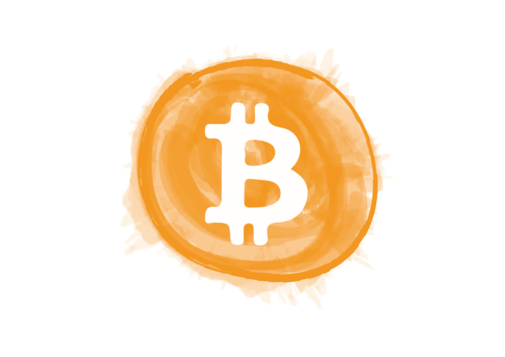

# 比特币是什么？(给我简单点)

> 原文：<https://medium.com/coinmonks/what-is-bitcoin-make-it-simple-for-me-8358eb09b5db?source=collection_archive---------2----------------------->

比特币让很多人感到困惑，因为他们迷失在行话中(去中心化、验证器等。).

事实上，你只需要理解为什么比特币存在背后的高层次想法。在这篇博文中，我将它分解成几个简单答案的基本问题。

注意:当我说比特币时，我仅指比特币加密货币( [BTC](https://coinmarketcap.com/currencies/bitcoin/) )。在比特币之后，还有许多加密货币被创造出来，这些被统称为“替代币”。Altcoins 是另类硬币的简称。作为一个群体，包括比特币，你把它们称为“加密货币”。

# 传统货币有什么问题？

政府支持传统的 T4 法定货币，这要求他们提议改变货币的运作方式。政府通过调整利率和货币供应量来实施这种控制。这可能是一件好事，也可能是一件坏事，因为有时需要政府干预。无论哪种方式，这使得大众对他们所挣的钱的控制权减少了。

今天，你可以努力工作 20 年，存下 30 万美元，以期买一栋房子。这是一大笔钱。当[政府凭空印出 3，000，000，000，000 美元**新钞**](https://www.livemint.com/industry/banking/lessons-from-the-fed-s-3-trillion-money-printing-11592322603528.html) 时，它会因为通货膨胀而“稀释”你的钱。

你攒下来买房子的 30 万美元不能再给你买房子了，因为你的钱贬值了。这是因为供求关系。这是**不公平**。

# 比特币是如何解决这个问题的？

比特币不是由任何一个人或实体，或一群人或实体支持的。

> **比特币没有任何东西做后盾，所以没人能操纵它。**

# 如果没人支持比特币，那它怎么会有价值？

**比特币永远只有 2100 万单位[1]。**就是这样！无论发生什么，它永远不会有更多。

如果经济崩溃或繁荣没关系，只有 21，000，000 单位的比特币会存在[1]。[比特币白皮书](https://bitcoin.org/bitcoin.pdf)描述了为什么这一限制保持不变的动机是一致的。

比特币使用一种新的 [**去中心化**](https://en.wikipedia.org/wiki/Bitcoin#Decentralization) **的方法来就谁拥有多少比特币达成协议。**这使得人们可以检查欺诈支付，从而保证比特币网络的安全。 [Cointelegraph 很好地解释了工作证明共识算法](https://cointelegraph.com/explained/proof-of-work-explained)。在[比特币白皮书](https://bitcoin.org/bitcoin.pdf)中对其进行了正式描述。

**固定的供应和内置的欺诈保护是人们信任比特币的原因。**

# 信任比特币意味着什么？

如果你愿意接受比特币作为商品或服务的支付方式，那么你“信任”比特币。

如果有足够多的人信任比特币，那么你就可以使用比特币开展业务。这将有助于比特币成为主流。

如果供应商接受比特币，店主会接受比特币。反过来，如果他们自己的供应商接受比特币，供应商也会接受比特币，等等。这已经开始发生了。

以这种方式，比特币可以充当“经济价值的替身”,你可以用它来换取同等的商品或服务。换句话说，这意味着你可以使用比特币作为货币。

# 比特币达到临界量了吗？

**比特币已经达到临界质量，但尚未成为主流应用**。这就是为什么像这样的信息博客帖子仍然是需要的。

比特币的名声从“毒贩使用的小众地下货币”变成了“[银行会持有你的比特币和加密货币](https://www.forbes.com/sites/matthougan/2020/07/27/the-occs-notice-on-crypto-is-a-really-big-deal/#733f23ef6301)”。这意味着我们已经达到临界质量，正在向主流采用迈进。

美国有非常严格的与金钱有关的法律。然而，[比特币基地](https://www.coinbase.com/)和[双子星](https://gemini.com/)拥有所需的执照和合规性。这些交易交易所由顶级风险投资公司如 T4 的安德森·霍洛维茨基金资助。世界上还有许多更著名的交易所，如币安交易所。这些交易所使得比特币和其他加密货币几乎可以被任何人轻易获得。由于这些交易所，加密货币自 2017 年以来变得更加容易获得。

以下是 2017 年以来比特币领域最引人注目的一些发展:

*   2017 年 12 月 17 日[芝加哥商品交易所(CME)开始交易比特币期货](https://www.cbsnews.com/news/chicago-mercantile-exchange-jumps-into-bitcoin-futures/)。点击查看 CME 比特币期货的[实时报价。](https://www.cmegroup.com/trading/equity-index/us-index/bitcoin.html)
*   [哈佛大学投资 block stack(2019 年 4 月)](https://www.bloomberg.com/news/articles/2019-04-11/harvard-takes-plunge-into-crypto-with-a-token-sale-investment)
*   [著名对冲基金经理保罗·都铎·琼斯](https://en.wikipedia.org/wiki/Paul_Tudor_Jones)，[将超过 1%的持股投资于比特币，以对冲联邦量化宽松(2020 年 5 月)](https://news.bitcoin.com/popular-hedge-fund-manager-paul-tudor-jones-bitcoin-reminds-me-of-gold-back-in-1976/)
*   [第三次比特币减半事件发生在 2020 年 5 月 11 日](https://www.investopedia.com/bitcoin-halving-4843769#:~:text=Bitcoin%20halved%20on%20May%2011,which%20new%20Bitcoins%20enter%20circulation.)
*   [货币监理署允许国家银行提供加密货币保管服务(2020 年 7 月)](https://www.forbes.com/sites/matthougan/2020/07/27/the-occs-notice-on-crypto-is-a-really-big-deal/#722eb5a63014)
*   [渣打银行将推出机构加密托管解决方案(2020 年 7 月)](https://www.coindesk.com/standard-chartered-to-launch-institutional-crypto-custody-solution)
*   [MicroStrategy 成为首家购买比特币的上市公司(纳斯达克),作为其资本分配策略的一部分，购买了价值 2.5 亿美元的比特币(2020 年 8 月)](https://www.theblockcrypto.com/linked/74534/microstrategy-becomes-first-listed-company-to-buy-bitcoin)
*   [比特硬币制造商在贝鲁特爆炸后启动加密货币救助基金(2020 年 8 月)](https://www.coindesk.com/bitcoiners-launch-cryptocurrency-relief-fund-following-beirut-explosion)
*   [保诚证券前首席执行官乔治·鲍尔表示，是时候购买比特币了，称其为避风港，因为政府不能永远刺激市场(2020 年 8 月)](https://news.bitcoin.com/former-prudential-financial-ceo-george-ball-says-now-time-to-buy-bitcoin/) ( [链接到他的视频采访](https://news.yahoo.com/time-buy-bitcoin-ex-prudential-194326042.html)

这些都是我们已经过了临界点的迹象。还有很多这样的例子，为了使这一部分简短，我已经省略了。

**如果你今天想购买比特币，你可以以安全可靠的方式进行，这在 2013 年或 2017 年并不那么容易。**

# 比特币的价格一直在变。我如何能在它里面交易？

交易交易所的活跃程度决定了比特币的价格。由于交易所的市场波动，比特币的价格一直在变化。所有货币都会出现这种情况。人们在外汇市场(FOREX)交易外币，造成波动。

在过去的 5 年里，比特币相对于美元的价格上涨了 44 倍，年化回报率为 113%。

比特币比其他(法定)货币更不稳定的原因有很多。以下是一些例子:

1.  比特币是一种新货币，它引入了一种前所未有的新货币模式。
2.  没有人知道如何对比特币进行准确的估值和定价。从来没有人活着看到这种规模的东西真正实现，所以我们都在新的领域。
3.  比特币的供应量是预先确定的。它由软件按照固定的时间表发布，[每四年减半](https://www.bitcoinblockhalf.com/)直到所有 21，000，000 个单元都被发布[1]。减半事件对新比特币的铸造速度有很大影响。最近一次减半事件发生在 2020 年 5 月 11 日，这是第三次减半事件。

许多人认为比特币是对通货膨胀的对冲。它还能防范当地经济的失败，比如在委内瑞拉或波多黎各。你可以把它想象成一份[保险单](https://cointelegraph.com/news/fidelity-calls-bitcoin-an-aspirational-store-of-value-and-an-insurance-policy)和一个[价值储存库](https://academy.binance.com/economics/is-bitcoin-a-store-of-value#:~:text=Bitcoin%20certainly%20shares%20most%20of,early%20to%20say%20for%20sure.)。

# 比特币的价值主张与黄金有何不同？

许多人认为黄金是抵御通货膨胀的工具。历史上大约开采了 197，576 吨黄金。这个数字很可能是这个数字的两倍，我们永远也不会知道，因为这只是一个估计。**比特币永远只有 21，000，000 单位**，就像我上面描述的[1]。

如果你拥有黄金来对冲通货膨胀，那么**政府可以通过一项法案，强迫你向他们出售你所有的黄金！他们可以在这次销售中为黄金定价。他们正是通过 1933 年 4 月 5 日的第 6102 号行政命令做到了这一点。他们无法用比特币做到这一点，因为它是去中心化的。与黄金相比，比特币的存储、运输和支付成本更低，也更安全。**

Melting Gold

# 与黄金相比，比特币的存储、运输和支付成本更低，安全性更高？

以下是一些与比特币相关的事实来解释这一点:

*   **存储** —比特币是数据。你可以在少量数据中存储价值数十亿美元的比特币。如果你愿意，你可以把它保存在一张纸上。与黄金相比，这更容易储存。
*   **传输** —你可以通过比特币网络转移比特币。这是数据的传输。比特币网络是连接起来形成“货币互联网”的电脑。运输黄金时，你需要各种各样的物理安全措施。与黄金相比，比特币提供了一个更好的解决方案。
*   **支付用例** —比特币最多可分 8 位小数。这使得它比黄金更容易支付。付给某人 0.01 BTC 的费用与付给某人 10 万 BTC 的费用相同。如果你想把比特币分割成 8 位以上的小数，你可以在比特币闪电网上这样做。熔化精确数量的黄金来支付一杯 5 美元的咖啡是非常昂贵的。与黄金相比，比特币提供了一个更好的解决方案。
*   **安全性** —比特币内置多重签名保护。这让您可以选择到底有多少人，以及谁需要批准支付才能通过。如果你正确设置了 multisig，那么即使有人闯入你的房子偷走你的比特币，你的比特币也是安全的。对于黄金，如果有人偷了它，你就会失去它。

# 比特币的价格什么时候才能稳定下来？

关于比特币和加密货币，还有很多事情需要弄清楚。以下是目前[人正在努力改进的挑战](https://github.com/bitcoin/bitcoin/graphs/contributors):

1.  **可扩展性** —比特币如何扩展以支持现实世界支付的需求？目前[比特币支持每秒 3.5 次交易(即 3.5 tx/s)](https://www.blockchain.com/charts/transactions-per-second) ，非常非常慢。其他区块链更快如以太坊(15 tx/s)、恒星([1000 tx/s)](https://www.lumenauts.com/blog/how-many-transactions-per-second-can-stellar-process)、[索拉纳(65000 tx/s)](https://solana.com/primer#:~:text=Solana%20is%20a%20high%2Dspeed,times%20with%20over%2050%20nodes.)。作为参考，Visa 的情况说明书([下载](https://usa.visa.com/dam/VCOM/download/corporate/media/visanet-technology/aboutvisafactsheet.pdf))提到，截至 2017 年 8 月，他们的峰值容量为 65，000 tx/s。这方面还有很大的改进空间，过去几年一直是开发者关注的焦点。查看[以太坊如何使用 Reddit 寻找扩展其区块链的最佳解决方案](https://www.reddit.com/r/ethereum/comments/hbjx25/the_great_reddit_scaling_bakeoff/)。
2.  用户友好性 —还记得我提到术语的那部分吗(验证器、去中心化等等)？这些涉及区块链的内部运作。这项技术的大多数消费者不应该处理这个问题。开发者正在创新，让区块链和加密货币更容易使用。这将使它更直观，但这是一项具有挑战性的任务。**互联网也面临着这一挑战。**互联网有复杂的行话(IP 地址、HTTP、HTML、TCP、UDP 等。).随着时间和创新，开发人员抽象出了这些复杂性。最终用户现在对互联网非常满意。要了解更多关于技术中的抽象概念，请看[我最近关于这个话题的博客](/swlh/abstractions-in-software-are-like-boxes-b4f536228cfe)。
3.  大规模采用——是的，你没看错。当我们达到大规模采用时，比特币的价格只会变得更加稳定。你可以把每一个买卖比特币的人看作是对价格的“投票”。如果有人认为价格太低，那么他们买入，如果他们认为价格太高，那么他们卖出，或做空。今天，很少有人为比特币的价格“投票”，因为他们中的大多数人都“坐在”市场之外。[数据显示，比特币的交易量约为每天 270 亿美元](https://coinmarketcap.com/currencies/bitcoin/)。以 11700 美元的价格计算，这相当于每天交易 230 万个比特币单位。相比之下，纳斯达克的交易量为每天 1220 亿美元，即每天 20 亿单位。导致比特币价格的投票“样本量”比纳斯达克少约 800 倍(230 万对 20 亿)。这意味着**与移动纳斯达克 10%相比，移动比特币价格 10%需要更少的钱**。当更多的人交易比特币时，“投票者”的数量就会增加，从而给比特币价格带来稳定。

一旦世界解决了这些问题，比特币的价格就会稳定下来。

关于这一点，需要注意两点:

1.  这至少需要几年或者更长时间，因为这些都是具有挑战性的技术和法律问题。
2.  当比特币的价格稳定下来时，可能会更高。这是因为如今比特币存在很多不确定性和风险。开发者正在创新以解决这种不确定性和风险。随着不确定性和风险的降低，人们会更好地理解比特币，这将增加其作为货币的价值。

# 我一直听到的工作证明共识是什么？

共识算法的细节是复杂的。 [Cointelegraph 很好地解释了工作证明共识算法](https://cointelegraph.com/explained/proof-of-work-explained)。这在[比特币白皮书](https://bitcoin.org/bitcoin.pdf)中有正式描述。

# 我可以贡献比特币吗？

任何人都可以贡献比特币。你可以贡献你的技能，比如代码、知识、内容和营销。你可以通过[运行比特币网络软件(节点)](https://www.investopedia.com/news/running-full-bitcoin-node-investors/#:~:text=Running%20a%20bitcoin%20node%20requires,generous%20upload%20and%20download%20limit.)来帮助保护网络。

代码是完全开源的。你可以在 Github 上找到代码。在那里，你可以参与到积极的对话中，看看开发者在做什么。

**比特币是民有、民治的。我们需要每个人都参与进来。**

见[比特币新手子编辑](https://www.reddit.com/r/BitcoinBeginners/)和[比特币子编辑](https://www.reddit.com/r/Bitcoin/)与其他对比特币感兴趣的人联系。

# 比特币可以赚或者投资吗？

是啊！您可以通过以下方式赚取比特币:

*   用比特币对产品和服务收费
*   成为比特币矿工( [investopedia 指南](https://www.investopedia.com/tech/how-does-bitcoin-mining-work/)

你可以在其中一个加密货币交易所购买比特币。比特币基地、[双子座](https://gemini.com/)和[币安](https://www.binance.com/)对于初学者来说都是很好的交流对象。

*注意:并非所有的加密货币交易所都会迎合你的司法管辖区，也并非所有的交易所都是安全的。* ***我不认可任何具体的交换。*** *在向任何交易所、网站或应用程序发送货币或加密货币之前，进行彻底的研究。正如这篇文章提到的，在加密货币的用户友好性方面还有很多工作要做。*

# 比特币是谁创造的？

关于比特币最广为人知的事实是，没人知道是谁创造了它。创作者(或团体)化名为[中本聪](https://en.wikipedia.org/wiki/Satoshi_Nakamoto#:~:text=Satoshi%20Nakamoto%20is%20the%20name,devised%20the%20first%20blockchain%20database.)。

没有人知道 Satoshi 选择对他们的身份保密的原因。这可能有很多原因。多读一些这方面的内容会让你度过一个有趣的夜晚！

你可以找到中本聪在比特币早期发给电子邮件论坛的[邮件。](https://satoshi.nakamotoinstitute.org/emails/)

有一点可以肯定的是，比特币已经对我们的社会产生了重大影响，并将继续存在下去！

*更新:*

*【1】(08/19/2020)*[*比特币白皮书*](https://bitcoin.org/bitcoin.pdf) *中没有明确定义 2100 万的限额。然而，根据比特币软件中设置的参数，总供应量为 21，000，000 单位。比特币的生产速度每 21 万块降低 50%，第一块开始奖励 50 个比特币。利用一个无限几何级数的* [*和*](https://en.wikipedia.org/wiki/Geometric_series#Sum) *公式，我们可以计算出这是 210000 * 50/(1–0.5)= 210000 * 50/0.5 = 210000 * 100 =****21000000 比特币。*** [*这篇维基文章更多的解释了比特币网络的参数与比特币总供应量的关系*](https://en.bitcoin.it/wiki/Controlled_supply) *。*

***免责声明:*** *以上信息均非投资建议、购买上述代币的邀约、使用特定交易所、或以任何方式的事实信息，也不应被解释为如此。读者应该自己做研究。如果有任何错误引起我的注意，我会尽我所能来修正它们。我的意图只是提供信息和传播关于这个话题的知识。我在*[*The Stellar Development Foundation*](https://www.stellar.org/)*工作，担任* [*海带加密货币交易机器人*](https://kelpbot.io/?tag=medium_what_is_bitcoin_make_it_simple_for_me_1) *的工程师，我拥有这篇文章中提到的所有项目的代币。本帖所有内容仅代表我个人观点。*

## 另外，阅读

*   最好的[密码交易机器人](/coinmonks/crypto-trading-bot-c2ffce8acb2a)
*   [密码本交易平台](/coinmonks/top-10-crypto-copy-trading-platforms-for-beginners-d0c37c7d698c)
*   最好的[加密税务软件](/coinmonks/best-crypto-tax-tool-for-my-money-72d4b430816b)
*   [最佳加密交易平台](/coinmonks/the-best-crypto-trading-platforms-in-2020-the-definitive-guide-updated-c72f8b874555)
*   最佳[加密借贷平台](/coinmonks/top-5-crypto-lending-platforms-in-2020-that-you-need-to-know-a1b675cec3fa)
*   [最佳区块链分析工具](https://bitquery.io/blog/best-blockchain-analysis-tools-and-software)
*   [加密套利](/coinmonks/crypto-arbitrage-guide-how-to-make-money-as-a-beginner-62bfe5c868f6)指南:新手如何赚钱
*   最佳[加密制图工具](/coinmonks/what-are-the-best-charting-platforms-for-cryptocurrency-trading-85aade584d80)
*   [莱杰 vs 特雷佐](/coinmonks/ledger-vs-trezor-best-hardware-wallet-to-secure-cryptocurrency-22c7a3fd391e)
*   了解比特币最好的[书籍有哪些？](/coinmonks/what-are-the-best-books-to-learn-bitcoin-409aeb9aff4b)
*   [3 商业评论](/coinmonks/3commas-review-an-excellent-crypto-trading-bot-2020-1313a58bec92)
*   [AAX 交易所评论](/coinmonks/aax-exchange-review-2021-67c5ea09330c) |推荐代码、交易费用、利弊
*   [德里比特评论](/coinmonks/deribit-review-options-fees-apis-and-testnet-2ca16c4bbdb2) |选项、费用、API 和测试网
*   [FTX 密码交易所评论](/coinmonks/ftx-crypto-exchange-review-53664ac1198f)
*   [n 零审核](/coinmonks/ngrave-zero-review-c465cf8307fc)
*   [Bybit 交换评论](/coinmonks/bybit-exchange-review-dbd570019b71)
*   [3Commas vs Cryptohopper](/coinmonks/cryptohopper-vs-3commas-vs-shrimpy-a2c16095b8fe)
*   最好的比特币[硬件钱包](/coinmonks/the-best-cryptocurrency-hardware-wallets-of-2020-e28b1c124069?source=friends_link&sk=324dd9ff8556ab578d71e7ad7658ad7c)
*   最佳 [monero 钱包](https://blog.coincodecap.com/best-monero-wallets)
*   [莱杰 nano s vs x](https://blog.coincodecap.com/ledger-nano-s-vs-x)
*   [bits gap vs 3 commas vs quad ency](https://blog.coincodecap.com/bitsgap-3commas-quadency)
*   [莱杰纳米 S vs 特雷佐 one vs 特雷佐 T vs 莱杰纳米 X](https://blog.coincodecap.com/ledger-nano-s-vs-trezor-one-ledger-nano-x-trezor-t)
*   [block fi vs Celsius](/coinmonks/blockfi-vs-celsius-vs-hodlnaut-8a1cc8c26630)vs Hodlnaut
*   Bitsgap 评论——一个轻松赚钱的加密交易机器人
*   为专业人士设计的加密交易机器人
*   [PrimeXBT 审查](/coinmonks/primexbt-review-88e0815be858) |杠杆交易、费用和交易
*   [埃利帕尔泰坦评论](/coinmonks/ellipal-titan-review-85e9071dd029)
*   [赛克斯石评论](https://blog.coincodecap.com/secux-stone-hardware-wallet-review)
*   [BlockFi 评论](/coinmonks/blockfi-review-53096053c097) |赚取高达 8.6%的加密利息