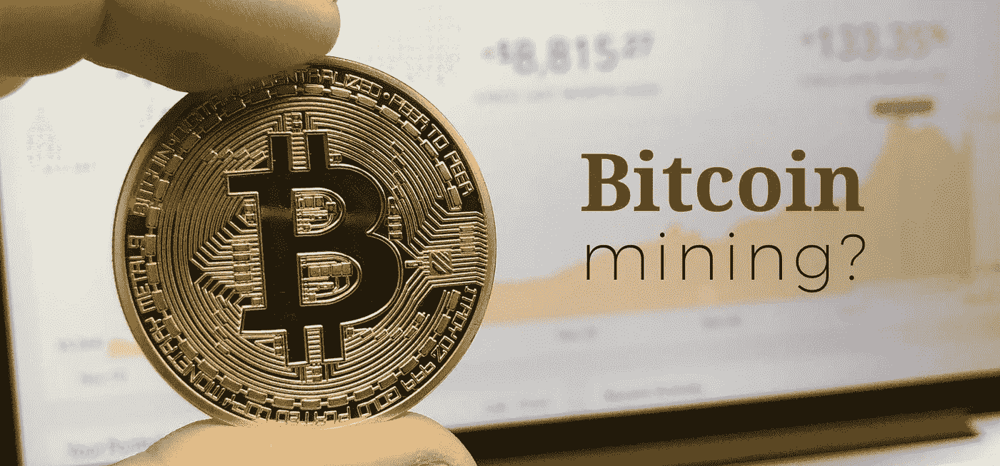

# 什么是比特币挖矿？

> 原文：<https://medium.com/coinmonks/what-is-bitcoin-mining-148f02ba8a05?source=collection_archive---------4----------------------->



***比特币*** 来到这里，我的朋友们谈论比特币已经有一段时间了。我也读过一些关于比特币、哈希和可信特性的文章。但是说实话，这些概念对我来说还是一团迷雾。所以我决定用我认为的方式真正弄清楚它们，并尽可能清晰地解释它。这篇文章只是整个比特币事件的一部分。作为开头，我想重点说一下挖矿比特币的概念。

# 这一切都是为了验证交易

作为一种货币，比特币必须解决以下要求，包括**如何铸造硬币**和**如何验证** [**交易**](https://en.bitcoin.it/wiki/Transaction) (换句话说，如何跟踪所有交易)，因为比特币最终是电子但分散的货币(与政府或中央银行印刷的传统货币相比，不是集中的)。

那么比特币是如何做到这一点的呢？嗯，比特币通过利用被称为区块链的概念来解决这些问题。

## 什么？区块链是什么来着？

进口这种区块链的东西听起来可能有点令人毛骨悚然。如果你有一些计算机科学背景，就把它想象成单个[链表](https://en.wikipedia.org/wiki/Linked_list)。或者，把它想象成一条由乐高积木组成的长长的乐高链。每个乐高积木相当于区块链的积木。它包含已解决难题的前一个块的标识以及驻留在该块中的事务。

有了这个结构，每个人都可以在当前的链上添加一个块，任何人都可以看到交易信息，这是互联网的灵魂，对吗？(我的意思是每个人都有访问资源的平等权利)

## 但是等一下，如何添加一个新的块呢？

为了添加一个新的块，必须解决前一个块给出的难题，它通常是一个散列值(还记得我们之前讨论过的[散列算法](http://www.runpinghuang.top/blog/2017-09-21/)吗？下面是其中一种用法)。

一个公开的区块链正拿着一个散列值的难题。矿工必须解决区块链提供的难题，以验证他们的事务列表，并因此将他们的块(节点)附加到区块链(通过说在这里解决难题，我使用通用表达式，更多细节可以在这里找到)。第一个解决难题的人将有权将其自身附加到区块链，这意味着本地块中的分类帐可以对全球区块链公开，以便每个人都可以看到它。同时，这名矿工将获得 12.5 比特币作为奖励。比特币就是这样被分配到 T2 的。然而解谜的过程就是**验证**的过程。

# 解谜的不同算法

说到谜题，我说过它是一个散列值，但是有一些不同的算法用于验证(定义谁是赢家)。众所周知，除非通过强力搜索，否则哈希值是不可逆的。获得准确的原始信息并不容易。

## 工作证明

这是一种确保新块难以创建的方法。基本上，解决这个难题的要求是让**散列值<指向**。这里有一个由 [Siraj](https://github.com/llSourcell/blockchain_consensus/blob/master/blockchain_consensus.ipynb) 提供的简单实现

```
#Simple Proof-of-Work example**import** sys
**import** time
**import** hashlib
**from** struct **import** unpack, packtimestamp = str(time.time())
message = "this is a random message"
payload = (timestamp + message).encode('utf-8')nonce = 0
guess = 999999999999
throttle = 100000000
target = 2**64/ throttlepayloadHash = hashlib.sha512(payload).digest()start = time.time()
**while** guess > target:
    nonce+1
    guess, = unpack('>Q', hashlib.sha512(hashlib.sha512(pack('>Q', nonce) + payloadHash).digest()).digest()[0:8])[0:8]
end = time.time()
**print** "%s:%s:%s:%s:%s:%s:%s" % (timestamp, message, nonce, guess, payload, target, end-start)
```

## *堆栈证明*

## 燃烧证明

# 概括起来

简单来说，从解密摘要到获得比特币奖励的整个过程就是所谓的比特币挖矿。这与区块链有很大关系。然而，这只是对比特币非常粗浅的一瞥。持续更新，和平！

> [直接在您的收件箱中获得最佳软件交易](https://coincodecap.com/?utm_source=coinmonks)

[](https://coincodecap.com/?utm_source=coinmonks)

# 剩余问题

1.  如果我是一名矿工，我如何知道使用哪些算法来解决难题？
2.  初始区块链是如何产生的？
3.  本地区块链是如何产生的？

# 参考

[https://github . com/llSourcell/区块链 _ consensus/blob/master/区块链 _ consensus . ipynb](https://github.com/llSourcell/blockchain_consensus/blob/master/blockchain_consensus.ipynb)
https://www . huffington post . com/ameer-rosic-/what-is-bit coin-mining-a-_ b _ 13764842 . html
[https://block geeks . com/guides/what-is-区块链-technology/](https://blockgeeks.com/guides/what-is-blockchain-technology/)
[https://www.bitcoinmining.com](https://www.bitcoinmining.com/)

# 相关技术

*   单链表
*   哈希算法

我将在我自己的博客中发布一些我感兴趣的话题。如果你愿意，请继续关注我的博客，并希望在这里或那里发表评论，告诉我我写的博客的一些改进。

因为我是中国人，我也用中文写了一些帖子。将来我会继续用英语写博客，因为我认为这些想法值得在全球传播！