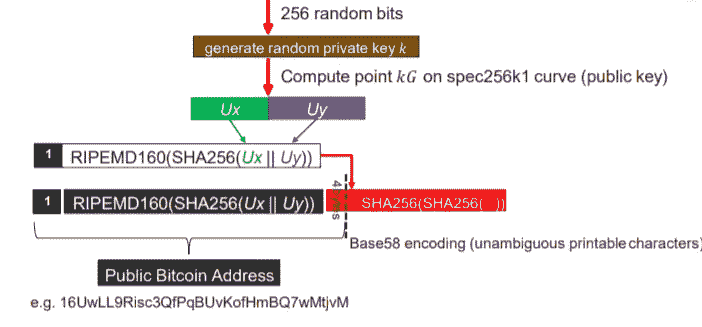
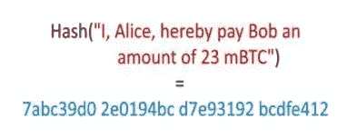
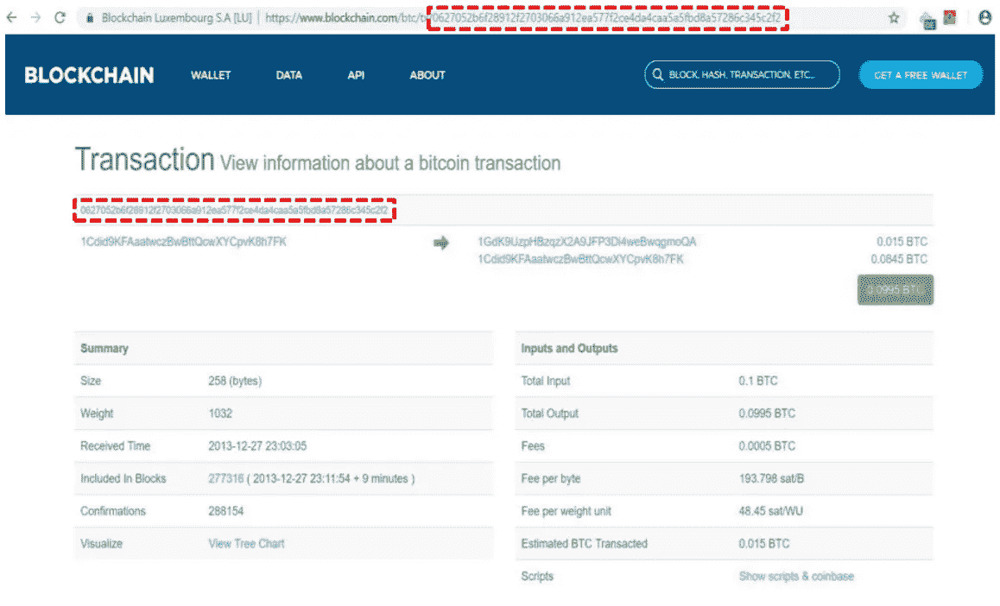
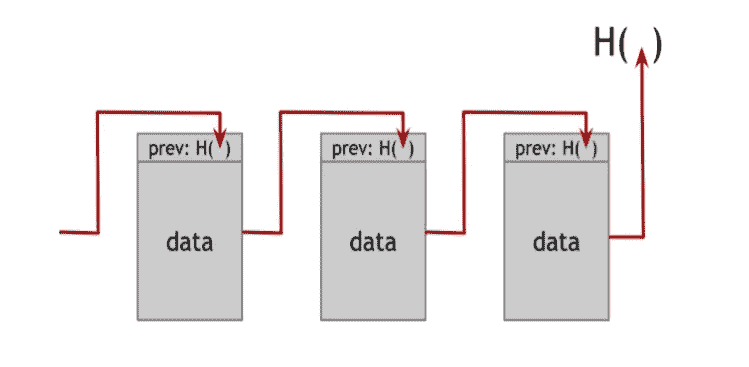
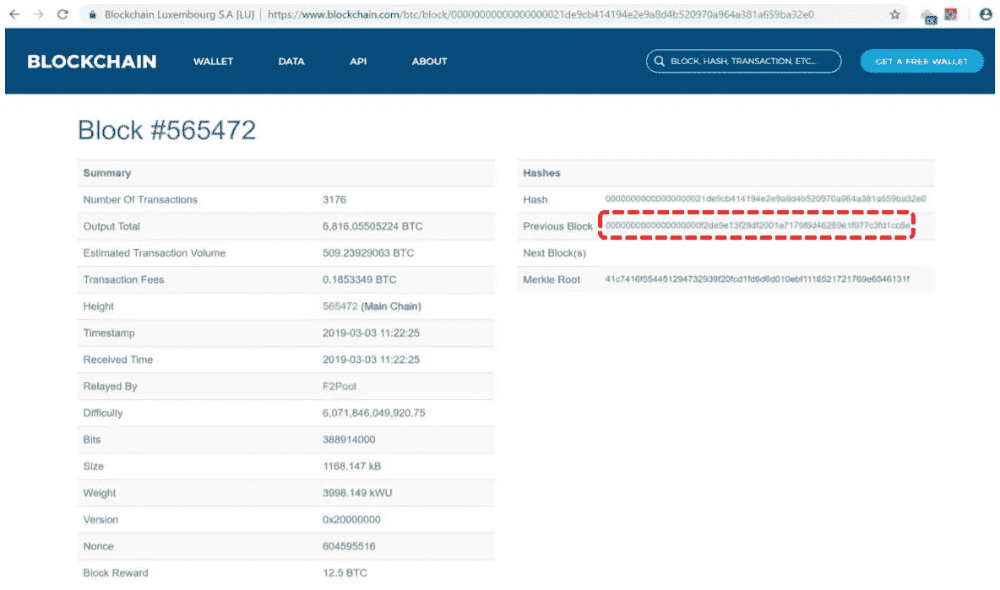
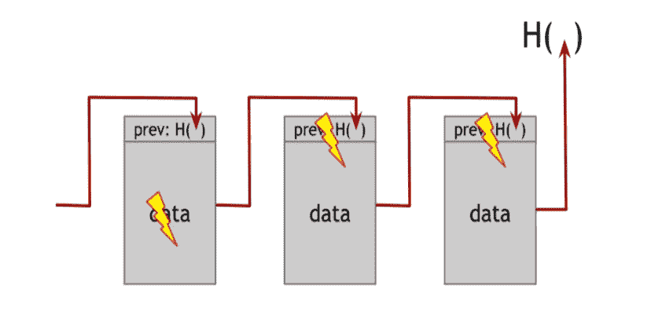
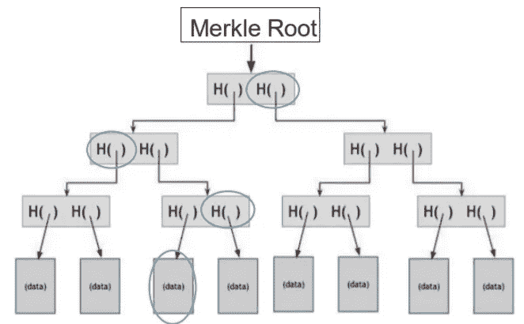
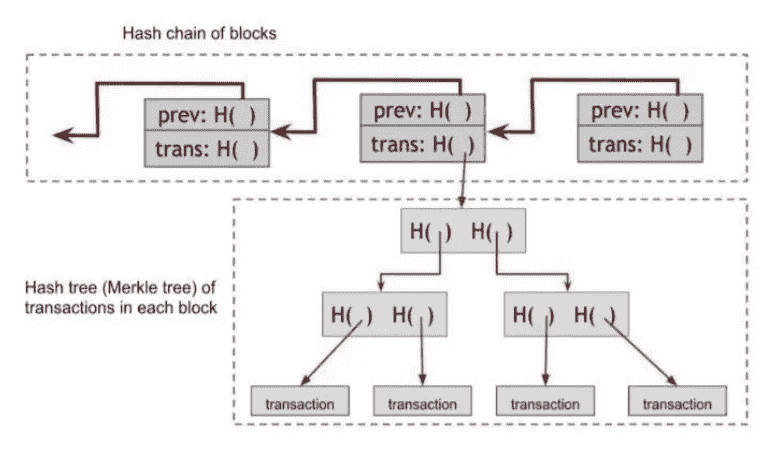

# 什么是区块链？区块链深度解读

> 原文：<https://medium.com/coinmonks/what-is-blockchain-blockchain-deep-explanation-5844284efdb4?source=collection_archive---------2----------------------->

## 比特币中的哈希应用

在理解什么是区块链之前，我们应该知道什么是散列函数以及如何使用它。首先，我们来看看密码学研究者为什么要创造这样的函数。除了用户身份验证之外，我们还必须对正在发送的消息进行身份验证，并确保消息在传输过程中没有被篡改(数据完整性)，数据完整性是信息安全基本原则的组成部分之一。

CIA Triad

所以为了这个目的，有一个总的想法:

*   产生一个取决于消息和密钥的短比特序列
*   为了对消息进行身份验证，伙伴将计算相同的位模式，假设他共享相同的密钥

那么，什么是散列函数呢？固定长度的散列值 H 由函数 H 生成，函数 H 将任意长度的消息作为输入:
***h = H(M)***

我们可以用它来表达上面的想法:

*   a 发送 M 和 H(M)
*   b 通过计算 H(M)并检查匹配来验证消息

所以我们需要创建这样的函数来满足我们的需求，并且攻击它们是不可能的。这些函数应该有一些抗攻击的要求:

*   h 可以应用于任何大小的消息
*   h 产生固定长度的输出
*   计算 H(M)很容易
*   原像抗力性质:对于给定的 H，找到 M 使得 H(M) = h 在计算上是不可行的
*   第二原像阻力性质:对于给定的 M，计算上不可能找到 M′≠M 使得 H(M′)= H(M)
*   抗冲突性:用 H(M)= H(M′)来寻找 M，M′在计算上是不可行的

有许多不同的哈希函数，如果我们想列举一些流行的函数:

*   MD5(消息摘要 5)
*   SHA1(安全哈希算法 1)
*   SHA2 家族:SHA-384 SHA-256 SHA-224，SHA 512
*   SHA3(安全哈希算法 3)

现在我们已经介绍了散列函数，让我们看看它们是如何与我们的主题相关联的。在比特币协议中，哈希函数用于 5 个不同的地方:

*   通过散列公钥产生`public bitcoin address`
*   产生一个`transaction digest`作为签署交易的输入
*   生成前一个块的散列以用于`Blockchain`中的块头
*   产生用于认证块中的事务的`Merkle tree root`(沿着树向上使用散列)
*   产生块的双重散列(带有随机数),以找到满足`mining`中所需难度的块

所以我们要解释所有这些。

## 公共比特币地址

让我们从生成比特币地址的第一个开始。每当用户想要接收或发送任何款项时，都应该在网络中有一个地址。你可以生成任意多的地址，现在一些钱包会为每一笔新交易自动生成一个新地址，这让你更加匿名。

让我们看看这些地址是如何像下图这样一步步生成的。您正在使用的任何操作系统都有一个生成随机数的内置函数。事实上，我们需要一个私钥和一个公钥来签署事务。通过使用操作系统的随机数生成器，我们生成一个随机数，这是我们的私钥，我们将看到的地址取决于这个私钥。所以我们的私钥就是图中的 *k* ( 256 位)。我们将这个 *k* 乘以 G(这是 spec256k1 曲线上的一个生成点——我将在另一篇文章中解释椭圆曲线加密)，这个 *k* G 就是我们可以给每个人的公钥。因此，当我们计算 *k* G 时，它是曲线上一个具有 Ux 和 Uy 坐标的点，现在我们连接(Ux，Uy ),然后对其应用 SHA256 哈希函数，然后对输出应用另一个哈希函数(RIPEMD160 ),最终它是一个 160 位(20 字节)输出。

我们在 RIPEMD-160 哈希前面添加 1 (0x00 十六进制)字节作为版本字节(1 是 Base58 编码)，该版本字节指示地址类型(我们将进一步看到不同的类型)。现在，我们对这 21 个字节应用 SHA256 两次，得到 256 位输出，然后我们剪切这 256 位输出的前 4 个字节(32 位),并与之前的 21 位输出连接，现在，最终输出是一个 25 字节的地址，然后我们对其应用 Base58 编码，您会看到结果是上图末尾的可读字符串。所以你看到了我们在这个上下文中使用散列函数的次数。

## 交易摘要

我们在比特币系统中使用哈希函数的下一个地方是交易摘要。我们从不签署事务消息本身，我们总是首先对消息应用散列函数，然后签署事务摘要。例如，假设事务消息如下所示

事务消息绝对不是这样的(我将在另一篇文章中解释事务消息中的确切内容以及它们的区别),但现在只需想象它像上面的图片一样，所以当我们应用哈希函数时，我们有一个小的输出(256 位),我们可以轻松地对它进行签名。事实上，事务摘要是两次应用 SHA-256 算法的结果。

## 区块链和 Merkle 树

现在我们要深入我们的主要话题。我们从一个重要的概念`Hash Pointers`开始，实际上，他们构建了我们的基础设施。

您可能熟悉数据结构中指针的概念。指针告诉我们特定的数据存储在内存中的什么地方，并指向存储在计算机内存中任何地方的值的地址。哈希指针是一个指针，指向在某个固定时间点存储数据以及该数据值的加密哈希的位置。常规指针为您提供了一种检索信息的方法，而散列指针也为您提供了一种验证信息没有改变的方法。

**实际上，** **数据存储在其中的地址就是数据的哈希**。例如，下面的图片是 blockchain.com[的](https://www.blockchain.com/)网站，这是一个查看区块和交易的浏览器，在这里你可以看到我们正在访问一个地址，其中有一个交易，交易显示 0.015 *BTC* 从左边的地址发送到右边的地址，0.0845 *BTC* 返回到发送者地址。这个事务的 hash 就是我们要访问的地址，在图中用红线圈出。如果我们将散列函数应用于一个事务，并且与它的地址不匹配，这表明存在于地址中的数据被**改变了，这里**我们知道我们的消息(这里是事务)没有被认证，所以我们使用散列指针来创建**认证的数据结构**。

***关键思想:***

*   采用任何基于指针的数据结构(比如链表)
*   用加密哈希替换指针

我们现在有了一个经过认证的数据结构。

***区块链*** 是第一个也是最流行的认证数据结构，是一个使用哈希指针的链表。在一个常规的链表中，你有一系列的块，每个块都有数据和一个指向列表中前一个块的指针，而在区块链中，前一个块的指针将被替换为一个散列指针。

每个块不仅告诉我们前一个块的值在哪里，还包含该值的摘要，允许我们验证该值没有改变。

再来看看下面这张来自[blockchain.com](https://www.blockchain.com/)探索者的图片，这次我们正在访问一个区块(区块编号 565472 ),它显示了与之相关的一些信息，例如它包含 3176 个交易，并显示了这个区块中 *BTC* 的总产量，或者开采池是 F2Pool，以及当时开采的难度和区块回报。

在这里，您可以看到数据块的哈希(以几个零开始),我们将此哈希作为数据块的地址来访问该数据块，因此这可以通过身份验证，因为我们可以访问其中的数据，并对其应用哈希函数，检查它是否与引用的地址匹配。您还可以看到，该数据块中存在上一个数据块哈希，如果我们单击它，我们会转到上一个数据块，实际上您可以看到区块链，但这有什么好处呢？

如果对手修改区块链中任何地方的数据，将导致下一个块中的散列指针不正确。

对任何块的修改将永远传播:

Tamper-evident Log

所以区块链正在给我们一个没有人可以修改的篡改明显的日志。

因此，我们有一个经过验证的数据结构，所有事务的内容都存储在其中，并且我们确信这些事务的内容没有被更改。

## **默克尔树**

比特币协议中使用的另一种认证数据结构是 **Merkle 树**，其中是哈希指针的二叉树。在区块链的每个块中，我们都有一个 Merkle 树，我们的事务都放在这个 Merkle 树的结构中。

事务是 Merkle 树中的树叶(上图中的数据)，正如您所看到的，这些事务以二进制格式散列在一起，散列被散列在一起，我们继续，直到树的根，称为 ***Merkle Root*** ，Merkle Root 是每个块头中出现的内容。

在这个数据结构中，如果树中有 *n* 个节点，那么只需要显示大约 log( *n* )项作为成员关系的证明。我们假设你想向某人证明你的事务(把蓝色圈起来的数据当作你的事务)存在于一个块中，一种方式是把整个区块链给那个人而当前的区块链大约是 200 *GB，*所以这种方式是不理性的因为，比如 您智能手机上的钱包不能包含 200 *GB* 用于证明交易有效(当您想要从任何地址收款时，您应该确保该地址中存在金额，因此我们需要在块中显示交易成员)。

Merkle 树提供了一种不用发送 200 *GB* 信息就能证明有效性的方法。你只需要给那个人你的交易和上图中三个指定的散列(蓝色圆圈)，收到这些的人可以很容易地检查有效性，他只需要找到你的交易散列，然后分别用你给他的散列进行散列，如果他找到一个与块头中的 Merkle 根相匹配的 Merkle 根，成员资格证明就提供给 log( *n* )项。这是钱包正在使用的结构。

要伪造证明，需要找到散列前像，从文章的第一部分，我们知道不可能找到具有良好设计的散列函数的散列前像。

所以在比特币中，我们有两种哈希结构:

*   块的散列链:这些块被链接在一起并且基于彼此
*   每个块内部的 Merkle 事务树

## **结论**

所以我们研究了比特币中使用的数据结构，发现了区块链到底是什么，为什么它有用，为什么比特币使用这样一种经过认证的数据结构。比特币协议还有一个使用哈希函数的地方，我们在文章中提到过，那就是挖掘，但为了简洁起见，我们将在另一篇文章中解释。

我希望你喜欢它。

> 加入 [Coinmonks 电报频道](https://t.me/coincodecap)，了解加密交易和投资

## 另外，阅读

*   [智能合约开发&部署](/coinmonks/smart-contract-blockchain-splitwise-dapp-544d344c838e)
*   [币安 vs 北海巨妖](https://blog.coincodecap.com/binance-vs-kraken) | [美元成本平均交易机器人](https://blog.coincodecap.com/pionex-dca-bot)
*   [Stormgain 回顾](https://blog.coincodecap.com/stormgain-review) | [Bexplus 回顾](https://blog.coincodecap.com/bexplus-review) | [币安 vs Bittrex](https://blog.coincodecap.com/binance-vs-bittrex)
*   [如何在 FTX 交易所交易期货](https://blog.coincodecap.com/ftx-futures-trading) | [OKEx vs 币安](https://blog.coincodecap.com/okex-vs-binance)