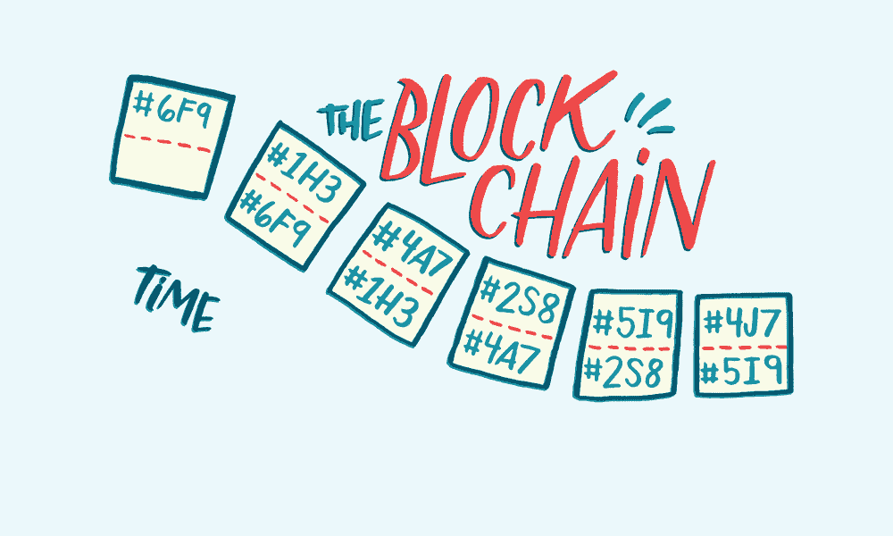
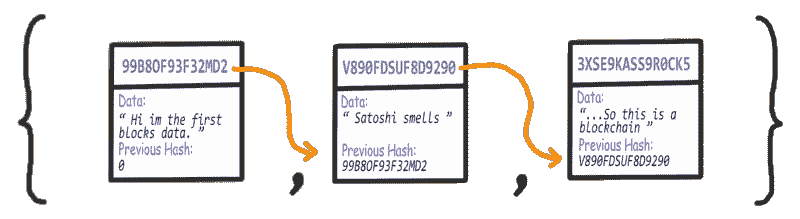
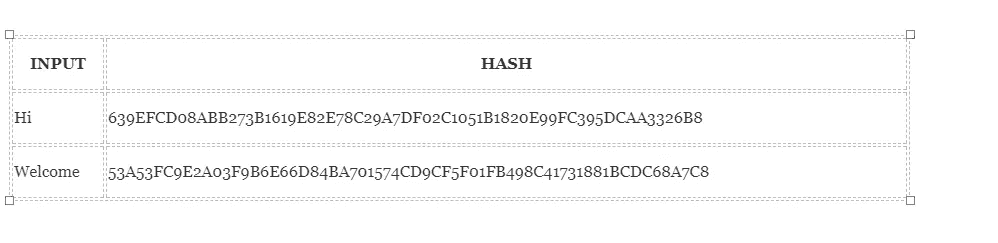
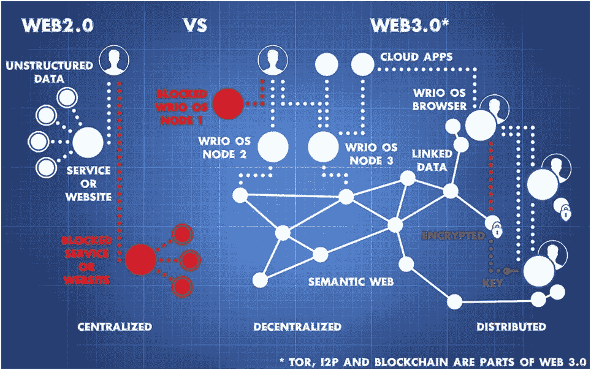

# 什么是区块链技术和 web 3.0 的未来世界

> 原文：<https://medium.com/coinmonks/what-is-blockchain-technology-and-future-world-of-web-3-0-6ba5cdcd5f87?source=collection_archive---------4----------------------->

Block chain

# 区块链

今天大家都在谈论区块链，所以先来看看什么是区块链。区块链是一种去中心化的技术，正如你看到的上图显示的矩形博客，每个博客在区块链技术中被称为节点。每个块都有自己的数字签名，包含前一个块的数字签名，并有一些数据

Blockchain sample structure

**每个块不仅仅包含它前面的块的散列，它自己的散列也是一部分，是根据前面的散列计算出来的**。如果前一个数据块的数据发生变化，则前一个数据块的哈希也会发生变化(因为它部分是由数据计算的)，进而影响其后数据块的所有哈希。**计算和比较哈希值允许我们查看区块链是否无效。**

这是什么意思？…更改此列表中的任何数据，都会更改签名，并且**会断开链**。

# 那么什么是哈希呢？

简单地说，散列意味着获取任意长度的输入字符串，并给出固定长度的输出。在比特币等加密货币的背景下，交易被视为输入，并通过哈希算法运行([比特币使用 SHA-256](https://blockgeeks.com/guides/blockchain-address-101/) )，该算法给出固定长度的输出。

让我们看看散列过程是如何工作的。我们会投入一些资源。在本练习中，我们将使用 SHA-256(安全哈希算法 256)。

Sample hashing

# 区块链如何工作

区块链背后的技术思想类似于数据库，只是你与数据库的交互方式不同。那么，让我们来理解它的工作原理:

有人请求交易。
*1。所请求的事务被广播到由称为节点的计算机组成的 P2P 网络。*
*2。验证:节点网络使用已知算法验证交易和用户状态。*
*3。经验证的交易可以包括加密货币、合同、记录或其他信息。*
*4。一旦通过验证，该交易将链接到其他交易，为分类帐创建一个新的数据块。*
*5。然后，新区块会以永久且不可更改的方式附加到现有区块链上。*
*6。交易终于完成了。*

> “我们可以将区块链定义为一个系统，它允许一组连接的计算机维护一个更新的、安全的账本。”

# **现在轮到 Web3.0 了**

Web2.0 vs Web3.0

区块链的诞生引发了一场注定要颠覆整个科技行业的运动。区块链和加密爱好者称之为 [Web 3.0](/@matteozago/why-the-web-3-0-matters-and-you-should-know-about-it-a5851d63c949) ，它希望让所有传统的商业模式都不复存在。简而言之，这是因为该技术将促进万维网的去中心化，从而从追逐利润的公司手中夺回控制权和所有权。

# 区块链分散了控制权:

在遗留系统中，'**业务逻辑**或'**处理程序**和'**数据**'被像谷歌、脸书、苹果这样的中央实体紧紧控制着。这些服务提供商自己保守秘密。

谷歌、脸书、苹果等公司的用户生成数据/内容，但不知道他/她的数据如何被使用。他/她无法将自己的数据货币化。如果他/她决定离开服务，他/她就不能取回数据。他/她的数据将永远丢失。

Source: [https://giphy.com/gifs/love-sad-lost-tbbb1ZYTLhaMM](https://giphy.com/gifs/love-sad-lost-tbbb1ZYTLhaMM])

# 但是有希望。自由并不遥远。

**区块链是引领网络世界民主和去中心化趋势的技术。**

*   任何人存储在区块链数据库中的数据都是经得起考验的。这是不可改变的。这就是个人和企业对区块链表现出信任的原因。
*   在许多场景中，基于区块链的信任在现代数字系统中比银行、保险代理、房地产经纪人和中间人提供的信任更受欢迎。

区块链能够使用“智能合约”将“业务逻辑/程序”与“数据”分离。**智能合同和数据都是可移植的。没有一个组织可以劫持您的数据。**

现在您可以跟踪您的数据:)

$……………….快乐学习。$